## ИНСТРУКЦИЯ:

Анализируй предоставленный код подробно и объясни его функциональность. Ответ должен включать три раздела:  

1. **<алгоритм>**: Опиши рабочий процесс в виде пошаговой блок-схемы, включая примеры для каждого логического блока, и проиллюстрируй поток данных между функциями, классами или методами.  
2. **<mermaid>**: Напиши код для диаграммы в формате `mermaid`, проанализируй и объясни все зависимости, 
    которые импортируются при создании диаграммы. 
    **ВАЖНО!** Убедитесь, что все имена переменных, используемые в диаграмме `mermaid`, 
    имеют осмысленные и описательные имена. Имена переменных вроде `A`, `B`, `C`, и т.д., не допускаются!  
    
    **Дополнительно**: Если в коде есть импорт `import header`, добавьте блок `mermaid` flowchart, объясняющий `header.py`:\
    ```mermaid
    flowchart TD
        Start --> Header[<code>header.py</code><br> Determine Project Root]
    
        Header --> import[Import Global Settings: <br><code>from src import gs</code>] 
    ```

3. **<объяснение>**: Предоставьте подробные объяснения:  
   - **Импорты**: Их назначение и взаимосвязь с другими пакетами `src.`.  
   - **Классы**: Их роль, атрибуты, методы и взаимодействие с другими компонентами проекта.  
   - **Функции**: Их аргументы, возвращаемые значения, назначение и примеры.  
   - **Переменные**: Их типы и использование.  
   - Выделите потенциальные ошибки или области для улучшения.  

Дополнительно, постройте цепочку взаимосвязей с другими частями проекта (если применимо).  

Это обеспечивает всесторонний и структурированный анализ кода.
## Формат ответа: `.md` (markdown)
**КОНЕЦ ИНСТРУКЦИИ**
### <алгоритм>

**1. `main()`**

   - **Начало**: Запускает весь процесс.
   - **Пример**: Вызывается при запуске скрипта.
   - **Действие**: Инициирует выполнение сценариев из файлов.

**2. `run_scenario_files(s, scenario_files_list)`**

   - **Вход**: `s` (объект настроек), `scenario_files_list` (список путей к файлам сценариев).
      - **Пример**: `s` содержит настройки для подключения к БД PrestaShop, `scenario_files_list` = `['scenario1.json', 'scenario2.json']`.
   - **Действие**: Итерируется по списку файлов и для каждого вызывает `run_scenario_file()`.
   - **Выход**: None.

**3. `run_scenario_file(s, scenario_file)`**

   - **Вход**: `s` (объект настроек), `scenario_file` (путь к файлу сценария).
      - **Пример**: `s` - объект с настройками, `scenario_file` = 'scenario1.json'.
   - **Действие**: Загружает сценарии из `scenario_file` (JSON). Итерируется по сценариям и для каждого вызывает `run_scenario()`.
   - **Выход**: None.

**4. `run_scenario(s, scenario)`**
   - **Вход**: `s` (объект настроек), `scenario` (словарь с данными сценария).
      - **Пример**: `s` - объект с настройками, `scenario` = `{'url': 'https://example.com/category/mineral-creams/', 'name': 'минеральные+кремы', 'presta_categories': {...}}`.
   - **Действие**:
     - 1. Переходит по URL из `scenario`.
     - 2. Извлекает список продуктов (пути к страницам) со страницы категории.
     - 3. Итерируется по списку продуктов и для каждого продукта:
           - Переходит на страницу продукта.
           - Извлекает данные продукта.
           - Создает объект продукта.
           - Пытается сохранить продукт в PrestaShop.
           - Обновляет журнал выполнения.
   - **Выход**: None.

**5. `dump_journal(s, journal)`**
   - **Вход**: `s` (объект настроек), `journal` (список записей журнала).
       - **Пример**: `s` - объект настроек, `journal` = `[{'scenario': 'кремы', 'status': 'success', 'time': '2024-08-09'}, ...]`
   - **Действие**: Сохраняет журнал в файл.
   - **Выход**: None.

### <mermaid>

```mermaid
graph TD
    subgraph Module `src.scenario`
    Start(Start) --> loadSettings[Load Settings <br> `s`];
    loadSettings --> loadScenarioFiles[Load Scenario Files <br> `scenario_files_list`];
    loadScenarioFiles -- Valid List --> runScenarioFiles[Run Scenario Files];
    loadScenarioFiles -- Invalid List --> errorHandling1[Error Handling <br> Invalid Scenario List];
    runScenarioFiles --> iterateFiles{Iterate Through Each <br> Scenario File};
    iterateFiles --> runScenarioFile[Run Scenario File <br> `s, scenario_file`];
    runScenarioFile --> loadScenarios[Load Scenarios <br> from `scenario_file`];
    loadScenarios --> iterateScenarios{Iterate Through Each <br> Scenario};
    iterateScenarios --> runScenario[Run Scenario <br> `s, scenario`];
    runScenario --> navigateURL[Navigate to <br> `scenario.url`];
    navigateURL --> getProductList[Get List of Products <br> from category page];
    getProductList --> iterateProducts{Iterate Through Each <br> Product URL};
    iterateProducts --> navigateProductPage[Navigate to <br> Product Page];
    navigateProductPage --> grabProductFields[Grab Product Fields <br> from Product Page];
    grabProductFields --> createProductObject[Create <br> Product Object];
    createProductObject --> insertProduct[Insert Product into PrestaShop <br> using `s`];
    insertProduct -- Success --> successMessage[Success];
    insertProduct -- Failure --> errorHandling2[Error Handling <br> Failed to Insert Product];
    successMessage --> updateJournal[Update Journal <br> with Success];
     errorHandling2 --> updateJournal;
    updateJournal --> returnStatus[Return True/False];
     returnStatus -->dumpJournal[Dump Journal <br> `s, journal`]
     dumpJournal-->End(End)
     errorHandling1 --> End
    end
```

### <объяснение>

**Импорты:**

- В представленном коде нет явных инструкций `import`. Однако, описание предполагает наличие внешних зависимостей, таких как:
   - **`requests`**: Используется для HTTP-запросов при взаимодействии с веб-сайтами поставщиков.  Зависимость реализуется во взаимодействии с внешними ресурсами.
   - **`json`**:  Используется для обработки JSON-файлов, в которых хранятся сценарии. Реализуется при парсинге файла со сценарием.
   - **`src.gs`**: Глобальные настройки проекта. Модуль, который хранит общие настройки для всего проекта.
   - **`PrestaShop`**: Предполагается взаимодействие с API PrestaShop, для загрузки данных.  Реализуется на уровне взаимодействия с БД.

**Классы:**
- В предоставленном коде нет классов. Функционал реализуется с помощью отдельных функций.

**Функции:**
1.  **`run_scenario_files(s, scenario_files_list)`**
    -   **Аргументы**:
        -   `s`: Объект настроек, содержащий данные для подключения к базе данных и другие параметры.
        -   `scenario_files_list`: Список строк, представляющих пути к JSON-файлам со сценариями.
    -   **Назначение**: Выполняет сценарии из всех файлов в списке, последовательно обрабатывая каждый файл.
    -   **Пример**: `run_scenario_files(settings, ['scenario1.json', 'scenario2.json'])`
    -   **Возвращаемое значение**: None.
2.  **`run_scenario_file(s, scenario_file)`**
    -   **Аргументы**:
        -   `s`: Объект настроек.
        -   `scenario_file`: Строка, представляющая путь к JSON-файлу со сценариями.
    -   **Назначение**: Загружает сценарии из указанного файла и запускает их.
    -   **Пример**: `run_scenario_file(settings, 'scenario1.json')`
    -    **Возвращаемое значение**: None.
3.  **`run_scenario(s, scenario)`**
    -   **Аргументы**:
        -   `s`: Объект настроек.
        -   `scenario`: Словарь, содержащий данные для одного сценария (URL, имя категории и т.д.).
    -   **Назначение**: Обрабатывает один сценарий. Переходит по URL, извлекает данные о продуктах и сохраняет их в базе данных.
    -   **Пример**:
         ```python
            scenario = {
            "url": "https://example.com/category/mineral-creams/",
            "name": "минеральные+кремы",
            "presta_categories": {
              "default_category": 12345,
              "additional_categories": [12346, 12347]
               }
            }
        run_scenario(settings, scenario)
         ```
    -   **Возвращаемое значение**: None.
4.  **`dump_journal(s, journal)`**
    -   **Аргументы**:
        -   `s`: Объект настроек.
        -   `journal`: Список записей журнала выполнения.
    -   **Назначение**: Записывает журнал выполнения в файл.
    -   **Пример**: `dump_journal(settings, journal_list)`
    -    **Возвращаемое значение**: None.
5.  **`main()`**
    -   **Аргументы**: None.
    -   **Назначение**: Основная функция для запуска модуля. Инициирует загрузку и выполнение сценариев.
    -   **Пример**: Вызывается при запуске скрипта `python scenario.py`.
    -   **Возвращаемое значение**: None.

**Переменные:**
- `s`: Объект настроек (предположительно экземпляр класса `Settings`).
- `scenario_files_list`: Список строк, содержащих пути к JSON-файлам.
- `scenario_file`: Строка, содержащая путь к одному JSON-файлу.
- `scenario`: Словарь, содержащий данные для одного сценария.
- `journal`: Список словарей, каждый из которых содержит запись о выполнении сценария.

**Потенциальные ошибки и области для улучшения:**

-   **Отсутствие обработки ошибок на каждом этапе**: Код может быть улучшен путем добавления более детальной обработки исключений, чтобы обеспечить стабильность работы.
-   **Отсутствие логирования**: Необходимо добавить логирование действий для более детального отслеживания процесса и выявления проблем.
-   **Жёсткая привязка к формату JSON**: Код предполагает строгое соответствие формату JSON, что может быть проблемой при изменении форматов файлов.  Стоит рассмотреть возможность более гибкой обработки данных.
-   **Нет проверки на дублирование товаров**: Необходимо предусмотреть проверку на дублирование товаров при добавлении в PrestaShop, чтобы избежать лишних записей.
-   **Нет асинхронности**: Обработка сценариев выполняется последовательно, что может замедлить процесс. Стоит рассмотреть возможность асинхронного выполнения для ускорения работы.

**Цепочка взаимосвязей с другими частями проекта:**

-   **`src.gs` (global settings)**: Используется для получения настроек, таких как данные для подключения к базе данных PrestaShop, пути к файлам и другие параметры.
-  **`requests`**: Используется для HTTP-запросов при взаимодействии с веб-сайтами поставщиков.
-  **PrestaShop API**: Для загрузки данных в БД.
- **`src.db`**: Взаимодействие с базой данных PrestaShop.
-  **`src.log`**: Ведение журнала выполнения.

Этот модуль является ключевым компонентом для автоматизации процессов извлечения данных и синхронизации их с PrestaShop, и тесно связан с другими модулями проекта.