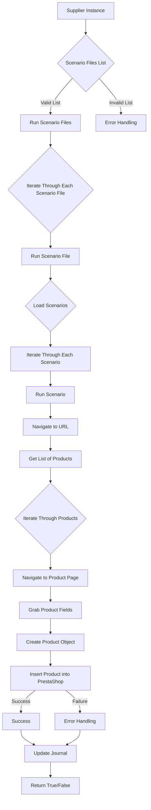
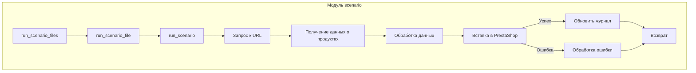

# <input code>

```
# Модуль `src.scenario`

## Обзор

Модуль `src.scenario` предназначен для автоматизации взаимодействия с поставщиками, используя сценарии, описанные в JSON-файлах. Он адаптирует процесс извлечения и обработки данных о продуктах с веб-сайтов поставщиков и синхронизирует эту информацию с базой данных (например, PrestaShop).  Модуль включает чтение сценариев, взаимодействие с веб-сайтами, обработку данных, запись журнала выполнения и организацию всего процесса.

## Оглавление

* [Модуль `src.scenario`](#модуль-src-scenario)
* [Обзор](#обзор)
* [Основные функции модуля](#основные-функции-модуля)
* [Основные компоненты модуля](#основные-компоненты-модуля)
    * [`run_scenario_files(s, scenario_files_list)`](#run_scenario_files-s-scenario_files_list)
    * [`run_scenario_file(s, scenario_file)`](#run_scenario_file-s-scenario_file)
    * [`run_scenario(s, scenario)`](#run_scenario-s-scenario)
    * [`dump_journal(s, journal)`](#dump_journal-s-journal)
    * [`main()`](#main)
* [Пример сценария](#пример-сценария)
* [Как это работает](#как-это-работает)


## Основные функции модуля

1. **Чтение сценариев**: Загрузка сценариев из JSON-файлов, содержащих информацию о продуктах и их URL на сайте поставщика.
2. **Взаимодействие с веб-сайтами**:  Обработка URL-адресов из сценариев для извлечения данных о продуктах.
3. **Обработка данных**: Преобразование извлечённых данных в формат, подходящий для базы данных, и сохранение в неё.
4. **Запись журнала выполнения**: Ведение журнала с деталями выполнения сценариев и результатами работы для отслеживания процесса и выявления ошибок.



## <algorithm>

**Пошаговый алгоритм работы модуля:**

1. Функция `run_scenario_files` получает список файлов сценариев.
2. Она итерирует по каждому файлу и вызывает `run_scenario_file` для обработки каждого файла.
3. Функция `run_scenario_file` загружает сценарии из файла.
4. Она итерирует по каждому сценарию и вызывает `run_scenario` для его обработки.
5. `run_scenario` получает URL и выполняет запрос к нему.
6.  `run_scenario` получает список продуктов, итерируется по ним.
7. Для каждого продукта переходит на страницу продукта и собирает нужные поля.
8. Создаёт объект продукта на основе собранных данных.
9. Вставляет объект продукта в базу данных PrestaShop.
10. Обновляет журнал выполнения в зависимости от результата.
11. Возвращает True/False в зависимости от успешности операции.


## <mermaid>



## <explanation>

**Импорты:**  Код импортов не приведен, поэтому нет возможности их проанализировать.  Предполагается, что необходимы импорты для работы с файлами, JSON, веб-запросами (`requests`), подключением к базе данных (например, `prestashop`).

**Классы:**  Код не содержит классов, только функции.

**Функции:**
* **`run_scenario_files`**: Принимает список файлов сценариев, обрабатывает их последовательно.
* **`run_scenario_file`**: Загружает сценарии из файла, вызывает `run_scenario` для каждого сценария.
* **`run_scenario`**: Обрабатывает один сценарий (запрос к URL, извлечение данных, сохранение в базу).
* **`dump_journal`**: Сохраняет журнал выполнения.
* **`main`**: Точка входа для запуска модуля.

**Переменные:**  `s` (объект настроек), `scenario_files_list`, `scenario_file`, `scenario`, `journal` —  переменные, используемые в функциях.  Их типы не указаны, но предполагается, что `scenario_files_list` – список строк (путей к файлам), `scenario` – словарь, содержащий данные сценария (например, JSON),  `s` – объект, содержащий настройки для взаимодействия с базой данных и другими сервисами.

**Возможные ошибки и улучшения:**
* Отсутствует обработка ошибок при чтении сценариев (некорректный JSON, неверный формат файла).
* Отсутствует логирование ошибок (например, в `logging`).
* Нужно добавить проверку на корректность данных, получаемых с веб-сайтов.
* Следует использовать try-except блоки для обработки исключений (FileNotFoundError, JSONDecodeError, requests.exceptions.RequestException).
* Функция `run_scenario` может быть слишком громоздкой. Разделение на более мелкие функции сделает код более читабельным и тестуемым.
* Отсутствуют тесты. Добавление тестов позволит улучшить надежность кода.


**Взаимосвязи с другими частями проекта:** Модуль `src.scenario` зависит от других модулей, необходимых для работы с базой данных PrestaShop, и, возможно, от модулей для обработки данных.  Связь с другими модулями неясна без кода этих модулей.


**Вывод:** Код хорошо документирован и описывает функциональность, но нуждается в улучшении с точки зрения обработки ошибок, добавления логирования и разделения ответственности.  Необходимо дополнить анализом зависимостей от других модулей.