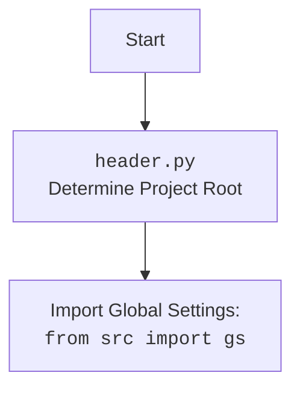

## ИНСТРУКЦИЯ:

Анализируй предоставленный код подробно и объясни его функциональность. Ответ должен включать три раздела:  

1.  **<алгоритм>**: Опиши рабочий процесс в виде пошаговой блок-схемы, включая примеры для каждого логического блока, и проиллюстрируй поток данных между функциями, классами или методами.  
2.  **<mermaid>**: Напиши код для диаграммы в формате `mermaid`, проанализируй и объясни все зависимости,  
    которые импортируются при создании диаграммы.  
    **ВАЖНО!** Убедитесь, что все имена переменных, используемые в диаграмме `mermaid`,  
    имеют осмысленные и описательные имена. Имена переменных вроде `A`, `B`, `C`, и т.д., не допускаются!  
    
    **Дополнительно**: Если в коде есть импорт `import header`, добавьте блок `mermaid` flowchart, объясняющий `header.py`:\
    ```mermaid\
    flowchart TD\
        Start --> Header[<code>header.py</code><br> Determine Project Root]\
    \
        Header --> import[Import Global Settings: <br><code>from src import gs</code>] \
    ```

3.  **<объяснение>**: Предоставьте подробные объяснения:  
    -   **Импорты**: Их назначение и взаимосвязь с другими пакетами `src.`.  
    -   **Классы**: Их роль, атрибуты, методы и взаимодействие с другими компонентами проекта.  
    -   **Функции**: Их аргументы, возвращаемые значения, назначение и примеры.  
    -   **Переменные**: Их типы и использование.  
    -   Выделите потенциальные ошибки или области для улучшения.  

Дополнительно, постройте цепочку взаимосвязей с другими частями проекта (если применимо).  

Это обеспечивает всесторонний и структурированный анализ кода.
## Формат ответа: `.md` (markdown)
**КОНЕЦ ИНСТРУКЦИИ**
## <алгоритм>
```mermaid
graph TD
    A[Начало: run_scenario_files] --> B{Является ли scenario_files_list путем?};
    B -- Да --> C[Преобразовать в список: scenario_files_list = [scenario_files_list]];
    B -- Нет --> D{Является ли scenario_files_list списком?};
    D -- Да --> E{Пустой ли список scenario_files_list?};
    D -- Нет --> F[Вызвать исключение TypeError];
    E -- Да --> G[Присвоить scenario_files_list = s.scenario_files];
    E -- Нет --> H[Сохранить имя файла в журнал: _journal['scenario_files'] = {}];
    G --> H;
    H --> I{Перебор scenario_file в scenario_files_list};
    I -- Да --> J[Сохранить имя файла в журнал];
    J --> K[Вызов run_scenario_file(s, scenario_file)];
    K --> L{Успешно ли выполнен run_scenario_file?};
    L -- Да --> M[Успех: Сохранить сообщение в журнале];
    L -- Нет --> N[Ошибка: Сохранить сообщение об ошибке в журнале];
    M --> O[Записать успех в лог];
    N --> P[Записать ошибку в лог];
    O --> I;
    P --> I;
    I -- Нет --> Q[Завершение: return True];
     F --> Q;    
    
    
    Q --> R[Начало: run_scenario_file];
    R --> S[Загрузить сценарии из файла: scenarios_dict = j_loads(scenario_file)['scenarios']];
    S --> T{Перебор scenario_name, scenario в scenarios_dict.items()};
    T -- Да --> U[Присвоить s.current_scenario = scenario];
    U --> V[Вызвать run_scenario(s, scenario, scenario_name)];
    V --> W{Успешно ли выполнен run_scenario?};
    W -- Да --> X[Записать успех в лог];
    W -- Нет --> Y[Записать ошибку в лог];
    X --> T;
    Y --> T;
     T -- Нет --> Z[Завершение: return True];
    S --> AA{Ошибка загрузки или обработки файла?};
    AA -- Да --> AB[Записать ошибку в лог];
    AB --> AC[Завершение: return False];

    Z --> AD[Начало: run_scenarios];
    AD --> AE{Являются ли scenarios пустым?};
     AE -- Да --> AF[Присвоить scenarios = [s.current_scenario]];
     AE -- Нет --> AG[Проверка scenarios: список или словарь?];
     AF --> AG;
     AG -- Да --> AH[Присвоить scenarios = scenarios];
     AG -- Нет --> AI[Присвоить scenarios = [scenarios]];
     AH --> AJ[Инициализация списка результатов: res = []];
    AI --> AJ;
     AJ --> AK{Перебор scenario в scenarios};
      AK -- Да --> AL[Вызвать run_scenario(s, scenario)];
    AL --> AM[Сохранить результат в журнал: _journal['scenario_files'][-1][scenario] = str(res)];
    AM --> AN[Сохранить журнал в файл dump_journal(s, _journal)];
    AN --> AK;
    AK -- Нет --> AO[Завершение: return res];
    
     
    AO --> AP[Начало: run_scenario];
    AP --> AQ[Записать в лог: Starting scenario: {scenario_name}];
    AQ --> AR[Присвоить s.current_scenario = scenario];
    AR --> AS[Получить драйвер: d = s.driver];
    AS --> AT[Загрузить URL: d.get_url(scenario['url'])];
    AT --> AU[Получить список продуктов: list_products_in_category = s.related_modules.get_list_products_in_category(s)];
    AU --> AV{Пустой ли список продуктов?};
    AV -- Да --> AW[Записать в лог: No product list collected from the category page];
     AW --> AX[Завершение: return False];
    AV -- Нет --> AY{Перебор url в list_products_in_category};
    AY -- Да --> AZ[Загрузить URL продукта: d.get_url(url)];
      AZ --> BA{Успешно ли загружен URL?};
    BA -- Да --> BB[Получить поля продукта: grabbed_fields = s.related_modules.grab_product_page(s)];
      BB --> BC[Асинхронно получить данные: f = asyncio.run(s.related_modules.grab_page(s))];
    BC --> BD{Удалось ли получить поля продукта?};
    BD -- Да --> BE[Извлечь presta_fields_dict и assist_fields_dict];
     BE --> BF[Создать продукт: product: Product = Product(...)];
     BF --> BG[Вставить полученные данные: insert_grabbed_data(f)];
    BG --> AY;
     BD -- Нет --> BH[Записать в лог: Failed to collect product fields];
    BH --> AY;
     BA -- Нет --> BI[Записать в лог: Error navigating to product page];
      BI --> AY;
     AY -- Нет --> BJ[Завершение: return list_products_in_category];


     BJ --> BK[Начало: insert_grabbed_data_to_prestashop];
     BK --> BL[Создать экземпляр PrestaShop: presta = PrestaShop()];
     BL --> BM[Вызвать метод post_product_data: await presta.post_product_data(...)];
     BM --> BN{Успешно ли выполнено post_product_data};
     BN -- Да --> BO[Завершение: return True];
     BN -- Нет --> BP[Записать ошибку в лог];
    BP --> BQ[Завершение: return False];
```

## <mermaid>
```mermaid
flowchart TD
    Start(Start) --> run_scenario_files;
    run_scenario_files --> run_scenario_file;
    run_scenario_file --> j_loads;
    j_loads --> run_scenario;
    run_scenario --> get_url;
     run_scenario --> get_list_products_in_category;
     run_scenario --> grab_product_page;
      run_scenario --> grab_page;
      grab_page -->  ProductFields;
      run_scenario --> Product;
      run_scenario --> insert_grabbed_data;
      insert_grabbed_data --> insert_grabbed_data_to_prestashop
      insert_grabbed_data_to_prestashop --> PrestaShop;
      PrestaShop --> post_product_data;
      Product --> ProductFields
  
     
    
    subgraph src.scenario.executor
    run_scenario_files
    run_scenario_file
     run_scenario
    insert_grabbed_data_to_prestashop
    end
    subgraph src.utils.jjson
        j_loads
    end
    subgraph src.endpoints.prestashop
        PrestaShop
    end
    subgraph src.endpoints.prestashop.product_async
      ProductFields
    end
     subgraph other modules
        get_url
        get_list_products_in_category
        grab_product_page
        grab_page
        Product
        post_product_data
    end
    
    
    
    
    classDef function fill:#f9f,stroke:#333,stroke-width:2px
    class run_scenario_files, run_scenario_file, run_scenario, insert_grabbed_data_to_prestashop function
    class j_loads, PrestaShop, ProductFields, get_url, get_list_products_in_category, grab_product_page, grab_page, Product, post_product_data  fill:#ccf,stroke:#333,stroke-width:2px
     
    
    
```


**Объяснение зависимостей:**
- `src.scenario.executor`: Этот модуль отвечает за выполнение сценариев, загрузку их из файлов и инициирование процесса получения данных о продуктах и их добавления в PrestaShop. Он импортирует различные модули для выполнения этих задач.
- `src.utils.jjson`: Модуль `jjson` используется для загрузки и сохранения данных в формате JSON. В данном коде используется функция `j_loads` для загрузки сценариев из JSON файла.
- `src.endpoints.prestashop`: Этот модуль включает в себя класс `PrestaShop`, который содержит методы для взаимодействия с PrestaShop API, включая добавление данных о продукте. 
- `src.endpoints.prestashop.product_async`: Этот модуль отвечает за асинхронный сбор данных о товаре и содержит класс `ProductFields`, который используется для хранения полей товара.
- `other modules`: Включает в себя ряд модулей, которые используются для различных задач, таких как навигация по страницам `get_url`, получение списка продуктов `get_list_products_in_category`, получение данных со страницы продукта `grab_product_page`, асинхронный сбор данных `grab_page`, создание экземпляра продукта `Product` и сохранение данных о продукте `post_product_data`.

## <объяснение>

### Импорты

*   `os`, `sys`: Стандартные модули Python для работы с операционной системой и интерпретатором.
*   `requests`: Библиотека для отправки HTTP-запросов (хотя в данном коде явно не используется).
*   `asyncio`: Библиотека для асинхронного программирования, используется для асинхронного сбора данных.
*   `time`: Стандартный модуль для работы со временем.
*   `tempfile`: Модуль для создания временных файлов и каталогов.
*   `datetime`: Модуль для работы с датой и временем.
*   `math.log`, `math.prod`: Математические функции, которые в данном коде не используются напрямую, но могут быть полезны в других частях проекта.
*   `pathlib.Path`: Модуль для работы с путями к файлам и директориям.
*   `typing.Dict`, `typing.List`, `typing.Optional`: Модули для определения типов переменных.
*   `json`: Модуль для работы с JSON.
*   `header`: Пользовательский модуль, который, вероятно, устанавливает корневой каталог проекта и загружает глобальные настройки.
*   `src.gs`: Модуль глобальных настроек проекта.
*   `src.utils.printer.pprint`: Функция для красивого вывода в консоль.
*   `src.utils.jjson.j_loads`, `src.utils.jjson.j_dumps`: Функции для загрузки и сохранения данных в формате JSON.
*   `src.endpoints.prestashop.product_async.ProductAsync`, `src.endpoints.prestashop.product_async.ProductFields`: Модули для работы с данными о продуктах в PrestaShop.
*   `src.db.ProductCampaignsManager`: Модуль для управления продуктовыми кампаниями в базе данных.
*    `src.logger.logger`: Модуль для логирования событий.
*   `src.logger.exceptions.ProductFieldException`: Модуль для обработки исключений связанных с полями товара.

### Переменные

*   `_journal`: Глобальный словарь для хранения информации о выполнении сценариев. В нем хранится имя журнала (метка времени) и информация о каждом сценарии.
*   `timestamp`: Метка времени, полученная из `gs.now` и используемая для имени журнала.

### Функции

1.  **`dump_journal(s, journal: dict) -> None`**:
    *   **Аргументы**:
        *   `s`: Экземпляр поставщика.
        *   `journal`: Словарь с данными журнала.
    *   **Назначение**: Сохраняет данные журнала в файл JSON.
    *   **Пример**:
    ```python
        supplier = Supplier(...)
        journal_data = {'name': 'test_journal', 'scenario_files': {'test_scenario.json': {'message': 'completed!'}}}
        dump_journal(supplier, journal_data)  # создаст файл test_journal.json в _journal директории поставщика
        ```
2.  **`run_scenario_files(s, scenario_files_list: List[Path] | Path) -> bool`**:
    *   **Аргументы**:
        *   `s`: Экземпляр поставщика.
        *   `scenario_files_list`: Список путей к файлам сценариев или один путь.
    *   **Назначение**: Выполняет сценарии из списка файлов.
    *   **Возвращаемое значение**: `True`, если все сценарии выполнены успешно, `False` в противном случае.
    *   **Пример**:
    ```python
        supplier = Supplier(...)
        scenario_paths = [Path('scenarios/scenario1.json'), Path('scenarios/scenario2.json')]
        run_scenario_files(supplier, scenario_paths) # выполнит сценарии из указанных файлов
        run_scenario_files(supplier, Path('scenarios/scenario1.json')) # выполнит сценарий из одного файла
        ```
    *   **Логика**:
        1.  Проверяет тип `scenario_files_list`. Если это путь (`Path`), преобразует его в список.
        2.  Если `scenario_files_list` пустой, использует `s.scenario_files`.
        3.  Итерируется по списку файлов, вызывает `run_scenario_file` для каждого файла, логирует результаты и сохраняет их в журнал.

3.  **`run_scenario_file(s, scenario_file: Path) -> bool`**:
    *   **Аргументы**:
        *   `s`: Экземпляр поставщика.
        *   `scenario_file`: Путь к файлу сценария.
    *   **Назначение**: Загружает и выполняет сценарии из файла.
    *   **Возвращаемое значение**: `True`, если все сценарии выполнены успешно, `False` в противном случае.
    *   **Пример**:
    ```python
        supplier = Supplier(...)
        scenario_path = Path('scenarios/scenario1.json')
        run_scenario_file(supplier, scenario_path) # загрузит и выполнит сценарии из файла
    ```
    *   **Логика**:
        1.  Загружает сценарии из файла, используя `j_loads`.
        2.  Итерируется по сценариям в словаре, устанавливает `s.current_scenario` и вызывает `run_scenario`.
        3.  Обрабатывает исключения `FileNotFoundError` и `JSONDecodeError`, возвращая `False` в случае ошибки.
4.  **`run_scenarios(s, scenarios: Optional[List[dict] | dict] = None, _journal=None) -> List | dict | bool`**:
    *   **Аргументы**:
        *   `s`: Экземпляр поставщика.
        *   `scenarios`: Список сценариев или один сценарий. По умолчанию `None`.
        *   `_journal`: Журнал, в который добавляется информация.
    *   **Назначение**: Выполняет список сценариев (не файлов).
    *   **Возвращаемое значение**: Результат выполнения сценариев или `False` в случае ошибки.
    *   **Пример**:
    ```python
        supplier = Supplier(...)
        scenarios_data = [{'url': 'example.com/category1', 'module': 'module_name1'}, {'url': 'example.com/category2', 'module': 'module_name2'}]
        run_scenarios(supplier, scenarios_data)
        run_scenarios(supplier, {'url': 'example.com/category1', 'module': 'module_name1'}) #выполнит один сценарий
    ```
    *   **Логика**:
        1.  Если `scenarios` не задан, использует `s.current_scenario`.
        2.  Преобразует `scenarios` в список, если это не список.
        3.  Итерируется по списку сценариев и вызывает `run_scenario` для каждого, сохраняет результат в журнал.

5.  **`run_scenario(supplier, scenario: dict, scenario_name: str, _journal=None) -> List | dict | bool`**:
    *   **Аргументы**:
        *   `supplier`: Экземпляр поставщика.
        *   `scenario`: Словарь с деталями сценария.
        *   `scenario_name`: Имя сценария.
        *  `_journal`: Журнал, в который добавляется информация.
    *   **Назначение**: Выполняет один сценарий.
    *   **Возвращаемое значение**: Результат выполнения сценария.
    *   **Пример**:
    ```python
        supplier = Supplier(...)
        scenario_data = {'url': 'example.com/category1', 'module': 'module_name1'}
        run_scenario(supplier, scenario_data, 'scenario1')
    ```
    *   **Логика**:
        1.  Получает URL из сценария и загружает страницу.
        2.  Получает список продуктов из категории.
        3.  Итерируется по URL-адресам продуктов, загружает страницу продукта, извлекает данные и создает экземпляр `Product`.
        4.  Вызывает функцию `insert_grabbed_data` для сохранения данных.

6.  **`insert_grabbed_data_to_prestashop(f: ProductFields, coupon_code: Optional[str] = None, start_date: Optional[str] = None, end_date: Optional[str] = None) -> bool`**:
    *   **Аргументы**:
        *   `f`: Экземпляр `ProductFields` с данными о продукте.
        *   `coupon_code`: Код купона (необязательно).
        *   `start_date`: Дата начала акции (необязательно).
        *   `end_date`: Дата окончания акции (необязательно).
    *   **Назначение**: Вставляет данные о продукте в PrestaShop.
    *   **Возвращаемое значение**: `True`, если вставка прошла успешно, `False` в противном случае.
    *   **Пример**:
    ```python
        fields = ProductFields(product_id=123, product_name='Test Product', ...)
        insert_grabbed_data_to_prestashop(fields, coupon_code='SALE10', start_date='2023-01-01', end_date='2023-01-31')
    ```
    *   **Логика**:
        1.  Создает экземпляр `PrestaShop`.
        2.  Вызывает метод `post_product_data` для отправки данных в PrestaShop API.
        3.  Обрабатывает исключения и возвращает `False` в случае ошибки.

### Классы

В данном коде явно не определены классы, но используются экземпляры классов, такие как `Supplier`, `Product`, `ProductFields`, и `PrestaShop`. Их реализация находится в других файлах проекта, например:
   * `src.endpoints.prestashop.PrestaShop`
   * `src.endpoints.prestashop.product_async.ProductFields`

### Потенциальные ошибки и области для улучшения

*   **Обработка ошибок**: Код обрабатывает некоторые исключения, но в некоторых местах (например, при обращении к `scenario['url']`) может не хватать дополнительной обработки ошибок.
*   **Журналирование**: `_journal` используется для сохранения данных, но стоит рассмотреть более надежный способ журналирования с возможностью ротации файлов и уровнем детализации.
*   **Модульность**: Функция `run_scenario` выполняет слишком много действий. Можно разбить ее на более мелкие функции для улучшения читаемости и тестируемости.
*   **Зависимости**: Код имеет зависимости от других модулей, которые могут быть неявными (например, `s.driver`, `s.related_modules`). Стоит рассмотреть возможность более явного определения интерфейсов зависимостей.
*   **Асинхронность**: В коде используется `asyncio.run` для запуска асинхронной функции `s.related_modules.grab_page`, но сам код в функции run_scenario является синхронным. Можно рассмотреть возможность полной асинхронизации кода для повышения производительности.
*   **Не используется requests**: Заявлен в импортах, но нигде не используется.
*   **`_journal[-1][scenario]`**: Индексация `-1` для словаря не является надежным способом добавления данных в журнал. Лучше использовать `append` для списка.
* **`Todo` комментарии**: Есть несколько `Todo` комментариев, которые нужно исправить.
    *  В `run_scenarios` нужно проверить вариант когда нет сценариев.
    * В `run_scenario` проверить нужность параметра `scenario_name`
* **Переменные**:
   *   `_journal`: Глобальная переменная, что затрудняет отладку и тестирование. Лучше использовать локальные переменные.

### Взаимосвязь с другими частями проекта

*   **`header.py`**: Инициализирует среду и настройки проекта, которые используются в данном модуле.
*   **`src.gs`**: Содержит глобальные настройки, например, текущую дату и время, которые используются для имени журнала.
*   **`src.utils.jjson`**: Предоставляет функции для работы с JSON, которые используются для загрузки и сохранения данных о сценариях.
*   **`src.endpoints.prestashop`**: Обеспечивает взаимодействие с PrestaShop API для вставки данных о продуктах.
*   **`src.db`**: Предоставляет функции для работы с базой данных, в том числе для управления кампаниями.
*   **`src.logger`**: Обеспечивает возможность логирования для отслеживания работы приложения.
*   **`src.driver`**: Предоставляет функциональность для управления браузером.

Данный модуль является центральным звеном в процессе выполнения сценариев. Он загружает сценарии из файлов, управляет навигацией по сайту, извлекает данные о продуктах и отправляет их в PrestaShop. Он тесно взаимодействует со многими другими частями проекта, что делает его критически важным для работы всего приложения.