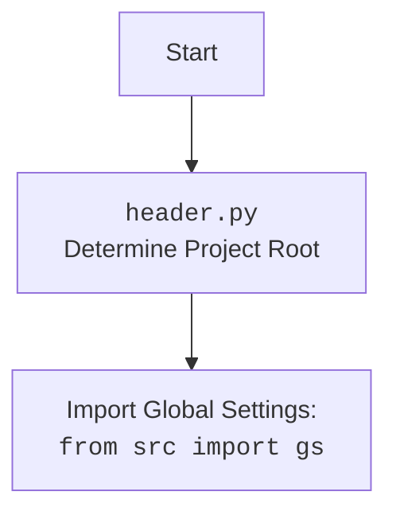

## ИНСТРУКЦИЯ:

Анализируй предоставленный код подробно и объясни его функциональность. Ответ должен включать три раздела:  

1. **<алгоритм>**: Опиши рабочий процесс в виде пошаговой блок-схемы, включая примеры для каждого логического блока, и проиллюстрируй поток данных между функциями, классами или методами.  
2. **<mermaid>**: Напиши код для диаграммы в формате `mermaid`, проанализируй и объясни все зависимости, 
    которые импортируются при создании диаграммы. 
    **ВАЖНО!** Убедитесь, что все имена переменных, используемые в диаграмме `mermaid`, 
    имеют осмысленные и описательные имена. Имена переменных вроде `A`, `B`, `C`, и т.д., не допускаются!  
    
    **Дополнительно**: Если в коде есть импорт `import header`, добавьте блок `mermaid` flowchart, объясняющий `header.py`:\
    ```mermaid
    flowchart TD
        Start --> Header[<code>header.py</code><br> Determine Project Root]
    
        Header --> import[Import Global Settings: <br><code>from src import gs</code>] 
    ```

3. **<объяснение>**: Предоставьте подробные объяснения:  
   - **Импорты**: Их назначение и взаимосвязь с другими пакетами `src.`.  
   - **Классы**: Их роль, атрибуты, методы и взаимодействие с другими компонентами проекта.  
   - **Функции**: Их аргументы, возвращаемые значения, назначение и примеры.  
   - **Переменные**: Их типы и использование.  
   - Выделите потенциальные ошибки или области для улучшения.  

Дополнительно, постройте цепочку взаимосвязей с другими частями проекта (если применимо).  

Это обеспечивает всесторонний и структурированный анализ кода.
## Формат ответа: `.md` (markdown)
**КОНЕЦ ИНСТРУКЦИИ**

## <алгоритм>

1.  **`set_project_root(marker_files=('__root__', '.git'))`**:
    *   Начало: Получает путь к текущему файлу (`__file__`) и определяет его родительскую директорию (`current_path`).
        *   Пример: если `__file__` находится в `/home/user/project/src/scenario/header.py`, то `current_path` будет `/home/user/project/src/scenario`.
    *   Инициализация `__root__` текущей директорией. `__root__ = current_path`
    *   Итерация: Перебирает `current_path` и все его родительские директории (`current_path.parents`).
        *   Пример:
        *   `/home/user/project/src/scenario`
        *   `/home/user/project/src`
        *    `/home/user/project`
        *   `/home/user`
        *   `/home`
        *   `/`
        
        * Для каждой родительской директории выполняется проверка наличия любого из `marker_files`.
        *    Пример:  проверяется `/home/user/project/src/scenario/__root__`, `/home/user/project/src/scenario/.git`, затем `/home/user/project/src/__root__`, `/home/user/project/src/.git` и т.д.
    *   Если один из `marker_files` найден, то родительская директория устанавливается как `__root__`, и цикл прерывается.
        *   Пример: если файл `.git` найден в `/home/user/project`, то `__root__` будет `/home/user/project`.
    *   Добавляет `__root__` в начало `sys.path`, если он там отсутствует, чтобы модули проекта могли быть найдены.
        *    Пример: если `__root__` это `/home/user/project`, то в начало `sys.path` будет добавлена строка "/home/user/project"
    *   Возвращает: `__root__` - путь к корневой директории проекта.
2.  **`__root__ = set_project_root()`**:
    *   Вызывает функцию `set_project_root()` для определения корневой директории проекта.
    *   Результат сохраняется в глобальной переменной `__root__`.
3.  **`from src import gs`**:
    *   Импортирует модуль `gs` из пакета `src`.
        *   Используется для доступа к глобальным настройкам проекта, определенным в `src/gs.py`
4.  **Чтение `settings.json`**:
    *   Пытается открыть файл `settings.json`, расположенный в `src/settings.json`.
    *   Если файл найден, то его содержимое загружается как словарь в переменную `settings`.
    *   Обработка ошибок: если возникает `FileNotFoundError` или `json.JSONDecodeError`, то `settings` остаётся `None`.
5.  **Чтение `README.MD`**:
    *   Пытается открыть файл `README.MD`, расположенный в `src/README.MD`.
    *   Если файл найден, то его содержимое считывается в переменную `doc_str`.
    *   Обработка ошибок: если возникает `FileNotFoundError` или `json.JSONDecodeError`, то `doc_str` остаётся `None`.
6.  **Инициализация глобальных переменных**:
    *   Инициализируются глобальные переменные `__project_name__`, `__version__`, `__doc__`, `__details__`, `__author__`, `__copyright__`, `__cofee__`
    *   Значения устанавливаются на основе словаря `settings`, если он был успешно загружен, иначе используются значения по умолчанию.

## <mermaid>
```mermaid
flowchart TD
    Start --> FindRoot[<code>set_project_root()</code><br> Find Project Root]
    
    FindRoot --> CheckMarkers{Check for Marker Files <br> (<code>__root__</code>, <code>.git</code>)}
    CheckMarkers -- "Marker Found" --> SetRoot[Set Project Root]
    CheckMarkers -- "No Marker Found" --> UseCurrentDir[Use Current Directory as Root]
    
    SetRoot --> AddToPath[Add Project Root to <code>sys.path</code>]
    UseCurrentDir --> AddToPath
    AddToPath --> ReturnRoot[Return Project Root]

    ReturnRoot --> ImportGS[Import Global Settings: <br> <code>from src import gs</code>]

    ImportGS --> ReadSettings{Read <code>settings.json</code>}
    ReadSettings -- "Success" --> ParseSettings[Parse <code>settings.json</code>]
    ReadSettings -- "Fail" --> SetDefaultSettings[Set Default Settings]
    
    ParseSettings --> ReadReadme{Read <code>README.MD</code>}
    ReadReadme -- "Success" --> ParseReadme[Parse <code>README.MD</code>]
    ReadReadme -- "Fail" --> UseDefaultDocString[Use Default Docstring]

    SetDefaultSettings --> ReadReadme
    ParseReadme --> SetGlobalVariables[Set Global Variables <br> (<code>__project_name__</code>, <code>__version__</code>, etc.)]
    UseDefaultDocString --> SetGlobalVariables
     
     SetGlobalVariables --> End[End]
     
```



**Объяснение `mermaid` диаграммы:**

*   **`flowchart TD`**: Объявляет диаграмму типа "блок-схема" с направлением "сверху вниз".
*   **`Start --> FindRoot`**:  Начало блок-схемы, стрелка ведет к блоку `FindRoot`, представляющему вызов функции `set_project_root()`.
*   **`FindRoot --> CheckMarkers`**: Переход к блоку `CheckMarkers`, в котором происходит проверка на наличие маркерных файлов.
*   **`CheckMarkers -- "Marker Found" --> SetRoot`**: Если маркерный файл найден, то стрелка ведет к блоку `SetRoot`, который устанавливает корневую директорию проекта.
*   **`CheckMarkers -- "No Marker Found" --> UseCurrentDir`**: Если маркерный файл не найден, то стрелка ведет к блоку `UseCurrentDir`, где текущая директория становится корневой.
*   **`SetRoot --> AddToPath` и `UseCurrentDir --> AddToPath`**: Пути сливаются в блоке `AddToPath`, где корень проекта добавляется в `sys.path`.
*    **`AddToPath --> ReturnRoot`**: После добавления в `sys.path`, корень проекта возвращается.
*   **`ReturnRoot --> ImportGS`**: Переход к импорту глобальных настроек из `src.gs`
*   **`ImportGS --> ReadSettings`**: Чтение файла `settings.json`.
*  **`ReadSettings -- "Success" --> ParseSettings`**: При успешном чтении, настройки парсятся.
*  **`ReadSettings -- "Fail" --> SetDefaultSettings`**: При неудачном чтении, используются значения по умолчанию
*  **`SetDefaultSettings --> ReadReadme`**: После установки значений по умолчанию, выполняется чтение README.MD
*   **`ParseSettings --> ReadReadme`**: Чтение файла `README.MD`.
*  **`ReadReadme -- "Success" --> ParseReadme`**: При успешном чтении, README парсится.
*  **`ReadReadme -- "Fail" --> UseDefaultDocString`**: При неудачном чтении, используется значение по умолчанию.
*    **`ParseReadme --> SetGlobalVariables`**: Глобальные переменные устанавливаются на основе прочитанных данных.
*    **`UseDefaultDocString --> SetGlobalVariables`**: Глобальные переменные устанавливаются на основе данных по умолчанию.
*   **`SetGlobalVariables --> End`**: Завершение работы блока.
*   **`Header --> import`**: Дополнительный блок показывает импорт `gs` после определения `__root__`.

## <объяснение>

**Импорты:**

*   **`import sys`**: Модуль `sys` используется для работы с системными переменными и функциями, включая `sys.path` для изменения путей поиска модулей.
*   **`import json`**: Модуль `json` используется для работы с данными в формате JSON, в данном случае для чтения `settings.json`.
*   **`from packaging.version import Version`**: Импортирует класс `Version` для работы с версиями. В данном коде не используется, но оставлен как импорт.
*   **`from pathlib import Path`**: Модуль `pathlib` предоставляет объектно-ориентированный способ работы с файловыми путями.
*   **`from src import gs`**: Импортирует модуль `gs` из пакета `src`. Это предполагает, что в директории `src` есть файл `gs.py`, который содержит глобальные настройки проекта. Скорее всего, `gs` содержит вложенный модуль `path` (`gs.path`).

**Функции:**

*   **`set_project_root(marker_files=('__root__', '.git')) -> Path`**:
    *   **Аргументы:**
        *   `marker_files`: кортеж строк, представляющих имена файлов или директорий, которые используются для определения корневой директории проекта.
    *   **Возвращаемое значение**:
        *   `Path`: путь к корневой директории проекта.
    *   **Назначение:** Функция ищет корневую директорию проекта, начиная с директории, где находится текущий файл, и поднимаясь вверх по иерархии директорий, пока не найдет один из `marker_files`. Функция добавляет корень проекта в `sys.path`, чтобы все модули проекта могли импортироваться.

**Переменные:**

*   **`__root__` (Path)**: Глобальная переменная, хранящая путь к корневой директории проекта.
*   **`settings` (dict)**: Глобальная переменная, хранящая словарь с настройками проекта, загруженный из `settings.json`. Если файл не найден или не может быть прочитан, `settings` остается `None`.
*    **`doc_str` (str)**: Глобальная переменная, хранящая строку с содержимым файла `README.MD`.  Если файл не найден или не может быть прочитан, `doc_str` остается `None`.
*   **`__project_name__` (str)**: Глобальная переменная, хранящая имя проекта. Значение берется из `settings`, если он был загружен, или устанавливается в `'hypotez'` по умолчанию.
*   **`__version__` (str)**: Глобальная переменная, хранящая версию проекта. Значение берется из `settings`, если он был загружен, или устанавливается в `''` по умолчанию.
*   **`__doc__` (str)**: Глобальная переменная, хранящая документацию проекта. Значение берется из `doc_str`, если он был загружен, или устанавливается в `''` по умолчанию.
*   **`__details__` (str)**: Глобальная переменная, содержащая дополнительную информацию о проекте (пока пустая строка).
*   **`__author__` (str)**: Глобальная переменная, хранящая имя автора проекта. Значение берется из `settings`, если он был загружен, или устанавливается в `''` по умолчанию.
*   **`__copyright__` (str)**: Глобальная переменная, хранящая информацию об авторских правах. Значение берется из `settings`, если он был загружен, или устанавливается в `''` по умолчанию.
*   **`__cofee__` (str)**: Глобальная переменная, хранящая ссылку на поддержку разработчика. Значение берется из `settings`, если он был загружен, или устанавливается в строку по умолчанию.

**Цепочка взаимосвязей с другими частями проекта:**

*   **`src.gs`**: Этот модуль используется для доступа к глобальным настройкам проекта, таким как пути к директориям, конфигурации и другие параметры.
*   **`settings.json`**: Файл, содержащий основные настройки проекта в формате JSON. Используется для получения имени проекта, версии и т.д.
*   **`README.MD`**: Файл, содержащий документацию к проекту. Его содержимое используется для заполнения `__doc__`.

**Потенциальные ошибки и области для улучшения:**

*   **Обработка ошибок:** Код использует `try...except` блоки для обработки `FileNotFoundError` и `json.JSONDecodeError` при чтении `settings.json` и `README.MD`. Однако, в `except` блоке используется `...` что означает пропуск обработки ошибки. Было бы лучше добавить запись в лог или выдать предупреждение.
*   **Зависимость от структуры каталогов**: Код полагается на наличие файлов `settings.json` и `README.MD` в подкаталоге `src`.  Если структура проекта изменится, код может перестать работать.
*   **Использование `Version`**: Импорт `Version` не используется, лучше удалить импорт.
*   **Отсутствие проверок:** Нет проверок на корректность данных, прочитанных из `settings.json`.
*   **Размещение `__cofee__`**: Не совсем понятно зачем нужна переменная `__cofee__` и почему она относится к общим параметрам проекта.

**Дополнительно:**

*   Код является важным компонентом, так как определяет корневую директорию проекта и загружает основные настройки, необходимые для работы других модулей.
*   Функция `set_project_root()` обеспечивает гибкость в определении корневой директории, что полезно в различных условиях разработки и развертывания.
*   Глобальные переменные, инициализированные в этом файле, являются основными параметрами всего проекта и широко используются в других модулях.