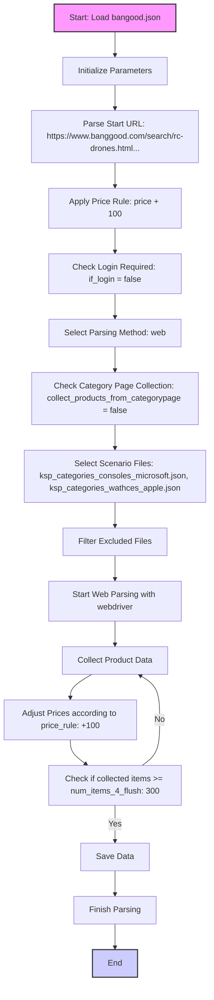

## <алгоритм>

1.  **Начало**: Загружается JSON-файл `bangood.json`, который содержит настройки для парсинга данных с сайта Banggood.
2.  **Инициализация параметров**: Из JSON-файла извлекаются следующие параметры:
    *   `supplier`: Указывает поставщика ("ksp").
    *   `supplier_prefix`: Префикс поставщика ("ksp"), используется для именования файлов.
    *   `start_url`: URL для начального парсинга ("https://www.banggood.com/search/rc-drones.html...").
    *   `price_rule`: Правило для корректировки цены ("+100").
    *   `num_items_4_flush`: Количество товаров для сброса данных (300).
    *   `if_login`: Флаг, указывающий на необходимость авторизации (false).
    *   `parcing method`: Метод парсинга ("web").
    *   `about method web scrapping`: Комментарий о методе парсинга.
    *   `collect_products_from_categorypage`: Флаг, указывающий на сбор товаров со страницы категории (false).
    *   `scenario_files`: Список файлов сценариев для парсинга категорий.
    *   `excluded`: Список файлов категорий, которые нужно исключить из парсинга.
    *    `last_runned_scenario`: Последний запущенный сценарий (пустая строка).
3.  **Обработка параметров**:
    *   URL `start_url` используется для запуска парсера.
    *   Правило цены `price_rule` применяется к спарсенным ценам.
    *   `num_items_4_flush` определяет количество товаров, которые нужно собрать перед сохранением.
    *   Флаг `if_login` определяет, нужно ли авторизоваться перед парсингом.
    *   Метод `parcing method` указывает на использование web-парсинга через webdriver.
    *   `collect_products_from_categorypage` определяет, нужно ли собирать товары со страниц категорий.
    *   `scenario_files` используется для загрузки дополнительных сценариев.
    *   `excluded` используется для фильтрации файлов сценариев.
4.  **Выбор сценариев**: На основе списка `scenario_files` и списка `excluded` выбираются файлы для парсинга.
5.  **Парсинг**: Используется web-драйвер для парсинга страницы по `start_url` и дополнительным сценариям.
6.  **Сбор данных**: Парсер собирает данные о товарах (название, цена, описание и т.д.) со страниц, используя выбранный метод.
7.  **Корректировка цен**: Применяется правило `price_rule` к спарсенным ценам.
8.  **Сохранение данных**: Данные сохраняются после сбора `num_items_4_flush` товаров.
9.  **Завершение**: Парсинг завершается после обработки всех указанных страниц.

## <mermaid>

## <объяснение>

### Импорты
В данном коде импорты не представлены, так как это JSON-файл, предназначенный для конфигурации, а не для выполнения кода. JSON-файл используется для передачи структурированных данных, поэтому он не имеет собственных импортов.

### Классы
В данном файле нет классов, поскольку это JSON-файл, предназначенный для хранения конфигурационных данных. JSON не предназначен для определения классов.

### Функции
В данном файле нет функций, поскольку это JSON-файл. Он содержит только данные и не имеет исполняемых инструкций.

### Переменные

В данном JSON-файле содержатся следующие переменные (ключи) и их значения:

*   `supplier` (string):  Указывает поставщика, в данном случае "ksp".
*   `supplier_prefix` (string): Префикс для идентификации поставщика, в данном случае "ksp".
*   `start_url` (string):  Начальный URL для парсинга, "https://www.banggood.com/search/rc-drones.html?...".
*   `price_rule` (string):  Правило для корректировки цены, "+100" (добавление 100).
*   `num_items_4_flush` (integer):  Количество товаров, собираемых перед сохранением, 300.
*   `if_login` (boolean):  Флаг, указывающий на необходимость авторизации, `false`.
*   `parcing method [webdriver|api]` (string):  Метод парсинга, "web" (используется web-драйвер).
*   `about method web scrapping [webdriver|api]` (string):  Комментарий о методе парсинга.
*   `collect_products_from_categorypage` (boolean): Флаг, указывающий на сбор товаров со страницы категории, `false`.
*   `scenario_files` (array of strings):  Список файлов сценариев для парсинга категорий.
*   `excluded` (array of strings):  Список файлов категорий, которые нужно исключить из парсинга.
*    `last_runned_scenario` (string): Последний запущенный сценарий.

### Взаимосвязь с другими частями проекта

Этот JSON-файл, вероятно, является частью системы парсинга, которая использует его для настройки параметров парсинга. Взаимодействие с другими частями проекта может включать:

1.  **Загрузка файла**: Этот файл загружается другими частями проекта (например, парсером) для получения конфигурации.
2.  **Парсер**: Данные из файла используются для настройки парсера (веб-драйвер или API), включая URL, правила цен, количество товаров для сохранения и т.д.
3.  **Сценарии**:  `scenario_files` указывают на другие JSON-файлы, которые содержат более подробные настройки для категорий.
4. **Фильтрация**: `excluded` указывает на категории которые нужно исключить.

### Потенциальные ошибки и области для улучшения

1.  **Опечатки**: В названиях переменных есть опечатки: `parcing method` нужно исправить на `parsing_method`.
2.  **Неточность описания**:  Описание метода парсинга `about method web scrapping`  не является переменной, а скорее пояснением.
3.  **Отсутствие проверок**: Нет проверок на валидность данных, например, что `start_url` является корректным URL.
4.  **Жестко закодированные значения**: Значения `price_rule`, `num_items_4_flush` и т.д. могут быть параметризованы для большей гибкости.
5. **Формат данных**: Использовать более строгие форматы для данных, например, использовать  `enum` для `parcing method` (`web`, `api`) вместо строкового значения.
6. **Безопасность**: При реальном использовании, нужно уделить внимание безопасности, например,  хранить url в переменной окружения.

### Цепочка взаимосвязей

1.  **`bangood.json`**: Этот файл содержит общие настройки для парсинга с сайта Banggood.
2.  **`ksp_categories_consoles_microsoft.json`** и **`ksp_categories_wathces_apple.json`**: Эти файлы, указанные в `scenario_files`, вероятно, содержат более детальные настройки для соответствующих категорий товаров.
3.  **Парсер**: Программа, которая использует данные из `bangood.json` для настройки и запуска процесса парсинга. Она загружает настройки, обрабатывает данные и сохраняет результаты.
4. **Файловая система**:  Все  `*.json` лежат в `hypotez/src/scenario/json`, при этом `bangood.json` выступает в роли "главного файла".
5. **Контекст проекта**:  Данный файл является частью проекта,  `hypotez`,  используется для сбора данных, в этом файле  содержится  конфигурация для  `bangood`.

В целом, этот JSON-файл представляет собой конфигурационный файл для парсера, который определяет основные параметры и сценарии парсинга товаров с сайта Banggood.