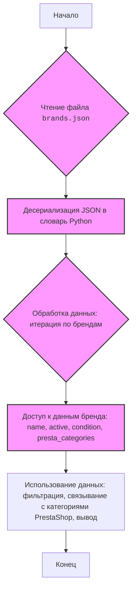

## ИНСТРУКЦИЯ:

Анализируй предоставленный код подробно и объясни его функциональность. Ответ должен включать три раздела:

1.  **<алгоритм>**: Опиши рабочий процесс в виде пошаговой блок-схемы, включая примеры для каждого логического блока, и проиллюстрируй поток данных между функциями, классами или методами.
2.  **<mermaid>**: Напиши код для диаграммы в формате `mermaid`, проанализируй и объясни все зависимости,
    которые импортируются при создании диаграммы.
    **ВАЖНО!** Убедитесь, что все имена переменных, используемые в диаграмме `mermaid`,
    имеют осмысленные и описательные имена. Имена переменных вроде `A`, `B`, `C`, и т.д., не допускаются!

    **Дополнительно**: Если в коде есть импорт `import header`, добавьте блок `mermaid` flowchart, объясняющий `header.py`:
    ```mermaid
    flowchart TD
        Start --> Header[<code>header.py</code><br> Determine Project Root]

        Header --> import[Import Global Settings: <br><code>from src import gs</code>]
    ```

3.  **<объяснение>**: Предоставьте подробные объяснения:
    *   **Импорты**: Их назначение и взаимосвязь с другими пакетами `src.`.
    *   **Классы**: Их роль, атрибуты, методы и взаимодействие с другими компонентами проекта.
    *   **Функции**: Их аргументы, возвращаемые значения, назначение и примеры.
    *   **Переменные**: Их типы и использование.
    *   Выделите потенциальные ошибки или области для улучшения.

Дополнительно, постройте цепочку взаимосвязей с другими частями проекта (если применимо).

Это обеспечивает всесторонний и структурированный анализ кода.
## Формат ответа: `.md` (markdown)
**КОНЕЦ ИНСТРУКЦИИ**

### <алгоритм>
1.  **Чтение JSON файла**:
    *   Файл `brands.json` содержит структуру данных в формате JSON.
    *   Пример: `{ "brand": { "ACER": { "active": true, "condition":"new", "presta_categories": 24 }, ... } }`
2.  **Обработка данных (в Python)**:
    *   Если бы это был Python код, то данные были бы загружены с помощью `json.load()` в структуру данных, аналогичную словарю Python.
    *   Структура словаря представляет собой вложенный словарь, где ключом верхнего уровня является `"brand"`, а значения - словари, где ключ - название бренда (например, `"ACER"`) и значение - словарь с его характеристиками.
    *   Пример:
        ```python
        import json

        with open("brands.json", 'r') as f:
            data = json.load(f)
        brands = data['brand']
        for brand_name, brand_info in brands.items():
            print(f"Бренд: {brand_name}")
            print(f"  Активный: {brand_info['active']}")
            print(f"  Состояние: {brand_info['condition']}")
            print(f"  Presta категории: {brand_info['presta_categories']}")
        ```
3. **Использование данных**:
    * Данные могут использоваться для различных целей, например:
        *   Фильтрация списка брендов (активных/неактивных)
        *   Связывание брендов с категориями в PrestaShop
        *   Использование данных для вывода в пользовательском интерфейсе
        *   Сравнение характеристик разных брендов.

### <mermaid>

### <объяснение>

**Импорты**:

*   В данном файле импортов нет. Если бы код был на python, то для работы с JSON потребовался бы `import json`. Однако, это не Python файл, а JSON.

**Классы**:

*   В данном коде нет классов, так как это JSON файл, а не python.

**Функции**:

*   В данном коде нет функций, так как это JSON файл, а не python.

**Переменные**:

*   `brand` - это ключ верхнего уровня, который содержит словарь с данными по брендам. Тип - `str`.
*   `ACER`, `AMD`, `ANTEC`, ..., `ZALMAN` - это ключи, представляющие названия брендов, значение каждого ключа - словарь. Тип - `str`.
*   `active` - это булево значение, указывающее, активен ли бренд. Тип - `bool`.
*   `condition` - строка, обозначающая состояние товара. Тип - `str`.
*   `presta_categories` - число, представляющее ID категории в PrestaShop. Тип - `int`.

**Цепочка взаимосвязей**:

*   Этот файл ( `brands.json` ) является частью более крупной системы управления данными,  используемой для настройки магазина PrestaShop. Он содержит основную информацию о брендах.
*   Данные из `brands.json`, скорее всего, используются в других частях системы, например, в скриптах импорта данных для PrestaShop или в программном обеспечении для управления каталогом.
*   Этот файл не импортирует никакие данные, но данные из него, скорее всего, импортируются в другие модули и скрипты Python.

**Потенциальные ошибки и области для улучшения**:

*   **Отсутствие схемы:** Отсутствует схема JSON, что затрудняет валидацию данных. Рекомендуется добавить JSON schema для проверки структуры и типов данных.
*   **Жестко заданные значения:** Значения, такие как `condition: "new"`, могут быть вынесены в константы или настроечные файлы, чтобы их можно было легко изменять.
*   **Неполнота данных**: Для полноценной работы, могут потребоваться дополнительные поля, такие как логотип бренда, описание, и т.д.
*   **Разные значения для WD и WESTERN DIGITAL**: У обоих брендов одинаковое значение `presta_categories`. Это стоит проверить и исправить, если есть ошибка.

В целом, это базовый файл конфигурации, который хранит информацию о брендах и их соответствующих категориях PrestaShop, и он, вероятно, является частью более сложной системы управления данными.