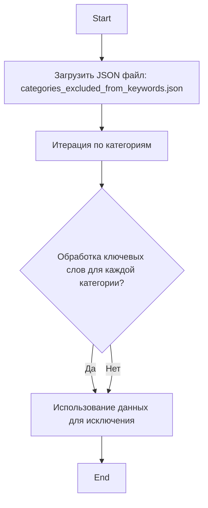

## <алгоритм>

1.  **Чтение JSON**: Загрузка JSON-файла (`categories_excluded_from_keywords.json`) в память. Представление данных в виде словаря, где ключи - идентификаторы категорий (например, "3198"), а значения - строки, содержащие ключевые слова, связанные с этими категориями (например, "CONSUMER ELECTRONICS").
    *   *Пример:* `{"3198": "CONSUMER ELECTRONICS", "3202": "computer,smartphone,gaming console,smart device"}`

2.  **Итерация по категориям**: Проход по всем парам ключ-значение в словаре, где ключ - это идентификатор категории, а значение - строка с ключевыми словами.
    *   *Пример:* На первой итерации: ключ="3198", значение="CONSUMER ELECTRONICS". На второй итерации: ключ="3202", значение="computer,smartphone,gaming console,smart device"

3.  **Обработка ключевых слов**: Для каждой категории строка ключевых слов может быть обработана (например, разделена на отдельные ключевые слова). В данном коде эта обработка не происходит. Ключевые слова остаются строкой.
    *   *Пример:* Для категории "3202" значение остается "computer,smartphone,gaming console,smart device"

4.  **Использование данных**:  Данные (категории и связанные с ними ключевые слова) используются для исключения определенных категорий из процесса обработки ключевых слов. В предоставленном коде показаны только данные.

## <mermaid>

**Объяснение зависимостей `mermaid`:**

*   **`Start`**: Начало процесса.
*   **`LoadJson`**: Этап загрузки данных из `categories_excluded_from_keywords.json`. Необходим для доступа к категориям и их ключевым словам.
*   **`IterateCategories`**: Этап перебора всех категорий в загруженных данных.
*   **`ProcessKeywords`**: Условный блок, проверяющий, нужна ли дополнительная обработка ключевых слов. В данном случае обработка отсутствует, и переход идет сразу к `UseData`.
*   **`UseData`**: Этап использования данных о категориях и их ключевых словах в основном процессе (исключение категорий из обработки).
*    **`End`**: Конец процесса.

## <объяснение>

**Импорты:**

В предоставленном коде нет импортов. Код представляет собой данные в формате JSON.

**Классы:**

В коде нет классов.

**Функции:**

В коде нет функций.

**Переменные:**

*   **`categories_excluded_from_keywords.json`**: Представляет собой JSON-файл, содержащий словарь.
    *   **Ключи**: Идентификаторы категорий (например, "3198", "3202"), которые являются строками.
    *   **Значения**: Строки, содержащие ключевые слова, связанные с соответствующими категориями.
    *   **Тип**: `dict` (словарь), где ключи и значения являются строками.

**Назначение кода:**

Данный JSON-файл содержит информацию о категориях, которые должны быть исключены при обработке ключевых слов. Это значит, что при анализе текста, ключевые слова из этих категорий не будут учитываться. Например, если в тексте встретится слово "smartphone", то это слово не будет считаться ключевым, если этот текст относится к категории "3202".

**Цепочка взаимосвязей:**

Этот JSON-файл, вероятно, используется в других частях проекта, например, в модуле для обработки текста или анализа ключевых слов. Он может служить для фильтрации или исключения определенных категорий из анализа, что позволяет более точно идентифицировать ключевые слова и избежать нерелевантных результатов.

**Потенциальные ошибки и улучшения:**

*   **Отсутствие обработки ключевых слов**: В текущем виде ключевые слова загружаются как строка. Если в дальнейшем предполагается разделять ключевые слова на отдельные элементы, необходимо предусмотреть соответствующую обработку (например, разделение строки по запятой).
*   **Жесткое кодирование**: Идентификаторы категорий (например, "3198") являются жестко закодированными. Возможно, стоит использовать более гибкий механизм для управления категориями (например, базу данных или конфигурационный файл).

**Дополнительные замечания:**

Данный JSON-файл является частью системы управления ключевыми словами и их категориями. Он обеспечивает гибкость при анализе текста и позволяет исключать определенные категории из обработки, основываясь на бизнес-логике и требованиях проекта.