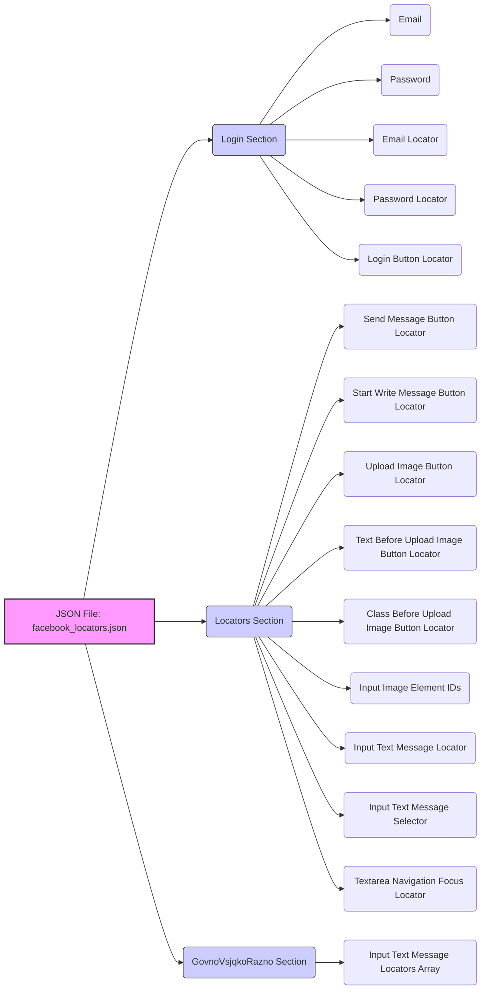

## АНАЛИЗ JSON ФАЙЛА

### 1. <алгоритм>

1. **Чтение JSON:** Файл `facebook_locators.json` представляет собой JSON-объект, содержащий конфигурацию локаторов для элементов веб-страницы Facebook.
2. **Структура JSON:**
   - Объект верхнего уровня содержит три ключевые секции: `"login"`, `"locators"` и `"govno-vsjqko-razno"`.
   - Секция `"login"` содержит данные для входа в аккаунт Facebook, такие как почта, пароль и селекторы для полей ввода и кнопки входа.
     - Пример:
       ```json
        "login": {
            "email": "one.last.bit@gmail.com",
            "password": "@o533368048",
            "email_selector": { "by": "ID", "selector": "email" },
            "password_locator": { "by": "ID", "selector": "..." },
            "loginbutton_locator": { "by": "ID", "selector": "u_0_b" }
         }
       ```
   - Секция `"locators"` содержит набор локаторов для различных элементов на странице, таких как кнопки, поля ввода и т. д. Каждый локатор задается типом селектора (`by`) и строкой селектора (`selector`).
      - Пример:
        ```json
        "locators": {
          "btn_send_message": { "by": "CSS_SELECTOR", "selector": "._1mf7._4jy0._4jy3._4jy1._51sy" },
          "btn_start_write_message": { "by": "css selector", "selector": "span._5qtp" },
          ...
        }
        ```
   - Секция `"govno-vsjqko-razno"` представляет собой дополнительную секцию с массивом локаторов.
      - Пример:
        ```json
        "govno-vsjqko-razno": {
          "input_text_message": [ "._1mf._1mk", "._1p1v", "textarea[placeholder*=\\"���� ����\\"]" ]
         }
        ```

3. **Использование:**
   - Приложение, использующее этот файл, читает его содержимое, парсит JSON и извлекает данные для автоматизации взаимодействия с веб-интерфейсом Facebook.
   - Данные в секции `"login"` используются для аутентификации.
   - Локаторы в секциях `"locators"` и `"govno-vsjqko-razno"` используются для поиска и взаимодействия с элементами на странице.
4. **Примеры:**
   - Чтобы найти поле ввода email, приложение будет использовать данные из `"login.email_selector"` (`by="ID"`, `selector="email"`).
   - Чтобы кликнуть на кнопку отправки сообщения, приложение будет использовать данные из `"locators.btn_send_message"` (`by="CSS_SELECTOR"`, `selector="._1mf7._4jy0._4jy3._4jy1._51sy"`).

### 2. <mermaid>


### 3. <объяснение>

**Импорты:**
- В данном коде нет импортов, так как это JSON-файл. Он используется как источник конфигурационных данных для других частей приложения.

**Классы:**
- В данном файле нет классов. Этот файл содержит только данные в формате JSON.

**Функции:**
- В данном файле нет функций.

**Переменные:**
- **`login`:** Объект, содержащий данные для авторизации на Facebook.
  - `email`: Строка, содержащая адрес электронной почты для входа.
  - `password`: Строка, содержащая пароль для входа.
  - `email_selector`: Объект, содержащий тип и значение селектора для поля ввода email.
  - `password_locator`: Объект, содержащий тип и значение селектора для поля ввода пароля.
  - `loginbutton_locator`: Объект, содержащий тип и значение селектора для кнопки входа.

- **`locators`:** Объект, содержащий локаторы для различных элементов на странице.
  -  `btn_send_message`: Объект, содержащий тип и значение селектора для кнопки отправки сообщения.
  -  `btn_start_write_message`: Объект, содержащий тип и значение селектора для кнопки начала написания сообщения.
  - `btn_upload_image`: Объект, содержащий тип и значение селектора для кнопки загрузки изображения.
  - `div_before_btn_upload_image_text`: Объект, содержащий тип и значение селектора для текстового блока перед кнопкой загрузки изображения.
  - `div_before_btn_upload_image_class`: Объект, содержащий тип и значение селектора для блока с классом перед кнопкой загрузки изображения.
  - `input_image_element_id`: Массив строк, содержащий возможные ID для поля ввода изображения.
  - `input_text_message___`: Объект, содержащий тип и значение селектора для поля ввода текста (альтернативный).
    -`input_text_message`: Объект, содержащий тип и значение селектора для поля ввода текста.
    - `textarea_navigationFocus`: Объект, содержащий тип и значение селектора для текстового поля фокуса навигации.

- **`govno-vsjqko-razno`:** Объект, содержащий дополнительные локаторы для поля ввода текста.
  -  `input_text_message`: Массив строк, содержащий различные селекторы для поля ввода текста.
**Взаимосвязь с другими частями проекта:**
- Этот файл является конфигурационным файлом и используется другими модулями проекта, которые отвечают за автоматизацию действий в веб-интерфейсе Facebook.
- Другие модули читают этот JSON-файл, парсят его и используют данные для поиска и взаимодействия с элементами на странице Facebook.
- Локаторы, определенные в этом файле, используются, например, в классах и методах, взаимодействующих с Selenium WebDriver.
- Взаимосвязь:
  - `src/scenario/facebook_bot.py` будет использовать эти локаторы для выполнения действий на сайте facebook
  - `src/scenario/json/facebook_locators.json` будет загружен и распарсен
  - Локаторы будут использованы в методах `src/scenario/facebook_bot.py`
**Потенциальные ошибки и области для улучшения:**
- **Жестко закодированные значения:** Значения, такие как email и пароль, хранятся непосредственно в файле. Это небезопасно и может быть изменено на использование переменных окружения или других безопасных способов хранения.
- **Неоднозначные имена:** Название секции `"govno-vsjqko-razno"` является неоднозначным и несет в себе негативный смысл. Следует переименовать в более описательное имя, например, `additional_input_locators`.
- **Дублирование локаторов:** Есть несколько локаторов для текстового поля ввода сообщения. Возможно, следует пересмотреть их необходимость и использовать только один основной локатор.
- **Уязвимость к изменениям:** Локаторы, основанные на CSS-селекторах, могут быть уязвимы к изменениям в верстке Facebook. Нужно внедрить механизмы для отслеживания и адаптации к таким изменениям.
- **Отсутствие комментариев:**  Файл не содержит комментариев, которые могли бы пояснить назначение каждого локатора, особенно для элементов с неявными именами. Это затрудняет понимание и поддержку файла.
- **Не все локаторы могут работать:**  Один из локаторов для пароля `"password_locator": { "by": "ID", "selector": "..." }"` не завершён и требует корректировки.

**Цепочка взаимосвязей с другими частями проекта (если применимо):**
- `src/scenario/facebook_bot.py` -> `src/scenario/json/facebook_locators.json`:  Модуль `facebook_bot.py` читает и использует данные локаторов из этого файла для управления веб-браузером.
- `src/scenario/common_functions.py`: Общие функции, такие как загрузка данных из JSON файла, могут использовать этот файл для загрузки локаторов.
- `src/tests/facebook_test.py` : Тесты могут использовать этот файл для создания тестовых сценариев.

В целом, файл `facebook_locators.json` является важной частью проекта, обеспечивая необходимую конфигурацию для работы с элементами веб-страницы Facebook. Однако, необходимо устранить выявленные недостатки для повышения безопасности, надежности и сопровождаемости кода.