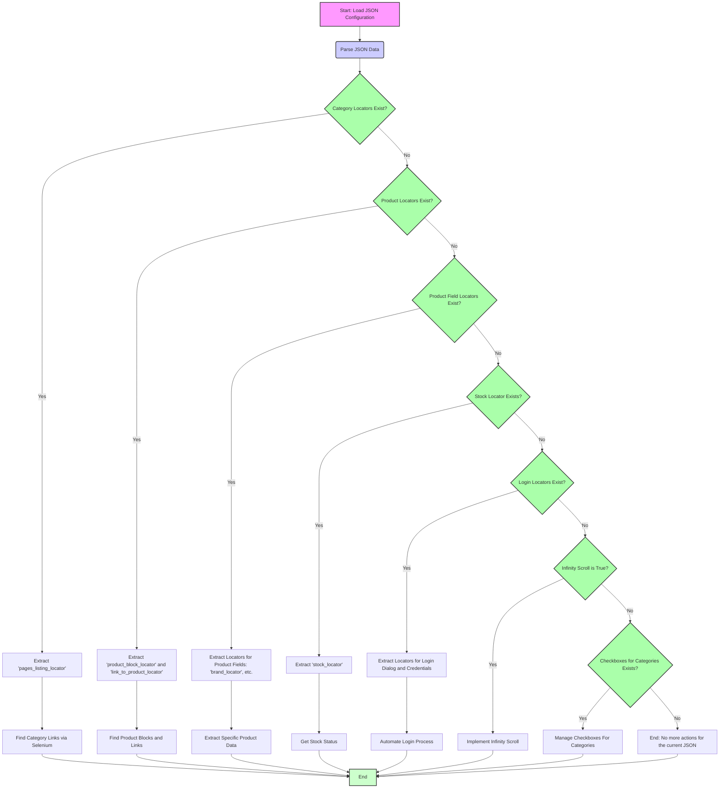

## ИНСТРУКЦИЯ:

Анализируй предоставленный код подробно и объясни его функциональность. Ответ должен включать три раздела:  

1.  **<алгоритм>**: Опиши рабочий процесс в виде пошаговой блок-схемы, включая примеры для каждого логического блока, и проиллюстрируй поток данных между функциями, классами или методами.  
2.  **<mermaid>**: Напиши код для диаграммы в формате `mermaid`, проанализируй и объясни все зависимости, 
    которые импортируются при создании диаграммы. 
    **ВАЖНО!** Убедитесь, что все имена переменных, используемые в диаграмме `mermaid`, 
    имеют осмысленные и описательные имена. Имена переменных вроде `A`, `B`, `C`, и т.д., не допускаются!  
    
    **Дополнительно**: Если в коде есть импорт `import header`, добавьте блок `mermaid` flowchart, объясняющий `header.py`:\
    ```mermaid
    flowchart TD
        Start --> Header[<code>header.py</code><br> Determine Project Root]
    
        Header --> import[Import Global Settings: <br><code>from src import gs</code>] 
    ```

3.  **<объяснение>**: Предоставьте подробные объяснения:  
    - **Импорты**: Их назначение и взаимосвязь с другими пакетами `src.`.  
    - **Классы**: Их роль, атрибуты, методы и взаимодействие с другими компонентами проекта.  
    - **Функции**: Их аргументы, возвращаемые значения, назначение и примеры.  
    - **Переменные**: Их типы и использование.  
    - Выделите потенциальные ошибки или области для улучшения.  

Дополнительно, постройте цепочку взаимосвязей с другими частями проекта (если применимо).  

Это обеспечивает всесторонний и структурированный анализ кода.
## Формат ответа: `.md` (markdown)
**КОНЕЦ ИНСТРУКЦИИ**

## <алгоритм>

Данный JSON файл представляет собой конфигурацию локаторов для веб-скрейпинга сайта grandadvance.
Он структурирован по категориям и типам элементов на веб-странице и содержит информацию о том, как находить эти элементы.

**Общая блок-схема обработки:**

1.  **Загрузка JSON:** Загрузить файл `grandadvance_locators.json`.
2.  **Разбор JSON:** Преобразовать JSON в структуру данных (словарь) Python.
3.  **Доступ к данным:**  Обращение к конкретным локаторам через ключи словаря.
4.  **Использование локаторов:**  Передача полученных данных в Selenium или другую библиотеку для поиска веб-элементов на странице.

**Пример для `category.pages_listing_locator`:**
   1.  **Обращение:** Извлечь данные по ключу  `category.pages_listing_locator`.
   2.  **Получение:** Получить словарь:
   ```json
        {
          "logic for attribue[AND|OR|XOR|VALUE|null]":null,
          "attribute": "href",
          "by": "css selector",
          "selector": "a.glyphicon-triangle-right"
        }
    ```
    3.  **Использование:**  Применить этот словарь при поиске ссылок на странице категорий:
    ```python
        # Пример с Selenium:
        from selenium import webdriver
        from selenium.webdriver.common.by import By

        driver = webdriver.Chrome()
        driver.get("https://grandadvance.co.il/category/6")  # Пример URL

        locator_config = data["category"]["pages_listing_locator"]
        by_method = locator_config["by"].upper()
        selector = locator_config["selector"]
        
        if by_method == "CSS SELECTOR":
            elements = driver.find_elements(By.CSS_SELECTOR, selector)
        elif by_method == "XPATH":
             elements = driver.find_elements(By.XPATH, selector)

        for element in elements:
            attribute_value = element.get_attribute(locator_config["attribute"])
            print(attribute_value)

        driver.quit()
    ```
   4. **Аналогично:**  Повторить для других разделов: product, product_fields_locators, stock_locator, login.

**Пример для `login`:**
1. **Обращение:** Извлечь данные по ключу `login`.
2. **Получение:** Получить словарь:
```json
    {
        "open_login_dialog_locator": {
            "by": "css selector",
            "selector": "div.col-md-12.login button"
        },
        "email": "sales@aluf.co.il",
        "email_selector": {
          "by": "css selector",
          "selector": "input.mp_ltb.tbEmail"
        },
        "password": "0ee33",
        "password_locator": {
          "by": "css selector",
          "selector": ".mp_ltb.tbPassword"
        },
        "loginbutton_locator": {
          "by": "css selector",
          "selector": "div.ui-dialog-buttonpane button"
        }
    }
```
3. **Использование:** Использовать локаторы для автоматического ввода данных пользователя при авторизации:
```python
        # Пример с Selenium:
        from selenium import webdriver
        from selenium.webdriver.common.by import By

        driver = webdriver.Chrome()
        driver.get("https://grandadvance.co.il")  # Пример URL

        login_config = data["login"]

        # Открываем окно логина
        open_login_locator = login_config["open_login_dialog_locator"]
        by_method = open_login_locator["by"].upper()
        selector = open_login_locator["selector"]

        if by_method == "CSS SELECTOR":
            open_login_button = driver.find_element(By.CSS_SELECTOR, selector)
        elif by_method == "XPATH":
            open_login_button = driver.find_element(By.XPATH, selector)

        open_login_button.click()
        
        # Заполняем поле email
        email_locator = login_config["email_selector"]
        by_method = email_locator["by"].upper()
        selector = email_locator["selector"]

        if by_method == "CSS SELECTOR":
            email_field = driver.find_element(By.CSS_SELECTOR, selector)
        elif by_method == "XPATH":
             email_field = driver.find_element(By.XPATH, selector)
        
        email_field.send_keys(login_config["email"])

        # Заполняем поле password
        password_locator = login_config["password_locator"]
        by_method = password_locator["by"].upper()
        selector = password_locator["selector"]

        if by_method == "CSS SELECTOR":
             password_field = driver.find_element(By.CSS_SELECTOR, selector)
        elif by_method == "XPATH":
            password_field = driver.find_element(By.XPATH, selector)
        
        password_field.send_keys(login_config["password"])

         # Нажимаем кнопку login
        login_button_locator = login_config["loginbutton_locator"]
        by_method = login_button_locator["by"].upper()
        selector = login_button_locator["selector"]

        if by_method == "CSS SELECTOR":
             login_button = driver.find_element(By.CSS_SELECTOR, selector)
        elif by_method == "XPATH":
             login_button = driver.find_element(By.XPATH, selector)

        login_button.click()

        driver.quit()
```

## <mermaid>



**Объяснение:**
1.  **A[Start: Load JSON Configuration]**: Начало процесса, загрузка JSON файла с конфигурациями локаторов.
2.  **B(Parse JSON Data)**:  JSON данные преобразуются в структуру данных (словарь Python).
3.  **C{Category Locators Exist?}**: Проверка наличия локаторов для категории (например, `pages_listing_locator`).
4.  **D[Extract 'pages_listing_locator']**:  Извлечение конфигурации локаторов для списка страниц категорий.
5.  **E[Find Category Links via Selenium]**:  Использование локаторов для поиска ссылок на страницы категорий, используя Selenium.
6.  **F{Product Locators Exist?}**: Проверка наличия локаторов для блоков и ссылок товаров.
7.  **G[Extract 'product_block_locator' and 'link_to_product_locator']**: Извлечение локаторов для блоков и ссылок товаров.
8.  **H[Find Product Blocks and Links]**: Поиск блоков и ссылок товаров с помощью Selenium.
9.  **I{Product Field Locators Exist?}**: Проверка наличия локаторов для полей товаров (например, `brand_locator`).
10. **J[Extract Locators for Product Fields: 'brand_locator', etc.]**: Извлечение всех локаторов полей товара.
11. **K[Extract Specific Product Data]**: Поиск и извлечение данных конкретных полей товара с помощью Selenium.
12. **L{Stock Locator Exists?}**: Проверка наличия локатора для информации о наличии на складе.
13. **M[Extract 'stock_locator']**: Извлечение локатора для статуса наличия на складе.
14. **N[Get Stock Status]**: Поиск информации о статусе наличия на складе с использованием Selenium.
15. **O{Login Locators Exist?}**: Проверка наличия локаторов для автоматизации логина.
16. **P[Extract Locators for Login Dialog and Credentials]**: Извлечение локаторов для диалогового окна логина, полей для ввода email и пароля, и кнопки логина.
17. **Q[Automate Login Process]**: Автоматизация процесса логина путем использования Selenium для взаимодействия с элементами веб-страницы.
18. **R{Infinity Scroll is True?}**: Проверка включена ли функция бесконечной прокрутки.
19. **S[Implement Infinity Scroll]**: Реализация бесконечной прокрутки страниц, для загрузки всего контента, если это настроено в `json`.
20. **T{Checkboxes for Categories Exists?}**: Проверка, нужно ли управлять чекбоксами категорий.
21. **U[Manage Checkboxes For Categories]**: Управление состояниями чекбоксов.
22. **V[End: No more actions for the current JSON]**: Завершение процесса обработки JSON, если нет дальнейших действий.
23. **X[End]**: Окончание обработки

## <объяснение>

**Импорты:**
В данном коде нет импортов. Это файл конфигурации, а не исполняемый код на Python.

**Классы:**
В данном коде нет классов.

**Функции:**
В данном коде нет функций.

**Переменные:**
Файл `grandadvance_locators.json` содержит набор переменных в формате JSON, организованных в виде словарей (объектов) и списков (массивов):

1.  `category`: Объект, содержащий локаторы для навигации по категориям товаров.
    *   `pages_listing_locator`:  Локатор для поиска элементов, ведущих на следующие страницы категорий.
        *   `logic for attribue[AND|OR|XOR|VALUE|null]`: Null, означает, что логика для атрибута не требуется.
        *   `attribute`:  "href" -  атрибут для получения ссылки на страницу.
        *   `by`: "css selector" - метод поиска элемента на странице.
        *   `selector`: "a.glyphicon-triangle-right" - CSS селектор для поиска элемента.

2.  `product`:  Объект, содержащий локаторы для поиска блоков и ссылок товаров.
    *   `product_block_locator`: Локатор для поиска блока, содержащего информацию о товаре.
        * `attribute`:  "innerHTML" - получение внутреннего HTML содержимого
        *   `by`: "css selector".
        *   `selector`: "div.prod"
    *   `link_to_product_locator`: Локатор для поиска ссылки на страницу конкретного товара.
        *   `attribute`: "href".
        *   `by`: "css selector".
        *   `selector`: ".name a".

3.  `product_fields_locators`:  Объект, содержащий локаторы для поиска различных полей товара.
    *   `brand_locator`: Локатор для названия бренда.
        * `attribute`:  "innerHTML".
        * `by`: "css selector".
        * `selector`: ".brands".
    *   `brand_sku_locator`: Локатор для артикула бренда.
        *  `attribute`: "innerHTML".
        *   `by`: "XPATH".
        *   `selector`:  "//*[@id='aspnetForm']/center/div[1]/div/table/tbody/tr[1]/td[2]/table/tbody/tr[2]/td/table/tbody/tr[2]/td[2]/b".
    *   `summary_locator`: Локатор для краткого описания товара.
        * `attribute`:  "innerHTML".
        *   `by`: "css selector".
        *   `selector`: ".pp_pp_ttcc".
    *   `description_locator`: Локатор для полного описания товара.
        *  `attribute`: "innerHTML".
        *  `by`: "css selector".
        *   `selector`: ".pp_ttc".
    *   `images_locator`: Локатор для получения ссылок на изображения товара.
        *  `attribute`:  "href".
        *  `by`: "css selector".
        *   `selector`: "td.pp_dp a".
    *   `price_locator`: Локатор для цены товара.
        *  `attribute`:  "innerHTML".
        *  `by`: "css selector".
        *   `selector`: ".pp_sp.rc".
    *   `sku_locator`: Локатор для артикула товара.
        *  `attribute`: "innerHTML".
        *  `by`: "css selector".
        *   `selector`: ".lPartNumber".
    *   `product_name_locator`: Локатор для названия товара.
        *  `attribute`:  "innerHTML".
        *  `by`: "css selector".
        *   `selector`: ".pp_n".

4.  `stock_locator`:  Локатор для определения наличия товара на складе.
    *  `attribute`: "innerHTML".
    *  `by`: "css selector".
    *   `selector`: ".t_b.a_r".
5.  `not in stock`: Список строк, которые могут указывать на то, что товара нет в наличии.
6.  `login`: Объект, содержащий локаторы для автоматизации процесса авторизации.
    * `open_login_dialog_locator`: Локатор для кнопки открытия диалога авторизации
        * `by`: "css selector".
        * `selector`: "div.col-md-12.login button".
    *   `email`: Email для автоматического ввода.
    *   `email_selector`:  Локатор для поля ввода email.
        *   `by`: "css selector".
        *   `selector`: "input.mp_ltb.tbEmail".
    *   `password`: Пароль для автоматического ввода.
    *   `password_locator`: Локатор для поля ввода пароля.
        *   `by`: "css selector".
        *   `selector`: ".mp_ltb.tbPassword".
    *   `loginbutton_locator`: Локатор для кнопки подтверждения авторизации.
        *   `by`: "css selector".
        *   `selector`: "div.ui-dialog-buttonpane button".
7. `infinity_scroll`: Логическая переменная. `true` если нужно использовать бесконечную прокрутку. `false` если нет.
8.  `checkboxes_for_categories`: Логическая переменная. `true` если есть чекбоксы категорий. `false` если нет.

**Потенциальные ошибки и области для улучшения:**
1.  **Зависимость от структуры HTML:**  Локаторы жестко привязаны к HTML структуре сайта. Любое изменение в структуре сайта приведет к неработоспособности локаторов. Необходимо внедрять гибкие стратегии поиска элементов (например, более общие селекторы или поиск по тексту).
2.  **Отсутствие обработки ошибок:** В примерах не реализована обработка случаев, когда элемент не найден. Необходимо добавить проверку на наличие элемента перед взаимодействием с ним (например, через  `try`/`except`).
3.  **Жестко закодированные данные:** Email и пароль для логина закодированы в JSON. Это небезопасно и негибко. Лучше хранить учетные данные в переменных окружения или использовать более надежные методы управления секретами.
4.  **Отсутствие логики для атрибутов:** Ключ `"logic for attribue[AND|OR|XOR|VALUE|null]":null` указывает, что логика для атрибутов не используется. Возможно, в будущем потребуется реализация логики для извлечения данных из атрибутов, в таком случае, нужно будет изменить структуру и алгоритм.
5. **Зависимость от XPATH**: Использование `XPATH` может быть медленным и хрупким, лучше использовать `CSS selectors` если это возможно.

**Цепочка взаимосвязей с другими частями проекта:**
Данный файл используется как конфигурация для веб-скрейпера.  Он передает информацию о локаторах в модули, которые:
1.  Загружают этот файл (например, через модуль `json`).
2.  Используют эти локаторы для поиска элементов на веб-странице через Selenium.
3.  Извлекают необходимые данные (текст, ссылки, атрибуты) с помощью методов Selenium (например, `find_element`, `find_elements`, `get_attribute`).
4.  Сохраняют извлеченные данные в нужном формате.