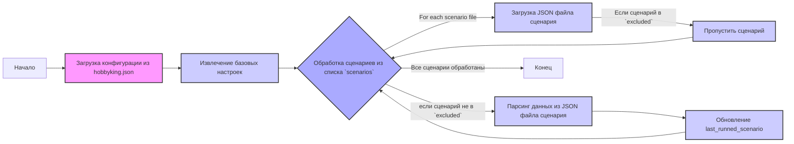

## Анализ JSON конфигурации `hobbyking.json`

### 1. <алгоритм>
JSON-файл `hobbyking.json` представляет собой конфигурацию для веб-скрапера, предназначенного для сбора данных о товарах с сайта `ksp.co.il`. Вот пошаговое описание процесса:

1.  **Инициализация**:
    *   Скрипт начинает с чтения этого JSON-файла.
    *   Извлекает базовые настройки, такие как поставщик (`supplier`), префикс поставщика (`supplier_prefix`), начальный URL (`start_url`), правило цены (`price_rule`), и количество товаров для сброса (`num_items_4_flush`).
    *   Определяет, требуется ли вход на сайт (`if_login`) и нужно ли собирать товары со страниц категорий (`collect_products_from_categorypage`).

2.  **Обработка сценариев**:
    *   Извлекается список сценариев (`scenarios`). Каждый сценарий (например, `"ksp_categories_consoles_microsoft.json"`) указывает, какие категории товаров нужно парсить.
    *   Скрипт поочередно обрабатывает каждый указанный в `scenarios` JSON файл: например, читает `ksp_categories_consoles_microsoft.json`

3.  **Исключения**:
    *   Извлекается список исключенных сценариев (`excluded`). Эти сценарии не будут обработаны, даже если они присутствуют в общем списке категорий для парсинга.
    *   Пример: `"ksp_categories_speakers_google.json"`  не будет обработан, поскольку указан в списке `excluded`.

4.  **Обновление последнего запущенного сценария**:
    *   После каждого запуска сценария поле `last_runned_scenario` должно быть обновлено именем последнего обработанного файла (это не показано в файле конфигурации, но подразумевается).

5. **Завершение**:
   *   Скрипт завершает работу после обработки всех сценариев и исключений.

**Примеры**:
* `supplier`: `"ksp"` - устанавливает имя поставщика.
* `supplier_prefix`: `"ksp"` - устанавливает префикс для идентификаторов товаров.
* `start_url`: `"https://www.ksp.co.il/"` - базовый URL для веб-скрейпинга.
* `price_rule`: `"+100"` - правило для корректировки цены товара.
* `scenarios`: `["ksp_categories_consoles_microsoft.json","ksp_categories_wathces_apple.json"]` - список json файлов со сценариями, которые необходимо обработать.
* `excluded`: `["ksp_categories_speakers_google.json","ksp_categories_speakers_jbl.json"]` - список json файлов со сценариями, которые необходимо пропустить.

### 2. <mermaid>



**Описание зависимостей `mermaid`**:

*   **Start** - Начало процесса.
*   **LoadConfig** - Загружает JSON-конфигурацию из `hobbyking.json` файла.
*   **ExtractSettings** - Извлекает базовые настройки из загруженного JSON, такие как `supplier`, `supplier_prefix`, `start_url`, `price_rule`, `num_items_4_flush`, `if_login`, `collect_products_from_categorypage`.
*   **ProcessScenarios** - Итерация по списку сценариев в `scenarios`.
*    **LoadScenarioFile** - Загружает JSON-файл сценария
*   **SkipScenario** - Если текущий сценарий находится в списке `excluded`, он пропускается.
*   **ParseScenario** - Парсит данные из JSON файла сценария, который не находится в `excluded`.
*   **UpdateLastRunned** - Обновляет переменную `last_runned_scenario`  название последнего обработанного сценария
*   **End** - Конец процесса.

### 3. <объяснение>

#### Импорты
В предоставленном коде отсутствуют явные импорты. Это JSON-файл конфигурации, а не Python-код. Тем не менее, если бы этот файл был частью большего скрипта, он, вероятно, импортировал бы библиотеки для работы с JSON и, возможно, библиотеки для веб-скрейпинга, например:
```python
import json
import requests
from bs4 import BeautifulSoup
```
* `json` используется для чтения и обработки JSON-данных
* `requests` - библиотека для отправки HTTP-запросов к веб-сайтам
* `bs4` (Beautiful Soup) - библиотека для парсинга HTML- и XML-документов

#### Классы
В данном файле отсутствуют классы. Это JSON-файл, содержащий данные, которые используются в других частях программы.

#### Функции
В данном файле нет функций. JSON-файл содержит только данные в формате ключ-значение, которые используются программой.

#### Переменные
JSON-файл содержит следующие переменные:
*   `supplier` (строка): Определяет поставщика товаров.
*   `supplier_prefix` (строка): Префикс для идентификаторов товаров от данного поставщика.
*   `start_url` (строка): Начальный URL веб-сайта, с которого будут собираться данные.
*   `price_rule` (строка): Правило для корректировки цен, например "+100" добавляет 100 к цене товара.
*   `num_items_4_flush` (целое число): Количество товаров, которые обрабатываются перед сбросом или сохранением данных.
*   `if_login` (логическое значение):  Флаг, определяющий, требуется ли вход на сайт. `false` - вход не требуется.
*   `collect_products_from_categorypage` (логическое значение): Флаг, указывающий, нужно ли собирать товары непосредственно со страниц категорий.
*   `scenarios` (список строк): Список JSON-файлов, содержащих сценарии для парсинга определенных категорий товаров.
*   `excluded` (список строк): Список JSON-файлов, которые необходимо исключить из обработки.
*   `last_runned_scenario` (строка): Хранит имя последнего выполненного сценария.

#### Потенциальные ошибки и области для улучшения:

*   **Жестко заданные значения**: Многие значения, такие как `supplier`, `start_url` и списки `scenarios` и `excluded`, заданы жестко. Это может сделать конфигурацию менее гибкой. Возможность использования переменных окружения или внешних файлов конфигурации могла бы быть улучшением.
*   **Обработка ошибок**: В коде, который будет использовать этот файл, нужно предусмотреть обработку ошибок, таких как некорректный JSON формат или не найденный файл.
*  **Проверка типов**: В коде, использующем этот JSON, необходимо проверять соответствие типов переменных. Например, `num_items_4_flush` должно быть целым числом.
*   **Отсутствие валидации**: Нет проверки на существование указанных файлов в `scenarios` и `excluded`. Необходимо добавить проверку в скрипт, использующий этот файл.
*  **`last_runned_scenario`**: В предоставленном JSON-файле переменная  `last_runned_scenario` пустая, и необходимо предусмотреть логику для ее обновления в процессе работы скрипта.

#### Взаимосвязи с другими частями проекта:

*   **Скрипты-парсеры**: Этот JSON файл является конфигурацией для основного скрипта, который осуществляет парсинг веб-сайта. Этот скрипт будет читать данный JSON, извлекать настройки, загружать и обрабатывать сценарии из `scenarios`,  и исключать сценарии из `excluded`.
*  **Файлы сценариев**: Файлы, перечисленные в `scenarios` и `excluded`  (например, `"ksp_categories_consoles_microsoft.json"`), также являются JSON-файлами и определяют, какие категории и товары должны быть обработаны.
*   **Файлы результатов**: Собранные данные могут быть записаны в базу данных или в файлы, и в дальнейшем будут использованы для анализа и принятия решений.

Этот JSON файл является центральной частью конфигурации проекта, задавая его поведение и структуру.