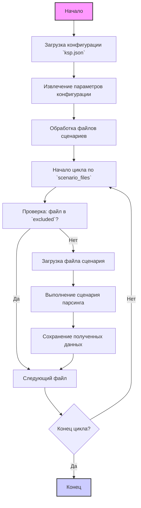

## АНАЛИЗ JSON КОНФИГУРАЦИОННОГО ФАЙЛА

### 1. <алгоритм>
Данный JSON-файл представляет собой конфигурацию для парсера, ориентированного на сбор данных с сайта KSP. Алгоритм работы парсера на основе этой конфигурации будет следующим:

1.  **Инициализация**:
    *   Парсер загружает JSON-файл конфигурации.
    *   Извлекаются базовые параметры, такие как `supplier_id`, `supplier`, `supplier_prefix`, `start_url`.
    *   Устанавливается правило ценообразования `price_rule` (в данном случае "+100").
    *   Определяется, использовать ли мышь (`use_mouse`: `false`), требуется ли обязательное наличие данных (`mandatory`: `true`).
    *   Задаётся количество элементов для сброса буфера `num_items_4_flush` (здесь 300).
    *   Определяется, нужен ли вход в систему `if_login` (`false`).
    *   Выбирается метод парсинга: веб-скреппинг или API (`parcing method [webdriver|api]`: `web`).
    *   Устанавливается, собирать ли данные с категории товаров (`collect_products_from_categorypage`: `false`).
2. **Подготовка к парсингу**:
    *   Получение списка файлов сценариев для парсинга из `scenario_files`.
        *   Пример: `ksp_categories_aio_lenovo.json`, `ksp_categories_headphones_jbl.json` и т.д.
    *   Получение списка исключённых файлов из `excluded`, которые будут проигнорированы.
        *   Пример:  `ksp_categories_phones_xiaomi.json`, `ksp_categories_monitors_samsung.json` и т.д.
    *   Определение последнего запущенного сценария `last_runned_scenario`.
3.  **Цикл обработки сценариев**:
    *   Парсер проходит по списку файлов из `scenario_files`.
    *   Если файл находится в списке `excluded`, он пропускается.
    *   Для каждого файла сценария (`json`):
        *   Загружается соответствующий файл сценария.
        *   Парсер выполняет действия, описанные в файле сценария.
        *   Данные, собранные на каждом шаге, сохраняются.
    *   После обработки всех сценариев работа парсера завершается.

**Пример для логического блока:**

Предположим, файл `ksp_categories_headphones_jbl.json` не находится в списке `excluded`.
Парсер:

1.  Загружает `ksp_categories_headphones_jbl.json`.
2.  Начинает парсинг, следуя инструкциям из `ksp_categories_headphones_jbl.json`.
3.  Извлекает данные о наушниках JBL.
4.  Переходит к следующему файлу в `scenario_files`.

### 2. <mermaid>

**Объяснение:**

*   `Start`: Начальная точка процесса.
*   `LoadConfig`: Загружает JSON-файл конфигурации (`ksp.json`).
*   `ExtractConfig`: Извлекает из файла основные параметры, такие как `supplier_id`, `supplier`, `start_url`, `price_rule`, `scenario_files`, `excluded` и другие.
*   `ProcessScenarios`: Начинает процесс обработки списка файлов сценариев.
*   `LoopStart`: Начало цикла по списку файлов сценариев (`scenario_files`).
*  `CheckExcluded`: Проверяет, находится ли текущий файл сценария в списке исключенных `excluded`.
*   `LoopContinue`: Переход к следующему файлу сценария.
*   `LoadScenarioFile`: Загружает файл сценария (например, `ksp_categories_headphones_jbl.json`).
*   `ExecuteScenario`: Выполняет действия парсинга на основе инструкций в файле сценария.
*   `SaveData`: Сохраняет собранные данные.
*   `LoopEnd`: Проверяет, закончился ли цикл обработки файлов сценариев. Если нет, то переходим к `LoopStart`. Если да, то заканчиваем процесс.
*   `End`: Конечная точка процесса.

### 3. <объяснение>

**Импорты:**
   - В данном коде импортов нет, т.к. это конфигурационный JSON-файл.

**Классы:**
   - В данном коде нет классов, т.к. это конфигурационный JSON-файл.

**Функции:**
  -  В данном коде нет функций, т.к. это конфигурационный JSON-файл.
**Переменные:**

*   `supplier_id`: (string) Идентификатор поставщика, "2787".
*   `supplier`: (string) Название поставщика, "KSP".
*   `supplier_prefix`: (string) Префикс поставщика, "ksp".
*   `start_url`: (string) Начальный URL-адрес сайта, "https://www.ksp.co.il/".
*   `price_rule`: (string) Правило ценообразования, "+100".
*  `if_list`: (string) Указывает как брать список элементов, "first"
*   `use_mouse`: (boolean) Указывает, использовать ли мышь при парсинге, `false`.
*   `mandatory`: (boolean) Указывает, обязательное ли наличие данных, `true`.
*   `num_items_4_flush`: (number) Количество элементов для сброса буфера, 300.
*   `if_login`: (boolean) Указывает, требуется ли вход в систему, `false`.
*  `parcing method [webdriver|api]`: (string) Метод парсинга: "web"
*  `about method web scrapping [webdriver|api]`: (string)  Описание метода парсинга: "Если я работаю через API мне не нужен webdriver"
*   `collect_products_from_categorypage`: (boolean) Указывает, собирать ли данные с категории товаров, `false`.
*   `scenario_files`: (array of strings) Список файлов сценариев для парсинга.
*   `excluded`: (array of strings) Список исключенных файлов сценариев.
*   `last_runned_scenario`: (string) Имя последнего запущенного файла сценария.

**Объяснение:**

Этот JSON-файл является конфигурационным файлом для парсера, который занимается сбором данных с сайта KSP.

*   Основные параметры (`supplier_id`, `supplier`, `supplier_prefix`, `start_url`) определяют идентификацию и точку входа для парсинга.
*   `price_rule` устанавливает правило, которое будет применено к цене товара при сборе данных.
*   `use_mouse`, `mandatory`, `num_items_4_flush`, `if_login` задают определенные условия и настройки для парсинга.
*   `parcing method [webdriver|api]` и  `about method web scrapping [webdriver|api]` определяют метод парсинга и его особенности.
*   `collect_products_from_categorypage` указывает, собирать ли данные о продуктах непосредственно со страниц категорий.
*   `scenario_files` содержит список сценариев парсинга для различных категорий или брендов.
*   `excluded` содержит список сценариев, которые нужно проигнорировать при парсинге.
*    `last_runned_scenario` указывает на последний запущенный сценарий, возможно, для возобновления работы или отслеживания процесса.

**Взаимосвязь с другими частями проекта:**

Этот файл является частью системы парсинга и используется совместно с кодом, который реализует логику парсинга.
На основе этого файла программа будет:

1.  Загружать и разбирать JSON.
2.  Извлекать информацию о поставщике, правилах, URL-адресах и списках сценариев.
3.  Проходить по спискам сценариев и выполнять парсинг.
4.  Игнорировать сценарии из списка `excluded`.

**Потенциальные ошибки и области для улучшения:**

*   **Дублирование в `excluded`**: В списке `excluded` есть повторяющиеся значения. Это может указывать на ошибку при формировании списка или на избыточность. Необходимо удалить дубликаты.
*   **Зависимость от конкретных файлов**: Структура файла подразумевает наличие файлов сценариев в той же директории или по определенному пути. Если путь к этим файлам изменится, то парсер не будет работать. Это стоит улучшить через абстрагирование путей к файлам, возможно, через переменную в конфиге.
*   **Отсутствие проверки файлов**: Парсер предполагает, что файлы из `scenario_files` существуют и имеют правильную структуру. Если файл отсутствует или поврежден, это может привести к ошибке. Необходима проверка наличия и целостности файлов.
*   **Отсутствие единого формата для исключений**: Структура `excluded` подразумевает исключения только по имени файла. Возможно, потребуется добавить возможность исключения по другим критериям (например, по типу категории).

В целом, файл конфигурации выглядит функционально, но нуждается в некоторых улучшениях и проверках для повышения надежности и удобства использования.