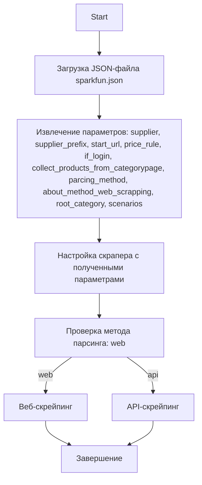

## Анализ JSON-файла `hypotez/src/scenario/json/sparkfun.json`

### 1. <алгоритм>

JSON-файл представляет собой конфигурационный файл для веб-скрейпинга сайта SparkFun. Алгоритм работы можно описать следующим образом:

1.  **Чтение JSON**: Загрузка JSON-файла в память программы.
    *   Пример: `data = json.load(open("sparkfun.json"))`

2.  **Инициализация параметров**: Извлечение основных параметров из JSON-структуры:
    *   `supplier`: поставщик - "sparkfun"
    *   `supplier_prefix`: префикс поставщика - "sparkfun"
    *   `start_url`: URL для начала парсинга - "https://www.sparkfun.com/categories"
    *   `price_rule`: правило для расчета цены - "+0" (нет изменения цены)
    *   `if_login`: флаг необходимости логина - `false` (логин не нужен)
    *   `collect_products_from_categorypage`: флаг сбора товаров со страниц категорий - `false`
    *   `parcing method [webdriver|api]`: метод парсинга - "web"
    *   `about method web scrapping [webdriver|api]`:  описание метода парсинга - "Если я работаю через API мне не нужен webdriver"
    *   `root_category`: id корневой категории - 3
    *   `scenarios`:  пустой словарь, куда должны добавляться сценарии парсинга.

3.  **Обработка параметров**: Использование извлеченных параметров в логике скраппера. В данном файле пока просто заданы настройки для последующего парсинга.
    *   Пример: `scraper = WebScraper(start_url, price_rule, if_login, method="web")`

4.  **Настройка сценариев парсинга**:  Пока не описаны, но будут добавлены в дальнейшем в `scenarios`.

### 2. <mermaid>

*   **`Start`**: Начало процесса.
*   **`LoadJSON`**: Загружает JSON-файл `sparkfun.json` в память.
*   **`ExtractParams`**: Извлекает параметры из загруженного JSON-объекта. Параметры включают:
    *   `supplier`: Имя поставщика (например, "sparkfun").
    *   `supplier_prefix`: Префикс для поставщика (например, "sparkfun").
    *   `start_url`: URL для начала сканирования.
    *   `price_rule`: Правило для корректировки цен.
    *   `if_login`: Флаг, указывающий, требуется ли вход в систему.
    *  `collect_products_from_categorypage`: Флаг, указывающий, собирать ли товары со страниц категорий.
    *   `parcing_method`: Метод парсинга ('web' или 'api').
    *    `about_method_web_scrapping`: Описание метода веб-парсинга.
    *   `root_category`: ID корневой категории.
    *   `scenarios`: Словарь для хранения сценариев сканирования.
*   **`SetUpScraper`**: Настраивает скрапер с использованием извлеченных параметров.
*   **`CheckMethod`**: Проверяет, какой метод парсинга выбран (web или api).
*  **`WebScrapping`**: Выполняется веб-скрейпинг сайта.
* **`APIScrapping`**: Выполняется парсинг через API.
*   **`End`**: Завершение процесса.

### 3. <объяснение>

**Импорты**:
В данном коде нет явных импортов. Однако, подразумевается, что  для работы с JSON будет использован стандартный модуль `json` в python.

**Классы**:
В представленном коде не определены классы. Этот JSON-файл является конфигурационным, а не кодом, поэтому классы и объекты здесь отсутствуют. Скорее всего будет класс типа `WebScraper`, который будет принимать данные настройки.

**Функции**:
В коде нет функций. Но в дальнейшем, на основе этого файла, можно предположить следующие функции:
*   `load_json(filename)`:  загружает JSON-файл по указанному имени. Возвращает словарь или вызывает исключение, если не удалось загрузить файл.
*  `create_scraper(config)`:  принимает словарь настроек и создает на его основе объект скраппера.

**Переменные**:
*   `supplier`: (string)  -  "sparkfun", указывает на поставщика.
*   `supplier_prefix`: (string) - "sparkfun",  используется для формирования уникальных идентификаторов товаров.
*   `start_url`: (string) - "https://www.sparkfun.com/categories",  является точкой входа для скрапинга.
*   `price_rule`: (string) - "+0", определяет способ модификации цены.
*   `if_login`: (bool) - `false`, указывает на необходимость входа в систему.
*   `collect_products_from_categorypage`: (bool) - `false`, определяет нужно ли брать товары с категорий.
*    `parcing method [webdriver|api]`: (string) - "web", определяет метод парсинга.
*    `about method web scrapping [webdriver|api]`: (string) - описание метода парсинга.
*    `root_category`: (int) -  3,  определяет  ID корневой категории.
*   `scenarios`: (dict) - пустой словарь, предназначенный для будущих сценариев скрапинга.

**Потенциальные ошибки и улучшения:**
*   **Отсутствие валидации**: В JSON-файле не определена схема валидации, что может привести к ошибкам при чтении, если файл будет поврежден или иметь неверную структуру.
*   **Отсутствие обработки ошибок**: При загрузке файла или доступе к данным могут возникать исключения. Необходимо предусмотреть обработку таких исключений.
*   **Нет описания сценариев парсинга**: В текущей версии `scenarios` пустой, в дальнейшем необходимо определить структуру и наполнение данного параметра.
*   **Жестко заданный метод парсинга**: в `parcing method`  жестко задано "web", было бы лучше  использовать enum или какой-то другой механизм выбора, чтобы можно было легко переключаться между web и api.
*   **Описание параметров**: Необходимо добавить описание для каждого параметра в JSON-файле.

**Цепочка взаимосвязей с другими частями проекта:**

1.  **`hypotez/src/web_scraper.py` (предположительно)**:  Этот файл, вероятно, будет импортировать настройки из JSON-файла и использовать их для настройки веб-скраппера, обрабатывающего страницы Sparkfun.
2.  **`hypotez/src/product.py` (предположительно)**: Извлеченные данные о продуктах могут быть трансформированы в объекты класса `Product` и сохранены в БД или файлы.
3.  **`hypotez/src/data_storage.py` (предположительно)**: Модуль, отвечающий за сохранение данных, полученных в результате скраппинга.

Этот анализ предоставляет полную картину о структуре и назначении JSON-файла, а также его взаимосвязях с другими частями проекта.