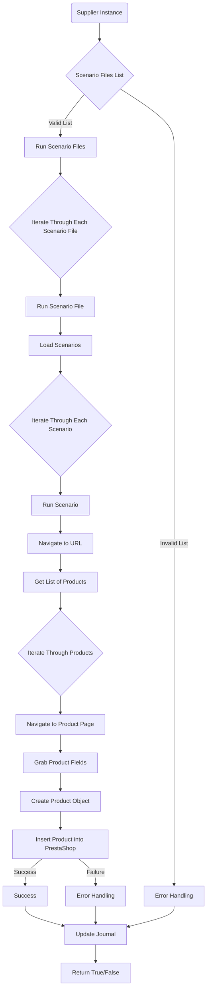

# Анализ кода `scenario_executor.mmd`

## <алгоритм>
Диаграмма описывает процесс выполнения сценариев для автоматизации действий, связанных с продуктами, вероятно, на веб-сайте PrestaShop.

1. **Начало (Supplier Instance):** Процесс начинается с экземпляра поставщика, который, вероятно, представляет источник данных или конфигурацию для сценариев.
    *   _Пример:_ Объект поставщика, содержащий настройки и URL-адреса.

2. **Список файлов сценариев (Scenario Files List):** Из экземпляра поставщика получается список файлов сценариев.
    *   _Пример:_  `['scenario1.json', 'scenario2.json', 'scenario3.json']`.

3. **Разделение на валидные и невалидные (Valid/Invalid List):** Список файлов сценариев проверяется на валидность.
    *   _Пример:_ `['scenario1.json', 'scenario2.json']` - валидный список;  `['invalid.txt']` - невалидный список.

4. **Обработка ошибок (Error Handling):** Если в списке есть невалидные файлы, выполняется обработка ошибок.
    *   _Пример:_ Логгирование ошибки или исключение.

5. **Запуск сценариев (Run Scenario Files):** Валидный список файлов сценариев передаётся для обработки.
    *   _Пример:_ Запуск функции, которая читает и выполняет сценарии.

6. **Итерация по файлам сценариев (Iterate Through Each Scenario File):** Происходит последовательное прохождение по файлам из валидного списка.
    *  _Пример:_ Перебор файлов `scenario1.json`, `scenario2.json` в цикле.

7. **Запуск файла сценария (Run Scenario File):** Каждый файл сценария передается на выполнение.
   *   _Пример:_ Вызов функции обработки содержимого `scenario1.json`.

8. **Загрузка сценариев (Load Scenarios):** Из файла сценария загружаются сценарии.
    *   _Пример:_ Разбор JSON из `scenario1.json` в список словарей.

9. **Итерация по сценариям (Iterate Through Each Scenario):** Происходит перебор сценариев из загруженного списка.
    * _Пример:_ Перебор сценариев, например: "перейти на страницу", "получить список продуктов" и т.д.

10. **Запуск сценария (Run Scenario):** Выполняется конкретный сценарий.
   * _Пример:_ Запуск сценария "перейти на страницу".

11. **Переход на URL (Navigate to URL):** Сценарий переходит на заданный URL.
    *   _Пример:_ Переход на страницу списка продуктов.

12. **Получение списка продуктов (Get List of Products):** Получается список продуктов на текущей странице.
    *   _Пример:_ Парсинг HTML-страницы и получение ссылок на продукты.

13. **Итерация по продуктам (Iterate Through Products):** Происходит перебор полученных продуктов.
   *  _Пример:_ Перебор ссылок на продукты.

14. **Переход на страницу продукта (Navigate to Product Page):** Происходит переход на страницу конкретного продукта.
    *   _Пример:_ Переход по ссылке на конкретный продукт.

15. **Получение полей продукта (Grab Product Fields):** Извлекаются поля продукта со страницы.
    *   _Пример:_ Получение названия, цены, описания товара.

16. **Создание объекта продукта (Create Product Object):** Извлеченные поля используются для создания объекта продукта.
    *   _Пример:_ Создание объекта с атрибутами `name`, `price`, `description`.

17. **Вставка продукта в PrestaShop (Insert Product into PrestaShop):** Объект продукта вставляется в базу данных PrestaShop.
    *   _Пример:_ Вызов API PrestaShop для добавления нового продукта.

18. **Обработка успеха/ошибки (Success/Failure):** Проверяется результат вставки продукта.
    *   _Пример:_ Проверка ответа API на добавление продукта.

19. **Обработка ошибок (Error Handling):** В случае ошибки происходит обработка ошибки, например логирование.

20. **Обновление журнала (Update Journal):** Обновляется журнал операций.
    *   _Пример:_ Запись в лог о том, что продукт был добавлен или не был добавлен с информацией об ошибке.

21. **Возврат True/False (Return True/False):** Возвращается результат выполнения всего сценария.
    *   _Пример:_ Возврат `True`, если все сценарии успешно выполнены, и `False` в противном случае.

## <mermaid>

### Анализ зависимостей `mermaid`
*  **supplierInstance**: Представляет источник данных или конфигурации для выполнения сценариев.
* **scenarioFilesList**: Представляет список файлов сценариев, которые будут выполняться.
*  **runScenarioFiles**: Представляет блок, который отвечает за запуск сценариев из списка файлов.
*   **errorHandling1**: Блок обработки ошибок, если список файлов сценариев невалиден.
* **iterateScenarioFiles**:  Блок итерирования по списку файлов сценариев.
* **runScenarioFile**:  Блок запуска каждого файла сценария.
*  **loadScenarios**: Представляет блок, который отвечает за загрузку сценариев из файла.
*  **iterateScenarios**: Блок итерирования по списку сценариев.
* **runScenario**:  Блок запуска каждого сценария.
*  **navigateToURL**: Блок навигации по URL.
*   **getListOfProducts**: Блок для получения списка продуктов на странице.
*   **iterateProducts**: Блок итерирования по списку продуктов.
*   **navigateToProductPage**: Блок навигации по страницам конкретного продукта.
*  **grabProductFields**: Блок получения полей продукта со страницы.
*   **createProductObject**: Блок для создания объекта продукта из полученных полей.
*   **insertProductIntoPrestaShop**: Блок добавления продукта в базу данных PrestaShop.
* **success**: Блок, представляющий успешное выполнение операции вставки продукта.
*  **errorHandling2**: Блок обработки ошибок, если вставка продукта не удалась.
* **updateJournal**:  Блок для обновления журнала операций.
* **returnResult**:  Блок возврата результата выполнения сценария.

## <объяснение>
### Импорты
В предоставленном коде отсутствуют явные импорты, которые можно было бы проанализировать. Однако из контекста можно предположить, что могут быть импорты из `src`, такие как:
- `src.config.settings` или `src.gs` для настроек и глобальных переменных.
- `src.scenario` для работы со сценариями.
- `src.utils` для утилит.
- `src.prestashop` для взаимодействия с PrestaShop API.
- `src.database` для взаимодействия с БД

### Классы
В предоставленном коде нет определения классов, но можно предположить, что существуют следующие классы:
- **Supplier**: Класс поставщика данных, содержащий настройки и методы для получения данных.
- **Scenario**: Класс, представляющий сценарий, который содержит шаги для выполнения действий (например, переход на страницу, получение данных и т.д.).
- **Product**: Класс, представляющий продукт, который содержит информацию о продукте, например, название, цену, описание.

### Функции
В коде нет явного определения функций, но, исходя из контекста, можно предположить, что есть следующие функции:
- **`run_scenarios(supplier)`**: Главная функция, которая запускает сценарии, принимает в качестве аргумента объект поставщика.
- **`load_scenario_files(supplier)`**: Загружает список файлов сценариев из поставщика.
- **`validate_scenario_files(files)`**: Проверяет список файлов сценариев на валидность.
- **`run_scenario_file(file)`**: Запускает конкретный файл сценария.
- **`load_scenarios(file)`**: Загружает список сценариев из файла.
- **`run_scenario(scenario)`**: Запускает сценарий, описанный в файле.
- **`navigate_to_url(url)`**: Переходит по URL.
- **`get_list_of_products()`**: Получает список продуктов со страницы.
- **`navigate_to_product_page(product_url)`**: Переходит на страницу конкретного продукта.
- **`grab_product_fields()`**: Получает поля продукта со страницы.
- **`create_product_object(fields)`**: Создает объект продукта из полей.
- **`insert_product_into_prestashop(product)`**: Вставляет продукт в PrestaShop.
- **`update_journal(status, message)`**: Обновляет журнал операций.

### Переменные
- **`supplierInstance`**: Объект поставщика, который используется для получения данных.
- **`scenarioFilesList`**: Список путей к файлам сценариев.
- **`validFilesList`**: Список валидных файлов сценариев.
- **`invalidFilesList`**: Список невалидных файлов сценариев.
- **`scenarioFile`**: Итератор по списку файлов сценариев.
- **`scenarios`**: Список сценариев, полученных из файла.
- **`scenario`**: Текущий сценарий.
- **`product_url`**: URL продукта.
- **`fields`**: Поля продукта.
- **`product`**: Объект продукта.
- **`status`**: Статус операции (успех или ошибка).
- **`message`**: Сообщение об ошибке или успехе операции.

### Потенциальные ошибки или области для улучшения
1. **Отсутствие обработки исключений**: В коде не видно явной обработки исключений (например, при парсинге JSON, при работе с веб-страницей или API).
2. **Жестко заданные параметры**: URL PrestaShop и другие параметры могут быть заданы жестко, что делает код менее гибким.
3. **Отсутствие логирования**: Необходимо более подробное логирование действий, включая успешные и ошибочные операции.
4. **Обработка ошибок**: Необходимо более детальное логирование ошибок, включая трассировку.
5. **Производительность**: При большом количестве продуктов, обработка каждого продукта в цикле может быть неэффективна.
6. **Асинхронность**: Некоторые операции, такие как запросы к API, должны быть асинхронными для улучшения производительности.

### Цепочка взаимосвязей
1.  `supplierInstance` → `scenarioFilesList`: Поставщик предоставляет список файлов сценариев.
2.  `scenarioFilesList` → `runScenarioFiles`: Список файлов используется для запуска сценариев.
3.  `runScenarioFiles` → `iterateScenarioFiles` → `runScenarioFile`: Происходит итерация по файлам и их запуск.
4.  `runScenarioFile` → `loadScenarios`: Загрузка сценариев из файла.
5.  `loadScenarios` → `iterateScenarios` → `runScenario`: Происходит итерация и запуск сценариев.
6.  `runScenario` → `navigateToURL`: Запуск сценария навигации по URL.
7.  `navigateToURL` → `getListOfProducts`:  Получение списка продуктов.
8.  `getListOfProducts` → `iterateProducts` →  `navigateToProductPage`: Перебор продуктов и переход на их страницы.
9.  `navigateToProductPage` → `grabProductFields`: Получение полей продукта.
10. `grabProductFields` → `createProductObject`: Создание объекта продукта.
11. `createProductObject` → `insertProductIntoPrestaShop`: Добавление продукта в PrestaShop.
12. `insertProductIntoPrestaShop` → `updateJournal`: Запись об операции в журнал.
13. `updateJournal` → `returnResult`: Возврат результата выполнения сценария.

Этот анализ обеспечивает всестороннее понимание того, как код работает и как его можно улучшить.