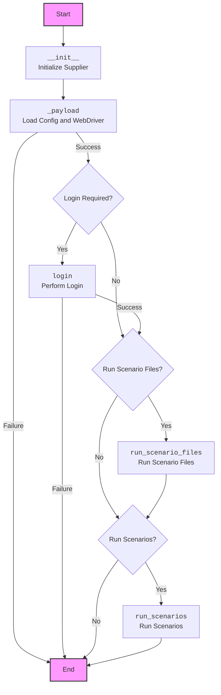

## Анализ кода класса `Supplier`

### <алгоритм>

1.  **Инициализация (`__init__`)**:
    *   При создании экземпляра класса `Supplier` передаются `supplier_prefix` (префикс поставщика, например, 'aliexpress'), `locale` (локаль, например, 'en') и `webdriver` (веб-драйвер или его настройка). Также могут быть переданы дополнительные аргументы `*attrs` и `**kwargs`.
    *   Сохраняются переданные параметры.
    *   Вызывается метод `_payload` для загрузки конфигурации и инициализации веб-драйвера.
    *   **Пример**: `supplier = Supplier(supplier_prefix='amazon', locale='en', webdriver='chrome')`

2.  **Загрузка конфигурации (`_payload`)**:
    *   Загружает настройки поставщика на основе `supplier_prefix`.
    *   Загружает конфигурационные файлы, включая локаторы и сценарии.
    *   Инициализирует веб-драйвер (если не был передан `False`).
    *   Возвращает `True`, если инициализация прошла успешно, иначе `False`.
    *   **Пример**:
        *   Загружаются настройки для `aliexpress` из `config/aliexpress_settings.json`.
        *   Загружаются локаторы веб-элементов для `aliexpress` из `locators/aliexpress_locators.json`.
        *   Загружаются сценарии выполнения для `aliexpress` из директории `scenarios/aliexpress`.
        *   Инициализируется Chrome WebDriver.

3.  **Вход на сайт (`login`)**:
    *   Метод предназначен для выполнения входа на сайт поставщика.
    *   Использует сохранённые `login_data` и `driver` для автоматизации процесса.
    *   Возвращает `True`, если вход прошел успешно, иначе `False`.
    *   **Пример**:
        *   Заполняет поля логина и пароля на сайте поставщика.
        *   Нажимает кнопку "Войти".
        *   Проверяет, что вход успешен.

4.  **Запуск сценариев (`run_scenario_files`)**:
    *   Принимает список файлов сценариев (`scenario_files`) для запуска.
    *   Итерирует по каждому файлу сценария и выполняет его.
    *   Возвращает `True`, если все сценарии выполнены, иначе `False`.
    *   **Пример**: `supplier.run_scenario_files(['scenario1.json', 'scenario2.json'])`

5.  **Запуск сценариев (`run_scenarios`)**:
    *   Принимает список или словарь сценариев (`scenarios`).
    *   Итерирует по каждому сценарию и выполняет его.
    *   Возвращает `True`, если все сценарии выполнены, иначе `False`.
    *   **Пример**: `supplier.run_scenarios([{'action': 'scrape', 'target': 'products'}, {'action': 'save', 'target': 'data'}])`

### <mermaid>

**Объяснение `mermaid` диаграммы:**

*   `Start`: Начало выполнения процесса.
*   `Init`: Метод `__init__`, инициализирующий объект `Supplier` с заданным префиксом поставщика, локалью и веб-драйвером.
*   `Payload`: Метод `_payload`, загружающий конфигурации и инициализирующий веб-драйвер.
*   `LoginCheck`: Проверка, требуется ли вход на сайт.
*   `Login`: Метод `login`, выполняющий вход на сайт поставщика.
*   `RunScenariosFilesCheck`: Проверка, нужно ли запускать сценарии из файлов.
*   `RunScenarioFiles`: Метод `run_scenario_files`, запускающий сценарии из файлов.
*   `RunScenariosCheck`: Проверка, нужно ли запускать сценарии из списка/словаря.
*   `RunScenarios`: Метод `run_scenarios`, запускающий сценарии из списка/словаря.
*   `End`: Завершение процесса.

### <объяснение>

**Импорты:**

В предоставленном коде импорты не указаны, но подразумевается использование:

*   `typing`: Для статической типизации (например, `List`, `dict`).
*   `webdriver`: Для взаимодействия с веб-браузером.
*   `json`: Для работы с JSON-файлами (конфигурации, сценарии).
*   Модули из `src.*`: Внутренние модули для работы с конфигурациями, локаторами, драйверами, сценариями.

**Класс `Supplier`**:

*   **Роль:** Базовый класс для работы с поставщиками данных. Обеспечивает общую логику, которую можно переиспользовать для разных поставщиков (например, Amazon, AliExpress).
*   **Атрибуты:**
    *   `supplier_id`: Уникальный идентификатор поставщика.
    *   `supplier_prefix`: Префикс для поставщика (например, `aliexpress`, `amazon`).
    *   `supplier_settings`: Настройки поставщика, загруженные из файла.
    *   `locale`: Код локализации (например, `en`, `ru`).
    *   `price_rule`: Правило расчета цены.
    *   `related_modules`: Модуль, содержащий специфические для поставщика функции.
    *   `scenario_files`: Список файлов сценариев.
    *   `current_scenario`: Текущий выполняемый сценарий.
    *   `login_data`: Данные для входа на сайт.
    *   `locators`: Локаторы веб-элементов.
    *   `driver`: Веб-драйвер (например, `selenium.webdriver`).
    *   `parsing_method`: Метод парсинга (`webdriver`, `api`, `xls`, `csv`).
*   **Методы:**
    *   `__init__(self, supplier_prefix: str, locale: str = 'en', webdriver: str | Driver | bool = 'default', *attrs, **kwargs)`:
        *   Конструктор класса. Инициализирует атрибуты, загружает конфигурации и инициализирует веб-драйвер через вызов `_payload`.
    *   `_payload(self, webdriver: str | Driver | bool, *attrs, **kwargs) -> bool`:
        *   Загружает настройки поставщика, локаторы и сценарии на основе `supplier_prefix`. Инициализирует веб-драйвер.
        *   Возвращает `True`, если инициализация успешна, `False` - если нет.
    *   `login(self) -> bool`:
        *   Выполняет вход на сайт поставщика, используя сохраненные `login_data`.
        *   Возвращает `True`, если вход успешен, `False` - если нет.
    *   `run_scenario_files(self, scenario_files: str | List[str] = None) -> bool`:
        *   Запускает сценарии, указанные в файлах, один за другим.
        *   Возвращает `True`, если все сценарии выполнены, `False` - если нет.
    *   `run_scenarios(self, scenarios: dict | list[dict]) -> bool`:
        *   Запускает сценарии, переданные в виде списка или словаря.
        *   Возвращает `True`, если все сценарии выполнены, `False` - если нет.

**Переменные:**

*   Переменные используются для хранения настроек поставщика, локаторов, данных для входа, списка сценариев, текущего сценария и веб-драйвера.
*   `supplier_prefix`: Строка, определяющая поставщика.
*   `locale`: Строка, представляющая локаль.
*   `webdriver`: Объект веб-драйвера, строка (`'chrome'`, `'firefox'`), или `bool` (`False` для отмены инициализации).
*   `scenario_files`: Строка или список строк, представляющих пути к файлам сценариев.
*   `scenarios`: Список или словарь, представляющие сценарии.

**Потенциальные ошибки и области для улучшения:**

*   **Обработка ошибок**: Не указана обработка исключений (например, ошибки загрузки файлов, веб-драйвера, входа на сайт, выполнения сценариев).
*   **Модульность**: Можно вынести логику загрузки конфигурации и инициализации веб-драйвера в отдельные методы.
*   **Расширяемость**: Класс можно расширить для поддержки разных типов поставщиков данных (например, API, CSV-файлы), добавив новые методы и атрибуты.
*   **Тестирование**: Необходимы тесты для проверки корректности работы методов класса.
*   **Логирование**: Добавить логирование для отслеживания выполнения сценариев и возможных ошибок.
*   **Безопасность**: Хранение данных для входа (логин, пароль) в открытом виде не рекомендуется. Следует использовать механизм безопасного хранения.
*   **Управление драйвером**: Необходимо управление жизненным циклом драйвера. Нужно явно вызывать `driver.quit()` в случае ошибки.

**Взаимосвязь с другими частями проекта:**

*   Класс `Supplier` является частью основного ядра приложения и используется в модулях, которые работают с различными поставщиками данных.
*   Класс использует файлы конфигурации, локаторов и сценариев, хранящиеся в файловой системе.
*   Взаимодействует с веб-драйвером (например, `selenium.webdriver`) для автоматизации взаимодействия с веб-сайтами.
*   Модули, работающие с конкретными поставщиками, будут наследоваться от `Supplier` и переопределять специфические методы (например, `login`, `run_scenario`).
*   Результаты парсинга данных будут передаваться в другие части приложения для дальнейшей обработки.