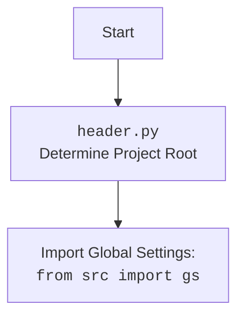

## `affiliated_products_generator.py` Analysis

### 1. <алгоритм>

**Общий процесс:**

1.  **Инициализация:**
    *   Создается экземпляр класса `AliAffiliatedProducts` с параметрами `campaign_name`, `campaign_category`, `language` и `currency`.
    *   Устанавливается путь для хранения данных (`campaign_path`) на основе параметров.

    *Пример:*

    ```python
    parser = AliAffiliatedProducts(
        campaign_name="test_campaign",
        campaign_category="electronics",
        language="RU",
        currency="RUB"
    )
    # campaign_path = gs.path.google_drive / 'aliexpress' / 'campaigns' / 'test_campaign' / 'categories' / 'electronics'
    ```

2.  **`process_affiliate_products`**:
    *   Принимает список `prod_urls` (URL-адреса или ID продуктов).
    *   Преобразует все URL в HTTPS формат с помощью `ensure_https`.
    *   Итерируется по каждому `prod_url` и вызывает `super().get_affiliate_links()` для получения партнерской ссылки.
        *   Если партнерская ссылка найдена, она добавляется в список `_promotion_links`, а `prod_url` - в `_prod_urls`.
        *   Если партнерская ссылка не найдена, логируется предупреждение.
    *   Проверяет, найдены ли партнерские ссылки, и если нет, возвращает `None`.
    *   Вызывает `self.retrieve_product_details()` с списком `_prod_urls`, чтобы получить детальную информацию о продуктах.
        *   Если детали продуктов не возвращены, возвращает `None`.
    *   Итерируется одновременно по полученным деталям продуктов и партнерским ссылкам.
        *   Если `promotion_link` отсутствует,  пытается извлечь `aff_short_key` из `product.promotion_link`, и  если ключ присутствует, то  создаёт короткую партнерскую ссылку.
        *   Если `aff_short_key` отсутствует или ссылка не является партнерской, удаляет продукт с помощью `self.delete_product()`.
        *   Если `promotion_link` присутствует, присваивает его продукту.
    *   Сохраняет изображение продукта с помощью `save_png_from_url()` в папку `campaign_path / 'images'`.
    *   Сохраняет видео продукта (если есть) с помощью `save_video_from_url()` в папку `campaign_path / 'videos'`.
    *   Сохраняет данные продукта в формате JSON с помощью `j_dumps()` в папку `campaign_path / self.locale`.
    *   Возвращает список обработанных продуктов.

    *Пример:*

    ```python
    prod_urls = [
        "https://www.aliexpress.com/item/12345.html",
        "67890",
        "https://aliexpress.com/item/13579.html"
    ]
    products = parser.process_affiliate_products(prod_urls)
    # Возвращает список SimpleNamespace объектов, где каждый объект - обработанный продукт.
    ```

3.  **`delete_product`**:
    *   Принимает `product_id` и флаг `exc_info`
    *   Извлекает `_product_id` из `product_id`.
    *   Читает список продуктов из `sources.txt`.
        *   Если список существует, то преобразует его в однородный список и удаляет `product_id` из списка, если такой id найден. Сохраняет обновленный список в `_sources.txt`.
        *   Если списка нет или id не найден, то переименовывает файл продукта в `sources/_id_.html` -> `sources/_id__.html`.

    *Пример:*

    ```python
    parser.delete_product("12345")
    # Удалит '12345' из списка в sources.txt или переименует файл в папке sources
    ```

**Поток данных:**

```mermaid
flowchart TD
    A[Начало] --> B(Инициализация AliAffiliatedProducts)
    B --> C{process_affiliate_products(prod_urls)}
    C --> D{ensure_https(prod_urls)}
    D --> E{get_affiliate_links(prod_url)}
    E -- Affiliate Link Found --> F(Сохранить promotion_link и prod_url)
    E -- No Affiliate Link --> G{logger.info_red('Not found affiliate for {prod_url}')}
    F --> H{retrieve_product_details(_prod_urls)}
     G --> H
    H --> I{Проверка affiliate products}
    I --  Нет товаров --> J[Return None]
    I -- Товары найдены --> K{Цикл по продуктам}
    K --> L{Проверка promotion_link}
     L -- Нет promotion_link --> M{Извлечь aff_short_key}
        M -- aff_short_key найден --> N[Создать короткую партнерскую ссылку]
        M -- aff_short_key не найден --> O{delete_product(product_id)}
        N --> P{Сохранить изображение}
    L -- promotion_link есть --> P
    O --> P
    P --> Q{Сохранить видео (если есть)}
    Q --> R{Сохранить JSON}
    R --> S{Конец цикла}
    S -- Еще есть продукты --> K
    S -- Нет продуктов --> T[return _affiliate_products]
    J --> T
    T --> U[Конец]
    
     style A fill:#f9f,stroke:#333,stroke-width:2px
    style U fill:#f9f,stroke:#333,stroke-width:2px
```

### 2. <mermaid>

```mermaid
flowchart TD
    A[AliAffiliatedProducts] --> B(AliApi)
    B --> C[language, currency]
    A --> D[campaign_name, campaign_category, language, currency]
    A --> E{process_affiliate_products(prod_urls)}
    E --> F{ensure_https(prod_urls)}
    F --> G{get_affiliate_links(prod_url)}
    G --> H{retrieve_product_details(_prod_urls)}
    H --> I{urlparse, parse_qs}
    I --> J{save_png_from_url}
    I --> K{save_video_from_url}
    I --> L{j_dumps}
    A --> M{delete_product(product_id)}
        M --> N{extract_prod_ids}
        M --> O{read_text_file}
        M --> P{save_text_file}

    style A fill:#f9f,stroke:#333,stroke-width:2px
```

**Зависимости:**

*   `AliAffiliatedProducts` наследует от `AliApi`, получая функциональность для работы с API Aliexpress.
*   `AliApi` принимает `language` и `currency` в качестве параметров инициализации.
*   `AliAffiliatedProducts` принимает `campaign_name`, `campaign_category`, `language` и `currency` для создания пути к файлам кампании.
*   `process_affiliate_products` использует `ensure_https` для форматирования URL, `get_affiliate_links` для получения партнерских ссылок, `retrieve_product_details` для получения информации о продуктах.
*   `urlparse` и `parse_qs` используются для обработки URL и извлечения параметров запроса.
*   `save_png_from_url`, `save_video_from_url` и `j_dumps` используются для сохранения данных.
    `delete_product` использует `extract_prod_ids` для обработки `product_id`, `read_text_file` для чтения файлов и `save_text_file` для сохранения данных в файл.

Дополнительный блок `mermaid` для `header.py`:



### 3. <объяснение>

**Импорты:**

*   **Стандартные библиотеки:**
    *   `asyncio`: Для асинхронного программирования (не используется напрямую в представленном коде, но может использоваться в других частях проекта).
    *   `itertools`: Для работы с итераторами (используется `count` - для генерации последовательностей, не используется в этом коде).
    *   `math`: Для математических операций (используется `log` - не используется в этом коде).
    *   `pathlib`: Для работы с путями файлов и директорий.
    *   `typing`: Для аннотации типов (используются `List`, `Union`, `Optional`).
    *   `types`: Для работы с типами данных (`SimpleNamespace`).
    *   `urllib.parse`: Для парсинга URL (`urlparse`, `parse_qs`).

*   **`src` (внутренние библиотеки):**
    *   `from src import gs`: Импортирует глобальные настройки (`gs`). `gs`  вероятно хранит пути и общие параметры проекта. Это позволяет использовать `gs.path` для формирования путей к файлам проекта.
    *   `from src.suppliers.aliexpress import AliApi`: Импортирует класс `AliApi` для работы с API AliExpress. Является родителем класса `AliAffiliatedProducts`.
    *   `from src.suppliers.aliexpress import Aliexpress`: Импортирует класс `Aliexpress`. Не используется в этом коде, вероятно, используется в других частях проекта.
    *   `from src.suppliers.aliexpress.affiliate_links_shortener_via_webdriver import AffiliateLinksShortener`: Импортирует класс `AffiliateLinksShortener` для сокращения партнерских ссылок. Не используется в этом коде.
    *   `from src.suppliers.aliexpress.utils.extract_product_id import extract_prod_ids`: Импортирует функцию `extract_prod_ids` для извлечения ID продукта из URL или строки.
    *   `from src.suppliers.aliexpress.utils.set_full_https import ensure_https`: Импортирует функцию `ensure_https` для преобразования URL в HTTPS.
    *    `from src.utils.convertor.csv2json import csv2dict`: Импортирует функцию `csv2dict`. Не используется в этом коде.
    *   `from src.utils.jjson import j_dumps`: Импортирует функцию `j_dumps` для сохранения данных в формате JSON.
    *   `from src.utils import save_png_from_url, save_video_from_url`: Импортирует функции для сохранения изображений и видео с URL.
    *   `from src.utils.printer import pprint`: Импортирует функцию `pprint` для форматированного вывода.
    *   `from src.utils.file import read_text_file, save_text_file`: Импортирует функции для чтения и записи текстовых файлов.

    *   `from src.logger.logger import logger`: Импортирует объект `logger` для логирования событий.

**Классы:**

*   **`AliAffiliatedProducts(AliApi)`:**
    *   **Роль:** Основной класс для обработки партнерских продуктов AliExpress. Наследует от `AliApi` для работы с API.
    *   **Атрибуты:**
        *   `campaign_name` (str): Название рекламной кампании.
        *   `campaign_category` (Optional[str]): Категория кампании (может отсутствовать).
        *   `campaign_path` (Path): Путь к директории кампании.
        *   `language` (str): Язык кампании.
        *   `currency` (str): Валюта кампании.
        *   `locale`:  строка с `language` и `currency`.
    *   **Методы:**
        *   `__init__(...)`: Конструктор класса, инициализирует атрибуты и вызывает конструктор родительского класса.
        *   `process_affiliate_products(prod_urls: List[str])`: Основной метод для обработки списка URL продуктов, получения партнерских ссылок, загрузки изображений, видео и сохранения JSON данных.
        *   `delete_product(product_id: str, exc_info: bool = False)`:  Удаляет продукт который не является партнерским.

**Функции:**

*   **`__init__(...)`:**
    *   **Аргументы:**
        *   `campaign_name` (str): Название рекламной кампании.
        *   `campaign_category` (Optional[str]): Категория кампании (может быть `None`).
        *   `language` (str): Язык кампании (по умолчанию `EN`).
        *   `currency` (str): Валюта кампании (по умолчанию `USD`).
    *   **Назначение:** Инициализирует объект класса `AliAffiliatedProducts`. Создает путь для сохранения данных.
    *   **Пример:**
        ```python
        parser = AliAffiliatedProducts("test_campaign", "electronics", "RU", "RUB")
        ```
*   **`process_affiliate_products(prod_urls: List[str])`:**
    *   **Аргументы:**
        *   `prod_urls` (List[str]): Список URL-адресов продуктов или ID.
    *   **Возвращаемое значение:** Список объектов `SimpleNamespace`, представляющих обработанные продукты.
    *   **Назначение:** Основной метод для обработки списка URL-адресов, получения партнерских ссылок, загрузки изображений, видео и сохранения JSON данных.
        *  Извлекает партнерские ссылки из списка URL или ID продуктов.
        *  Получает детальную информацию о продуктах.
        *  Сохраняет изображения и видео для каждого продукта.
        *  Сохраняет JSON данные о каждом продукте.
        *  Если продукт не имеет партнерской ссылки, удаляет его из списка.
    *   **Пример:**
        ```python
        products = parser.process_affiliate_products([
            "https://www.aliexpress.com/item/12345.html",
            "67890"
        ])
        ```
*   **`delete_product(product_id: str, exc_info: bool = False)`:**
     * **Аргументы:**
        *   `product_id` (str): ID продукта.
        *   `exc_info` (bool): Флаг для подробного вывода ошибок.
     * **Возвращаемое значение:** `None`
     * **Назначение:** Удаляет продукт из `sources.txt` файла или переименовывает файл продукта в папке `sources`, если файл не является партнерским.

**Переменные:**

*   `campaign_name`, `campaign_category`, `language`, `currency`: Атрибуты класса, которые устанавливаются при инициализации.
*   `campaign_path`: Путь к директории кампании, формируется на основе атрибутов класса.
*   `_promotion_links`: Список партнерских ссылок.
*   `_prod_urls`: Список URL-адресов продуктов или ID.
*   `_affiliate_products`: Список объектов `SimpleNamespace`, содержащих информацию о продукте.
*   `product`: Объект `SimpleNamespace`, содержащий информацию о продукте.
*   `promotion_link`: Строка, содержащая партнерскую ссылку.
*  `_product_id`: ID продукта, полученный после обработки с помощью `extract_prod_ids`.

**Потенциальные ошибки и улучшения:**

*   **Обработка ошибок:** Код содержит базовую обработку ошибок, но могут быть добавлены дополнительные проверки и обработки, например, проверка существования директорий, обработка ошибок сети и т. д.
*   **Асинхронность:** Загрузка изображений и видео может быть выполнена асинхронно для ускорения работы.
*   **Кэширование:** Результаты вызовов API могут быть кэшированы для уменьшения количества запросов.
*   **Тестирование:** Добавление модульных тестов для проверки корректности работы методов класса.
*   **Рефакторинг:** Разделение кода на более мелкие функции для улучшения читаемости и поддержки.
* **Логирование:** Добавить более подробное логирование с информацией о конкретных продуктах и операциях.

**Взаимосвязи с другими частями проекта:**

*   **`gs` (global settings):**  Используется для получения путей и настроек проекта.
*   **`AliApi`:** Обеспечивает доступ к API Aliexpress и используется для получения партнерских ссылок.
*   **`src.utils`:** Используются для сохранения изображений, видео, JSON данных и форматированного вывода.
*   **`src.logger`:** Используется для логирования событий.
*  **`src.utils.file`:** Используется для чтения и сохранения данных в текстовые файлы.

Этот анализ обеспечивает полное понимание структуры, функциональности и связей кода, что позволяет эффективно его использовать и поддерживать.