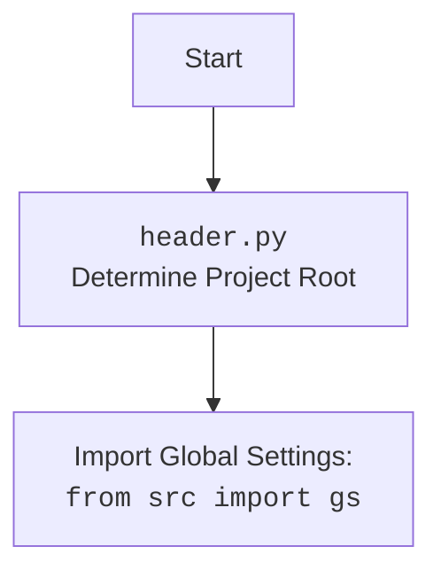

## ИНСТРУКЦИЯ:

Анализируй предоставленный код подробно и объясни его функциональность. Ответ должен включать три раздела:  

1. **<алгоритм>**: Опиши рабочий процесс в виде пошаговой блок-схемы, включая примеры для каждого логического блока, и проиллюстрируй поток данных между функциями, классами или методами.  
2. **<mermaid>**: Напиши код для диаграммы в формате `mermaid`, проанализируй и объясни все зависимости, 
    которые импортируются при создании диаграммы. 
    **ВАЖНО!** Убедитесь, что все имена переменных, используемые в диаграмме `mermaid`, 
    имеют осмысленные и описательные имена. Имена переменных вроде `A`, `B`, `C`, и т.д., не допускаются!  
    
    **Дополнительно**: Если в коде есть импорт `import header`, добавьте блок `mermaid` flowchart, объясняющий `header.py`:\
    ```mermaid
    flowchart TD
        Start --> Header[<code>header.py</code><br> Determine Project Root]
    
        Header --> import[Import Global Settings: <br><code>from src import gs</code>] 
    ```

3. **<объяснение>**: Предоставьте подробные объяснения:  
   - **Импорты**: Их назначение и взаимосвязь с другими пакетами `src.`.  
   - **Классы**: Их роль, атрибуты, методы и взаимодействие с другими компонентами проекта.  
   - **Функции**: Их аргументы, возвращаемые значения, назначение и примеры.  
   - **Переменные**: Их типы и использование.  
   - Выделите потенциальные ошибки или области для улучшения.  

Дополнительно, постройте цепочку взаимосвязей с другими частями проекта (если применимо).  

Это обеспечивает всесторонний и структурированный анализ кода.
## Формат ответа: `.md` (markdown)
**КОНЕЦ ИНСТРУКЦИИ**

## <алгоритм>

**Блок-схема работы класса `AliAffiliatedProducts`:**

1.  **Инициализация `__init__`:**
    *   Принимает `campaign_name`, `campaign_category` (опционально), `language`, и `currency`.
    *   Инициализирует родительский класс `AliApi` с `language` и `currency`.
    *   Сохраняет переданные параметры как атрибуты экземпляра класса.
    *   Формирует `locale` строку, например, "EN\_USD".
    *   Определяет `campaign_path` для сохранения материалов кампании на основе `gs.path.google_drive`.
    *   Пример:
        ```python
        parser = AliAffiliatedProducts(
                    campaign_name="SummerSale",
                    campaign_category="Clothing",
                    language="EN",
                    currency="USD"
                )
        #  parser.campaign_path будет содержать путь к каталогу кампании
        ```

2.  **`process_affiliate_products(prod_urls)`:**
    *   **Вход:** Список `prod_urls` (URL-адреса или ID товаров).
    *   **Преобразование URL:**
        *   Преобразует все URL в HTTPS формат используя `ensure_https(prod_urls)`.
    *   **Получение аффилированных ссылок:**
        *   Итерируется по URL и вызывает `super().get_affiliate_links(prod_url)` для каждого URL.
        *   Если аффилированная ссылка найдена (имеет атрибут `promotion_link`), то добавляет ее в список `_promotion_links`, а URL в список `_prod_urls`.
        *   В случае отсутствия аффилированной ссылки логирует ошибку.
    *   **Проверка наличия аффилированных ссылок:**
        *   Если список `_promotion_links` пустой, то логируется ошибка и функция завершается.
    *   **Получение деталей продукта:**
        *   Вызывает `self.retrieve_product_details(_prod_urls)` для получения детальной информации о товарах.
        *   Если деталей нет, то функция завершается.
    *   **Обработка информации о продукте:**
        *   Итерируется по полученным продуктам и аффилированным ссылкам.
        *   Проверяет, существует ли `promotion_link`. Если нет, парсит URL, извлекает `aff_short_key`, и, если он есть, формирует короткую аффилированную ссылку. Если `aff_short_key` нет, вызывает `self.delete_product(product.product_id)`.
        *   Если  `promotion_link` существует, то присваивает ее атрибуту `product.promotion_link`.
        *   Сохраняет изображения продукта используя `save_png_from_url`, сохраняя путь в `local_image_path` атрибуте продукта.
        *   Если у продукта есть видео, сохраняет его, используя `save_video_from_url`, сохраняя путь в  `local_video_path` атрибуте продукта.
        *   Сохраняет данные о продукте в JSON файл используя `j_dumps`. Логирует ошибку если сохранение не удалось.
    *   **Выход:** Возвращает список обработанных продуктов.
    *   Пример:
    ```python
    prod_urls = ["https://www.aliexpress.com/item/123.html", "456"]
    products = parser.process_affiliate_products(prod_urls)
    #  products - список SimpleNamespace объектов, каждый из которых
    #  содержит информацию о продукте
    ```

3.  **`delete_product(product_id)`:**
    *   **Вход:** `product_id` - ID продукта для удаления.
    *   Извлекает ID товара из `product_id`, используя `extract_prod_ids`
    *   Читает список товаров из `sources.txt`
    *   Проверяет наличие товара в списке и, если есть, то удаляет запись из списка и сохраняет в файл `_sources.txt`.
    *   Если `sources.txt` не найден, то ищет html файл в папке `/sources/{product_id}.html`, переименовывает и перемещает его в папку `sources/{product_id}_.html`.
    *   Логирует успешное переименование или ошибку, если файл не найден.
    *   Пример:
        ```python
        parser.delete_product("123")
        #  запись с ID 123 будет удалена
        ```

## <mermaid>

```mermaid
flowchart TD
    Start[Начало] --> Init[<code>__init__</code><br>Инициализация класса `AliAffiliatedProducts`]
    
    Init --> SetAttributes[Установка атрибутов экземпляра: <br>campaign_name, campaign_category,<br> language, currency, locale, campaign_path]

    SetAttributes --> ProcessProducts[<code>process_affiliate_products(prod_urls)</code><br>Обработка списка URL/ID продуктов]
    
    ProcessProducts --> EnsureHttps[<code>ensure_https(prod_urls)</code><br>Преобразование URL в HTTPS]
    
    EnsureHttps --> LoopUrls[Цикл по URL/ID: <br><code>for prod_url in promotional_prod_urls</code>]
    
    LoopUrls -- Есть аффилированная ссылка --> GetAffiliateLink[<code>super().get_affiliate_links(prod_url)</code><br>Получение аффилированной ссылки]
     GetAffiliateLink --> AddPromotionLink[Добавление promotion_link в `_promotion_links`<br>Добавление prod_url в `_prod_urls`]
    
    LoopUrls -- Нет аффилированной ссылки --> LogNoAffiliate[Логирование ошибки отсутствия аффилированной ссылки]
    
    AddPromotionLink --> LoopUrls
    LogNoAffiliate --> LoopUrls
    
    LoopUrls -- Все URL обработаны --> CheckPromotionLinks[Проверка списка `_promotion_links`]
    
    CheckPromotionLinks -- Список пуст --> LogNoAffiliateProducts[Логирование ошибки отсутствия аффилированных продуктов и выход]
    CheckPromotionLinks -- Список не пуст --> RetrieveDetails[<code>retrieve_product_details(_prod_urls)</code><br>Получение деталей продуктов]
    
    RetrieveDetails --> CheckDetails[Проверка наличия деталей продукта]
    CheckDetails -- Детали отсутствуют --> End[Выход]
    CheckDetails -- Детали есть --> LoopProducts[Цикл по полученным продуктам: <br><code>for product, promotion_link in zip(_affiliate_products, _promotion_links)</code>]

    LoopProducts --> CheckPromotionLink[Проверка наличия `promotion_link`]
        
    CheckPromotionLink -- Нет promotion_link --> ParseUrl[Парсинг URL, получение `aff_short_key`]
    ParseUrl --> CheckAffShortKey[Проверка `aff_short_key`]
    CheckAffShortKey -- aff_short_key есть --> SetShortLink[Формирование короткой ссылки]
    SetShortLink --> SetPromotionLink[Установка `promotion_link`]
    CheckAffShortKey -- aff_short_key нет --> DeleteProductCall[<code>delete_product(product.product_id)</code><br>Удаление продукта]
    DeleteProductCall --> LoopProducts
    CheckPromotionLink -- promotion_link есть --> SetPromotionLink

    SetPromotionLink --> SaveImage[<code>save_png_from_url</code><br>Сохранение изображения продукта]
    SaveImage --> CheckVideo[Проверка наличия видео]
    CheckVideo -- Видео есть --> SaveVideo[<code>save_video_from_url</code><br>Сохранение видео продукта]
    SaveVideo --> SaveJson[<code>j_dumps</code><br>Сохранение информации о продукте в JSON]
    CheckVideo -- Видео нет --> SaveJson
    SaveJson -->  LoopProducts
    LoopProducts -- Все продукты обработаны --> ReturnProducts[Возврат списка обработанных продуктов]

    ReturnProducts --> End
    LogNoAffiliateProducts --> End
    
    
    
    subgraph delete_product
        DStart[Начало `delete_product`] --> ExtractId[<code>extract_prod_ids(product_id)</code><br>Извлечение ID продукта]
        ExtractId --> ReadSources[Чтение списка товаров из `sources.txt`]
        ReadSources --> CheckSourcesList[Проверка наличия списка товаров]
        CheckSourcesList -- Список есть --> LoopSourcesList[Цикл по списку товаров]
            LoopSourcesList --> ExtractIdFromRecord[<code>extract_prod_ids(record)</code><br>Извлечение ID из записи]
            ExtractIdFromRecord --> CheckRecordId[Сравнение ID записи с ID продукта]
            CheckRecordId -- ID совпадают --> RemoveRecord[Удаление записи из списка]
            RemoveRecord --> SaveSources[_save_text_file(list2string(products_list, '\\n'), prepared_product_path)_<br>Сохранение списка в _sources.txt]
            SaveSources --> DBreak[Выход из цикла]
            CheckRecordId -- ID не совпадают --> LoopSourcesList
            DBreak --> DEnd[Конец `delete_product`]
        CheckSourcesList -- Списка нет -->  RenameFile[Переименование HTML файла]
        RenameFile --> DEnd
    end
    
    DeleteProductCall --> delete_product
    
    
    
```
    


## <объяснение>

### Импорты
*   **`asyncio`**: Библиотека для асинхронного программирования, но в данном коде не используется напрямую.
*   **`itertools.count`**: Используется для создания бесконечных итераторов. В данном коде не используется напрямую.
*   **`math.log`**: Используется для математических операций, но в данном коде не используется напрямую.
*   **`pathlib.Path`**: Используется для работы с файловыми путями в объектно-ориентированном стиле.
*   **`typing.List, typing.Union, typing.Optional`**: Используется для аннотации типов, что делает код более читаемым и понятным, а также помогает инструментам анализа кода.
*   **`types.SimpleNamespace`**: Используется для создания простых объектов с динамическими атрибутами.
*   **`urllib.parse.urlparse, urllib.parse.parse_qs`**: Используются для разбора URL-адресов.
*   **`src.gs`**: Содержит глобальные настройки проекта.
*   **`src.suppliers.aliexpress.AliApi`**: Базовый класс для работы с Aliexpress API.
*   **`src.suppliers.aliexpress.Aliexpress`**: Класс для работы с Aliexpress.
*   **`src.suppliers.aliexpress.affiliate_links_shortener_via_webdriver.AffiliateLinksShortener`**: Класс для сокращения аффилированных ссылок через вебдрайвер.
*   **`src.suppliers.aliexpress.utils.extract_product_id.extract_prod_ids`**: Функция для извлечения ID продукта из строки.
*   **`src.suppliers.aliexpress.utils.set_full_https.ensure_https`**: Функция для преобразования URL в HTTPS формат.
*   **`src.utils.convertor.csv2json.csv2dict`**: Функция для конвертации CSV в JSON.
*   **`src.utils.jjson.j_dumps`**: Функция для сохранения данных в JSON.
*   **`src.utils.save_png_from_url, src.utils.save_video_from_url`**: Функции для сохранения изображений и видео из URL.
*   **`src.utils.printer.pprint`**: Функция для красивого вывода.
*   **`src.utils.file.read_text_file, src.utils.file.save_text_file`**: Функции для работы с текстовыми файлами.
*   **`src.logger.logger.logger`**: Объект логирования для записи ошибок, предупреждений и отладочной информации.

### Классы

*   **`AliAffiliatedProducts(AliApi)`**:
    *   **Назначение:** Класс для сбора полной информации о товарах, используя Aliexpress Affiliate API.
    *   **Атрибуты:**
        *   `campaign_name: str`: Название рекламной кампании.
        *   `campaign_category: Optional[str]`: Категория кампании.
        *   `campaign_path: Path`: Путь к директории, где хранятся материалы кампании.
        *   `language: str`: Язык для кампании.
        *   `currency: str`: Валюта для кампании.
    *   **Методы:**
        *   `__init__(self, campaign_name, campaign_category=None, language='EN', currency='USD')`: Конструктор класса, инициализирует атрибуты и вызывает конструктор родительского класса `AliApi`.
        *   `process_affiliate_products(self, prod_urls)`: Главный метод класса, который обрабатывает список URL-адресов или ID продуктов, получает аффилированные ссылки, сохраняет изображения и видео, и возвращает список объектов `SimpleNamespace` с информацией о продуктах.
        *   `delete_product(self, product_id: str, exc_info: bool = False)`: Удаляет продукт из списка или переименовывает файл, если не найдена аффилированная ссылка.

### Функции
*  `process_affiliate_products(self, prod_urls: List[str]) -> List[SimpleNamespace]:`
   *  **Аргументы:**
        * `prod_urls`:  Список URL-адресов или ID продуктов.
   * **Возвращает:**
        * Список объектов `SimpleNamespace` с информацией о продуктах
   * **Назначение:** Основной метод для обработки URL продуктов, получения аффилированных ссылок, сохранения медиафайлов, и формирования данных о продукте.
   *  **Пример**: `products = parser.process_affiliate_products(["https://example.com/product1", "12345"])`
*  `delete_product(self, product_id: str, exc_info: bool = False)`
    *  **Аргументы:**
         * `product_id`: ID продукта для удаления.
         * `exc_info`:  Флаг для отображения подробностей ошибки (по умолчанию `False`).
    *  **Возвращает:** `None`
    * **Назначение:** Удаление товара, для которого не найдена партнерская ссылка.
    * **Пример:** `parser.delete_product("123")`

### Переменные
*  `campaign_name: str`: Название рекламной кампании.
*  `campaign_category: Optional[str]`: Категория кампании (может быть `None`).
*  `campaign_path: Path`: Путь к директории, где хранятся материалы кампании.
*   `language: str`: Язык для кампании.
*   `currency: str`: Валюта для кампании.
*  `locale: str`: Строка локали, составленная из языка и валюты (например, "EN_USD").
*   `_promotion_links: list`: Список аффилированных ссылок.
*   `_prod_urls: list`: Список URL продуктов.
*   `promotional_prod_urls: list`: Список URL продуктов в формате HTTPS.
*   `print_flag: str`: Флаг для форматирования вывода в консоль.
*   `_link: SimpleNamespace`: Объект, содержащий аффилированную ссылку.
*   `_affiliate_products: SimpleNamespace`: Список объектов с информацией о продуктах.
* `image_path: Path`: Путь для сохранения изображения.
* `video_path: Path`: Путь для сохранения видео.
* `product: SimpleNamespace`: Обьект, содержащий информацию о продукте.
*  `aff_short_key: str`: Короткий ключ аффилированной ссылки.
* `suffix: str`: Расширение файла (видео).
* `product_path: Path`: Путь к файлу продукта.
* `prepared_product_path: Path`: Путь для сохранения временного файла списка.
* `products_list: List[str]`: Список товаров.
*  `record: str`: Одна запись из списка товаров.
*  `record_id: str`:  ID из записи списка товаров.
* `_product_id: str`: ID товара.

### Потенциальные ошибки и области для улучшения

*   **Обработка ошибок**:
    *   В функции `delete_product` отлавливаются исключения `FileNotFoundError` и `Exception`, однако могут быть другие исключения, которые нужно обрабатывать.
*  **Производительность**:
    *   Для улучшения производительности можно использовать асинхронное программирование для загрузки изображений и видео.
*   **Тестирование**:
    *   Необходимо добавить больше юнит-тестов для проверки различных сценариев и краевых случаев.
*   **Использование `SimpleNamespace`**:
    *   Рассмотреть возможность использования `dataclass` или `pydantic` для более строгого определения структуры данных продукта.
*   **Сохранение временных файлов**:
    *   При удалении товара сохраняется временный файл `_sources.txt`. Нужно продумать, как избежать создания временных файлов.

### Взаимосвязи с другими частями проекта

*   **`src.gs`**: Используется для получения глобальных настроек проекта, таких как путь к Google Drive.
*   **`src.suppliers.aliexpress.AliApi`**: Используется для получения аффилированных ссылок и детальной информации о продуктах с AliExpress API.
*   **`src.utils`**: Используется для сохранения изображений, видео и JSON, а также для логирования.
*   **`src.logger`**: Используется для логирования процесса работы.

Этот код представляет собой ключевой компонент для получения и обработки данных о товарах с AliExpress, используя их API и другие утилиты.