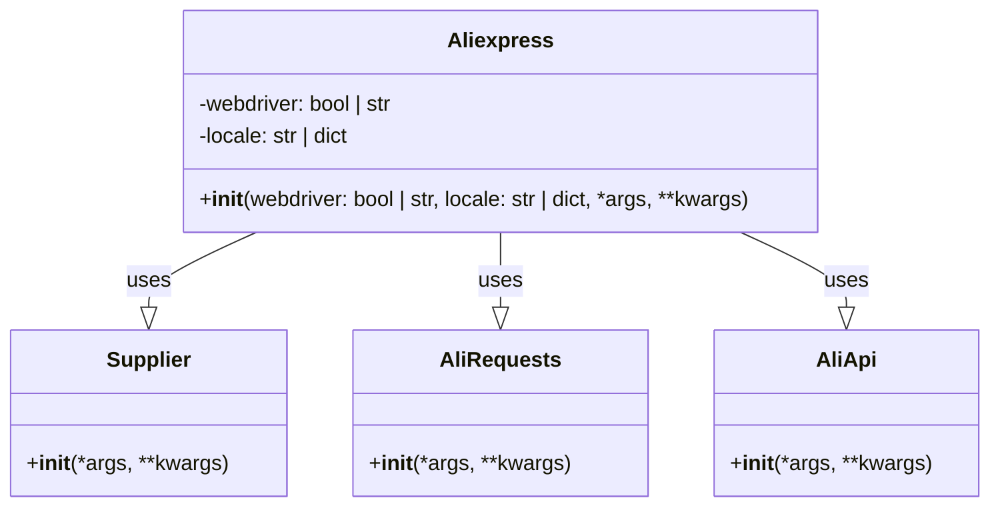

## ИНСТРУКЦИЯ:

Анализируй предоставленный код подробно и объясни его функциональность. Ответ должен включать три раздела:  

1. **<алгоритм>**: Опиши рабочий процесс в виде пошаговой блок-схемы, включая примеры для каждого логического блока, и проиллюстрируй поток данных между функциями, классами или методами.  
2. **<mermaid>**: Напиши код для диаграммы в формате `mermaid`, проанализируй и объясни все зависимости, 
    которые импортируются при создании диаграммы. 
    **ВАЖНО!** Убедитесь, что все имена переменных, используемые в диаграмме `mermaid`, 
    имеют осмысленные и описательные имена. Имена переменных вроде `A`, `B`, `C`, и т.д., не допускаются!  
    
    **Дополнительно**: Если в коде есть импорт `import header`, добавьте блок `mermaid` flowchart, объясняющий `header.py`:\
    ```mermaid
    flowchart TD
        Start --> Header[<code>header.py</code><br> Determine Project Root]
    
        Header --> import[Import Global Settings: <br><code>from src import gs</code>] 
    ```

3. **<объяснение>**: Предоставьте подробные объяснения:  
   - **Импорты**: Их назначение и взаимосвязь с другими пакетами `src.`.  
   - **Классы**: Их роль, атрибуты, методы и взаимодействие с другими компонентами проекта.  
   - **Функции**: Их аргументы, возвращаемые значения, назначение и примеры.  
   - **Переменные**: Их типы и использование.  
   - Выделите потенциальные ошибки или области для улучшения.  

Дополнительно, постройте цепочку взаимосвязей с другими частями проекта (если применимо).  

Это обеспечивает всесторонний и структурированный анализ кода.
## Формат ответа: `.md` (markdown)
**КОНЕЦ ИНСТРУКЦИИ**
```

# <алгоритм>

Алгоритм инициализации класса `Aliexpress` можно представить в виде следующей блок-схемы:

```mermaid
graph TD
    A[Начало: Инициализация Aliexpress] --> B{Проверка webdriver};
    B -- webdriver='chrome', 'mozilla', 'edge', 'default' --> C[Инициализация WebDriver];
    B -- webdriver=False --> D[WebDriver не используется];
    C --> E{Проверка locale};
    D --> E;
    E -- locale=str/dict --> F[Установка locale];
    E -- locale=None --> G[Locale по умолчанию: {'EN': 'USD'}];
    F --> H[Инициализация Supplier, AliRequests, AliApi];
    G --> H;
    H --> I[Передача *args и **kwargs внутренним компонентам];
    I --> J[Конец: Объект Aliexpress готов];
   
    style A fill:#f9f,stroke:#333,stroke-width:2px
    style J fill:#ccf,stroke:#333,stroke-width:2px
```

**Примеры для каждого блока:**

*   **A (Начало)**: Создание экземпляра `Aliexpress` с различными параметрами.
    ```python
    a1 = Aliexpress()
    a2 = Aliexpress(webdriver='chrome')
    a3 = Aliexpress(locale={'RU': 'RUB'})
    a4 = Aliexpress(webdriver='mozilla', locale={'DE': 'EUR'}, debug=True)
    ```
*   **B (Проверка webdriver)**: Проверка наличия и типа параметра `webdriver`.
    *   Если `webdriver = 'chrome'`,  `'mozilla'`, `'edge'` или `'default'` , то выполняется инициализация соответствующего вебдрайвера.
    *   Если `webdriver = False`, то вебдрайвер не используется.
*   **C (Инициализация WebDriver)**: Инициализация вебдрайвера (например, Chrome, Firefox).
    ```python
    # Например, если webdriver == 'chrome'
    driver = webdriver.Chrome()
    ```
*  **D (WebDriver не используется)**: Вебдрайвер не инициализируется.
*   **E (Проверка locale)**: Проверяется наличие и тип параметра `locale`.
*  **F (Установка locale)**: Установка переданной локали.
    ```python
    locale_settings = {'RU': 'RUB'}
    # установка локали для Supplier, AliRequests и AliApi
    ```
*   **G (Locale по умолчанию)**: Если `locale` не передан, используется  `{'EN': 'USD'}`.
*   **H (Инициализация Supplier, AliRequests, AliApi)**: Создаются экземпляры классов `Supplier`, `AliRequests` и `AliApi` для работы с AliExpress.
    ```python
    supplier = Supplier()
    ali_requests = AliRequests()
    ali_api = AliApi()
    ```
*   **I (Передача \*args и \*\*kwargs)**: Передаются дополнительные аргументы и параметры в компоненты.
    ```python
    # Передача параметров компонентам
    supplier = Supplier(debug=True)
    ali_requests = AliRequests(timeout=10)
    ali_api = AliApi(proxy="some_proxy")
    ```
*   **J (Конец)**: Объект `Aliexpress` инициализирован и готов к использованию.

# <mermaid>


**Объяснение диаграммы:**

*   **`Aliexpress`**:
    *   Этот класс является основным для работы с AliExpress.
    *   Атрибуты:
        *   `webdriver`: Определяет режим использования вебдрайвера (строка: `'chrome'`, `'mozilla'`, `'edge'`, `'default'`, `False`).
        *   `locale`: Определяет локализацию (`str` или `dict`, например, `{'EN': 'USD'}`).
    *   Метод `__init__`: Инициализирует объект `Aliexpress`, устанавливает вебдрайвер, локаль, а также создает экземпляры `Supplier`, `AliRequests` и `AliApi`.
*   **`Supplier`**:
    *   Отвечает за функциональность поставщика (вероятно, обработка данных поставщика).
    *   Метод `__init__`: Инициализирует объект `Supplier`. Может принимать дополнительные параметры `*args` и `**kwargs`.
*   **`AliRequests`**:
    *   Отвечает за выполнение запросов к AliExpress (вероятно, HTTP-запросы).
    *   Метод `__init__`: Инициализирует объект `AliRequests`. Может принимать дополнительные параметры `*args` и `**kwargs`.
*   **`AliApi`**:
    *   Отвечает за взаимодействие с API AliExpress.
    *   Метод `__init__`: Инициализирует объект `AliApi`. Может принимать дополнительные параметры `*args` и `**kwargs`.

**Зависимости:**

*   `Aliexpress` **использует** `Supplier`, `AliRequests` и `AliApi`. Это означает, что класс `Aliexpress` создаёт экземпляры этих классов для выполнения операций, связанных с AliExpress.
*   Стрелки со сплошной линией и наконечником в виде треугольника, означают отношение зависимости.

# <объяснение>

*   **Импорты:**
    *   `.. module:: src.suppliers.aliexpress`: Эта директива reStructuredText указывает, что текущий документ относится к модулю `aliexpress` внутри пакета `src.suppliers`.
    *   В предоставленном коде не указаны явные `import` в Python. Однако предполагается, что  классы `Supplier`, `AliRequests` и `AliApi`  импортируются из других модулей в пакете `src`. Структура проекта может выглядеть следующим образом:
        ```
        src/
        ├── suppliers/
        │   ├── aliexpress/
        │   │   ├── __init__.py
        │   │   ├── aliexpress.py # Этот модуль
        │   │   ├── ali_requests.py # Модуль AliRequests
        │   │   ├── ali_api.py # Модуль AliApi
        │   │   └── supplier.py # Модуль Supplier
        ```
    *   В `aliexpress.py` могут быть такие импорты:
        ```python
        from src.suppliers.aliexpress.ali_requests import AliRequests
        from src.suppliers.aliexpress.ali_api import AliApi
        from src.suppliers.aliexpress.supplier import Supplier
        ```
*   **Классы:**
    *   **`Aliexpress`**:
        *   Роль: Основной класс, предоставляющий интерфейс для работы с AliExpress. Он инкапсулирует в себе `Supplier`, `AliRequests` и `AliApi`, упрощая взаимодействие с ними.
        *   Атрибуты:
            *   `webdriver` (bool | str): Определяет, используется ли вебдрайвер и какой именно.
            *   `locale` (str | dict): Определяет локализацию (язык и валюта).
        *   Методы:
            *   `__init__`: Инициализирует объект `Aliexpress`. Принимает параметры для настройки вебдрайвера, локали, а также передаёт дополнительные аргументы в экземпляры `Supplier`, `AliRequests` и `AliApi`.
        *   Взаимодействие: Создаёт экземпляры классов `Supplier`, `AliRequests` и `AliApi` и делегирует им часть функциональности.
    *    **`Supplier`**, **`AliRequests`**, **`AliApi`**:
        *   Роль: Вспомогательные классы, предоставляющие специализированные функции для `Aliexpress`.
        *  `Supplier`: отслеживает и управляет данными поставщиков
        *  `AliRequests`: обрабатывает запросы к API и сайту AliExpress.
        * `AliApi`: отвечает за взаимодействие с API AliExpress.
        *    Методы: `__init__` - Инициализируют свои объекты с возможностью передачи параметров.
*   **Функции:**
    *   `__init__` (в `Aliexpress`):
        *   Аргументы: `webdriver` (bool | str, optional), `locale` (str | dict, optional), `*args`, `**kwargs`.
        *   Возвращаемое значение: `None`.
        *   Назначение: Инициализация экземпляра класса `Aliexpress`. Устанавливает режим вебдрайвера, локаль и создаёт экземпляры `Supplier`, `AliRequests` и `AliApi`.
        *   Примеры:
            ```python
            a = Aliexpress()  # Без вебдрайвера, локаль по умолчанию.
            b = Aliexpress(webdriver='chrome') # С вебдрайвером Chrome, локаль по умолчанию.
            c = Aliexpress(locale={'RU': 'RUB'}) # Без вебдрайвера, с русской локалью.
            d = Aliexpress(webdriver='mozilla', locale={'DE': 'EUR'}, debug=True) # С Mozilla, немецкая локаль, с параметром debug.
            ```
*   **Переменные:**
    *   `webdriver`: Определяет режим работы с вебдрайвером (строка или `False`).
    *   `locale`: Настройки локали (словарь или строка).
*   **Потенциальные ошибки/улучшения:**
    *   **Обработка ошибок**: Недостаточно явная обработка исключений при инициализации вебдрайвера или при обращении к API AliExpress. Рекомендуется добавить блоки `try...except` для перехвата и обработки исключений (например, `webdriver.common.exceptions.WebDriverException`).
    *   **Абстракция**: Инициализация классов `Supplier`, `AliRequests` и `AliApi` может быть вынесена в отдельные приватные методы для более читаемого кода и гибкости.
    *  **Логирование**: Необходимо реализовать логирование для отслеживания ошибок и действий системы.
    * **Конфигурация**: Желательно использовать механизм конфигурации для хранения и управления настройками, такими как вебдрайвер и локаль.
    *   **Валидация**: Необходима валидация входных параметров, таких как `webdriver` и `locale`.

*   **Связь с другими компонентами проекта:**
    *   Модуль `aliexpress` зависит от классов `Supplier`, `AliRequests` и `AliApi` из других модулей в пакете `src.suppliers.aliexpress`. Также используется пакет `src` для глобальных настроек.

```