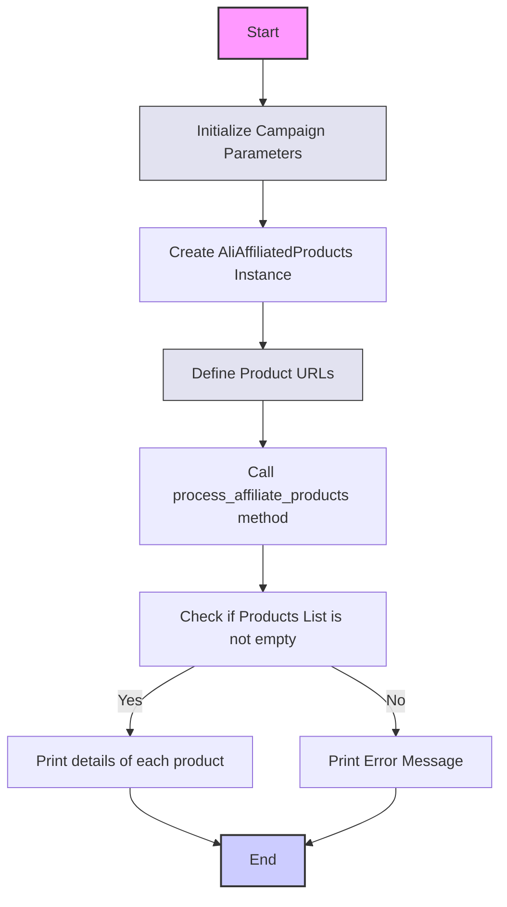

## ИНСТРУКЦИЯ:

Анализируй предоставленный код подробно и объясни его функциональность. Ответ должен включать три раздела:  

1.  **<алгоритм>**: Опиши рабочий процесс в виде пошаговой блок-схемы, включая примеры для каждого логического блока, и проиллюстрируй поток данных между функциями, классами или методами.  
2.  **<mermaid>**: Напиши код для диаграммы в формате `mermaid`, проанализируй и объясни все зависимости,
    которые импортируются при создании диаграммы.
    **ВАЖНО!** Убедитесь, что все имена переменных, используемые в диаграмме `mermaid`,
    имеют осмысленные и описательные имена. Имена переменных вроде `A`, `B`, `C`, и т.д., не допускаются!  

    **Дополнительно**: Если в коде есть импорт `import header`, добавьте блок `mermaid` flowchart, объясняющий `header.py`:
    ```mermaid
    flowchart TD
        Start --> Header[<code>header.py</code><br> Determine Project Root]

        Header --> import[Import Global Settings: <br><code>from src import gs</code>] 
    ```

3.  **<объяснение>**: Предоставьте подробные объяснения:
    -   **Импорты**: Их назначение и взаимосвязь с другими пакетами `src.`.
    -   **Классы**: Их роль, атрибуты, методы и взаимодействие с другими компонентами проекта.
    -   **Функции**: Их аргументы, возвращаемые значения, назначение и примеры.
    -   **Переменные**: Их типы и использование.
    -   Выделите потенциальные ошибки или области для улучшения.

Дополнительно, постройте цепочку взаимосвязей с другими частями проекта (если применимо).

Это обеспечивает всесторонний и структурированный анализ кода.
## Формат ответа: `.md` (markdown)
**КОНЕЦ ИНСТРУКЦИИ**

## <алгоритм>
1. **Инициализация параметров кампании:**
   - Задаются переменные: `campaign_name` (например, "summer_sale_2024"), `campaign_category` (например, "electronics" или `None`), `language` (например, "EN"), и `currency` (например, "USD").
   - **Пример:**
     ```python
        campaign_name = "summer_sale_2024"
        campaign_category = "electronics"
        language = "EN"
        currency = "USD"
     ```

2. **Создание экземпляра `AliAffiliatedProducts`:**
   - Создается объект `parser` класса `AliAffiliatedProducts`, передавая параметры кампании (`campaign_name`, `campaign_category`, `language`, `currency`).
   - **Пример:**
     ```python
       parser = AliAffiliatedProducts(
            campaign_name,
            campaign_category,
            language,
            currency
        )
     ```

3. **Определение списка URL продуктов:**
   - Создается список `prod_urls`, содержащий строки URL продуктов или их ID (например, `['123', 'https://www.aliexpress.com/item/123.html', '456', 'https://www.aliexpress.com/item/456.html']`).
    - **Пример:**
       ```python
       prod_urls = [
          '123',
           'https://www.aliexpress.com/item/123.html',
           '456',
           'https://www.aliexpress.com/item/456.html',
       ]
       ```
4. **Обработка аффилированных продуктов:**
   - Вызывается метод `process_affiliate_products` объекта `parser`, передавая список `prod_urls`.
   - Метод возвращает список объектов продуктов с аффилированными ссылками, локальными путями к изображениям и видео (если есть).
   - **Пример:**
     ```python
     products = parser.process_affiliate_products(prod_urls)
     ```
5. **Проверка и вывод результатов:**
   - Проверяется, является ли список `products` не пустым.
   - Если `products` не пустой:
     - Выводится количество полученных аффилированных продуктов.
     - Для каждого продукта в списке:
       - Выводится `product_id`, `promotion_link`, `local_image_path`.
       - Если есть `local_video_path`, он также выводится.
   - Если `products` пустой:
     - Выводится сообщение об ошибке.

   - **Пример:**
     ```python
     if products:
        print(f"Получено {len(products)} аффилированных продуктов.")
        for product in products:
            print(f"Продукт ID: {product.product_id}")
            print(f"Аффилированная ссылка: {product.promotion_link}")
            print(f"Локальный путь к изображению: {product.local_image_path}")
            if product.local_video_path:
                print(f"Локальный путь к видео: {product.local_video_path}")
            print()
     else:
        print("Не удалось получить аффилированные продукты.")
     ```

## <mermaid>


**Объяснение зависимостей `mermaid`:**

- **`Start`:** Начальная точка процесса.
- **`InitializeCampaign`:** Узел, представляющий инициализацию переменных, таких как имя кампании, категория, язык и валюта.
- **`CreateAliAffiliatedProductsInstance`:** Узел, где создается экземпляр класса `AliAffiliatedProducts`.
- **`DefineProductURLs`:** Определение списка URL-адресов или ID продуктов для обработки.
- **`ProcessAffiliateProducts`:** Вызов метода `process_affiliate_products` для получения аффилированных продуктов.
- **`CheckProductsList`:** Проверка, содержит ли список продуктов данные.
- **`PrintProductDetails`:** Вывод информации о каждом продукте (ID, аффилированная ссылка, путь к изображениям и видео).
- **`PrintError`:** Вывод сообщения об ошибке, если список продуктов пуст.
- **`End`:** Конечная точка процесса.

## <объяснение>
### Импорты:
- `from src.suppliers.aliexpress.affiliated_products_generator import AliAffiliatedProducts`: Импортирует класс `AliAffiliatedProducts` из модуля `affiliated_products_generator.py`, расположенного в пакете `src.suppliers.aliexpress`. Этот класс предназначен для обработки и генерации аффилированных ссылок на продукты AliExpress.

### Классы:
- `AliAffiliatedProducts`:
    - Роль: Класс, отвечающий за получение аффилированных ссылок на товары AliExpress. Он принимает параметры кампании, такие как имя кампании, категория, язык и валюту, и обрабатывает список URL или ID продуктов для генерации аффилированных ссылок.
    - Атрибуты:
        - `campaign_name` (str): Имя рекламной кампании.
        - `campaign_category` (str): Категория рекламной кампании.
        - `language` (str): Язык для кампании.
        - `currency` (str): Валюта для кампании.
    - Методы:
        - `__init__(self, campaign_name, campaign_category, language, currency)`: Конструктор класса, инициализирует атрибуты экземпляра.
        - `process_affiliate_products(self, product_urls)`: Основной метод, который обрабатывает список `product_urls` и возвращает список объектов с аффилированными ссылками, локальными путями к изображениям и видео.
    - Взаимодействие: Класс `AliAffiliatedProducts` взаимодействует с API AliExpress для получения аффилированных ссылок. Он может быть расширен для обработки различных типов данных и ответов от AliExpress.

### Функции:
- `main()`:
    - Назначение: Основная функция, которая управляет логикой генерации аффилированных продуктов.
    - Аргументы: Нет.
    - Возвращаемое значение: Нет.
    - Пример:
      - Инициализирует параметры кампании.
      - Создает экземпляр `AliAffiliatedProducts`.
      - Задает список URL или ID продуктов.
      - Вызывает метод `process_affiliate_products` для получения аффилированных ссылок.
      - Выводит результаты в консоль.
- `if __name__ == "__main__":`:
    - Назначение: Вызывает функцию `main()`, когда скрипт запускается напрямую.

### Переменные:
- `campaign_name` (str): Имя рекламной кампании. Например, "summer_sale_2024".
- `campaign_category` (str или None): Категория рекламной кампании. Например, "electronics" или `None`.
- `language` (str): Язык для кампании. Например, "EN".
- `currency` (str): Валюта для кампании. Например, "USD".
- `parser` (AliAffiliatedProducts): Экземпляр класса `AliAffiliatedProducts`.
- `prod_urls` (list): Список строк URL продуктов или их ID. Например, `['123', 'https://www.aliexpress.com/item/123.html', '456', 'https://www.aliexpress.com/item/456.html']`.
- `products` (list): Список объектов, содержащих информацию о продукте, включая аффилированную ссылку, локальный путь к изображению и видео.
- `product` (object): Объект продукта в цикле.
  - `product.product_id` (str): ID продукта.
  - `product.promotion_link` (str): Аффилированная ссылка на продукт.
  - `product.local_image_path` (str): Локальный путь к изображению продукта.
  - `product.local_video_path` (str): Локальный путь к видео продукта (может быть `None`).

### Потенциальные ошибки или области для улучшения:
- **Обработка ошибок:** Код не содержит обработки ошибок, связанных с запросами к API AliExpress, что может привести к сбою.
- **Валидация URL:** Код не валидирует URL-адреса продуктов, что может привести к ошибкам при их обработке.
- **Производительность:** Обработка большого количества URL-адресов может быть медленной. Необходимо оптимизировать процесс обработки.
- **Асинхронность:** Метод `process_affiliate_products` выполняется синхронно. Можно использовать асинхронное программирование для ускорения процесса.
- **Логирование:** Отсутствует логирование, которое помогло бы отслеживать ошибки и ход выполнения программы.
- **Конфигурация:** Параметры кампании и настройки API должны быть вынесены в конфигурационный файл, чтобы их можно было легко изменять.

### Цепочка взаимосвязей с другими частями проекта:
- Данный скрипт является примером использования класса `AliAffiliatedProducts`, который, скорее всего, расположен в другом модуле (`src.suppliers.aliexpress.affiliated_products_generator`).
- Класс `AliAffiliatedProducts` может взаимодействовать с другими частями проекта, такими как:
    - **API-клиент:** Для отправки запросов к API AliExpress и получения данных о продуктах.
    - **Система хранения файлов:** Для сохранения локальных изображений и видео продуктов.
    - **База данных:** Для сохранения информации о продуктах и аффилированных ссылках.
    - **Система логирования:** Для отслеживания ошибок и хода выполнения программы.

**Общее описание:**

Скрипт `affiliated_products_generator.py` предназначен для демонстрации работы класса `AliAffiliatedProducts`, который используется для генерации аффилированных ссылок на продукты AliExpress. Скрипт инициализирует параметры кампании, создает экземпляр `AliAffiliatedProducts`, задает список URL или ID продуктов, обрабатывает их и выводит результаты в консоль. Этот скрипт является частью более крупного проекта, который, вероятно, занимается автоматизацией аффилированного маркетинга на AliExpress.