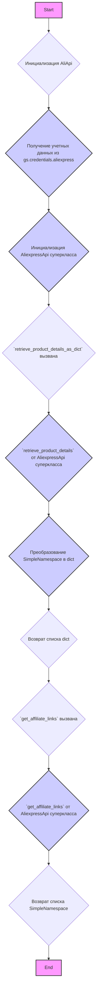
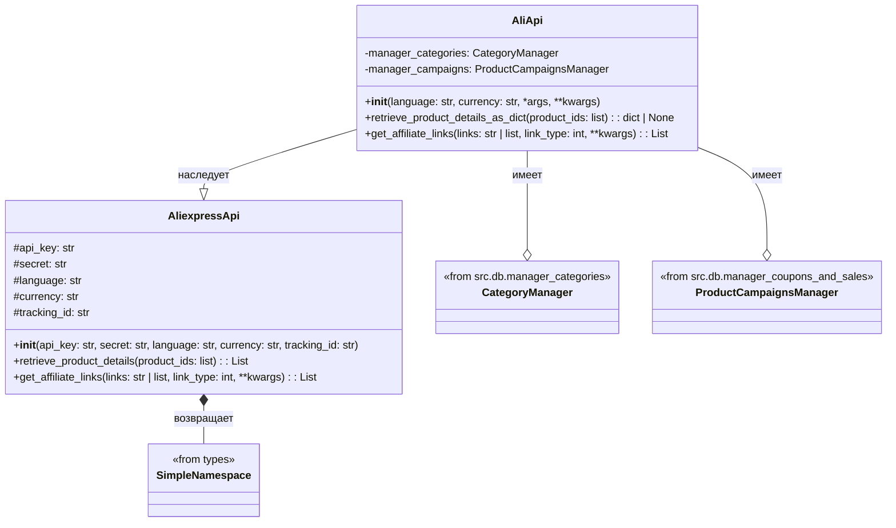
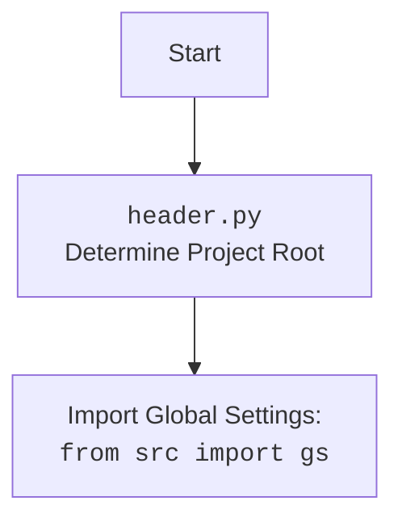

## АНАЛИЗ КОДА: `hypotez/src/suppliers/aliexpress/aliapi.py`

### 1. <алгоритм>

**Блок-схема:**

**Пример:**

1. **Инициализация `AliApi`:**
   - Создается экземпляр `AliApi` с указанием языка и валюты.
   - Извлекаются `api_key`, `secret` и `tracking_id` из `gs.credentials.aliexpress`.
   - Вызывается конструктор суперкласса `AliexpressApi` для настройки параметров запросов.
   - Инициализация менеджеров БД закомментирована.

2.  **`retrieve_product_details_as_dict`:**
    -   Принимает список `product_ids`.
    -   Вызывает метод `retrieve_product_details` суперкласса `AliexpressApi`, который возвращает список объектов `SimpleNamespace`.
        -  *Пример:* `[SimpleNamespace(id=123, name='Product A'), SimpleNamespace(id=456, name='Product B')]`
    -   Преобразует каждый `SimpleNamespace` в словарь с помощью `vars(ns)` или `ns.__dict__`.
        -  *Пример:* `[{'id': 123, 'name': 'Product A'}, {'id': 456, 'name': 'Product B'}]`
    -   Возвращает список словарей, представляющих детали продукта.

3.  **`get_affiliate_links`:**
    -   Принимает `links` (строку или список) и `link_type` (целое число).
        -   *Пример:* `links = "https://example.com/product1"` или `links = ["https://example.com/product1", "https://example.com/product2"]`, `link_type = 0`
    -   Вызывает метод `get_affiliate_links` суперкласса `AliexpressApi` для получения партнерских ссылок.
    -   Возвращает список объектов `SimpleNamespace`, содержащих партнерские ссылки.
        - *Пример:* `[SimpleNamespace(original_link="https://example.com/product1", affiliate_link="https://ali.ski/a1B2c3D4")]`

### 2. <mermaid>

**Объяснение зависимостей:**

1.  **`AliApi` наследует `AliexpressApi`**:
    *   `AliApi` является подклассом `AliexpressApi`, что означает, что он наследует методы и атрибуты `AliexpressApi` и может переопределять или расширять их.
    *   Это позволяет повторно использовать логику `AliexpressApi`, добавляя специфические функции для проекта.

2.  **`AliApi` имеет `CategoryManager` и `ProductCampaignsManager`**:
    *   `AliApi` содержит экземпляры классов `CategoryManager` и `ProductCampaignsManager` для управления категориями и кампаниями продуктов, соответственно.
    *   Эти менеджеры предназначены для работы с базами данных и позволяют получить доступ к данным о категориях и кампаниях.

3.  **`AliexpressApi` возвращает `SimpleNamespace`**:
    *   Методы `AliexpressApi` возвращают данные в виде списка объектов `SimpleNamespace`.
    *   `SimpleNamespace` – это простой класс, позволяющий создавать объекты с произвольными атрибутами.
    
**mermaid flowchart для header.py**:

### 3. <объяснение>

**Импорты:**

*   `re`, `json`, `asyncio`: Стандартные библиотеки Python для регулярных выражений, работы с JSON и асинхронного программирования (хотя `asyncio` в данном коде не используется).
*   `pathlib.Path`: Для работы с путями файлов и каталогов.
*   `typing.List`, `typing.Dict`: Для аннотации типов, что улучшает читаемость и проверку типов.
*  `types.SimpleNamespace`: Для создания простых объектов с произвольными атрибутами.
*  `requests.get`, `requests.post`: Для выполнения HTTP запросов.
*   `src.gs`: Модуль глобальных настроек проекта. Предположительно, содержит конфиденциальные данные, такие как API ключи.
    *   **Взаимосвязь**: `gs` используется для получения учетных данных (`api_key`, `secret`, `tracking_id`).
*   `src.utils.jjson`: Модуль для работы с JSON.
    *   `j_loads_ns`, `j_loads`, `j_dumps`: Функции для загрузки JSON, преобразования в `SimpleNamespace`, и сериализации в JSON соответственно.
*   `src.utils.printer.pprint`: Функция для красивого вывода данных.
*   `src.utils.convertors.json.json2csv`: Функция для преобразования JSON в CSV.
*   `src.logger.logger`: Модуль для логирования событий.
*  `.api.AliexpressApi`: Базовый класс API для работы с AliExpress.
    *   **Взаимосвязь**: `AliApi` наследует от `AliexpressApi`, расширяя его функционал.
*   `src.db.manager_categories.AliexpressCategory`, `src.db.manager_categories.CategoryManager`: Классы для работы с категориями AliExpress в базе данных.
    *   **Взаимосвязь**: `CategoryManager` используется для управления категориями.
*   `src.db.manager_coupons_and_sales.ProductCampaignsManager`: Класс для работы с кампаниями продуктов в базе данных.
     *    **Взаимосвязь**: `ProductCampaignsManager` используется для управления кампаниями.

**Классы:**

*   `AliApi(AliexpressApi)`:
    *   **Роль**: Пользовательский класс для работы с API AliExpress.
    *   **Атрибуты**:
        *   `manager_categories` (CategoryManager): Менеджер категорий.
        *   `manager_campaigns` (ProductCampaignsManager): Менеджер кампаний.
    *   **Методы**:
        *   `__init__(self, language: str = 'en', currency: str = 'usd', *args, **kwargs)`:
            *   **Аргументы**: `language` (язык), `currency` (валюта), дополнительные `*args` и `**kwargs`.
            *   **Назначение**: Инициализирует класс, получая учетные данные из `gs` и инициализируя суперкласс `AliexpressApi`.
            *  *Пример:* `api = AliApi(language='ru', currency='rub')`
        *   `retrieve_product_details_as_dict(self, product_ids: list) -> dict | None`:
            *   **Аргументы**: `product_ids` (список ID продуктов).
            *   **Назначение**: Получает детали продукта из API AliExpress и возвращает их в виде списка словарей.
            *   **Пример**: `details = api.retrieve_product_details_as_dict([123, 456])`
            *   **Возвращаемое значение**: `dict | None`
        *    `get_affiliate_links(self, links: str | list, link_type: int = 0, **kwargs) -> List[SimpleNamespace]`:
            *   **Аргументы**: `links` (строка или список ссылок), `link_type` (тип партнерской ссылки), дополнительные `**kwargs`.
            *   **Назначение**: Получает партнерские ссылки для заданных продуктов.
            *   **Пример**: `affiliate_links = api.get_affiliate_links("https://example.com/product1")`
            *   **Возвращаемое значение**: `List[SimpleNamespace]`

**Функции:**

*   В основном, логика находится в методах класса `AliApi`.

**Переменные:**

*   `credentials` (SimpleNamespace): Содержит учетные данные из `gs.credentials.aliexpress`.
*   `api_key` (str): API ключ для доступа к AliExpress API.
*   `secret` (str): Секрет API для доступа к AliExpress API.
*   `tracking_id` (str): ID отслеживания для партнерских ссылок.
*   `language` (str): Язык для API запросов.
*   `currency` (str): Валюта для API запросов.
*   `product_ids` (list): Список ID продуктов.
*   `prod_details_ns` (List[SimpleNamespace]): Список объектов `SimpleNamespace` с деталями продукта.
*   `prod_details_dict` (list): Список словарей с деталями продукта.
*  `links` (str | list): Ссылки на продукты.
*  `link_type` (int): Тип партнерской ссылки.

**Потенциальные ошибки и области для улучшения:**

*   **Обработка ошибок API**: Не хватает обработки ошибок при запросах к API AliExpress.
*   **Асинхронность**: Использование `asyncio` не реализовано, хотя импорт есть.
*   **Инициализация менеджеров БД**: Инициализация менеджеров базы данных закомментирована.
*   **Комментарии**: Желательно добавить docstrings для всех методов, включая приватные.
*   **Обработка некорректных `product_ids`**: Не предусмотрена проверка на корректность входных данных `product_ids`.
*   **Избыточные импорты**: Некоторые импорты, такие как `json2csv` и `asyncio`, не используются в данном коде.

**Взаимосвязь с другими частями проекта:**

*   **`gs`**: Зависит от модуля `src.gs` для получения учетных данных.
*   **`AliexpressApi`**: Наследует от класса `AliexpressApi` в том же каталоге, что и говорит о тесной связности.
*   **`CategoryManager` и `ProductCampaignsManager`**: Взаимодействует с модулями для управления данными в базе.
*    **Логгирование**: Использует `src.logger.logger` для логирования событий.

**Цепочка взаимосвязей:**

`AliApi` → `AliexpressApi` → `requests`, `SimpleNamespace` → `gs` → `CategoryManager` → `ProductCampaignsManager` → `logger`

Это подробное объяснение предоставляет полную картину функциональности кода, его зависимостей и потенциальных областей для улучшения.