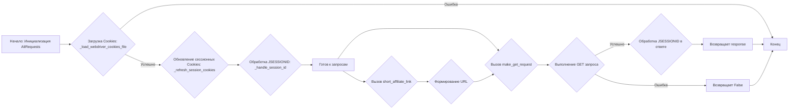
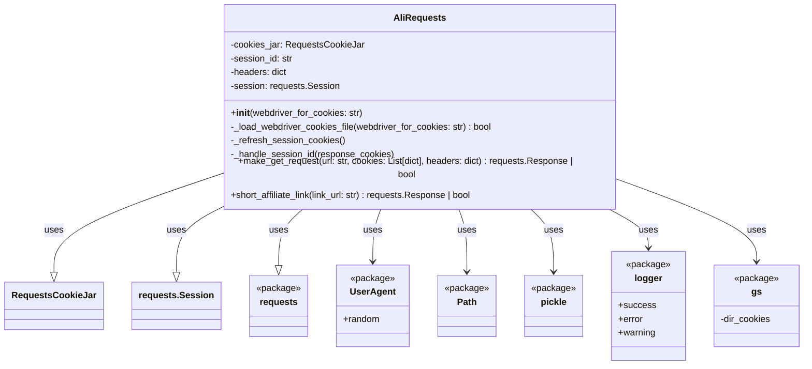
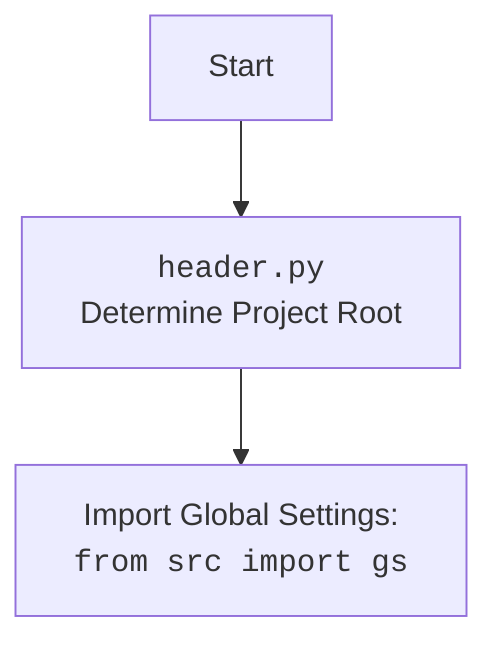

## ИНСТРУКЦИЯ:

Анализируй предоставленный код подробно и объясни его функциональность. Ответ должен включать три раздела:

1.  **<алгоритм>**: Опиши рабочий процесс в виде пошаговой блок-схемы, включая примеры для каждого логического блока, и проиллюстрируй поток данных между функциями, классами или методами.
2.  **<mermaid>**: Напиши код для диаграммы в формате `mermaid`, проанализируй и объясни все зависимости,
    которые импортируются при создании диаграммы.
    **ВАЖНО!** Убедитесь, что все имена переменных, используемые в диаграмме `mermaid`,
    имеют осмысленные и описательные имена. Имена переменных вроде `A`, `B`, `C`, и т.д., не допускаются!

    **Дополнительно**: Если в коде есть импорт `import header`, добавьте блок `mermaid` flowchart, объясняющий `header.py`:\
    ```mermaid\
    flowchart TD\
        Start --> Header[<code>header.py</code><br> Determine Project Root]\
    \
        Header --> import[Import Global Settings: <br><code>from src import gs</code>] \
    ```
3.  **<объяснение>**: Предоставьте подробные объяснения:
    -   **Импорты**: Их назначение и взаимосвязь с другими пакетами `src.`.
    -   **Классы**: Их роль, атрибуты, методы и взаимодействие с другими компонентами проекта.
    -   **Функции**: Их аргументы, возвращаемые значения, назначение и примеры.
    -   **Переменные**: Их типы и использование.
    -   Выделите потенциальные ошибки или области для улучшения.

Дополнительно, постройте цепочку взаимосвязей с другими частями проекта (если применимо).

Это обеспечивает всесторонний и структурированный анализ кода.
## Формат ответа: `.md` (markdown)
**КОНЕЦ ИНСТРУКЦИИ**
```md
## <алгоритм>

**1. Инициализация `AliRequests`:**

   -   Создается экземпляр класса `AliRequests`.
     -   Пример: `ali_requests = AliRequests(webdriver_for_cookies="chrome")`
   -   Инициализируются атрибуты:
        - `cookies_jar` (хранилище cookies).
        - `session_id` (идентификатор сессии).
        - `headers` (заголовки запроса с User-Agent).
        - `session` (объект requests.Session).
   -   Вызывается метод `_load_webdriver_cookies_file` для загрузки cookies из файла.

**2. Загрузка Cookies (`_load_webdriver_cookies_file`):**

    -   Формируется путь к файлу с cookies на основе `webdriver_for_cookies` и `gs.dir_cookies`.
        -   Пример: `"папка_проекта/cookies/aliexpress.com/chrome/cookie"`
    -   Происходит попытка открыть файл, загрузить cookies из pickle.
    -   Для каждого cookie из списка:
         -   Устанавливается cookie в `self.cookies_jar` используя `self.cookies_jar.set()` с атрибутами `name`, `value`, `domain`, `path`, `secure`, `rest`, `expires`.
         -   Пример cookie:
           ```python
           {
                'name': 'JSESSIONID',
                'value': 'some_session_id',
                'domain': 'aliexpress.com',
                'path': '/',
                'secure': True,
                'HttpOnly': 'true',
                'SameSite': 'None',
                'expirationDate': 1705384724
            }
           ```
    -   Выводится сообщение об успешной загрузке cookies с указанием пути к файлу через logger.success()
    -   Вызывается `_refresh_session_cookies` для обновления cookies сессии.
    -   Возвращается `True` при успехе, `False` при ошибках (FileNotFoundError, ValueError, Exception).

**3. Обновление Cookies сессии (`_refresh_session_cookies`):**

    -   Формируется URL для обновления кук: `"https://portals.aliexpress.com"`.
    -   Если `self.cookies_jar` не пустой:
        -   Делается GET запрос к URL с headers и cookies.
    -   Иначе, делается GET запрос с headers.
    -   Вызывается `_handle_session_id` для обработки cookies ответа.
    -   Выводится сообщение об ошибке через logger.error() при `requests.RequestException` или `Exception`.

**4. Обработка JSESSIONID (`_handle_session_id`):**

    -   Итерируется по cookies из response.
    -   Если имя cookie равно `'JSESSIONID'`:
        -   Если значение JSESSIONID равно текущему `self.session_id`, то выход.
        -   Иначе обновляется `self.session_id` и устанавливает этот cookie в `self.cookies_jar`.
    -   Если `'JSESSIONID'` не найден, выводится предупреждение через logger.warning().

**5. Отправка GET запроса (`make_get_request`):**

    -   Принимает `url` для запроса, опциональные `cookies` и `headers`.
        -   Пример вызова: `make_get_request(url="https://some_url.com", headers={"Content-Type": "application/json"})`
    -   Если headers не переданы, используются `self.headers`.
    -   Обновляются `self.session.cookies` из `self.cookies_jar`.
    -   Выполняется GET запрос к `url` с headers и cookies.
    -   Вызывается `resp.raise_for_status()` для проверки статуса ответа.
    -   Вызывается `_handle_session_id` для обработки cookies из ответа.
    -   Возвращает `response` объект при успехе, `False` при ошибках `requests.RequestException` или `Exception`.

**6. Получение сокращенной партнерской ссылки (`short_affiliate_link`):**

    -   Принимает `link_url` для сокращения.
        -   Пример: `short_affiliate_link(link_url="https://some_long_url.com")`
    -   Формируется URL с параметрами `trackId` и `targetUrl`.
    -   Вызывается `make_get_request` с сформированным URL.
    -   Возвращает `requests.Response` или `False`.

**Блок-схема:**



## <mermaid>



**Зависимости `mermaid`:**

*   **`AliRequests`**: Основной класс, обрабатывающий запросы к AliExpress.
*   **`RequestsCookieJar`**: Класс для управления cookie.
*   **`requests.Session`**: Класс для работы с HTTP сессией.
*   **`requests`**: Пакет для работы с HTTP запросами.
*   **`UserAgent`**: Класс из `fake_useragent` для генерации User-Agent.
*   **`Path`**: Класс из `pathlib` для работы с путями к файлам.
*   **`pickle`**: Модуль для сериализации и десериализации объектов.
*   **`logger`**: Пакет `src.logger` для логирования.
*    **`gs`**: Пакет `src` для глобальных настроек.

## <объяснение>

**Импорты:**

*   **`pickle`**: Используется для сохранения и загрузки cookies в файл. Cookies сериализуются для записи в файл и десериализуются при загрузке.
*   **`requests`**: Используется для отправки HTTP-запросов к AliExpress.
*   **`pathlib.Path`**: Используется для формирования путей к файлам cookies.
*   **`typing.List`**: Используется для аннотации типов списков в коде.
*   **`requests.cookies.RequestsCookieJar`**: Используется как хранилище cookies.
*   **`urllib.parse.urlparse`**: Используется для разбора URL-адресов (не используется напрямую в данном коде, но может использоваться в других модулях).
*   **`fake_useragent.UserAgent`**: Используется для генерации случайных User-Agent, что помогает избегать блокировок.
*    **`src.gs`**: Импортирует глобальные настройки проекта, включая директории для хранения cookies.
*   **`src.utils.jjson.j_dumps`**: Импортирует функцию для преобразования данных в JSON формат.
*    **`src.logger.logger`**: Импортирует объект `logger` для логирования событий.

**Классы:**

*   **`AliRequests`**:
    *   **Назначение**: Класс, инкапсулирующий логику взаимодействия с AliExpress через HTTP запросы.
    *   **Атрибуты**:
        *   `cookies_jar`: Хранилище cookies типа `RequestsCookieJar`.
        *   `session_id`: Идентификатор сессии типа `str`.
        *   `headers`: Словарь HTTP заголовков, включающий User-Agent.
        *   `session`: Объект `requests.Session` для управления HTTP сессией.
    *   **Методы**:
        *   `__init__(self, webdriver_for_cookies)`: Конструктор класса, инициализирует атрибуты и загружает cookies.
        *   `_load_webdriver_cookies_file(self, webdriver_for_cookies)`: Загружает cookies из файла, используя pickle.
        *    `_refresh_session_cookies(self)`:  Обновляет cookies сессии, отправляя GET запрос.
        *   `_handle_session_id(self, response_cookies)`: Обрабатывает и обновляет JSESSIONID в cookies.
        *   `make_get_request(self, url, cookies, headers)`: Выполняет GET запрос к указанному URL.
        *   `short_affiliate_link(self, link_url)`: Получает сокращенную партнерскую ссылку.

**Функции:**

*   `__init__(self, webdriver_for_cookies: str = 'chrome')`:
    *   **Аргументы**: `webdriver_for_cookies` (строка, имя вебдрайвера, по умолчанию 'chrome').
    *   **Возвращает**: None.
    *   **Назначение**: Инициализирует объект `AliRequests`. Загружает кукисы из файла, используя имя вебдрайвера.
*   `_load_webdriver_cookies_file(self, webdriver_for_cookies: str = 'chrome') -> bool`:
    *   **Аргументы**: `webdriver_for_cookies` (строка, имя вебдрайвера).
    *   **Возвращает**: `True` при успешной загрузке кукисов, `False` в случае ошибки.
    *   **Назначение**: Загружает кукисы из pickle файла.
*   `_refresh_session_cookies(self)`:
    *   **Аргументы**: Нет.
    *   **Возвращает**: None.
    *   **Назначение**: Обновляет сессионные кукисы, отправляя GET-запрос к `https://portals.aliexpress.com`.
*   `_handle_session_id(self, response_cookies)`:
    *    **Аргументы**: `response_cookies` (список cookie из ответа).
    *    **Возвращает**: None.
    *    **Назначение**: Находит и обрабатывает `JSESSIONID` в списке cookies, полученных в ответе.
*   `make_get_request(self, url: str, cookies: List[dict] = None, headers: dict = None)`:
    *   **Аргументы**: `url` (URL для GET запроса), `cookies` (список словарей с cookies), `headers` (словарь с HTTP заголовками).
    *   **Возвращает**: `requests.Response` объект при успехе, `False` при ошибке.
    *   **Назначение**: Отправляет GET-запрос к указанному URL и обрабатывает ответ.
*    `short_affiliate_link(self, link_url: str)`:
    *   **Аргументы**: `link_url` (URL для сокращения).
    *   **Возвращает**:  `requests.Response` объект при успехе, `False` при ошибке.
    *   **Назначение**: Отправляет запрос на получение сокращенной партнерской ссылки.

**Переменные:**

*   `self.cookies_jar`: Хранилище `RequestsCookieJar` для cookies.
*   `self.session_id`: Строка, хранящая идентификатор сессии.
*   `self.headers`: Словарь, содержащий HTTP заголовки, включая User-Agent.
*   `self.session`: Объект `requests.Session` для управления HTTP сессией.
*   `cookie_file_path`: Объект `Path`, представляющий путь к файлу с cookies.
*   `cookies_list`: Список словарей с cookies, загруженных из файла.
*   `url`: Строка, представляющая URL для запроса.
*   `resp`: Объект `requests.Response`, хранящий ответ на HTTP запрос.
*   `link_url`: Строка, представляющая URL для сокращения.
*    `track_id`: Строка, представляющая идентификатор трека (для партнерских ссылок).

**Потенциальные ошибки и области для улучшения:**

*   **Обработка ошибок:**
    *   В `_load_webdriver_cookies_file` и `make_get_request`, при возникновении исключений, возвращается `False`, что может усложнить отладку.
    *   Можно добавить более детальную обработку ошибок с помощью кастомных исключений.
*   **Использование `j_dumps`:**
     * Функция `j_dumps` не используется в данном коде, но импортируется. 
     *   Необходимо проверить ее назначение и удалить, если не требуется.
*   **Параметризация `short_affiliate_link`:**
    *   `track_id` является статичным значением. Можно сделать его параметром метода, чтобы использовать разные треки.
*   **Использование `urlparse`**:
    *   Модуль `urlparse` импортируется, но не используется в данном коде. Стоит его удалить, либо проверить, где он используется.
*   **Повторение кода**:
    *  В методах `_load_webdriver_cookies_file`, `make_get_request`, и  `_refresh_session_cookies` есть общий блок try/except.
    *  Можно выделить общую логику в отдельную функцию для избежания дублирования кода.

**Взаимосвязи с другими частями проекта:**

*   **`src.gs`:** Используется для получения пути к директории с cookies. Этот модуль отвечает за глобальные настройки проекта.
*    **`src.logger.logger`**:  Используется для логирования различных событий, таких как загрузка cookies, ошибки при запросах, и т.д.
*   **`src.utils.jjson`**: Используется для преобразования данных в JSON (но в этом файле нет использования).
*    **`src.suppliers`**: Данный модуль является частью пакета, отвечающего за работу с разными поставщиками, в данном случае AliExpress.

Этот анализ предоставляет подробное описание кода, его функций, переменных и взаимодействия с другими частями проекта, с указанием на возможные области улучшения.
```