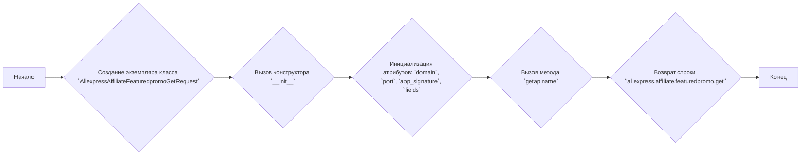
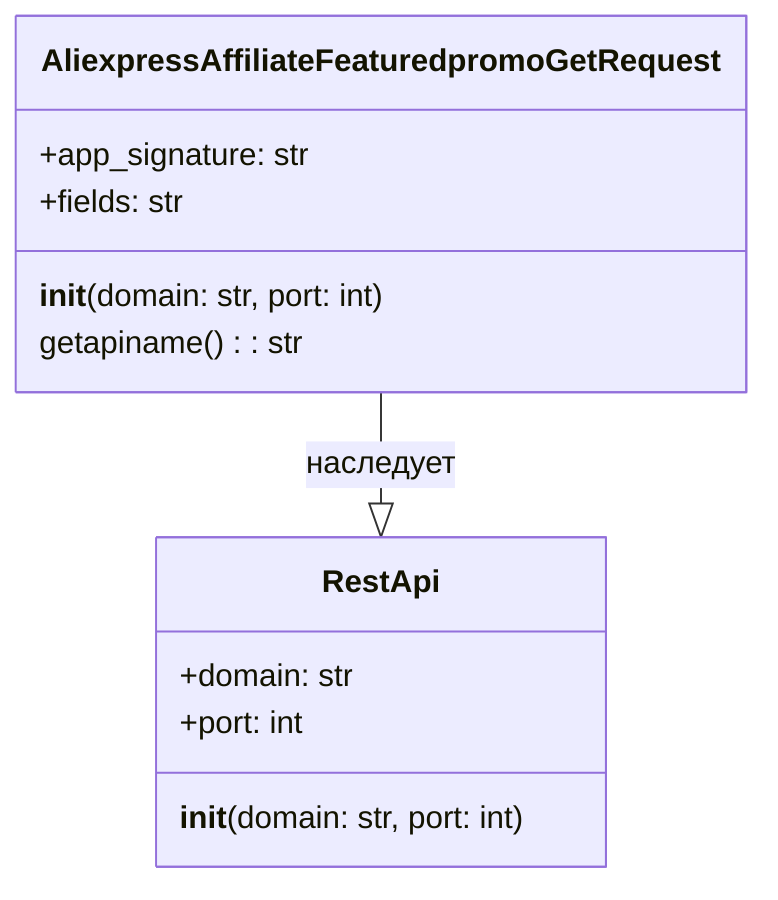

## Анализ кода `AliexpressAffiliateFeaturedpromoGetRequest.py`

### 1. <алгоритм>

**Блок-схема:**



**Примеры:**

1. **Создание экземпляра класса:**
   ```python
   request = AliexpressAffiliateFeaturedpromoGetRequest(domain="api.aliexpress.com", port=443)
   ```
   Здесь создается объект `request` класса `AliexpressAffiliateFeaturedpromoGetRequest`. `domain` устанавливается в `"api.aliexpress.com"`, а `port` в `443`. `app_signature` и `fields` инициализируются как `None`.

2. **Вызов метода `getapiname`:**
   ```python
   api_name = request.getapiname()
   ```
   Метод `getapiname()` вызывается у объекта `request`. Он вернет строку `'aliexpress.affiliate.featuredpromo.get'`, которая используется для определения имени API-запроса.

**Поток данных:**

1.  Создание объекта класса `AliexpressAffiliateFeaturedpromoGetRequest` → инициализация атрибутов класса.
2.  Вызов метода `getapiname` → получение имени API-запроса.

### 2. <mermaid>


**Объяснение:**
-   **`RestApi`**: Базовый класс для создания REST API запросов.
    -   `domain`: Доменное имя API.
    -   `port`: Порт для API.
    -   `__init__(domain: str, port: int)`: Конструктор для инициализации домена и порта.
-   **`AliexpressAffiliateFeaturedpromoGetRequest`**: Класс для запроса получения featured promo у Aliexpress.
    -   `app_signature`: Подпись приложения.
    -   `fields`: Поля для запроса.
    -   `__init__(domain: str, port: int)`: Конструктор, вызывает конструктор родительского класса `RestApi` и инициализирует атрибуты.
    -   `getapiname()`: Возвращает имя API-метода.
-   `AliexpressAffiliateFeaturedpromoGetRequest --|> RestApi`:  Означает, что класс `AliexpressAffiliateFeaturedpromoGetRequest` наследует от класса `RestApi`.

### 3. <объяснение>

**Импорты:**

-   `from ..base import RestApi`: Импортирует класс `RestApi` из модуля `base`, находящегося на уровень выше в директории (т.е. `src/suppliers/aliexpress/api/base`). `RestApi` вероятно является базовым классом для всех API запросов. Импорт говорит о том, что `AliexpressAffiliateFeaturedpromoGetRequest` зависит от базовой реализации API запросов.

**Классы:**

-   **`AliexpressAffiliateFeaturedpromoGetRequest`**:
    -   **Роль:** Представляет запрос для получения featured promo на AliExpress.
    -   **Атрибуты:**
        -   `app_signature`: (str, по умолчанию `None`) - Подпись приложения для авторизации запроса.
        -   `fields`: (str, по умолчанию `None`) - Поля, которые нужно получить в ответе.
    -   **Методы:**
        -   `__init__(self, domain="api-sg.aliexpress.com", port=80)`: Конструктор, принимает `domain` и `port` в качестве параметров и вызывает конструктор родительского класса `RestApi`. Инициализирует атрибуты `app_signature` и `fields` значением `None`.
        -   `getapiname(self)`: Возвращает строку `'aliexpress.affiliate.featuredpromo.get'`, которая представляет имя API метода для запроса.
    -   **Взаимодействие:** Наследует от класса `RestApi`, таким образом, может использовать его атрибуты и методы для выполнения HTTP-запросов.

**Функции:**

-   **`__init__(self, domain="api-sg.aliexpress.com", port=80)`:**
    -   **Аргументы:** `domain` (str, по умолчанию "api-sg.aliexpress.com"), `port` (int, по умолчанию 80).
    -   **Назначение:** Инициализирует экземпляр класса, устанавливая домен и порт для API запросов, а так же `app_signature` и `fields` в `None`. Вызывает конструктор родительского класса `RestApi`.
    -   **Пример:**
        ```python
        request = AliexpressAffiliateFeaturedpromoGetRequest(domain="api.aliexpress.com", port=443)
        ```
        Создает объект с указанным доменом и портом.

-   **`getapiname(self)`:**
    -   **Аргументы:** `self`.
    -   **Возвращаемое значение:** Строка `'aliexpress.affiliate.featuredpromo.get'`.
    -   **Назначение:** Возвращает имя API метода, которое используется для формирования URL-а.
    -   **Пример:**
        ```python
        api_name = request.getapiname()
        print(api_name) # Вывод: aliexpress.affiliate.featuredpromo.get
        ```

**Переменные:**
 - `app_signature` : str.  Представляет подпись приложения для авторизации запроса
 - `fields`: str.  Поля, которые нужно получить в ответе
 - `domain`: str. Доменное имя API.
 - `port`: int. Порт для API.
 - `self`: Ссылка на текущий экземпляр класса.

**Потенциальные ошибки и области для улучшения:**

-   **Отсутствие обработки ошибок**: Код не обрабатывает потенциальные ошибки, такие как неверные данные для `domain` или `port`.
-   **Отсутствие валидации**: Нет валидации для атрибутов `fields` и `app_signature`.
-   **Жестко заданное значение имени API**: Имя API (`'aliexpress.affiliate.featuredpromo.get'`) жестко закодировано в методе `getapiname`, можно было бы сделать его атрибутом класса или передавать в конструктор.
-   **Неполная реализация:** Класс `AliexpressAffiliateFeaturedpromoGetRequest` пока не содержит логики для фактического выполнения API-запроса, только подготавливает данные.

**Цепочка взаимосвязей:**

1.  `AliexpressAffiliateFeaturedpromoGetRequest` зависит от `RestApi` (наследование).
2.  `RestApi` (предположительно) является частью более общего фреймворка для работы с REST API.
3.  `AliexpressAffiliateFeaturedpromoGetRequest` используется для конкретного запроса к API AliExpress.

Этот класс является частью системы запросов к AliExpress API, и вероятно, в дальнейшем в проекте, будет использоваться совместно с другими классами, которые будут отвечать за отправку HTTP-запросов и обработку ответов.