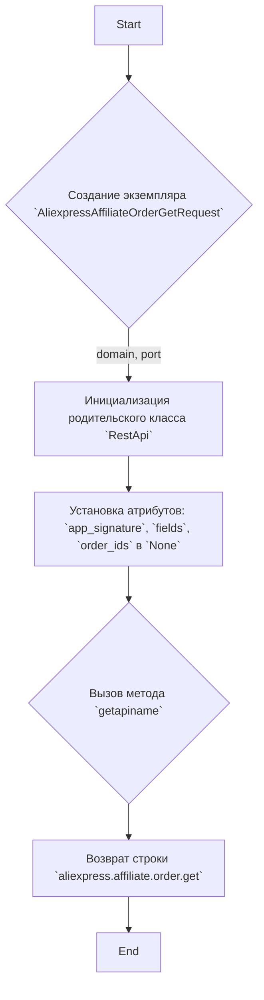
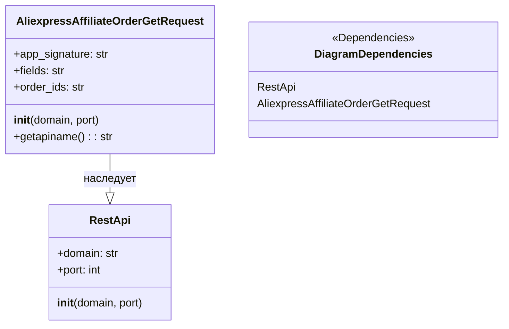

## Анализ кода: `AliexpressAffiliateOrderGetRequest.py`

### 1. <алгоритм>

**Блок-схема:**



**Примеры:**

1.  **Создание экземпляра:**
    ```python
    request = AliexpressAffiliateOrderGetRequest(domain="api-test.aliexpress.com", port=8080)
    ```
    Здесь создается объект `AliexpressAffiliateOrderGetRequest` с указанием другого домена и порта.

2.  **Инициализация родительского класса `RestApi`:**
    Внутри `__init__` вызывается `RestApi.__init__(self, domain, port)`, который устанавливает атрибуты для базового API запроса.
    
3. **Вызов `getapiname`:**
   ```python
   api_name = request.getapiname() 
   # api_name будет равен "aliexpress.affiliate.order.get"
   ```
   Метод `getapiname` возвращает строку, представляющую имя API метода.

### 2. <mermaid>



**Объяснение зависимостей:**

*   **`AliexpressAffiliateOrderGetRequest`** наследует от **`RestApi`**, что означает, что он использует функциональность базового класса для выполнения REST API запросов.
*   **`DiagramDependencies`** показывает основные зависимости классов в диаграмме.

### 3. <объяснение>

#### Импорты:

*   `from ..base import RestApi`:
    *   Импортирует класс `RestApi` из модуля `base`, находящегося на уровень выше в структуре пакетов (относительно текущего файла).
    *   `RestApi` предположительно является базовым классом для всех REST API запросов и предоставляет основную функциональность для отправки запросов к API.
    *   Использование `..` указывает на относительный импорт, который необходим для правильной работы внутри пакета.

#### Классы:

*   `class AliexpressAffiliateOrderGetRequest(RestApi):`
    *   Объявляет класс `AliexpressAffiliateOrderGetRequest`, который наследуется от `RestApi`.
    *   Этот класс представляет собой конкретный тип API запроса для получения данных по заказам от AliExpress.
    *   **Атрибуты:**
        *   `app_signature`: Предназначен для хранения подписи приложения (по умолчанию `None`).
        *   `fields`: Предназначен для хранения списка возвращаемых полей (по умолчанию `None`).
        *   `order_ids`: Предназначен для хранения ID заказов, по которым нужно получить информацию (по умолчанию `None`).
    *   **Методы:**
        *   `__init__(self, domain="api-sg.aliexpress.com", port=80)`:
            *   Конструктор класса. Принимает домен и порт API сервера.
            *   Вызывает конструктор родительского класса `RestApi.__init__(self, domain, port)` для инициализации общих настроек API.
            *   Инициализирует атрибуты класса `app_signature`, `fields`, `order_ids` значением `None`.
        *   `getapiname(self)`:
            *   Возвращает строку `aliexpress.affiliate.order.get`, которая является именем API метода для получения информации о заказах.

#### Функции:

*   `__init__`:
    *   **Аргументы**:
        * `self`: Ссылка на текущий объект.
        * `domain` (str, optional): Домен API. По умолчанию `"api-sg.aliexpress.com"`.
        * `port` (int, optional): Порт API. По умолчанию 80.
    *   **Возвращаемое значение**: `None`.
    *   **Назначение**: Инициализирует объект класса `AliexpressAffiliateOrderGetRequest`, устанавливая домен, порт и сбрасывая атрибуты в `None`.
*    `getapiname`:
     * **Аргументы:**
       * `self`: Ссылка на текущий объект.
     * **Возвращаемое значение**: Строка `aliexpress.affiliate.order.get`.
     * **Назначение**: Возвращает имя API метода.

#### Переменные:

*   `domain` (str): Домен API сервера.
*   `port` (int): Порт API сервера.
*   `app_signature` (str): Подпись приложения для API.
*   `fields` (str): Список полей, которые нужно вернуть в ответе API.
*   `order_ids` (str): Список ID заказов, для которых нужно получить информацию.

#### Потенциальные ошибки или области для улучшения:

*   **Отсутствие документации типов:** В коде отсутствуют аннотации типов, что делает его менее читаемым и сложным для отладки.
*   **Неполная реализация:** Класс `AliexpressAffiliateOrderGetRequest` только устанавливает базовые параметры и имя API метода, но не содержит логики для фактической отправки API запроса и обработки ответа. Это предполагает, что этот функционал реализован в базовом классе `RestApi` или в других частях проекта.

#### Взаимосвязи с другими частями проекта:

*   **`src.suppliers.aliexpress.api.base.RestApi`:** Этот класс наследуется от базового класса `RestApi`, который, вероятно, обеспечивает основную функциональность для выполнения REST API запросов. `RestApi` может содержать методы для отправки запросов, обработки ответов, аутентификации и т.д.
*   **Другие классы запросов:** Предположительно, существуют другие классы запросов (например, для получения списка товаров, категорий и т.д.), которые также наследуются от `RestApi`.
*   **Модуль обработки данных:** Вероятно, существует модуль, который использует этот класс запроса для получения данных и их дальнейшей обработки.
*   **Конфигурация:** Предполагается, что значения `domain` и `port` могут конфигурироваться в глобальных настройках проекта, чтобы можно было легко переключаться между различными API окружениями (например, тестовым и продуктивным).

В целом, данный код представляет собой структуру класса для запроса данных о заказах от AliExpress API, но требует дополнительной реализации для полноценного выполнения запросов.