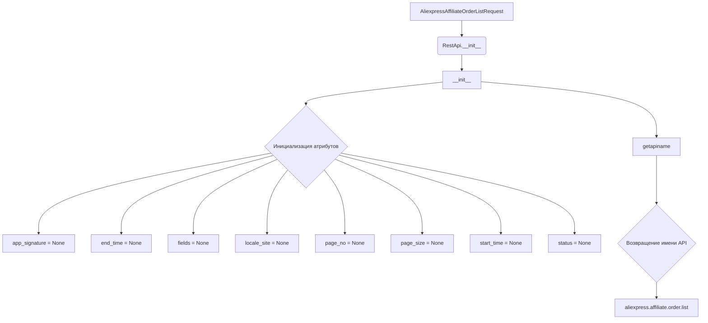

# <input code>

```python
## \file hypotez/src/suppliers/aliexpress/api/_examples/rest/AliexpressAffiliateOrderListRequest.py
# -*- coding: utf-8 -*-\
 # <- venv win
## ~~~~~~~~~~~~~
""" module: src.suppliers.aliexpress.api._examples.rest """

'''
Created by auto_sdk on 2021.06.02
'''
from ..base import RestApi
class AliexpressAffiliateOrderListRequest(RestApi):
	def __init__(self, domain="api-sg.aliexpress.com", port=80):
		RestApi.__init__(self,domain, port)
		self.app_signature = None
		self.end_time = None
		self.fields = None
		self.locale_site = None
		self.page_no = None
		self.page_size = None
		self.start_time = None
		self.status = None

	def getapiname(self):
		return 'aliexpress.affiliate.order.list'
```

# <algorithm>

1. **Инициализация (`__init__`)**:
   - Принимает `domain` и `port` в качестве аргументов.
   - Вызывает конструктор базового класса `RestApi` для инициализации общих свойств.
   - Инициализирует атрибуты `app_signature`, `end_time`, `fields`, `locale_site`, `page_no`, `page_size`, `start_time`, `status` со значениями `None`.

   *Пример:*
   ```
   request = AliexpressAffiliateOrderListRequest(domain="api-us.aliexpress.com", port=80)
   ```

2. **Получение имени API (`getapiname`)**:
   - Возвращает строку `'aliexpress.affiliate.order.list'`. Это имя API-метода, который будет использоваться для запроса данных.

   *Пример:*
   ```
   api_name = request.getapiname()  # api_name будет содержать 'aliexpress.affiliate.order.list'
   ```

# <mermaid>



# <explanation>

* **Импорты:**
    - `from ..base import RestApi`: Импортирует базовый класс `RestApi` из папки `base` в той же директории.  Эта строка предполагает структуру проекта, где `src.suppliers.aliexpress.api` содержит модули, связанные с API AliExpress, а `..base` указывает на директорию над текущей, вероятно `src.suppliers.aliexpress.api.base`
    Это позволяет использовать функциональность `RestApi` в текущем классе.

* **Классы:**
    - `AliexpressAffiliateOrderListRequest`: Этот класс наследуется от `RestApi`, указывая на то, что он использует функциональность и, вероятно, структуру, определенную в базовом классе.  Этот класс предназначен для запроса списка заказов аффилиата AliExpress.


* **Функции:**
    - `__init__(self, domain="api-sg.aliexpress.com", port=80)`: Конструктор класса. Инициализирует все атрибуты класса.  `domain` и `port` - параметры, которые могут быть переопределены при создании экземпляра класса, что дает возможность работать с разными API-серверами.
    - `getapiname(self)`: Функция возвращает имя API-метода `'aliexpress.affiliate.order.list'`. Это имя используется для вызова соответствующего API-метода на стороне сервера AliExpress.


* **Переменные:**
    - Все атрибуты класса ( `app_signature`, `end_time`, `fields`, `locale_site`, `page_no`, `page_size`, `start_time`, `status`) являются атрибутами экземпляра класса. Они хранят параметры, необходимые для формирования запроса к API AliExpress. Их значения инициализируются как `None`, что предполагает необходимость их установки перед использованием.

* **Возможные ошибки и улучшения:**
    - Отсутствует обработка исключений.  В реальном приложении необходимо добавить обработку потенциальных ошибок, например, проблем с подключением к API или некорректного ответа сервера.
    - Атрибуты класса инициализируются `None`, что требует их явного заполнения перед использованием. В классе `RestApi` может отсутствовать функциональность для заполнения этих значений.
    - Желательно добавить документацию к атрибутам и функциям для улучшения читабельности и понимания кода.
    - В имени файла `AliexpressAffiliateOrderListRequest.py` (и в имени класса) повторяется слово 'Aliexpress'.  Вместо этого лучше использовать более краткие наименования.

* **Взаимосвязи с другими частями проекта:**
    - Класс `RestApi` (вероятно, в `src.suppliers.aliexpress.api.base`) определяет общую логику взаимодействия с API, предоставляя методы для создания запросов и обработки ответов.  Это указывает на модульную структуру проекта с разделением обязанностей между классами.


```