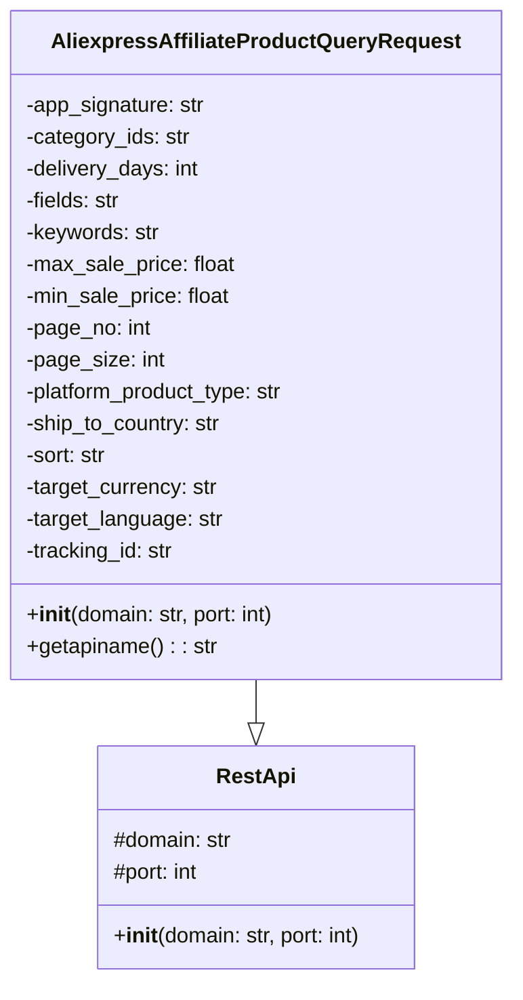

## Анализ кода `AliexpressAffiliateProductQueryRequest.py`

### 1. <алгоритм>

**Блок-схема:**

```mermaid
flowchart TD
    Start[Начало] --> InitClass[Инициализация класса `AliexpressAffiliateProductQueryRequest`]
    InitClass --> SetDefaultDomainPort[Установка домена и порта по умолчанию: `domain="api-sg.aliexpress.com"`, `port=80`]
    SetDefaultDomainPort --> InitRestApi[Вызов конструктора `RestApi` с доменом и портом]
    InitRestApi --> SetAttributes[Установка атрибутов экземпляра класса: `app_signature`, `category_ids`, `delivery_days`, `fields`, `keywords`, `max_sale_price`, `min_sale_price`, `page_no`, `page_size`, `platform_product_type`, `ship_to_country`, `sort`, `target_currency`, `target_language`, `tracking_id` как `None`]
    SetAttributes --> GetApiName[Вызов метода `getapiname()`]
    GetApiName --> ReturnApiName[Возврат имени API: `aliexpress.affiliate.product.query`]
    ReturnApiName --> End[Конец]
    
    style Start fill:#f9f,stroke:#333,stroke-width:2px
    style End fill:#ccf,stroke:#333,stroke-width:2px
```

**Примеры:**

1.  **Инициализация класса:**
    ```python
    request = AliexpressAffiliateProductQueryRequest()
    ```
    *   Создается экземпляр класса `AliexpressAffiliateProductQueryRequest`.
    *   Устанавливаются значения по умолчанию для `domain` и `port` (если они не переданы при вызове).
    *   Вызывается конструктор базового класса `RestApi`.
    *   Атрибуты запроса инициализируются значениями `None`.

2.  **Вызов метода `getapiname()`:**
    ```python
    api_name = request.getapiname()
    print(api_name) # Вывод: aliexpress.affiliate.product.query
    ```
    *   Вызывается метод `getapiname()` экземпляра класса.
    *   Возвращается имя API `'aliexpress.affiliate.product.query'`.

### 2. <mermaid>



**Объяснение:**

*   `class AliexpressAffiliateProductQueryRequest`: Представляет класс для запроса товаров через AliExpress API.
    *   `-app_signature`: Строка подписи приложения для авторизации.
    *   `-category_ids`: Строка идентификаторов категорий товаров.
    *   `-delivery_days`: Целое число дней доставки.
    *   `-fields`: Строка полей для возврата в ответе.
    *   `-keywords`: Строка ключевых слов для поиска.
    *   `-max_sale_price`: Максимальная цена товара.
    *   `-min_sale_price`: Минимальная цена товара.
    *   `-page_no`: Номер страницы результатов.
    *   `-page_size`: Размер страницы результатов.
    *   `-platform_product_type`: Тип продукта на платформе.
    *   `-ship_to_country`: Код страны доставки.
    *   `-sort`: Параметры сортировки результатов.
    *   `-target_currency`: Целевая валюта.
    *   `-target_language`: Целевой язык.
    *   `-tracking_id`: Идентификатор отслеживания.
    *   `+__init__(domain: str, port: int)`: Конструктор класса, инициализирует атрибуты.
    *   `+getapiname(): str`: Метод, возвращающий имя API.
*   `class RestApi`: Базовый класс для работы с REST API.
    *   `#domain`: Защищенный атрибут домена API.
    *   `#port`: Защищенный атрибут порта API.
    *   `+__init__(domain: str, port: int)`: Конструктор класса, инициализирует домен и порт.
*   `AliexpressAffiliateProductQueryRequest --|> RestApi`: Обозначает наследование класса `AliexpressAffiliateProductQueryRequest` от `RestApi`.

### 3. <объяснение>

**Импорты:**

*   `from ..base import RestApi`: Импортирует класс `RestApi` из модуля `base`, расположенного на уровень выше текущего модуля. Это подразумевает, что в структуре проекта есть каталог `src/suppliers/aliexpress/api/base`, где определен `RestApi`.  `RestApi` вероятно обеспечивает базовую функциональность для работы с REST API, например, управление URL, портами и т.д.

**Классы:**

*   `class AliexpressAffiliateProductQueryRequest(RestApi)`:
    *   **Роль:** Этот класс предназначен для формирования запроса к API AliExpress для получения списка товаров. Он наследуется от `RestApi`, что позволяет использовать его функциональность для управления подключением.
    *   **Атрибуты:**
        *   `app_signature`: (str) Подпись приложения.
        *   `category_ids`: (str) Идентификаторы категорий товаров.
        *   `delivery_days`: (int) Дни доставки.
        *   `fields`: (str) Список полей, возвращаемых в ответе.
        *   `keywords`: (str) Ключевые слова для поиска.
        *   `max_sale_price`: (float) Максимальная цена товара.
        *   `min_sale_price`: (float) Минимальная цена товара.
        *   `page_no`: (int) Номер страницы результатов.
        *   `page_size`: (int) Количество элементов на странице.
        *   `platform_product_type`: (str) Тип товара на платформе.
        *   `ship_to_country`: (str) Код страны доставки.
        *   `sort`: (str) Способ сортировки результатов.
        *   `target_currency`: (str) Целевая валюта.
        *   `target_language`: (str) Целевой язык.
        *   `tracking_id`: (str) Идентификатор отслеживания.
        * Все атрибуты инициализируются значением `None`, что позволяет устанавливать их позже при создании экземпляра.
    *   **Методы:**
        *   `__init__(self, domain="api-sg.aliexpress.com", port=80)`:
            *   Конструктор класса. Принимает домен и порт API по умолчанию. Вызывает конструктор родительского класса `RestApi`.
        *   `getapiname(self)`:
            *   Возвращает строку `'aliexpress.affiliate.product.query'`, которая является именем API.
    *   **Взаимодействие:**
        *   Использует `RestApi` для базовой настройки соединения (домен, порт).
        *   Атрибуты класса используются для хранения параметров запроса.
        *   Метод `getapiname()` предоставляет имя API для дальнейшего использования при формировании запроса.

**Функции:**

*   `__init__(self, domain="api-sg.aliexpress.com", port=80)`: Конструктор класса, устанавливает значения по умолчанию для домена и порта, а также вызывает конструктор родительского класса.

*    `getapiname(self)`: Возвращает имя API.
    
**Переменные:**

*   Атрибуты класса: Все атрибуты класса (например, `app_signature`, `category_ids`, и т.д.) являются переменными экземпляра и хранят соответствующие параметры для API запроса.

**Потенциальные ошибки и области для улучшения:**

*   **Отсутствие валидации:** Нет никакой валидации входных данных. Необходимо добавить проверку типов и значений для атрибутов, чтобы избежать ошибок при формировании запроса к API.
*   **Жестко заданные значения по умолчанию:** Домен и порт API заданы жестко в коде. Возможно, стоит вынести их в конфигурационный файл или использовать переменные окружения для большей гибкости.
*   **Нет обработки ошибок:** Отсутствует какая-либо обработка ошибок. При работе с реальным API необходимо предусмотреть обработку ошибок соединения, ответа и т.д.
*   **Нет документации:** Отсутствуют комментарии к атрибутам класса, которые бы описывали их назначение и типы.

**Цепочка взаимосвязей:**

1.  **`AliexpressAffiliateProductQueryRequest`** наследуется от **`RestApi`** из `src/suppliers/aliexpress/api/base.py`. Это означает, что `AliexpressAffiliateProductQueryRequest` использует функциональность `RestApi` для управления соединениями (установка домена, порта и т.д.).
2.  Класс `AliexpressAffiliateProductQueryRequest` используется для формирования параметров запроса к API AliExpress.
3.  Этот класс вероятно будет использоваться другими частями проекта, которые отвечают за отправку запроса к API AliExpress и получение списка товаров, а так же дальнейшей обработки ответа.

В целом, класс `AliexpressAffiliateProductQueryRequest` является базовым классом для формирования запроса к API AliExpress. Для полноценного использования его необходимо дополнить валидацией данных, обработкой ошибок и другими необходимыми функциями.