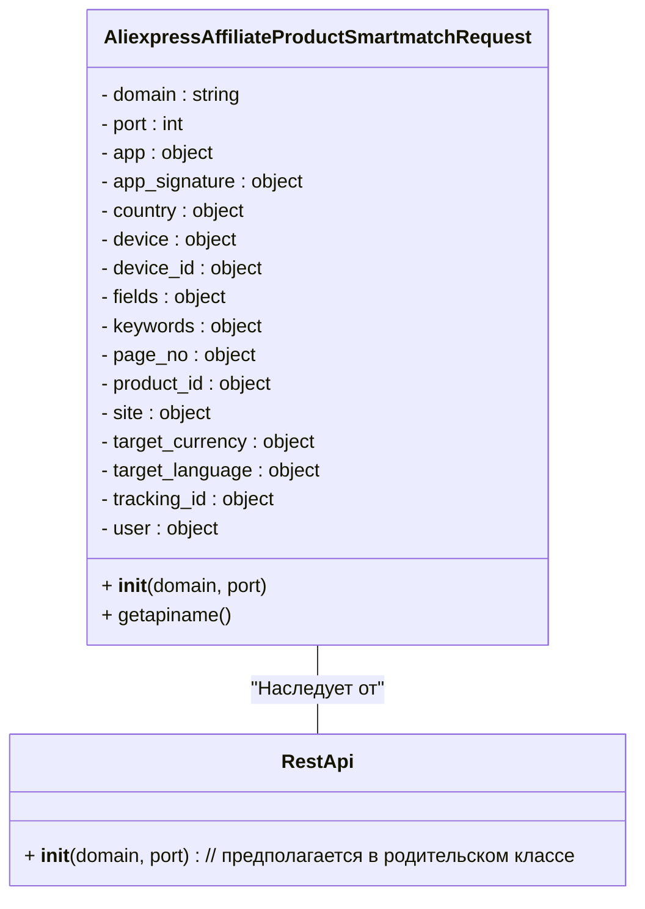

# <input code>

```python
## \file hypotez/src/suppliers/aliexpress/api/_examples/rest/AliexpressAffiliateProductSmartmatchRequest.py
# -*- coding: utf-8 -*-
 # <- venv win
## ~~~~~~~~~~~~~
""" module: src.suppliers.aliexpress.api._examples.rest """

'''
Created by auto_sdk on 2021.05.17
'''
from ..base import RestApi
class AliexpressAffiliateProductSmartmatchRequest(RestApi):
	def __init__(self, domain="api-sg.aliexpress.com", port=80):
		RestApi.__init__(self,domain, port)
		self.app = None
		self.app_signature = None
		self.country = None
		self.device = None
		self.device_id = None
		self.fields = None
		self.keywords = None
		self.page_no = None
		self.product_id = None
		self.site = None
		self.target_currency = None
		self.target_language = None
		self.tracking_id = None
		self.user = None

	def getapiname(self):
		return 'aliexpress.affiliate.product.smartmatch'
```

# <algorithm>

**Блок-схема:**

```mermaid
graph TD
    A[__init__(domain, port)] --> B{Инициализация атрибутов};
    B --> C[self.app = None];
    B -- self.app_signature = None --> D;
    B -- self.country = None --> E;
    B -- self.device = None --> F;
    B -- self.device_id = None --> G;
    B -- self.fields = None --> H;
    B -- self.keywords = None --> I;
    B -- self.page_no = None --> J;
    B -- self.product_id = None --> K;
    B -- self.site = None --> L;
    B -- self.target_currency = None --> M;
    B -- self.target_language = None --> N;
    B -- self.tracking_id = None --> O;
    B -- self.user = None --> P;
    P --> Q[RestApi.__init__(self, domain, port)];
    Q --> R[Запрос API];
    C --> R;
    D --> R;
    E --> R;
    F --> R;
    G --> R;
    H --> R;
    I --> R;
    J --> R;
    K --> R;
    L --> R;
    M --> R;
    N --> R;
    O --> R;
    P --> R;

    R --> S[Возврат "aliexpress.affiliate.product.smartmatch"];
    S --> T(Конец);
```

**Пример:**

Создается экземпляр класса `AliexpressAffiliateProductSmartmatchRequest` с параметрами `domain="api-us.aliexpress.com"` и `port=80`.  В результате инициализируются все атрибуты класса с нулевыми значениями. Метод `getapiname()` возвращает строку `'aliexpress.affiliate.product.smartmatch'`.


# <mermaid>



# <explanation>

**Импорты:**

- `from ..base import RestApi`: Импортирует класс `RestApi` из модуля `base` в подпапке `suppliers/aliexpress/api`.  Связь: данный модуль содержит базовый класс для REST-API запросов. `..` означает переход на два уровня вверх от текущего файла.

**Классы:**

- `AliexpressAffiliateProductSmartmatchRequest`: Этот класс представляет запрос `smartmatch` для API AliExpress.  Он наследуется от `RestApi`.
    - **Атрибуты:**  `app`, `app_signature`, `country`, ...  –  переменные, хранящие параметры запроса.  Они инициализируются в конструкторе со значением `None`.  Эти атрибуты могут быть использованы для настройки параметров запроса к API.
    - **Метод `__init__`:** Конструктор класса.  Принимает `domain` и `port` для настройки API.  Вызывает конструктор родительского класса `RestApi`.  Инициализирует все внутренние поля, задавая им значения по умолчанию `None`.
    - **Метод `getapiname`:** Возвращает имя API-эндпоинта для запроса `smartmatch`.

**Функции:**

- Нет функций, кроме `__init__` и `getapiname`.

**Переменные:**

- `domain`, `port`:  Строка и целое число, определяющие домен и порт API-сервера.
-  Атрибуты класса (например, `self.app`, `self.keywords`)  –  хранят данные, относящиеся к запросу.


**Возможные ошибки или улучшения:**

- Отсутствует валидация входных данных в конструкторе `__init__`.  Необходимо проверять корректность `domain`, `port` и других входных параметров.
- Отсутствует реализация запроса API, которая должна вызывать нужный API endpoint с заданными параметрами и парсить полученные данные.  В коде не хватает логики взаимодействия с AliExpress API.
- Необходимо добавить обработку ошибок (например, исключения, связанные с сетевыми проблемами или ответами сервера).
- Не хватает документации для атрибутов и методов класса, что затрудняет его использование.

**Цепочка взаимосвязей:**

`AliexpressAffiliateProductSmartmatchRequest` использует `RestApi` в качестве базового класса.  `RestApi` (скорее всего) содержит методы для взаимодействия с RESTful API.  Этот класс, в свою очередь, имеет связи с другими частями проекта, которые отвечают за работу с API и логику программы.

**В заключение:**

Код представляет собой базовый шаблон для запроса `smartmatch` API AliExpress.  Для его использования необходимо дополнить реализацию взаимодействия с сервером и обработку данных.