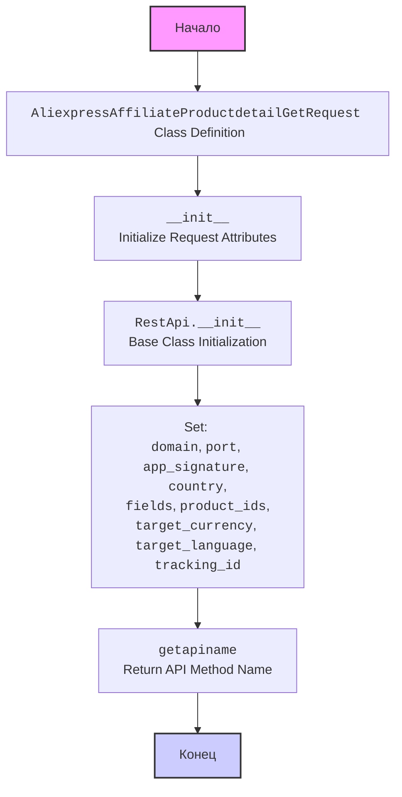

## АНАЛИЗ КОДА: `AliexpressAffiliateProductdetailGetRequest.py`

### <алгоритм>

1. **Импорт:**
   - Импортируется класс `RestApi` из `..base`, который, вероятно, является базовым классом для работы с REST API.
   ```python
   from ..base import RestApi
   ```

2. **Определение класса `AliexpressAffiliateProductdetailGetRequest`:**
   - Создается класс `AliexpressAffiliateProductdetailGetRequest`, наследующийся от `RestApi`.
   ```python
   class AliexpressAffiliateProductdetailGetRequest(RestApi):
   ```

3. **Конструктор `__init__`:**
   - Инициализируются атрибуты экземпляра класса:
     - `domain`: Устанавливается домен API (по умолчанию "api-sg.aliexpress.com").
     - `port`: Устанавливается порт API (по умолчанию 80).
     - `app_signature`: Задается None, скорее всего, для подписи запроса.
     - `country`: Задается None, для страны в запросе.
     - `fields`: Задается None, для указания конкретных полей ответа.
     - `product_ids`: Задается None, для идентификаторов товаров.
     - `target_currency`: Задается None, для целевой валюты.
     - `target_language`: Задается None, для целевого языка.
     - `tracking_id`: Задается None, для отслеживания запроса.
   - Вызывается конструктор базового класса `RestApi` с доменом и портом.
   ```python
    def __init__(self, domain="api-sg.aliexpress.com", port=80):
        RestApi.__init__(self,domain, port)
        self.app_signature = None
        self.country = None
        self.fields = None
        self.product_ids = None
        self.target_currency = None
        self.target_language = None
        self.tracking_id = None
   ```

4. **Метод `getapiname`:**
   - Возвращает строку `'aliexpress.affiliate.productdetail.get'`, которая представляет собой имя API метода для запроса детальной информации о товаре.
    ```python
   def getapiname(self):
        return 'aliexpress.affiliate.productdetail.get'
   ```
### <mermaid>



### <объяснение>

**Импорты:**
  -  `from ..base import RestApi`: Импортирует класс `RestApi` из модуля `base`, расположенного на один уровень выше в структуре пакетов. Этот класс, вероятно, содержит общую логику для работы с REST API, включая базовую настройку домена и порта, а также возможно методы для отправки запросов и обработки ответов. `..` указывает на относительный импорт из родительского каталога.

**Класс `AliexpressAffiliateProductdetailGetRequest`:**

-   **Назначение**: Представляет собой класс для формирования запроса к AliExpress API для получения детальной информации о продукте. Он наследует функциональность базового класса `RestApi`.
-   **Атрибуты**:
    -   `domain` (str): Домен API AliExpress (по умолчанию "api-sg.aliexpress.com").
    -   `port` (int): Порт API (по умолчанию 80).
    -   `app_signature` (str или None): Сигнатура приложения для авторизации (по умолчанию None).
    -   `country` (str или None): Страна, для которой запрашивается информация о товаре (по умолчанию None).
    -   `fields` (str или None): Список полей, которые нужно вернуть в ответе (по умолчанию None).
    -   `product_ids` (str или None): Строка с ID товаров, разделенных запятыми, по которым запрашивается информация (по умолчанию None).
    -   `target_currency` (str или None): Валюта, в которой нужно вернуть цены (по умолчанию None).
    -   `target_language` (str или None): Язык, на котором нужно вернуть описание товара (по умолчанию None).
    -    `tracking_id` (str или None): Идентификатор отслеживания (по умолчанию None)
-  **Методы:**
    -   `__init__(self, domain="api-sg.aliexpress.com", port=80)`: Конструктор класса. Инициализирует атрибуты экземпляра класса, задавая значения по умолчанию, и вызывает конструктор базового класса `RestApi` для настройки домена и порта.
    -   `getapiname(self)`: Возвращает имя API-метода, которое будет использоваться для формирования запроса.

**Функции:**
 - `__init__`: Конструктор класса, иницилизирует атрибуты экземпляра.
 - `getapiname`: Метод, возвращает строку с названием API метода.

**Переменные:**
- Все переменные являются атрибутами класса, которые используются для хранения параметров запроса.
- Типы переменных: `str` или `None`, `int` (для `port`).

**Взаимосвязи с другими частями проекта:**
 - Данный класс является частью пакета `suppliers.aliexpress.api._examples.rest`. Он зависит от класса `RestApi`, который, вероятно, находится в `suppliers.aliexpress.api.base`.
 - Предполагается, что будут другие классы, которые также будут наследоваться от `RestApi` для различных запросов к AliExpress API.
 - Этот класс служит для формирования запроса к API, и, вероятно, в других частях проекта будет код, который фактически отправляет запрос на API и обрабатывает ответ.

**Потенциальные ошибки и области для улучшения:**
-   Отсутствует валидация входных параметров. Например, проверка типов данных `product_ids`, `target_currency`, `target_language` и `fields`.
-   Отсутствует обработка ошибок при вызове API. Необходимо добавить логику обработки ошибок сети, ошибок API.
-   Можно было бы использовать `dataclass`, чтобы упростить объявление атрибутов класса.

**Пример использования:**

```python
request = AliexpressAffiliateProductdetailGetRequest()
request.product_ids = "12345,67890"
request.country = "US"
request.target_currency = "USD"
api_name = request.getapiname()
print(api_name) # Вывод: aliexpress.affiliate.productdetail.get
```
В этом примере создается экземпляр класса, устанавливаются некоторые параметры запроса, и получается имя API метода. Далее этот экземпляр можно использовать для фактического запроса к API.