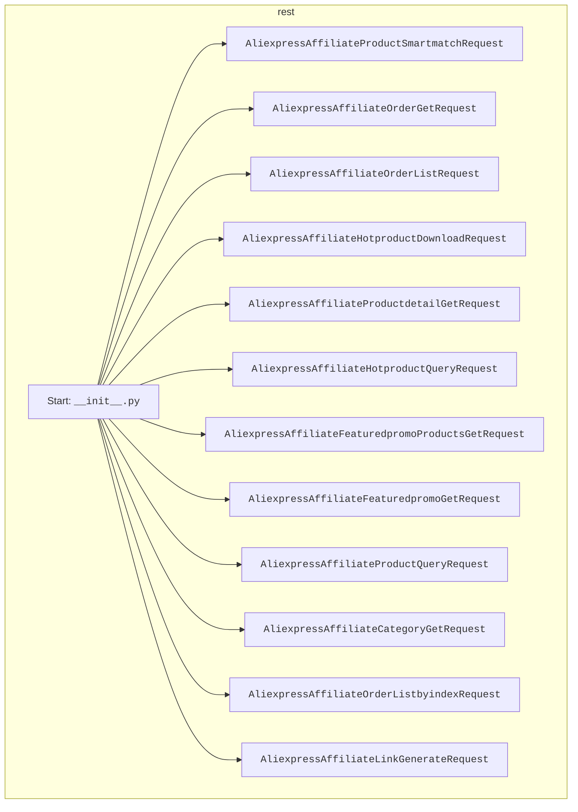

## АНАЛИЗ КОДА: `src/suppliers/aliexpress/api/_examples/rest/__init__.py`

### 1. <алгоритм>

Данный файл `__init__.py` служит для инициализации пакета `rest` и импорта классов, представляющих запросы к API AliExpress. Процесс можно представить следующим образом:

1. **Импорт классов:** Из каждого файла в текущей директории, который соответствует определенному типу запроса к AliExpress API, импортируется соответствующий класс. Например, из `AliexpressAffiliateProductSmartmatchRequest.py` импортируется `AliexpressAffiliateProductSmartmatchRequest`. 

2. **Доступ к классам:** После импорта, эти классы становятся доступными для использования в других частях проекта. Например, можно создать экземпляр `AliexpressAffiliateProductSmartmatchRequest` и использовать его для выполнения запроса к AliExpress API.

**Пример:**

```python
from src.suppliers.aliexpress.api._examples.rest import AliexpressAffiliateProductSmartmatchRequest

# Создание экземпляра класса
request = AliexpressAffiliateProductSmartmatchRequest()

# ... дальнейшая работа с объектом request
```

### 2. <mermaid>


**Объяснение зависимостей в `mermaid`:**

- Диаграмма типа `flowchart TD` показывает поток данных.
- `Start[Start: <code>__init__.py</code>]` - это начало, представляющее точку входа, в данном случае файл `__init__.py`.
- Каждый прямоугольник, такой как  `A[<code>AliexpressAffiliateProductSmartmatchRequest</code>]`, представляет класс, который импортируется из соответствующего файла. 
- Стрелки `Start --> A`, `Start --> B`, и т.д. показывают, что классы импортируются и становятся доступными при импорте пакета `rest`.
- Все элементы сгруппированы под общим сабграфом `rest` для указания на принадлежность к конкретному пакету.

### 3. <объяснение>

**Импорты:**

- Файл `__init__.py` в Python используется для инициализации пакета. В данном случае он импортирует классы из других файлов в текущей директории.
- Каждый импорт вида `from .ModuleName import ClassName` означает, что из файла `ModuleName.py` импортируется класс `ClassName`. Точка (`.`) указывает на то, что модуль находится в текущей директории.
- **Назначение импортов:**
    - Каждый импортированный класс представляет собой запрос к API AliExpress.
    - Классы с именами, содержащими "Product", работают с запросами связанными с товарами.
    - Классы с именами, содержащими "Order", работают с запросами связанными с заказами.
    - Классы с именами, содержащими "Hotproduct", работают с запросами связанными с популярными товарами.
    - `AliexpressAffiliateLinkGenerateRequest` служит для запросов генерации партнерских ссылок.
    - `AliexpressAffiliateCategoryGetRequest` служит для запросов списка категорий.
- **Связь с `src`:** Эти импорты создают интерфейс для работы с API AliExpress. Другие модули в `src` могут импортировать эти классы из `src.suppliers.aliexpress.api._examples.rest` и использовать их для выполнения запросов к AliExpress API.

**Классы:**

- В данном файле нет определения классов, но импортируются классы из других файлов. 
- Каждый класс (например, `AliexpressAffiliateProductSmartmatchRequest`) представляет собой конкретный запрос к API AliExpress.
-  Предполагается, что каждый класс имеет методы для настройки запроса, такие как добавление параметров запроса, и методы для выполнения самого запроса и обработки ответа.

**Функции:**

- В данном файле нет определения функций, но он подготавливает пакет к дальнейшему использованию классов.

**Переменные:**

- В файле не определены переменные, он только импортирует классы.

**Потенциальные ошибки и области для улучшения:**

- **Именованиe файлов:** Все имена файлов начинаются с `AliexpressAffiliate`, что может быть избыточным.  Может быть имеет смысл переименовать файлы в более короткие, например, `ProductSmartmatchRequest.py`, и использовать пакет для создания более полного пространства имен.
- **Обработка ошибок:** В текущем файле нет никакой обработки ошибок. Скорее всего, она реализуется в самих классах.
- **Неудобство импорта:** На данный момент для каждого нового запроса необходимо добавлять импорт в этот файл. Возможно, стоит рассмотреть более гибкий подход, например, автоматическое обнаружение запросов или использование фабрики.
- **Масштабируемость:** Если API AliExpress будет расширяться, то этот файл может стать слишком большим и сложным. Может понадобиться рефакторинг для более модульной структуры.

**Цепочка взаимосвязей:**

1. **`src/suppliers/aliexpress/api/_examples/rest/__init__.py`**: Этот файл инициализирует пакет `rest`, делая классы для запросов к AliExpress API доступными.
2. **`src/suppliers/aliexpress/api/_examples/rest/AliexpressAffiliateProductSmartmatchRequest.py`**,  `src/suppliers/aliexpress/api/_examples/rest/AliexpressAffiliateOrderGetRequest.py`  и другие файлы в той же директории: Каждый из этих файлов определяет класс для конкретного типа запроса к AliExpress API.
3. **Другие части `src`**: Другие модули в `src` могут импортировать классы из `src.suppliers.aliexpress.api._examples.rest` для выполнения запросов к AliExpress API, например, из модулей работы с данными и из модулей бизнес-логики.