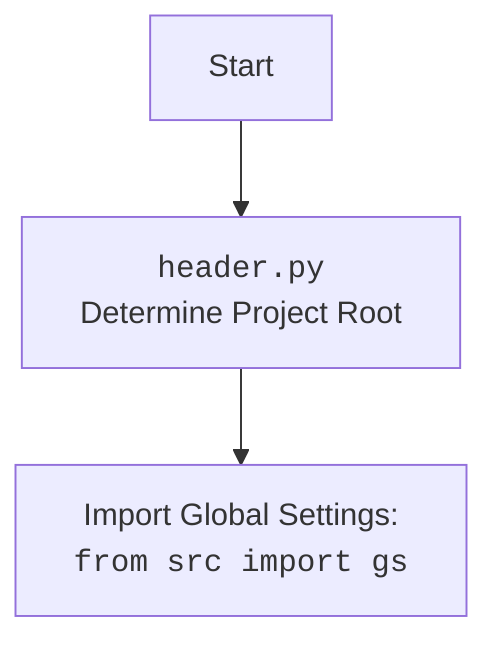

## ИНСТРУКЦИЯ:

Анализируй предоставленный код подробно и объясни его функциональность. Ответ должен включать три раздела:  

1. **<алгоритм>**: Опиши рабочий процесс в виде пошаговой блок-схемы, включая примеры для каждого логического блока, и проиллюстрируй поток данных между функциями, классами или методами.  
2. **<mermaid>**: Напиши код для диаграммы в формате `mermaid`, проанализируй и объясни все зависимости, 
    которые импортируются при создании диаграммы. 
    **ВАЖНО!** Убедитесь, что все имена переменных, используемые в диаграмме `mermaid`, 
    имеют осмысленные и описательные имена. Имена переменных вроде `A`, `B`, `C`, и т.д., не допускаются!  
    
    **Дополнительно**: Если в коде есть импорт `import header`, добавьте блок `mermaid` flowchart, объясняющий `header.py`:\
    ```mermaid
    flowchart TD
        Start --> Header[<code>header.py</code><br> Determine Project Root]
    
        Header --> import[Import Global Settings: <br><code>from src import gs</code>] 
    ```

3. **<объяснение>**: Предоставьте подробные объяснения:  
   - **Импорты**: Их назначение и взаимосвязь с другими пакетами `src.`.  
   - **Классы**: Их роль, атрибуты, методы и взаимодействие с другими компонентами проекта.  
   - **Функции**: Их аргументы, возвращаемые значения, назначение и примеры.  
   - **Переменные**: Их типы и использование.  
   - Выделите потенциальные ошибки или области для улучшения.  

Дополнительно, постройте цепочку взаимосвязей с другими частями проекта (если применимо).  

Это обеспечивает всесторонний и структурированный анализ кода.
## Формат ответа: `.md` (markdown)
**КОНЕЦ ИНСТРУКЦИИ**
```
## <алгоритм>

1. **Инициализация `AliexpressApi`:**
   - При создании экземпляра `AliexpressApi` (например, `api = AliexpressApi(key, secret, language, currency, tracking_id)`):
     - Сохраняются API-ключ (`key`), секретный ключ (`secret`), идентификатор отслеживания (`tracking_id`), язык (`language`), валюта (`currency`) и подпись приложения (`app_signature`).
     - Вызывается `setDefaultAppInfo` для настройки API-клиента.
     - Инициализируется `self.categories` как `None` для хранения категорий.
     
    ```python
    # Пример инициализации
    api = AliexpressApi(
        key="your_api_key",
        secret="your_api_secret",
        language="EN",
        currency="USD",
        tracking_id="your_tracking_id"
    )
    ```

2. **Получение деталей продукта (`retrieve_product_details`):**
   - Принимает `product_ids` (строку или список ID), `fields` (поля для возврата), `country` (страна доставки).
   - `product_ids` преобразуются в список и затем в строку, разделённую запятыми.
   - Создаётся запрос `AliexpressAffiliateProductdetailGetRequest`.
   - Запрос отправляется с помощью `api_request` (вызов API AliExpress).
   - Если `response.current_record_count > 0` (есть продукты):
     - `response.products.product` парсится с помощью `parse_products`.
     - Возвращается список объектов `model_Product`.
   - Если нет продуктов, логируется предупреждение и возвращается `None`.
   - При любой ошибке логируется ошибка и возвращается `None`.

   ```python
    # Пример вызова retrieve_product_details
    products = api.retrieve_product_details(
        product_ids=["123456", "789012"],
        fields=["productTitle", "imageUrl"],
        country="US"
    )
    ```

3. **Получение партнерских ссылок (`get_affiliate_links`):**
   - Принимает `links` (список или строка ссылок) и `link_type` (тип ссылки: `NORMAL` или `HOTLINK`).
   - Проверяется наличие `tracking_id` и, если его нет, логируется ошибка и возвращается `None`.
   - `links` преобразуются в строку.
   - Создаётся запрос `AliexpressAffiliateLinkGenerateRequest`.
   - Запрос отправляется через `api_request`.
   - Если `response.total_result_count > 0`:
     - Возвращается список `response.promotion_links.promotion_link` (объекты `model_AffiliateLink`).
   - В противном случае логируется предупреждение и возвращается `None`.

    ```python
    # Пример вызова get_affiliate_links
    affiliate_links = api.get_affiliate_links(
       links=["https://aliexpress.com/item/123456.html", "https://aliexpress.com/item/789012.html"],
       link_type=model_LinkType.HOTLINK
    )
    ```

4. **Получение горячих продуктов (`get_hotproducts`):**
   - Принимает параметры для фильтрации и сортировки горячих товаров, например `category_ids`, `delivery_days`, `keywords`, `min_sale_price`, `max_sale_price`.
   - Создаётся запрос `AliexpressAffiliateHotproductQueryRequest`.
   - Запрос отправляется через `api_request`.
   - Если `response.current_record_count > 0`:
     - `response.products.product` парсится с помощью `parse_products`.
     - Возвращается объект `model_HotProductsResponse`.
   - Если нет продуктов, вызывается исключение `ProductsNotFoudException`.
    
    ```python
    # Пример вызова get_hotproducts
    hot_products = api.get_hotproducts(
        category_ids=["100003097", "200000823"],
        min_sale_price=1000,
        max_sale_price=5000,
        sort=model_SortBy.DATE_DESC
    )
    ```

5. **Получение категорий (`get_categories`):**
   - Отправляет запрос `AliexpressAffiliateCategoryGetRequest`.
   - Если `response.total_result_count > 0`:
     - Сохраняет категории в `self.categories`.
     - Возвращает список категорий.
   - Если категорий нет, вызывает исключение `CategoriesNotFoudException`.

    ```python
    # Пример вызова get_categories
    categories = api.get_categories()
    ```
6. **Получение родительских категорий (`get_parent_categories`):**
   - Принимает `use_cache` (использовать ли кэш категорий).
   - Если `use_cache=False` или `self.categories` нет, вызывает `self.get_categories()` для получения категорий.
   - Использует `filter_parent_categories` для фильтрации только родительских категорий.
   - Возвращает список родительских категорий.

   ```python
   # Пример вызова get_parent_categories
   parent_categories = api.get_parent_categories(use_cache=True)
   ```
   
7. **Получение дочерних категорий (`get_child_categories`):**
   - Принимает `parent_category_id` и `use_cache`.
   - Если `use_cache=False` или `self.categories` нет, вызывает `self.get_categories()`.
   - Использует `filter_child_categories` для фильтрации дочерних категорий по `parent_category_id`.
   - Возвращает список дочерних категорий.

   ```python
    # Пример вызова get_child_categories
    child_categories = api.get_child_categories(
        parent_category_id=1234,
        use_cache=True
    )
    ```

## <mermaid>

```mermaid
flowchart TD
    classDef apiClass fill:#f9f,stroke:#333,stroke-width:2px
    classDef modelClass fill:#ccf,stroke:#333,stroke-width:2px
    classDef utilClass fill:#cfc,stroke:#333,stroke-width:2px
    classDef errorClass fill:#fcc,stroke:#333,stroke-width:2px
    
    Start[Начало] --> InitApi[Инициализация AliexpressApi]
    
    InitApi --> setAppInfo[<code>setDefaultAppInfo(key, secret)</code>]
    InitApi --> ApiObj[Создание объекта AliexpressApi]:::apiClass
   
   
    ApiObj --> RD[<code>retrieve_product_details</code>]
    RD --> getProdIDs[<code>get_product_ids(product_ids)</code>]:::utilClass
    getProdIDs --> listToStr1[<code>get_list_as_string(product_ids)</code>]:::utilClass
    listToStr1 --> createProdDetReq[Создание <code>AliexpressAffiliateProductdetailGetRequest</code>]
    createProdDetReq --> apiReq1[<code>api_request</code>]:::utilClass
    apiReq1 --> parseProd1[<code>parse_products</code>]:::utilClass
    parseProd1 --> ReturnProds[Возврат списка Product]:::modelClass
    apiReq1 -->|response.current_record_count <= 0| LogWarn1[Логирование предупреждения]
    LogWarn1 --> ReturnNone1[Возврат None]
    apiReq1 -->|error| LogErr1[Логирование ошибки]
    LogErr1 --> ReturnNone2[Возврат None]
    
    
    ApiObj --> AL[<code>get_affiliate_links</code>]
    AL --> checkTrackID[Проверка <code>tracking_id</code>]
    checkTrackID -->|No tracking_id| LogErr2[Логирование ошибки]
    LogErr2 --> ReturnNone3[Возврат None]
    checkTrackID -->|tracking_id| listToStr2[<code>get_list_as_string(links)</code>]:::utilClass
    listToStr2 --> createAffLinkReq[Создание <code>AliexpressAffiliateLinkGenerateRequest</code>]
    createAffLinkReq --> apiReq2[<code>api_request</code>]:::utilClass
    apiReq2 --> checkRespCount[Проверка <code>response.total_result_count > 0</code>]
    checkRespCount --> |response.total_result_count > 0|ReturnAffLinks[Возврат списка AffiliateLink]:::modelClass
    checkRespCount --> |response.total_result_count <= 0|LogWarn2[Логирование предупреждения]
    LogWarn2 --> ReturnNone4[Возврат None]
    
    
    ApiObj --> HP[<code>get_hotproducts</code>]
    HP --> listToStr3[<code>get_list_as_string(category_ids)</code>]:::utilClass
    listToStr3 --> createHotProdReq[Создание <code>AliexpressAffiliateHotproductQueryRequest</code>]
    createHotProdReq --> apiReq3[<code>api_request</code>]:::utilClass
    apiReq3 --> checkRecordCount[Проверка <code>response.current_record_count > 0</code>]
    checkRecordCount -->|response.current_record_count > 0| parseProd2[<code>parse_products</code>]:::utilClass
    parseProd2 --> ReturnHotProds[Возврат HotProductsResponse]:::modelClass
    checkRecordCount -->|response.current_record_count <= 0| RaiseProdNotFound[Вызов <code>ProductsNotFoudException</code>]:::errorClass
   
    ApiObj --> CAT[<code>get_categories</code>]
    CAT --> createCatReq[Создание <code>AliexpressAffiliateCategoryGetRequest</code>]
    createCatReq --> apiReq4[<code>api_request</code>]:::utilClass
    apiReq4 --> checkTotalResCount[Проверка <code>response.total_result_count > 0</code>]
    checkTotalResCount -->|response.total_result_count > 0|saveCats[Сохранение категорий в self.categories]
    saveCats --> ReturnCats[Возврат списка Category | ChildCategory]:::modelClass
    checkTotalResCount -->|response.total_result_count <= 0| RaiseCatNotFound[Вызов <code>CategoriesNotFoudException</code>]:::errorClass
    
    
    ApiObj --> PC[<code>get_parent_categories</code>]
    PC --> checkCache1[Проверка кэша self.categories и use_cache]
    checkCache1 --> |not use_cache or not self.categories|CAT
    checkCache1 --> |use_cache and self.categories|filterParentCats[<code>filter_parent_categories(self.categories)</code>]:::utilClass
    filterParentCats --> ReturnParentCats[Возврат списка Category]:::modelClass
   
   
    ApiObj --> CC[<code>get_child_categories</code>]
     CC --> checkCache2[Проверка кэша self.categories и use_cache]
    checkCache2 --> |not use_cache or not self.categories|CAT
    checkCache2 --> |use_cache and self.categories|filterChildCats[<code>filter_child_categories(self.categories, parent_category_id)</code>]:::utilClass
    filterChildCats --> ReturnChildCats[Возврат списка ChildCategory]:::modelClass

   
```

**Объяснение зависимостей:**

- **`from src.logger.logger import logger`**: Импортирует объект `logger` для логирования событий и ошибок.
- **`from src.utils.printer import pprint`**:  Импортирует `pprint` для красивого вывода данных (не используется в коде, но присутствует в импортах).
- **`from .models import ...`**: Импортирует классы моделей данных (например, `AffiliateLink`, `Category`, `Product`) из текущего пакета `src.suppliers.aliexpress.api.models`. Они используются для типизации и представления данных.
- **`from .errors.exceptions import CategoriesNotFoudException`**: Импортирует пользовательское исключение, которое вызывается, если категории не найдены.
- **`from .helpers.categories import filter_child_categories, filter_parent_categories`**: Импортирует функции для фильтрации дочерних и родительских категорий.
- **`from .skd import setDefaultAppInfo`**: Импортирует функцию для установки учетных данных API.
- **`from .skd import api as aliapi`**: Импортирует клиент API AliExpress (SDK).
- **`from .errors import ProductsNotFoudException, InvalidTrackingIdException`**: Импортирует исключения, которые вызываются, если продукты не найдены или не указан ID отслеживания.
- **`from .helpers import api_request, parse_products, get_list_as_string, get_product_ids`**: Импортирует вспомогательные функции для отправки запросов API, парсинга данных, преобразования списков в строки и извлечения идентификаторов продуктов.

**Дополнительный блок mermaid для header.py (если бы он был):**



## <объяснение>

**Импорты:**

- **`src.logger.logger`**: Обеспечивает ведение журнала событий, что важно для отслеживания работы программы и диагностики ошибок.
- **`src.utils.printer`**: Предназначен для красивого вывода данных в консоль, хотя в этом коде не используется.
- **`src.suppliers.aliexpress.api.models`**: Определяет структуры данных для работы с API AliExpress (продукты, категории, ссылки и т.д.).
- **`src.suppliers.aliexpress.api.errors.exceptions`**: Содержит пользовательские исключения, которые обрабатывают специфические ситуации (например, не найдены категории).
- **`src.suppliers.aliexpress.api.helpers.categories`**: Включает функции для фильтрации категорий, что позволяет работать с родительскими и дочерними категориями.
- **`src.suppliers.aliexpress.api.skd`**: Содержит SDK (Software Development Kit) для взаимодействия с AliExpress API. 
- **`src.suppliers.aliexpress.api.errors`**: Определяет исключения, специфичные для работы с API AliExpress, например, не найдены продукты или неправильный ID отслеживания.
- **`src.suppliers.aliexpress.api.helpers`**: Включает общие вспомогательные функции для работы с API, например, отправку запросов, обработку ответов и преобразование данных.

**Класс `AliexpressApi`:**

- **Роль**: Является основным интерфейсом для работы с AliExpress API. Он инкапсулирует все методы для запроса данных (продукты, ссылки, категории и т.д.).
- **Атрибуты:**
  - `_key`: API ключ.
  - `_secret`: Секретный ключ API.
  - `_tracking_id`: ID отслеживания для партнерских ссылок.
  - `_language`: Язык, в котором будут возвращаться данные.
  - `_currency`: Валюта, в которой будут возвращаться цены.
  - `_app_signature`: Подпись приложения.
  - `categories`: Кэшированные категории.
- **Методы:**
  - `__init__`: Инициализирует объект API, устанавливает ключи и язык/валюту.
  - `retrieve_product_details`: Получает подробную информацию о продуктах по их ID.
  - `get_affiliate_links`: Получает партнерские ссылки для товаров.
  - `get_hotproducts`: Получает список горячих товаров.
  - `get_categories`: Получает все категории (родительские и дочерние).
  - `get_parent_categories`: Получает только родительские категории.
  - `get_child_categories`: Получает дочерние категории для конкретной родительской категории.
- **Взаимодействие:** Использует функции из `helpers` для отправки запросов и обработки ответов, а также SDK `aliapi`. Методы класса предоставляют удобный интерфейс для выполнения этих операций.

**Функции:**

- **`__init__(self, key: str, secret: str, language: model_Language, currency: model_Currency, tracking_id: str = None, app_signature: str = None, **kwargs)`:**
  - **Аргументы**: `key`, `secret`, `language`, `currency`, `tracking_id` (опционально), `app_signature` (опционально) и дополнительные аргументы (`**kwargs`).
  - **Возвращает**: Ничего.
  - **Назначение**: Инициализирует объект `AliexpressApi`, устанавливая его параметры.
  - **Пример**:
    ```python
        api = AliexpressApi(
            key="your_api_key",
            secret="your_api_secret",
            language=model_Language.EN,
            currency=model_Currency.USD,
            tracking_id="your_tracking_id"
        )
    ```
- **`retrieve_product_details(self, product_ids: str | list, fields: str | list = None, country: str = None, **kwargs) -> List[model_Product]`:**
  - **Аргументы**: `product_ids` (строка или список идентификаторов продуктов), `fields` (список полей для возврата, по умолчанию все), `country` (страна для доставки).
  - **Возвращает**: Список объектов `model_Product`.
  - **Назначение**: Получает информацию о продуктах по их ID.
  - **Пример**:
    ```python
    products = api.retrieve_product_details(
      product_ids=["12345", "67890"],
      fields=["productTitle", "imageUrl"],
      country="US"
    )
    ```
- **`get_affiliate_links(self, links: str | list, link_type: model_LinkType = model_LinkType.NORMAL, **kwargs) -> List[model_AffiliateLink]`:**
  - **Аргументы**: `links` (строка или список URL), `link_type` (тип ссылки: `NORMAL` или `HOTLINK`, по умолчанию `NORMAL`).
  - **Возвращает**: Список объектов `model_AffiliateLink`.
  - **Назначение**: Конвертирует URL в партнерские ссылки.
  - **Пример**:
    ```python
    affiliate_links = api.get_affiliate_links(
       links=["https://aliexpress.com/item/12345.html", "https://aliexpress.com/item/67890.html"],
       link_type=model_LinkType.HOTLINK
    )
    ```
- **`get_hotproducts(self, category_ids: str | list = None, delivery_days: int = None, fields: str | list = None, keywords: str = None, max_sale_price: int = None, min_sale_price: int = None, page_no: int = None, page_size: int = None, platform_product_type: model_ProductType = None, ship_to_country: str = None, sort: model_SortBy = None, **kwargs) -> model_HotProductsResponse`:**
  - **Аргументы**: Различные параметры для фильтрации и сортировки горячих товаров.
  - **Возвращает**: Объект `model_HotProductsResponse` с информацией о горячих продуктах.
  - **Назначение**: Ищет горячие товары по заданным параметрам.
  - **Пример**:
     ```python
        hot_products = api.get_hotproducts(
            category_ids=["100003097", "200000823"],
            min_sale_price=1000,
            max_sale_price=5000,
            sort=model_SortBy.DATE_DESC
        )
     ```
- **`get_categories(self, **kwargs) -> List[model_Category | model_ChildCategory]`:**
  - **Аргументы**: Не принимает аргументов (кроме `**kwargs`).
  - **Возвращает**: Список объектов `model_Category` и `model_ChildCategory`.
  - **Назначение**: Получает все доступные категории товаров.
  - **Пример**:
     ```python
      categories = api.get_categories()
      ```
- **`get_parent_categories(self, use_cache=True, **kwargs) -> List[model_Category]`:**
  - **Аргументы**: `use_cache` (использовать ли кэшированные категории, по умолчанию `True`).
  - **Возвращает**: Список объектов `model_Category`.
  - **Назначение**: Получает только родительские категории.
  - **Пример**:
    ```python
     parent_categories = api.get_parent_categories(use_cache=True)
     ```
- **`get_child_categories(self, parent_category_id: int, use_cache=True, **kwargs) -> List[model_ChildCategory]`:**
  - **Аргументы**: `parent_category_id` (идентификатор родительской категории), `use_cache` (использовать ли кэшированные категории, по умолчанию `True`).
  - **Возвращает**: Список объектов `model_ChildCategory`.
  - **Назначение**: Получает дочерние категории для заданной родительской категории.
  - **Пример**:
     ```python
     child_categories = api.get_child_categories(
            parent_category_id=1234,
            use_cache=True
        )
     ```

**Переменные:**

- `_key`, `_secret`, `_tracking_id`, `_language`, `_currency`, `_app_signature`: Атрибуты экземпляра класса `AliexpressApi`, хранящие параметры API.
- `categories`: Атрибут экземпляра класса `AliexpressApi` для кэширования категорий.
- `request`: Объекты запросов, создаваемые для отправки API-запросов.
- `response`: Объекты ответов, получаемые от API AliExpress.
- `product_ids`, `links`, `category_ids`, `fields`, `country`: Переменные, передаваемые в качестве аргументов в методы класса.
- `ex`: Объект исключения для обработки ошибок.

**Потенциальные ошибки и области для улучшения:**

-   **Обработка ошибок:** В некоторых методах (например, `retrieve_product_details`) ошибки логируются, но возвращается `None`. Может быть лучше вызывать исключения для более явной обработки ошибок.
-   **Кэширование:** Категории кэшируются, но нет механизма для обновления кэша (если категории изменились).
-   **Валидация:** Отсутствует валидация входных данных, что может привести к некорректным запросам к API.
-   **Асинхронность:** API запросы выполняются синхронно, что может замедлить работу программы при большом количестве запросов.
-   **Типизация:** Возможна более точная типизация, например, для параметров функций.
-   **Унификация возвращаемых значений:** В разных методах возвращаются разные типы данных при ошибке, в некоторых None, в других - исключения.
-   **Комментарии:** Добавить docstring для каждой функции и класса.

**Взаимосвязи с другими частями проекта:**

- **`src.logger`**: Используется для логирования, что обеспечивает мониторинг и отладку.
- **`src.utils`**: Предоставляет вспомогательные функции, общие для разных модулей.
- **`src.suppliers.aliexpress.api.models`**: Определяет структуры данных для API AliExpress, что позволяет работать с данными в унифицированном формате.

Этот код обеспечивает удобный интерфейс для работы с API AliExpress, инкапсулируя логику запросов и предоставляя методы для получения продуктов, ссылок и категорий. Однако есть потенциал для улучшения обработки ошибок, валидации данных и производительности.