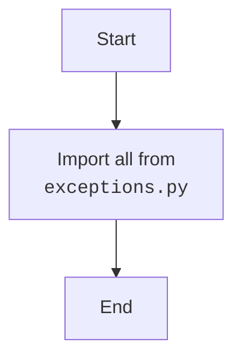

## АНАЛИЗ КОДА: `src/suppliers/aliexpress/api/errors/__init__.py`

### <алгоритм>

1.  **Импорт из `exceptions.py`**:  Модуль `__init__.py` импортирует все (`*`) имена (классы, функции, переменные) из модуля `exceptions.py`, расположенного в той же директории.
    *   **Пример**: Если `exceptions.py` содержит классы `AliExpressAPIError`, `InvalidResponseError`, и `RequestTimeoutError`, то после импорта они будут доступны напрямую через `src.suppliers.aliexpress.api.errors.AliExpressAPIError`, `src.suppliers.aliexpress.api.errors.InvalidResponseError`, и `src.suppliers.aliexpress.api.errors.RequestTimeoutError`.

### <mermaid>

**Анализ `mermaid`:**

*   `Start`: Начало процесса.
*   `ImportExceptions`: Операция импорта всех имен из `exceptions.py`.
*   `End`: Конец процесса.

**Объяснение зависимостей:**
Диаграмма показывает, что модуль `__init__.py` импортирует все содержимое из модуля `exceptions.py`, делая его доступным в пакете `src.suppliers.aliexpress.api.errors`.

### <объяснение>

**Импорты:**

*   `from .exceptions import *`:
    *   `.` (точка) означает, что `exceptions.py` находится в той же директории, что и `__init__.py`.
    *   `*` означает импорт всех имен (классов, функций, переменных), определённых в `exceptions.py`.
    *   **Назначение**: Этот импорт позволяет использовать классы ошибок, определённые в `exceptions.py`, в любом месте, где импортирован пакет `src.suppliers.aliexpress.api.errors`, например, так: `from src.suppliers.aliexpress.api import errors`.
    *   **Взаимосвязь**: Этот импорт связывает пакет `errors` с его модулем `exceptions.py`, который должен содержать определения классов исключений для данного API.

**Классы, Функции, Переменные:**

*   В текущем файле нет классов, функций или переменных. Весь функционал делегирован модулю `exceptions.py`, и  `__init__.py` выполняет роль агрегатора, экспортирующего содержимое этого модуля.

**Общая функциональность:**

*   Файл `__init__.py` в пакете `errors` является стандарным файлом, для Python, который делает модули пакета `errors` доступными для импорта. В данном случае, `__init__.py` обеспечивает, что все исключения, определённые в `exceptions.py`, могут быть импортированы и использованы напрямую через пакет `src.suppliers.aliexpress.api.errors`.

**Потенциальные ошибки или области для улучшения:**

*   **Импорт `*`**: Использование `import *` может привести к конфликтам имен, если в `exceptions.py` есть имена, которые совпадают с именами в других модулях. Однако, так как этот файл - `__init__.py`, он предназначен для упрощения импорта из пакета и это стандартная практика.
*   **Отсутствие документации**: Отсутствие документации в `__init__.py` и `exceptions.py` может затруднить понимание кода и его использование другими разработчиками.
*   **Необходимость анализа `exceptions.py`**:  Для полного понимания функциональности необходимо проанализировать содержимое `exceptions.py`, так как  `__init__.py` только экспортирует его содержимое.

**Цепочка взаимосвязей с другими частями проекта:**
* Этот модуль (`errors`) является частью API для AliExpress, поэтому он используется в других частях проекта, которые взаимодействуют с этим API. Например, в модулях, которые делают запросы к API AliExpress и обрабатывают ответы.
* Пакет `src.suppliers.aliexpress.api` использует этот модуль для обработки ошибок, связанных с AliExpress API.
*  Другие модули в рамках пакета `src.suppliers.aliexpress` также могут использовать этот модуль для обработки ошибок.