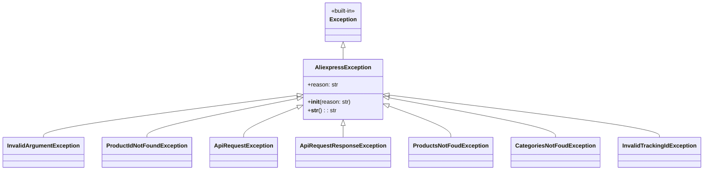

## <алгоритм>

1.  **Начало**: Код определяет базовый класс исключений `AliexpressException`, который наследуется от стандартного класса `Exception`. Этот класс служит основой для всех пользовательских исключений, связанных с AliExpress API.

    *   _Пример_: `class AliexpressException(Exception):` - определяет базовый класс исключений.
2.  **Инициализация `AliexpressException`**: Метод `__init__` класса `AliexpressException` принимает строку `reason`, которая описывает причину исключения. Эта причина сохраняется в атрибуте `self.reason`.

    *   _Пример_: `def __init__(self, reason: str):` - инициализирует объект исключения.
3.  **Строковое представление `AliexpressException`**: Метод `__str__` класса `AliexpressException` возвращает строку, содержащую причину исключения.

    *   _Пример_: `def __str__(self) -> str: return '%s' % self.reason` - преобразует объект исключения в строку.
4.  **Создание производных классов исключений**: Определяются несколько классов исключений, таких как `InvalidArgumentException`, `ProductIdNotFoundException` и другие, которые наследуют от `AliexpressException`. Эти классы представляют конкретные типы ошибок, которые могут возникнуть при работе с AliExpress API.

    *   _Пример_: `class InvalidArgumentException(AliexpressException): pass` - определяет исключение для некорректных аргументов.
5.  **Генерация исключений**: В других частях проекта, при возникновении ошибок, связанных с API AliExpress, будут создаваться экземпляры этих классов исключений. При создании экземпляра в конструктор передается строка с описанием ошибки.

    *   _Пример_: `raise InvalidArgumentException("Product ID must be a number")` - генерирует исключение о некорректном ID продукта.
6.  **Обработка исключений**: Исключения будут перехвачены в блоках `try...except` в вызывающем коде, что позволит обрабатывать ошибки и предотвращать аварийное завершение программы.

    *   _Пример_:
        ```python
        try:
            # код, который может вызвать исключение
            raise InvalidArgumentException("Invalid input data.")
        except InvalidArgumentException as e:
            print(f"Caught exception: {e}")
        ```
7.  **Завершение**: Код завершает описание всех пользовательских исключений.

## <mermaid>



**Объяснение зависимостей в mermaid:**

1.  **`AliexpressException`**: Базовый класс исключений, который наследует от встроенного класса `Exception`. Он содержит атрибут `reason` для хранения причины ошибки и методы `__init__` для инициализации и `__str__` для строкового представления.
2.  **`InvalidArgumentException`**, **`ProductIdNotFoundException`**, **`ApiRequestException`**, **`ApiRequestResponseException`**, **`ProductsNotFoudException`**, **`CategoriesNotFoudException`**, **`InvalidTrackingIdException`**:  Это производные классы, которые наследуются от `AliexpressException`. Они представляют конкретные типы ошибок, которые могут возникнуть при взаимодействии с AliExpress API. Эти классы не добавляют новых атрибутов или методов, но представляют разные типы ошибок в иерархии исключений.
3.  **`Exception`**: Встроенный класс, от которого наследуется `AliexpressException`. Это базовый класс для всех исключений в Python.

## <объяснение>

**Импорты:**

*   В данном коде нет явных импортов, кроме неявного импорта встроенного класса `Exception`. Это означает, что данный модуль `exceptions.py` не зависит от других модулей, помимо стандартных для Python.

**Классы:**

*   **`AliexpressException`**:
    *   **Роль**: Базовый класс для всех пользовательских исключений, связанных с AliExpress API.
    *   **Атрибуты**:
        *   `reason` (str): Строка, содержащая причину исключения.
    *   **Методы**:
        *   `__init__(self, reason: str)`: Конструктор класса, инициализирует атрибут `reason`.
        *   `__str__(self) -> str`: Метод, возвращающий строковое представление исключения (причину).
    *   **Взаимодействие**: Служит родителем для всех остальных классов исключений в этом файле.
*   **`InvalidArgumentException`**:
    *   **Роль**: Исключение, которое выбрасывается, когда аргументы, переданные API, некорректны.
    *   **Атрибуты**: Нет дополнительных атрибутов.
    *   **Методы**: Нет дополнительных методов.
    *   **Взаимодействие**: Наследует от `AliexpressException`.
*   **`ProductIdNotFoundException`**:
    *   **Роль**: Исключение, которое выбрасывается, когда продукт с указанным ID не найден.
    *   **Атрибуты**: Нет дополнительных атрибутов.
    *   **Методы**: Нет дополнительных методов.
    *   **Взаимодействие**: Наследует от `AliexpressException`.
*   **`ApiRequestException`**:
    *   **Роль**: Исключение, которое выбрасывается, если запрос к AliExpress API не удался.
    *   **Атрибуты**: Нет дополнительных атрибутов.
    *   **Методы**: Нет дополнительных методов.
    *   **Взаимодействие**: Наследует от `AliexpressException`.
*   **`ApiRequestResponseException`**:
    *   **Роль**: Исключение, которое выбрасывается, если ответ от AliExpress API недействителен.
    *   **Атрибуты**: Нет дополнительных атрибутов.
    *   **Методы**: Нет дополнительных методов.
    *   **Взаимодействие**: Наследует от `AliexpressException`.
*   **`ProductsNotFoudException`**:
    *   **Роль**: Исключение, которое выбрасывается, если продукты не найдены.
    *   **Атрибуты**: Нет дополнительных атрибутов.
    *   **Методы**: Нет дополнительных методов.
    *   **Взаимодействие**: Наследует от `AliexpressException`.
*   **`CategoriesNotFoudException`**:
    *   **Роль**: Исключение, которое выбрасывается, если категории не найдены.
    *   **Атрибуты**: Нет дополнительных атрибутов.
    *   **Методы**: Нет дополнительных методов.
    *   **Взаимодействие**: Наследует от `AliexpressException`.
*   **`InvalidTrackingIdException`**:
    *   **Роль**: Исключение, которое выбрасывается, если идентификатор отслеживания недействителен.
    *   **Атрибуты**: Нет дополнительных атрибутов.
    *   **Методы**: Нет дополнительных методов.
    *   **Взаимодействие**: Наследует от `AliexpressException`.

**Функции:**

*   В данном коде есть только два метода внутри класса `AliexpressException`: `__init__` (конструктор) и `__str__` (преобразование в строку).

    *   `__init__(self, reason: str)`:
        *   **Аргументы**:
            *   `self`: Ссылка на экземпляр объекта.
            *   `reason`: Строка, содержащая причину исключения.
        *   **Возвращаемое значение**: None.
        *   **Назначение**: Инициализирует атрибут `reason` у экземпляра класса.
        *   **Пример**: `AliexpressException("API request failed")`
    *   `__str__(self) -> str`:
        *   **Аргументы**: `self`: Ссылка на экземпляр объекта.
        *   **Возвращаемое значение**: Строка, содержащая значение атрибута `reason`.
        *   **Назначение**: Преобразует объект исключения в строку для удобного вывода.
        *   **Пример**: `str(AliexpressException("Invalid argument"))`

**Переменные:**

*   `reason`:
    *   **Тип**: `str`
    *   **Использование**: Атрибут класса `AliexpressException`, в котором хранится причина возникновения исключения.

**Потенциальные ошибки и области для улучшения:**

1.  **Отсутствие конкретики**: Все производные классы исключений (например, `InvalidArgumentException`, `ProductIdNotFoundException`) не имеют собственных атрибутов или методов и, по сути, являются просто "маркерами" разных видов ошибок. Можно было бы добавить дополнительные атрибуты (например, `invalid_value` или `product_id`) для более детального описания ошибки.
2.  **Недостаточно детализированные сообщения об ошибках**: Все исключения используют только `reason` как текст ошибки. Можно было бы добавить больше контекста и форматирования в сообщения об ошибках.
3.  **Нет перехвата ошибок в коде**: Данный код не содержит блока `try/except`.  Перехват и обработка исключений должна производиться в вызывающем коде.

**Взаимосвязь с другими частями проекта:**

*   Данный модуль предназначен для использования в модулях, которые взаимодействуют с AliExpress API. Исключения, определенные в этом модуле, должны вызываться в случае возникновения ошибок при выполнении API-запросов или обработке результатов. Например, при валидации входных данных, получении ответа от API или обработке данных, полученных от API.
*   Взаимодействие:
    *   **Вызов исключений**: Другие модули в проекте (`src.suppliers.aliexpress.api.*`) будут создавать экземпляры этих исключений (`raise InvalidArgumentException(...)`) при обнаружении ошибок.
    *   **Обработка исключений**: Модули, вызывающие код, который может привести к генерации этих исключений, будут использовать блоки `try...except` для перехвата и обработки исключений.
*   Этот модуль является важной частью обработки ошибок в модуле `src.suppliers.aliexpress.api`. Он обеспечивает структурированный подход к обработке ошибок, упрощая отладку и поддержание кода.