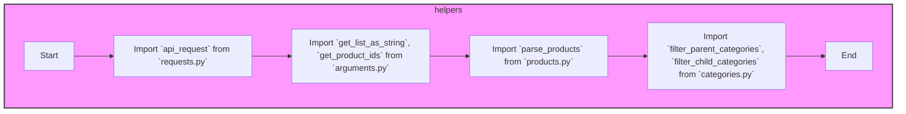

## Анализ кода `hypotez/src/suppliers/aliexpress/api/helpers/__init__.py`

### 1. <алгоритм>

**Общая цель:** Модуль `__init__.py` в `src.suppliers.aliexpress.api.helpers` выступает как точка входа (entry point) для пакета `helpers`. Он импортирует и перенаправляет функции и классы из других модулей в пакете, позволяя другим частям проекта удобно взаимодействовать с функциональностью `helpers`.

1.  **Импорт `api_request`:**
    *   Импортируется функция `api_request` из `requests.py`.
    *   `api_request` вероятно, отвечает за выполнение HTTP запросов к API AliExpress.
    *   **Пример:** `response = api_request(url, params)` - отправляет запрос по URL с заданными параметрами и возвращает ответ.

2.  **Импорт `get_list_as_string` и `get_product_ids`:**
    *   Импортируются функции `get_list_as_string` и `get_product_ids` из `arguments.py`.
    *   `get_list_as_string` может преобразовывать список в строку, подходящую для передачи в запросе API.
    *   `get_product_ids` может извлекать идентификаторы продуктов из различных входных форматов.
    *   **Пример:** `product_string = get_list_as_string([123, 456, 789])` - возвращает строку "123,456,789".
    *   **Пример:** `ids = get_product_ids(data)` - извлекает ID продуктов из данных.

3.  **Импорт `parse_products`:**
    *   Импортируется функция `parse_products` из `products.py`.
    *   `parse_products` вероятно, занимается обработкой данных о продуктах, полученных от API.
    *   **Пример:** `products = parse_products(raw_data)` - обрабатывает сырые данные и возвращает список продуктов в удобном формате.

4.  **Импорт `filter_parent_categories` и `filter_child_categories`:**
    *   Импортируются функции `filter_parent_categories` и `filter_child_categories` из `categories.py`.
    *   Эти функции, вероятно, предназначены для фильтрации иерархии категорий AliExpress (родительские и дочерние).
    *   **Пример:** `filtered_parents = filter_parent_categories(categories)` - возвращает только родительские категории из списка.
    *   **Пример:** `filtered_children = filter_child_categories(categories)` - возвращает только дочерние категории из списка.

### 2. <mermaid>



**Объяснение `mermaid`:**

*   Диаграмма `flowchart TD` представляет собой блок-схему, описывающую процесс импорта в модуле `__init__.py`.
*   `Start` и `End` обозначают начало и конец процесса импорта соответственно.
*   `Import_api_request`, `Import_arguments`, `Import_parse_products`, `Import_categories` представляют собой узлы, соответствующие импортам из `requests.py`, `arguments.py`, `products.py` и `categories.py` соответственно.
*   Стрелки показывают последовательность импортов.
*   `subgraph helpers` показывает, что все узлы относятся к пакету `helpers`.
*   Стиль `helpers` задаёт фон и границы для блока.
    

### 3. <объяснение>

**Импорты:**

*   `from .requests import api_request`: Импортирует функцию `api_request` из модуля `requests.py` в том же пакете. Эта функция, скорее всего, выполняет HTTP-запросы к API AliExpress, абстрагируя детали реализации запросов от других частей кода.
*   `from .arguments import get_list_as_string, get_product_ids`: Импортирует две функции, `get_list_as_string` и `get_product_ids`, из модуля `arguments.py` в том же пакете. `get_list_as_string` вероятно, преобразует список в строку для API-запросов, а `get_product_ids` извлекает ID продуктов из разных форматов входных данных.
*   `from .products import parse_products`: Импортирует функцию `parse_products` из модуля `products.py` в том же пакете. Эта функция, скорее всего, обрабатывает данные о продуктах, полученные в виде JSON от API AliExpress.
*   `from .categories import filter_parent_categories, filter_child_categories`: Импортирует функции `filter_parent_categories` и `filter_child_categories` из модуля `categories.py`. Эти функции, скорее всего, используются для фильтрации категорий AliExpress на родительские и дочерние.

**Цепочка взаимосвязей:**

1.  **Взаимосвязь с API AliExpress:**
    *   `api_request` – взаимодействует с API AliExpress для получения данных.
    *   `get_list_as_string` и `get_product_ids` – подготавливают данные для отправки в API.
    *   `parse_products` – обрабатывает данные, полученные от API, в удобный формат.
    *   `filter_parent_categories`, `filter_child_categories` – обрабатывает категории, полученные от API.

2.  **Взаимодействие с другими частями проекта:**
    *   Другие модули проекта будут импортировать функции из `src.suppliers.aliexpress.api.helpers` для работы с API AliExpress, например:
        ```python
        from src.suppliers.aliexpress.api.helpers import api_request, get_list_as_string, parse_products
        
        # Использование функций в других частях проекта
        ```

**Потенциальные проблемы и улучшения:**

*   **Обработка ошибок:** Код не предоставляет деталей об обработке ошибок при API-запросах или обработке данных. Рекомендуется добавить обработку исключений для `api_request`, `parse_products` и других функций, для того чтобы сделать код более надежным.
*   **Документация:**  Необходимо дополнить каждую функцию docstring, с описанием того, что она принимает, возвращает и делает.
*   **Типизация:** Использование подсказок типов (type hints) может помочь сделать код более понятным и уменьшить количество ошибок.

**Заключение:**

Файл `__init__.py` выступает как агрегатор функций для модуля `helpers`. Он обеспечивает удобный интерфейс для работы с API AliExpress, предоставляя функции для запросов, подготовки данных и обработки ответов.  Для более детального анализа нужно рассматривать каждый файл `requests.py, arguments.py, products.py, categories.py`.