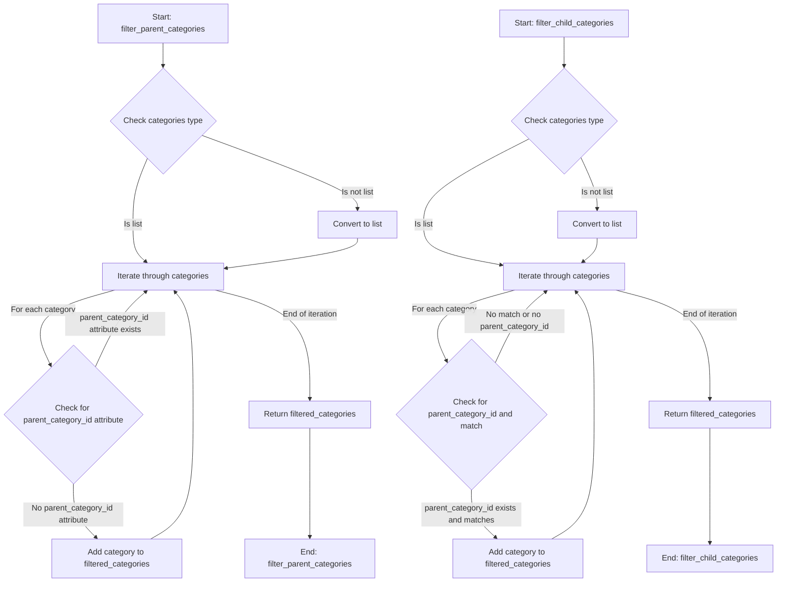

## <алгоритм>

1.  **`filter_parent_categories(categories)`**:
    *   **Вход**: Список объектов категорий (`categories`), которые могут быть либо родительскими (`models.Category`), либо дочерними (`models.ChildCategory`).
    *   **Проверка типа**: Если `categories` не является списком (например, `str`, `int`, `float`), он конвертируется в список, чтобы избежать ошибки при итерации.
    *   **Итерация**: Проходит по каждой `category` в списке `categories`.
    *   **Фильтрация**: Проверяет, имеет ли объект `category` атрибут `parent_category_id`. Если атрибут `parent_category_id` отсутствует, это означает, что категория является родительской, и она добавляется в список `filtered_categories`.
    *   **Возврат**: Возвращает список `filtered_categories`, содержащий только родительские категории.
    *   **Пример**:
        ```python
        # Пример использования filter_parent_categories
        categories = [
            models.Category(id=1, name="Electronics"),
            models.ChildCategory(id=10, name="Laptops", parent_category_id=1),
            models.Category(id=2, name="Fashion")
        ]
        parent_categories = filter_parent_categories(categories)
        # parent_categories будет содержать:
        # [models.Category(id=1, name="Electronics"), models.Category(id=2, name="Fashion")]
        ```

2.  **`filter_child_categories(categories, parent_category_id)`**:
    *   **Вход**: Список объектов категорий (`categories`) и ID родительской категории (`parent_category_id`).
    *   **Проверка типа**: Если `categories` не является списком, он конвертируется в список.
    *   **Итерация**: Проходит по каждой `category` в списке `categories`.
    *   **Фильтрация**: Проверяет, имеет ли `category` атрибут `parent_category_id` и равен ли этот атрибут заданному `parent_category_id`. Если оба условия верны, то `category` добавляется в список `filtered_categories`.
    *   **Возврат**: Возвращает список `filtered_categories`, содержащий только дочерние категории с указанным `parent_category_id`.
    *    **Пример**:
        ```python
        # Пример использования filter_child_categories
        categories = [
            models.Category(id=1, name="Electronics"),
            models.ChildCategory(id=10, name="Laptops", parent_category_id=1),
            models.ChildCategory(id=11, name="Mobiles", parent_category_id=1),
            models.ChildCategory(id=20, name="T-shirts", parent_category_id=2),
        ]
        child_categories = filter_child_categories(categories, parent_category_id=1)
        # child_categories будет содержать:
        # [models.ChildCategory(id=10, name="Laptops", parent_category_id=1), models.ChildCategory(id=11, name="Mobiles", parent_category_id=1)]
        ```

## <mermaid>



## <объяснение>

### Импорты

*   `from typing import List, Union`: Импортирует `List` и `Union` из модуля `typing` для статической типизации.
    *   `List`:  Используется для указания типа данных списка.
    *   `Union`: Используется для указания, что переменная или параметр функции может иметь один из нескольких типов.
*   `from .. import models`: Импортирует модуль `models` из родительского пакета (`..`).
    *   `models`: Предполагается, что этот модуль содержит определения классов `Category` и `ChildCategory`, представляющих структуры данных категорий и подкатегорий, используемых в функциях.

### Функции

1.  **`filter_parent_categories(categories: List[models.Category | models.ChildCategory]) -> List[models.Category]`**
    *   **Аргументы**:
        *   `categories`: Список, содержащий объекты `models.Category` или `models.ChildCategory`. `Union` позволяет списку содержать оба типа.
    *   **Возвращаемое значение**:
        *   `List[models.Category]`: Список объектов `models.Category`, представляющих родительские категории.
    *   **Назначение**:
        *   Фильтрует список категорий и возвращает только те, которые не имеют родительской категории (т.е. являются родительскими). Функция проверяет наличие атрибута `parent_category_id`, чтобы определить, является ли категория родительской.
    *   **Пример**:
        *   Если в функцию передать список, содержащий родительские и дочерние категории, она вернет только список родительских категорий.
        *   Если передается список, содержащий только дочерние категории, функция вернет пустой список.
        *   Если передается не список (например, строка или число), функция обработает это и вернет список, содержащий только этот элемент (если в нем нет `parent_category_id`).

2.  **`filter_child_categories(categories: List[models.Category | models.ChildCategory], parent_category_id: int) -> List[models.ChildCategory]`**
    *   **Аргументы**:
        *   `categories`: Список, содержащий объекты `models.Category` или `models.ChildCategory`.
        *   `parent_category_id`: Целое число, представляющее ID родительской категории.
    *   **Возвращаемое значение**:
        *   `List[models.ChildCategory]`: Список объектов `models.ChildCategory`, представляющих дочерние категории, принадлежащие указанной родительской категории.
    *   **Назначение**:
        *   Фильтрует список категорий и возвращает только те, которые являются дочерними и имеют указанный `parent_category_id`. Функция проверяет наличие атрибута `parent_category_id` и сравнивает его со значением `parent_category_id`.
    *   **Пример**:
        *   Если в функцию передать список, содержащий родительские и дочерние категории, и ID родительской категории, она вернет только дочерние категории, принадлежащие этой родительской.
        *   Если передать список дочерних категорий, которые не соответствуют `parent_category_id`, то функция вернет пустой список.
        *   Если передается не список, функция аналогично преобразует его в список.

### Переменные

*   `categories`: Список объектов категорий (родительских или дочерних).
*   `filtered_categories`: Список, используемый для накопления отфильтрованных категорий.
*   `parent_category_id`: ID родительской категории для фильтрации дочерних категорий.
*   `category`: Переменная цикла, представляющая текущий обрабатываемый объект категории.

### Потенциальные ошибки и области для улучшения

*   **Обработка ошибок**: Функции не обрабатывают исключения, которые могут возникнуть, если объекты категорий не имеют ожидаемых атрибутов (например, `parent_category_id`). Было бы полезно добавить проверку на наличие этого атрибута перед его использованием.
*   **Унификация проверки типов**: Код проверки типа `isinstance(categories, (str, int, float))` повторяется в обеих функциях. Это можно вынести в отдельную функцию.
*   **Типизация**: Можно было бы усилить типизацию, например, используя `typing.TypeVar` для большей гибкости.
*   **Производительность**: Для больших списков категорий, производительность можно улучшить, используя генераторы списков вместо циклов `for`.

### Взаимосвязи с другими частями проекта

*   Модуль `models`: Обе функции напрямую зависят от моделей `Category` и `ChildCategory`, которые, как предполагается, определены в `src.suppliers.aliexpress.api.models`.
*   Предполагается, что данные, возвращаемые этими функциями, будут использоваться в других частях проекта для дальнейшей обработки, например, для отображения категорий на веб-интерфейсе или для выполнения запросов к API.

### Дополнительное объяснение
В коде, представленном выше, есть небольшая неточность, если речь идет о проверке на наличие родительской категории:
*  `if not hasattr(category, 'parent_category_id'):` - данная запись проверяет **отсутствие** атрибута `parent_category_id` и на основании этого делает вывод о том, является ли категория родительской. Но может существовать другая ситуация, когда у родительской категории этот атрибут будет, но он будет иметь значение `None`.
* В связи с этим, было бы правильнее в `filter_parent_categories` проверять именно `if category.parent_category_id is None:`, при этом, подразумевается, что в классе `models.Category` свойство `parent_category_id` по умолчанию имеет значение `None`
```python
def filter_parent_categories(categories: List[models.Category | models.ChildCategory]) -> List[models.Category]:
    """
    Filters and returns a list of categories that do not have a parent category.
    
    @param categories: List of category or child category objects.
    @return: List of category objects without a parent category.
    """
    filtered_categories = []
    
    if isinstance(categories, (str, int, float)):
        categories = [categories]  # Convert to list if a single non-category value is passed.

    for category in categories:
        if getattr(category, 'parent_category_id', None) is None: # Modified condition
            filtered_categories.append(category)

    return filtered_categories
```

```md
## <объяснение>

### Импорты

*   `from typing import List, Union`: Импортирует `List` и `Union` из модуля `typing` для статической типизации.
    *   `List`:  Используется для указания типа данных списка.
    *   `Union`: Используется для указания, что переменная или параметр функции может иметь один из нескольких типов.
*   `from .. import models`: Импортирует модуль `models` из родительского пакета (`..`).
    *   `models`: Предполагается, что этот модуль содержит определения классов `Category` и `ChildCategory`, представляющих структуры данных категорий и подкатегорий, используемых в функциях.

### Функции

1.  **`filter_parent_categories(categories: List[models.Category | models.ChildCategory]) -> List[models.Category]`**
    *   **Аргументы**:
        *   `categories`: Список, содержащий объекты `models.Category` или `models.ChildCategory`. `Union` позволяет списку содержать оба типа.
    *   **Возвращаемое значение**:
        *   `List[models.Category]`: Список объектов `models.Category`, представляющих родительские категории.
    *   **Назначение**:
        *   Фильтрует список категорий и возвращает только те, которые не имеют родительской категории (т.е. являются родительскими). Функция проверяет наличие атрибута `parent_category_id` и его значение `None`, чтобы определить, является ли категория родительской.
    *   **Пример**:
        *   Если в функцию передать список, содержащий родительские и дочерние категории, она вернет только список родительских категорий.
        *   Если передается список, содержащий только дочерние категории, функция вернет пустой список.
        *   Если передается не список (например, строка или число), функция обработает это и вернет список, содержащий только этот элемент (если в нем нет `parent_category_id`).

2.  **`filter_child_categories(categories: List[models.Category | models.ChildCategory], parent_category_id: int) -> List[models.ChildCategory]`**
    *   **Аргументы**:
        *   `categories`: Список, содержащий объекты `models.Category` или `models.ChildCategory`.
        *   `parent_category_id`: Целое число, представляющее ID родительской категории.
    *   **Возвращаемое значение**:
        *   `List[models.ChildCategory]`: Список объектов `models.ChildCategory`, представляющих дочерние категории, принадлежащие указанной родительской категории.
    *   **Назначение**:
        *   Фильтрует список категорий и возвращает только те, которые являются дочерними и имеют указанный `parent_category_id`. Функция проверяет наличие атрибута `parent_category_id` и сравнивает его со значением `parent_category_id`.
    *   **Пример**:
        *   Если в функцию передать список, содержащий родительские и дочерние категории, и ID родительской категории, она вернет только дочерние категории, принадлежащие этой родительской.
        *   Если передать список дочерних категорий, которые не соответствуют `parent_category_id`, то функция вернет пустой список.
        *   Если передается не список, функция аналогично преобразует его в список.

### Переменные

*   `categories`: Список объектов категорий (родительских или дочерних).
*   `filtered_categories`: Список, используемый для накопления отфильтрованных категорий.
*   `parent_category_id`: ID родительской категории для фильтрации дочерних категорий.
*   `category`: Переменная цикла, представляющая текущий обрабатываемый объект категории.

### Потенциальные ошибки и области для улучшения

*   **Обработка ошибок**: Функции не обрабатывают исключения, которые могут возникнуть, если объекты категорий не имеют ожидаемых атрибутов (например, `parent_category_id`). Было бы полезно добавить проверку на наличие этого атрибута перед его использованием.
*   **Унификация проверки типов**: Код проверки типа `isinstance(categories, (str, int, float))` повторяется в обеих функциях. Это можно вынести в отдельную функцию.
*   **Типизация**: Можно было бы усилить типизацию, например, используя `typing.TypeVar` для большей гибкости.
*   **Производительность**: Для больших списков категорий, производительность можно улучшить, используя генераторы списков вместо циклов `for`.

### Взаимосвязи с другими частями проекта

*   Модуль `models`: Обе функции напрямую зависят от моделей `Category` и `ChildCategory`, которые, как предполагается, определены в `src.suppliers.aliexpress.api.models`.
*   Предполагается, что данные, возвращаемые этими функциями, будут использоваться в других частях проекта для дальнейшей обработки, например, для отображения категорий на веб-интерфейсе или для выполнения запросов к API.