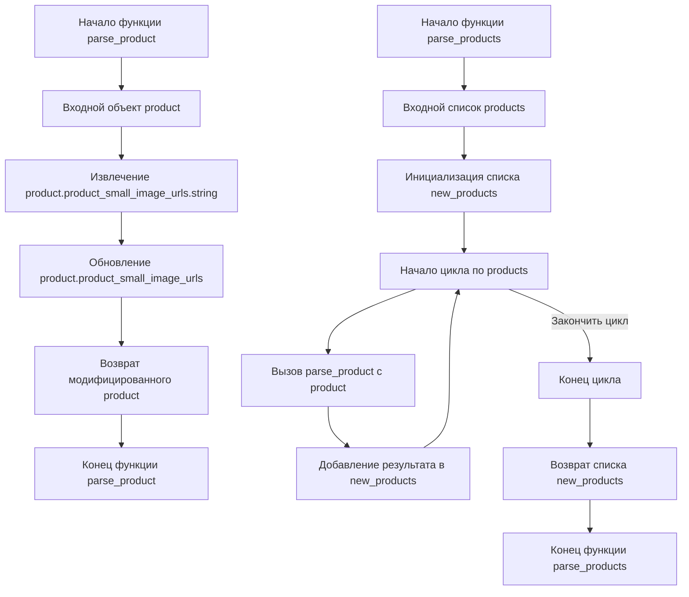

## <алгоритм>

**parse_product(product)**

1. **Начало:** Функция `parse_product` принимает объект `product` в качестве аргумента.
   * _Пример:_ `product` может представлять собой структуру данных, полученную из API Aliexpress, содержащую информацию о конкретном товаре. Например, словарь: `{'product_small_image_urls': {'string': 'url1,url2,url3'}, 'product_title': 'Some product'}`
2. **Извлечение URL изображений:** Извлекается строка с URL-адресами изображений из атрибута `product.product_small_image_urls.string`.
   * _Пример:_ Если `product.product_small_image_urls` это словарь `{'string': 'url1,url2,url3'}`, то `product.product_small_image_urls.string` примет значение `'url1,url2,url3'`.
3. **Обновление атрибута:** Атрибут `product.product_small_image_urls` перезаписывается строкой полученной в предыдущем шаге.
   * _Пример:_ После выполнения этого шага, `product.product_small_image_urls` станет строкой `'url1,url2,url3'` вместо исходного словаря.
4. **Возврат:** Функция возвращает модифицированный объект `product`.
   * _Пример:_ `parse_product` вернет `{'product_small_image_urls': 'url1,url2,url3', 'product_title': 'Some product'}`.

**parse_products(products)**

1. **Начало:** Функция `parse_products` принимает список объектов `products` в качестве аргумента.
   * _Пример:_ `products` может быть списком словарей, где каждый словарь представляет один товар.
2. **Инициализация:** Создается пустой список `new_products` для хранения обработанных товаров.
   * _Пример:_ `new_products` начинается как `[]`
3. **Цикл обработки:** Проходится по каждому объекту `product` в списке `products`.
   * _Пример:_ Для `products`  `[{'product_small_image_urls': {'string': 'url1,url2,url3'}, 'product_title': 'Product 1'}, {'product_small_image_urls': {'string': 'url4,url5'}, 'product_title': 'Product 2'}]` на каждой итерации будет  `product` равно одному из словарей.
4. **Обработка продукта:** Для каждого `product` вызывается функция `parse_product`, которая преобразовывает объект.
   * _Пример:_ Если `product` = `{'product_small_image_urls': {'string': 'url1,url2,url3'}, 'product_title': 'Product 1'}`, то после вызова `parse_product` вернется `{'product_small_image_urls': 'url1,url2,url3', 'product_title': 'Product 1'}`.
5. **Добавление в список:** Возвращаемый из `parse_product` модифицированный `product` добавляется в список `new_products`.
    * _Пример:_ `new_products` теперь будет  `[{'product_small_image_urls': 'url1,url2,url3', 'product_title': 'Product 1'}]` после первой итерации.
6. **Завершение цикла:** Цикл продолжается пока не будут обработаны все продукты.
7. **Возврат:** Функция возвращает список `new_products`, который содержит все преобразованные объекты `product`.
    * _Пример:_ Функция вернет `[{'product_small_image_urls': 'url1,url2,url3', 'product_title': 'Product 1'}, {'product_small_image_urls': 'url4,url5', 'product_title': 'Product 2'}]`.

## <mermaid>

### Объяснение зависимостей в mermaid:

Диаграмма `mermaid`  отображает поток выполнения двух функций: `parse_product` и `parse_products`.
- `parse_product`: 
   - `Input_product` представляет входной объект `product`, над которым производится обработка.
   - `Extract_image_urls` обозначает шаг извлечения строки с URL-адресами изображений из объекта `product`.
   - `Update_attribute` показывает процесс обновления атрибута `product.product_small_image_urls` извлеченной строкой.
   - `Return_product` показывает возвращение измененного объекта `product`.
- `parse_products`:
  - `Input_products`  представляет входной список объектов `product`.
  - `Initialize_new_products` показывает создание пустого списка для хранения преобразованных продуктов.
  - `Loop_start` и `Loop_end` обозначают начало и конец цикла обработки продуктов.
  - `Call_parse_product`  показывает вызов функции `parse_product` для каждого продукта.
  - `Append_to_new_products` показывает добавление обработанного объекта в список `new_products`.
  - `Return_new_products` показывает возвращение списка обработанных продуктов.
Таким образом диаграмма наглядно показывает последовательность и взаимодействие функций в коде.

## <объяснение>

### Импорты:
В данном коде отсутствуют импорты. Это означает, что код является самодостаточным и не зависит от других модулей.

### Функции:

**1. `parse_product(product)`**
   - **Аргументы:**
     - `product`: Объект, содержащий данные о продукте, включая вложенный словарь `product_small_image_urls` с ключом `string`, содержащим строку URL изображений.
   - **Возвращаемое значение:** Модифицированный объект `product`, в котором `product.product_small_image_urls` теперь является строкой URL, а не словарем.
   - **Назначение:**
     -  Извлекает строку URL-адресов из вложенного атрибута `product.product_small_image_urls.string` и перезаписывает ее в `product.product_small_image_urls`.
   - **Примеры:**
     -  **Вход:** `product = {'product_small_image_urls': {'string': 'url1,url2,url3'}, 'title': 'Some product'}`.
     -  **Выход:** `{'product_small_image_urls': 'url1,url2,url3', 'title': 'Some product'}`.

**2. `parse_products(products)`**
   - **Аргументы:**
     - `products`: Список объектов `product`, каждый из которых представляет собой товар.
   - **Возвращаемое значение:** Список модифицированных объектов `product`, полученных после обработки каждого элемента входного списка функцией `parse_product`.
   - **Назначение:**
     - Обрабатывает список товаров, вызывая для каждого товара функцию `parse_product` и собирает результаты в новый список.
   - **Примеры:**
     - **Вход:** `products = [{'product_small_image_urls': {'string': 'url1'}, 'title': 'prod1'}, {'product_small_image_urls': {'string': 'url2'}, 'title': 'prod2'}]`.
     - **Выход:** `[{'product_small_image_urls': 'url1', 'title': 'prod1'}, {'product_small_image_urls': 'url2', 'title': 'prod2'}]`.

### Переменные:

- `new_products`: Список, используемый в `parse_products` для хранения результатов обработки объектов `product`. Тип: список (list).
- `product`:  Переменная, представляющая отдельный товар при итерации по списку `products`. Тип: словарь (dict) внутри списка в `parse_products`, и объект в `parse_product`.

### Потенциальные ошибки и области для улучшения:

1. **Отсутствие проверок:** Код предполагает, что структура входных данных всегда будет соответствовать ожидаемой. Отсутствуют проверки на наличие необходимых ключей в словарях и типа данных.
   - _Улучшение:_ Добавить проверки типа `if` и `try-except` блоки для обработки ситуаций, когда ключа `string` не существует в `product.product_small_image_urls`.
2. **Обработка ошибок:** Если `product.product_small_image_urls` не является словарем или если нет ключа `string`, код вызовет ошибку.
    - _Улучшение:_  Добавить обработку ошибок, чтобы код был более устойчивым.
3.  **Неэффективная работа со строками**: Если в строке `product.product_small_image_urls.string` содержится несколько URL-адресов через запятую, они обрабатываются как одна строка.
    - _Улучшение:_ Можно добавить логику для разделения строки на список URL.
4. **Название переменных**: Можно использовать более осмысленные имена переменных, например, `product_image_urls_string` вместо `product.product_small_image_urls.string`.
5. **Функциональность**:  Функции `parse_product` и `parse_products` преобразовывают только url-адреса, в то время как они могли бы выполнять и другие преобразования.
   - _Улучшение:_ Можно модифицировать функции так чтобы они производили и другие необходимые операции обработки данных.

### Цепочка взаимосвязей с другими частями проекта:

1. **Источники данных:** Данный код, скорее всего, используется для обработки данных о товарах, полученных из API Aliexpress.
2. **Дальнейшая обработка:** Результат работы функций, скорее всего, будет использоваться другими частями проекта для отображения данных, фильтрации или сохранения в базе данных.
3. **API взаимодействие:** Код является частью API-клиента для Aliexpress и зависит от формата данных, возвращаемого API.

В целом, код выполняет поставленную задачу по преобразованию данных, но требует доработки в части обработки ошибок и универсальности, а также добавления проверок входящих данных.