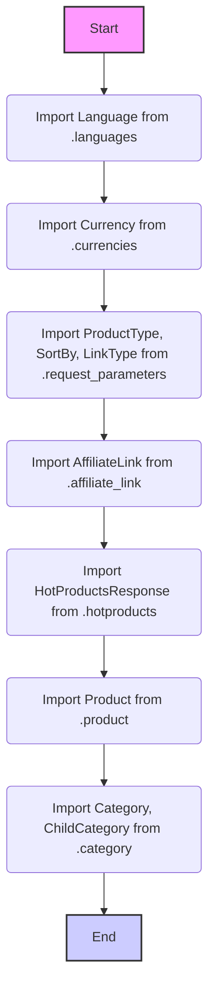
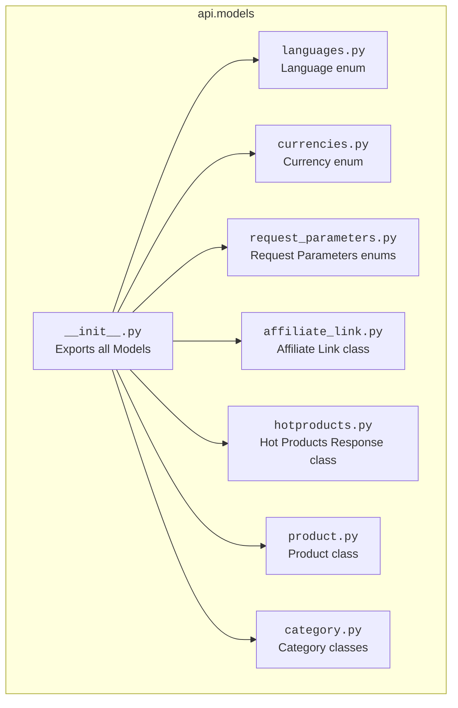

## АНАЛИЗ КОДА: `src/suppliers/aliexpress/api/models/__init__.py`

### 1. <алгоритм>

**Блок-схема:**

**Примеры для каждого логического блока:**

1.  **`Import Language from .languages`**: Импортирует класс `Language`, который может содержать информацию о доступных языках. Пример: `Language.EN`, `Language.RU`.
2.  **`Import Currency from .currencies`**: Импортирует класс `Currency`, который может представлять доступные валюты. Пример: `Currency.USD`, `Currency.EUR`.
3.  **`Import ProductType, SortBy, LinkType from .request_parameters`**: Импортирует перечисления, используемые для формирования запросов к API.
    *   `ProductType`: `ProductType.BEST_SELLING`, `ProductType.NEW`.
    *   `SortBy`: `SortBy.PRICE_ASC`, `SortBy.ORDERS_DESC`.
    *   `LinkType`: `LinkType.AFFILIATE`, `LinkType.DIRECT`.
4.  **`Import AffiliateLink from .affiliate_link`**: Импортирует класс, используемый для формирования аффилиатских ссылок. Пример: `AffiliateLink(product_id=123, promotion_id=456)`.
5.  **`Import HotProductsResponse from .hotproducts`**: Импортирует класс для представления ответа API с горячими товарами. Пример: `HotProductsResponse(products=[Product(...), Product(...)])`.
6.  **`Import Product from .product`**: Импортирует класс, который представляет информацию о товаре. Пример: `Product(id=123, name="Test Product", price=10.0)`.
7.  **`Import Category, ChildCategory from .category`**: Импортирует классы, которые представляют категории и подкатегории товаров.
    *   `Category(id=1, name="Electronics")`
    *   `ChildCategory(id=2, name="Smartphones", parent_id=1)`.

### 2. <mermaid>

**Объяснение зависимостей:**

*   `__init__.py` импортирует классы и перечисления из других модулей (`languages.py`, `currencies.py`, `request_parameters.py`, `affiliate_link.py`, `hotproducts.py`, `product.py`, `category.py`) в рамках пакета `src.suppliers.aliexpress.api.models`. Это позволяет использовать эти модели напрямую через импорт пакета, например `from src.suppliers.aliexpress.api.models import Product, Currency`.
*   Каждый из импортированных модулей (например, `languages.py`) определяет собственные классы или перечисления, которые представляют конкретные типы данных (языки, валюты, параметры запроса и т.д.) в контексте работы с API AliExpress.
*  `__init__.py` действует как точка входа для доступа к моделям данных, предоставляя их в одном месте для удобства использования в других частях проекта.

### 3. <объяснение>

**Импорты:**

*   **`from .languages import Language`**: Импортирует класс `Language` из модуля `languages.py`, который находится в той же директории, что и `__init__.py`.  Этот класс, вероятно, является перечислением (enum) или классом, содержащим константы, представляющие доступные языки для API.
*   **`from .currencies import Currency`**: Импортирует класс `Currency` из модуля `currencies.py`.  Аналогично `Language`, класс `Currency`, скорее всего, является перечислением или классом, предоставляющим константы для доступных валют.
*   **`from .request_parameters import ProductType, SortBy, LinkType`**: Импортирует несколько перечислений (или классов) из `request_parameters.py`.  Эти перечисления, вероятно, представляют типы продуктов, способы сортировки и типы ссылок, используемые при запросах к API AliExpress.
*   **`from .affiliate_link import AffiliateLink`**: Импортирует класс `AffiliateLink` из `affiliate_link.py`.  Этот класс, скорее всего, предназначен для создания и управления аффилиатскими ссылками.
*   **`from .hotproducts import HotProductsResponse`**: Импортирует класс `HotProductsResponse` из `hotproducts.py`.  Этот класс представляет структуру ответа API, который содержит информацию о "горячих" товарах.
*   **`from .product import Product`**: Импортирует класс `Product` из `product.py`. Этот класс представляет структуру данных товара, полученного от API.
*   **`from .category import Category, ChildCategory`**: Импортирует классы `Category` и `ChildCategory` из `category.py`. Эти классы представляют категории товаров и их подкатегории, что также являются частью структуры данных.

**Классы:**

*   `Language`, `Currency`, `ProductType`, `SortBy`, `LinkType`, `AffiliateLink`, `HotProductsResponse`, `Product`, `Category`, `ChildCategory`: Все эти импортированные элементы являются классами, которые представляют различные сущности или типы данных, используемые при взаимодействии с API AliExpress. Конкретные реализации этих классов не видны из этого файла, но по именам можно понять их назначение.

**Функции:**

*   В этом файле нет явных функций. Он используется для импорта и экспорта классов и констант для упрощения доступа к ним из других частей проекта.

**Переменные:**

*   В этом файле нет объявленных переменных, только импорты.

**Цепочка взаимосвязей:**

*   Этот `__init__.py` файл служит центральной точкой для доступа ко всем моделям данных AliExpress API. Другие части проекта (например, сервисы для работы с API или представления данных) могут импортировать эти модели для представления запросов и ответов.
*   `__init__.py`  создает своего рода фасад, который скрывает сложность структуры проекта и предоставляет удобный способ использования классов через один импорт (например, `from src.suppliers.aliexpress.api.models import Product`).

**Потенциальные ошибки и области для улучшения:**

*   Код не имеет явных ошибок. Однако, при развитии проекта стоит обратить внимание на потенциальные конфликты имен, если в будущем будет добавляться больше моделей.
*   Стоит рассмотреть возможность добавления docstrings к классам и модулям, что облегчит понимание их назначения.
*   В `__init__.py`  может быть добавлено `__all__` для явного указания экспортируемых элементов, что может повысить читаемость.

В целом, код является хорошим примером организации моделей данных для API. Он хорошо структурирован и упрощает использование моделей в других частях проекта.