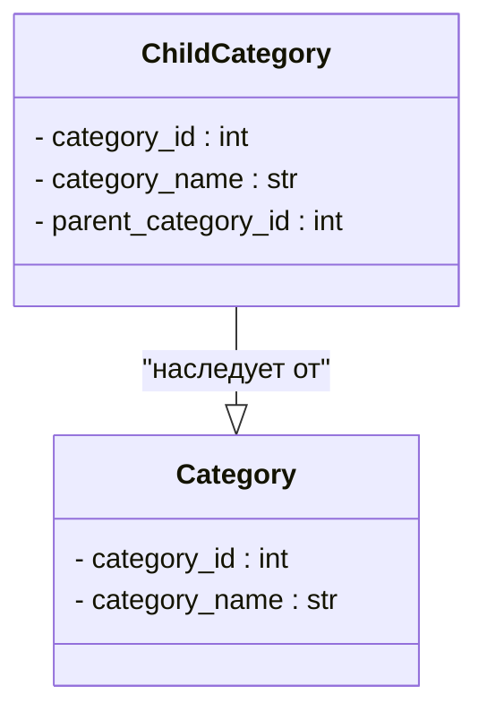

```MD
# Анализ кода файла hypotez/src/suppliers/aliexpress/api/models/category.py

## <input code>

```python
# -*- coding: utf-8 -*-
 # <- venv win
## ~~~~~~~~~~~~
""" module: src.suppliers.aliexpress.api.models """
class Category:
    category_id: int
    category_name: str


class ChildCategory(Category):
    parent_category_id: int
```

## <algorithm>

**Шаг 1:** Определение класса `Category`.
* Этот класс определяет базовый шаблон для представления категорий.
* Он содержит два атрибута: `category_id` (целое число) и `category_name` (строка).
* Пример: `Category(category_id=1, category_name="Электроника")`

**Шаг 2:** Определение класса `ChildCategory`.
* Этот класс наследуется от класса `Category`, добавляя к нему дополнительный атрибут `parent_category_id` (целое число).
* Этот атрибут идентифицирует родительскую категорию.
* Пример: `ChildCategory(category_id=2, category_name="Телефоны", parent_category_id=1)`


## <mermaid>



## <explanation>

**Импорты:**

Файл не содержит импортов. Отсутствуют импорты из других модулей.

**Классы:**

* **`Category`**: Представляет основную категорию. Он определяет общие характеристики для категорий, такие как идентификатор и название.
* **`ChildCategory`**: Представляет дочернюю категорию.  Наследуется от `Category`, что означает, что `ChildCategory` имеет все атрибуты `Category`, а также имеет дополнительный атрибут `parent_category_id`, который указывает на родительскую категорию.  Это позволяет структурировать данные в иерархическом порядке.

**Функции:**

В данном файле нет функций.  Все логика основана на определении классов.

**Переменные:**

В коде используются только атрибуты классов.

**Возможные ошибки или области для улучшений:**

* **Отсутствует валидация данных**: Нет проверок на корректность значений `category_id`, `category_name` и `parent_category_id`.  Например, `category_id` должен быть положительным числом, `category_name` — не пустой строкой, `parent_category_id` должен существовать в базе данных.  Это потенциальная ошибка, которая может привести к проблемам в работе приложения.

* **Отсутствие методов**:  Классы не содержат методов, которые позволяли бы манипулировать данными категории. Например, `get_category_by_id`, `add_category`.

* **Отсутствие связей с другими частями проекта**: Нет информации о том, как эти классы будут использоваться в других частях проекта (например, для хранения данных в базе данных или обработки запросов).  Эта информация необходима для более глубокого анализа.

**Цепочка взаимосвязей:**

Этот код, скорее всего, является частью большего проекта, связанного с API для магазина (например, AliExpress).  В дальнейших этапах разработки должны быть созданы классы для обработки данных,  возможно, с использованием ORM (Object-Relational Mapper) для взаимодействия с базой данных и другими классами, обрабатывающими запросы к API AliExpress.  Таким образом, данные из API должны будут обработаны, преобразованны и помещены в структуру данных `Category` и `ChildCategory`.


**Заключение:**

Код представляет собой базовые определения классов для хранения данных о категориях.  Он нуждается в расширении методами, валидацией и интеграцией с другими частями проекта.