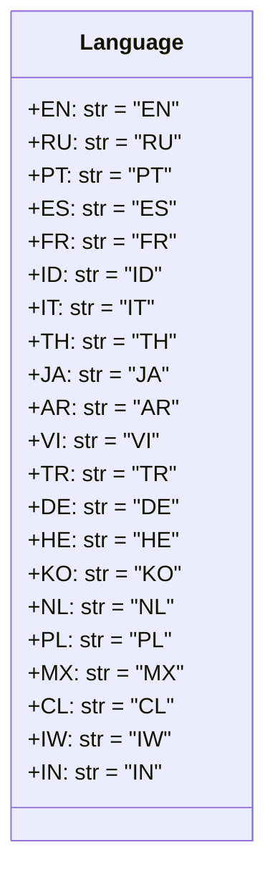

## АНАЛИЗ КОДА

### <алгоритм>

1.  **Определение класса `Language`:**
    *   Начинается определение класса `Language`.
    *   Этот класс предназначен для хранения констант, представляющих языковые коды.
2.  **Определение констант:**
    *   Внутри класса `Language` определяются статические константы, представляющие языковые коды, такие как `EN` (английский), `RU` (русский), `PT` (португальский) и другие.
    *   Каждая константа инициализируется строковым значением, соответствующим коду языка (например, `EN = 'EN'`).
    *   Примеры констант:
        *   `EN = 'EN'`: Английский язык.
        *   `RU = 'RU'`: Русский язык.
        *   `ES = 'ES'`: Испанский язык.
        *   `FR = 'FR'`: Французский язык.
        *   `ID = 'ID'`: Индонезийский язык.
    *   Данный набор констант представляет все поддерживаемые языки.
    
### <mermaid>

**Объяснение `mermaid` диаграммы:**

*   `classDiagram`: Указывает, что это диаграмма классов.
*   `class Language`: Определяет класс с именем `Language`.
*   Внутри класса `Language` перечислены атрибуты, представляющие языковые коды:
    *   `+EN: str = "EN"`: Атрибут `EN` (английский), типа `str`, со значением `"EN"`.
    *   Аналогично определены атрибуты для всех остальных языков, такие как `RU`, `PT`, `ES`, `FR`, `ID`, `IT`, `TH`, `JA`, `AR`, `VI`, `TR`, `DE`, `HE`, `KO`, `NL`, `PL`, `MX`, `CL`, `IW`, `IN`.
    *   `+`: Указывает, что атрибуты публичные (доступны извне класса).

### <объяснение>

**Импорты:**

*   В предоставленном коде нет явных импортов. Это говорит о том, что класс `Language` не зависит от внешних модулей.

**Классы:**

*   `class Language`:
    *   **Роль:** Класс `Language` является контейнером для констант, представляющих языковые коды. Он обеспечивает централизованное место для хранения и использования кодов языков, что способствует консистентности и удобству использования в проекте.
    *   **Атрибуты:** Все атрибуты класса являются статическими константами, которые представляют коды языков. Каждый атрибут является строкой (str) и имеет значение, соответствующее коду языка.
    *   **Методы:** Класс не имеет методов, так как его основная цель — предоставление констант.
    *   **Взаимодействие:** Этот класс предназначен для использования в других частях проекта, где необходимо работать с кодами языков. Он предоставляется как способ получить доступ к кодам языков (например, `Language.EN` для английского).

**Функции:**

*   В данном коде нет функций. Класс `Language` содержит только статические переменные (константы).

**Переменные:**

*   `EN`, `RU`, `PT`, `ES`, `FR`, `ID`, `IT`, `TH`, `JA`, `AR`, `VI`, `TR`, `DE`, `HE`, `KO`, `NL`, `PL`, `MX`, `CL`, `IW`, `IN`:
    *   **Тип:** Все эти переменные являются строками (`str`).
    *   **Использование:** Они представляют собой константы, которые содержат языковые коды, используемые для идентификации языков.

**Потенциальные ошибки и области для улучшения:**

*   **Обновление кодов:** Если AliExpress добавит или изменит языковые коды, потребуется вручную обновить этот класс. Это может привести к ошибкам, если не поддерживать класс актуальным. Можно улучшить это, вынеся все языковые коды в отдельный конфигурационный файл или базу данных.
*   **Типизация:** Можно добавить `Literal` type hints, чтобы явно указать, что значения констант должны быть одним из предопределенных строковых значений.
*   **Расширяемость:** Класс не расширяем, добавить языки можно только модифицируя исходный код, что может усложнить поддержку.

**Цепочка взаимосвязей с другими частями проекта:**

*   Этот класс, вероятно, используется в модулях, связанных с API AliExpress, где необходимо работать с языками, например, при формировании запросов или обработке ответов.
*   Он служит базой для правильного указания языковых настроек при общении с API.

**Дополнительные заметки:**
*   Комментарий `# <- venv win` указывает на среду выполнения кода (скорее всего, Windows).
*   Комментарий `## ~~~~~~~~~~~~~~` является разделителем в файле.
*   Комментарий `""" module: src.suppliers.aliexpress.api.models """`  указывает на местоположение модуля в проекте.

**Заключение:**

Код представляет собой простой класс, содержащий статические константы для языковых кодов. Он обеспечивает централизованное хранение этих кодов, что помогает в поддержании консистентности в рамках проекта. Потенциальные улучшения могут включать обновление кодов и использование `Literal` type hints для более строгой типизации и контроля.