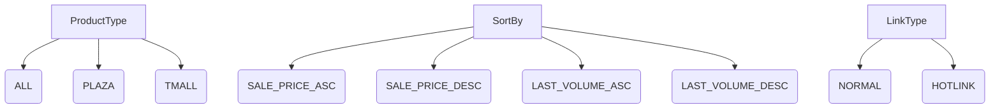
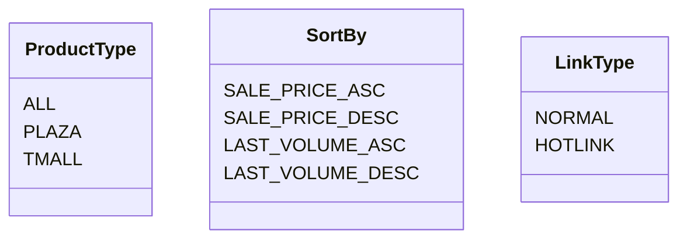

```MD
# Анализ кода файла hypotez/src/suppliers/aliexpress/api/models/request_parameters.py

## <input code>

```python
# -*- coding: utf-8 -*-\
 # <- venv win
## ~~~~~~~~~~~~~\
""" module: src.suppliers.aliexpress.api.models """
class ProductType:
    ALL = 'ALL'
    PLAZA = 'PLAZA'
    TMALL = 'TMALL'

class SortBy:
    SALE_PRICE_ASC = 'SALE_PRICE_ASC'
    SALE_PRICE_DESC = 'SALE_PRICE_DESC'
    LAST_VOLUME_ASC = 'LAST_VOLUME_ASC'
    LAST_VOLUME_DESC = 'LAST_VOLUME_DESC'

class LinkType:
    NORMAL = 0
    HOTLINK = 2
```

## <algorithm>

Этот код определяет три класса, представляющих различные типы параметров запроса к API AliExpress.  Блок-схема простая и состоит из определения констант.  Взаимодействие между классами отсутствует, так как это просто определения типов, которые будут использоваться в других частях проекта. Данные передаются другими частями проекта, которые используют эти классы, для передачи типов данных.



## <mermaid>



## <explanation>

Этот файл определяет набор констант (строковых литералов) для типов параметров запроса к API AliExpress.  Эти константы представляют возможные значения для параметров сортировки, типа продукта и типа ссылки.  Они будут использоваться в других частях проекта `hypotez` для построения и передачи запросов на API.

**Импорты:**

Файл не содержит импортов, поскольку он содержит только определения классов, представляющих типы данных для параметров.

**Классы:**

* **`ProductType`**: Представляет тип продукта, который может быть `ALL`, `PLAZA` или `TMALL`. Используется для фильтрации результатов запроса.
* **`SortBy`**: Представляет возможные критерии сортировки результатов.  Возможные критерии сортировки, например, по цене, популярности.
* **`LinkType`**: Представляет тип ссылки, например, обычная или горячая ссылка.

**Функции:**

Файл не содержит функций, только определения классов.

**Переменные:**

Все переменные в этом файле являются константами (с именем в стиле `CONSTANT_NAME`). Они имеют строковый тип и представляют различные возможные значения для типов параметров запросов к API.

**Возможные ошибки или области для улучшений:**

* **Дополнения:** В данном случае нет места для улучшения. Классы хорошо структурированы для хранения значений констант, относящихся к определенным типам.
* **Использование:**  Этот файл должен быть импортирован в других частях приложения, чтобы использовать эти константы при формировании запросов к API.  Без использования в других частях проекта, он не оказывает никакого влияния на логику приложения.  Важно понимать, что эти классы являются своего рода "инвентаризацией" возможных значений. Они встроены в приложение и будут использоваться в методах запроса к API для корректного формирования запросов.


**Цепочка взаимосвязей:**

Этот файл является частью модуля `aliexpress`, который, скорее всего, взаимодействует с другими частями проекта, ответственными за:
1. Формирование запросов к API AliExpress.
2. Обработку ответов от API AliExpress.
3. Представление данных пользователю.

В конечном счёте, этот файл обеспечивает основу для корректного взаимодействия с API AliExpress внутри проекта `hypotez`.