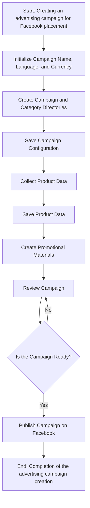
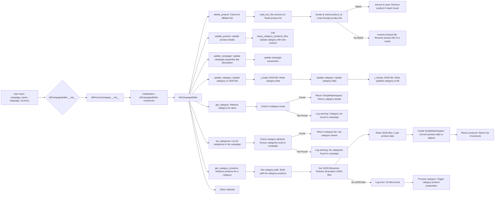
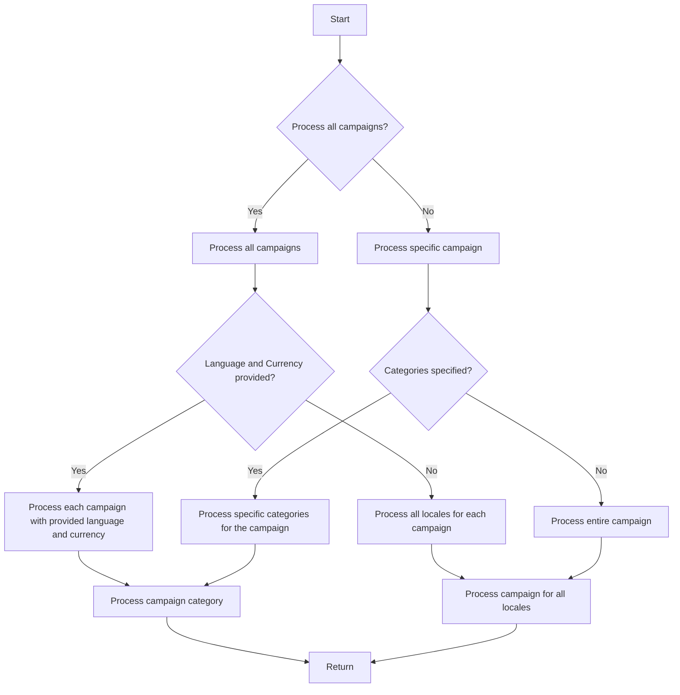

## Анализ кода `campaign`

### 1. <алгоритм>

Модуль `campaign` предназначен для управления процессом создания и публикации рекламных кампаний в Facebook. Он включает в себя функциональность для инициализации параметров кампании, создания структуры каталогов, сохранения конфигураций, сбора и сохранения данных о продуктах, создания рекламных материалов, проверки кампании и ее публикации в Facebook. Кроме того, он обеспечивает функции для редактирования и подготовки кампаний.

**Блок-схема процесса создания рекламной кампании:**

1.  **Начало:** Запускается процесс создания рекламной кампании для размещения в Facebook.
    *   *Пример:* Пользователь инициирует создание новой рекламной кампании в системе.

2.  **Инициализация параметров кампании:** Определяются название, язык и валюта кампании.
    *   *Пример:* `Название: "Летняя распродажа", Язык: "Русский", Валюта: "RUB"`.

3.  **Создание директорий:** Создается структура каталогов для хранения файлов кампании.
    *   *Пример:* Создаются папки `summer_sale/`, `summer_sale/products/`, `summer_sale/promo/`.

4.  **Сохранение конфигурации кампании:** Сохранются параметры кампании (название, язык, валюта).
    *   *Пример:* Данные о кампании сохраняются в файл `campaign_config.json`.

5.  **Сбор данных о продуктах:** Собираются данные о продвигаемых продуктах.
    *   *Пример:* Извлекаются `product_id`, описание, изображения и цены из базы данных товаров.

6.  **Сохранение данных о продуктах:** Собираются данные о продвигаемых продуктах.
    *   *Пример:* Информация о товарах сохраняется в JSON файлах в папке `summer_sale/products/`.

7.  **Создание рекламных материалов:** Создаются графические баннеры и другие рекламные материалы.
    *   *Пример:* Создаются баннеры `banner_1.png`, `banner_2.jpg` с текстами и изображениями товаров.

8.  **Проверка кампании:** Проверяется готовность всех компонентов кампании.
    *   *Пример:* Ручная проверка корректности данных, качества баннеров.

9.  **Готова ли кампания?**: Проверка, готова ли кампания к публикации.
    *   Если **Да**: Переходим к публикации кампании.
    *   Если **Нет**: Возвращаемся к шагу 8 (Проверка кампании).

10. **Публикация кампании:** Кампания публикуется в Facebook.
    *   *Пример:* Вызывается API Facebook для публикации кампании.

11. **Завершение:** Процесс создания кампании завершен.

**Блок-схема редактирования кампании:**

1.  **Ввод данных пользователем:** Пользователь вводит данные для редактирования (название кампании, язык, валюта).
2.  **Инициализация `AliCampaignEditor`:** Создается экземпляр класса `AliCampaignEditor`, который управляет редактированием кампании.
3.  **Удаление продукта:** Проверяется наличие партнерской ссылки для удаления продукта.
    *   Читается список товаров из `sources.txt`.
    *   Проверяется ID каждого товара из списка.
    *   Если ID совпадает - удаляем и сохраняем изменения.
    *   Если нет - переименовываем файл продукта.
4.  **Обновление продукта:** Вызывается метод для обновления данных о продукте.
    *   Вызывается метод `dump_category_products_files` для обновления категории с новым продуктом.
5.  **Обновление кампании:** Вызывается метод для обновления свойств кампании (описание).
    *   Обновляются параметры кампании.
6.  **Обновление категории:** Вызывается метод для обновления категории в JSON файле.
    *   Считывается JSON файл категории.
    *   Обновляются данные категории.
    *   Сохраняются обновленные данные в JSON файл.
7.  **Получение категории:** Вызывается метод для получения категории по имени.
    *   Проверяется наличие категории.
    *   Если категория найдена - возвращается `SimpleNamespace` с деталями категории.
    *   Если нет - выводится предупреждение в лог.
8.  **Список категорий:** Вызывается метод для вывода списка категорий.
    *   Проверяется наличие категорий в кампании.
    *   Если категории найдены - возвращается список категорий.
    *   Если нет - выводится предупреждение в лог.
9.  **Получение продуктов категории:** Вызывается метод для получения продуктов категории.
    *   Строится путь к продуктам категории.
    *   Получаются все JSON файлы продуктов.
    *   Считываются данные из JSON файлов.
    *   Создаются объекты `SimpleNamespace` с данными продукта.
    *   Возвращается список продуктов.
    *   Если JSON файлы отсутствуют - выводится ошибка, и запускается процесс подготовки продуктов.
10. **Другие методы:** Присутствуют дополнительные методы для работы с кампаниями.

**Блок-схема подготовки кампании:**

1.  **Начало:** Процесс подготовки кампании начинается.
2.  **Обработать все кампании?**: Проверяется, нужно ли обработать все кампании.
    *   Если **Да**: Переходим к обработке всех кампаний.
    *   Если **Нет**: Переходим к обработке конкретной кампании.
3.  **Обработка всех кампаний:**
    *   Проверяется, указаны ли язык и валюта.
        *   Если **Да**: Обрабатывается каждая кампания с указанным языком и валютой.
        *   Если **Нет**: Обрабатываются все локали для каждой кампании.
4.  **Обработка конкретной кампании:**
    *   Проверяется, указаны ли категории.
        *   Если **Да**: Обрабатываются только указанные категории.
        *   Если **Нет**: Обрабатывается вся кампания.
5.  **Обработка категории кампании:** Категория кампании обрабатывается.
6.  **Обработка всех локалей:** Обрабатываются все локали для кампании.
7.  **Завершение:** Процесс завершается.

### 2. <mermaid>

**Объяснение `mermaid`:**

Диаграмма представляет собой flowchart, демонстрирующий процесс создания рекламной кампании на Facebook.
*   `Start`: Начало процесса создания кампании.
*   `Initialize Campaign Name, Language, and Currency`: Инициализация основных параметров кампании (имя, язык, валюта).
*   `Create Campaign and Category Directories`: Создание структуры каталогов для хранения данных кампании.
*   `Save Campaign Configuration`: Сохранение параметров кампании.
*   `Collect Product Data`: Сбор данных о товарах для продвижения.
*   `Save Product Data`: Сохранение данных о товарах.
*   `Create Promotional Materials`: Создание рекламных материалов.
*   `Review Campaign`: Проверка готовности кампании.
*   `Is the Campaign Ready?`: Проверка, готова ли кампания к публикации.
*   `Publish Campaign on Facebook`: Публикация кампании на Facebook.
*   `End: Completion of the advertising campaign creation`: Завершение процесса.

**Объяснение `mermaid`:**
*   `user_input`: Начальная точка, где пользователь вводит данные.
*  `init_ali_campaign_editor`: Инициализация класса `AliCampaignEditor`.
*  `init_ali_promo_campaign`: Инициализация класса `AliPromoCampaign`.
*   `initialization`: Конструктор класса `AliCampaignEditor`.
*   `ali_campaign_editor`: Экземпляр класса `AliCampaignEditor`.
*  `delete_product_method`: Метод удаления товара.
    *   `read_product_list`: Читает список товаров из файла `sources.txt`.
    *   `iterate_product_ids`: Итерируется по списку товаров и проверяет их ID.
    *   `remove_and_save_product`: Удаляет товар и сохраняет изменения, если ID совпадает.
    *   `rename_product_file`: Переименовывает файл товара, если ID не совпадает.
*  `update_product_method`: Метод обновления товара.
    *   `dump_category_products`: Обновляет категорию новыми продуктами.
*   `update_campaign_method`: Метод обновления кампании.
    *   `update_campaign_parameters`: Обновляет параметры кампании.
*  `update_category_method`: Метод обновления категории.
    *   `read_json_file`: Читает данные из JSON-файла.
    *   `update_category_data`: Обновляет данные категории.
    *   `write_json_file`: Записывает обновленные данные в JSON-файл.
*   `get_category_method`: Метод получения категории.
    *  `check_category_exists`: Проверяет наличие категории.
    *   `return_category_details`: Возвращает данные категории.
    *  `log_category_not_found`: Выводит предупреждение, если категория не найдена.
*  `list_categories_method`: Метод для получения списка категорий.
     * `check_category_attribute`: Проверяет наличие категорий в кампании.
     * `return_category_list`: Возвращает список категорий.
     * `log_no_categories_found`: Выводит предупреждение, если категории не найдены.
*   `get_category_products_method`: Метод получения продуктов категории.
    *  `get_category_path`: Строит путь к продуктам категории.
    *   `get_json_filenames`: Получает список файлов продуктов.
    *   `read_json_files`: Загружает данные из файлов.
    *   `create_simple_namespace`: Создает объекты `SimpleNamespace` с данными продуктов.
    *   `return_products`: Возвращает список продуктов.
    *   `log_no_files_found`: Выводит ошибку, если файлы не найдены.
    *   `process_category_products`: Вызывает метод подготовки продуктов категории.
*  `other_methods`: Другие методы класса.

**Объяснение `mermaid`:**

* `start`: Начало процесса подготовки кампании.
*   `process_all_campaigns_question`: Проверка, нужно ли обработать все кампании или только конкретную.
*  `process_all_campaigns_node`: Обработка всех кампаний.
* `process_specific_campaign_node`: Обработка конкретной кампании.
*   `language_currency_provided_question`: Проверка, указаны ли язык и валюта.
*  `process_campaign_with_locales`: Обработка кампаний с указанными языком и валютой.
*   `process_all_locales`: Обработка кампаний со всеми локалями.
* `categories_specified_question`: Проверка, указаны ли категории.
* `process_specific_categories`: Обработка конкретных категорий.
* `process_entire_campaign`: Обработка всей кампании.
* `process_category_node`: Обработка категории кампании.
* `process_campaign_locales`: Обработка всех локалей кампании.
* `end_node`: Завершение процесса.

### 3. <объяснение>

**Импорты:**

В предоставленном коде нет явных импортов Python. Тем не менее, из описания можно заключить, что модуль использует функциональность из других частей проекта, таких как:

*   `src.suppliers.aliexpress`: Основной пакет для работы с AliExpress.
*   `ali` или `html`: Предположительно, модули для сбора данных о продуктах через API или HTML.
*   `header.py`:  (не упоминается явно в тексте, но подразумевается) Модуль, определяющий корень проекта и глобальные настройки.

**Классы:**

*   `AliCampaignEditor`: Класс, отвечающий за редактирование кампаний. Вероятно, он содержит методы для удаления, обновления, получения продуктов и категорий, а также для обновления параметров кампании.

**Функции:**

Функции подробно описаны в секции <mermaid>, и не требуют дополнительного объяснения.

**Переменные:**

*   Переменные, используются в основном внутри методов классов для хранения промежуточных данных и конфигураций. Примеры:
    *   `campaign_name`, `language`, `currency`: Строковые переменные для хранения параметров кампании.
    *   `product_id`: Уникальный идентификатор продукта.
    *   `category`: Строка с названием категории или объект, представляющий категорию.
    *   `products`: Список объектов продуктов.
    *   `data`: Данные, полученные из JSON файлов или API.

**Потенциальные ошибки и области для улучшения:**

1.  **Обработка ошибок:** Код не описывает обработку ошибок, возникающих при чтении файлов, выполнении API-запросов или работе с базами данных. Необходимо предусмотреть try-except блоки для более стабильной работы.
2.  **Валидация данных:** Необходимо добавить валидацию входных данных (название, язык, валюта, ID продуктов).
3.  **Логирование:** Добавить подробное логирование всех важных шагов (создание каталогов, сохранение конфигураций, сбор данных, ошибки и предупреждения).
4.  **Конфигурация:**  Возможность использования внешних файлов конфигурации.
5.  **Тестирование:** Требуется написание unit-тестов для проверки корректности работы всех функций и методов.
6.  **Масштабируемость:**  Реализация сбора и обработки данных должна быть оптимизирована для работы с большим объемом информации.

**Взаимосвязи с другими частями проекта:**

*   Модуль `campaign` напрямую связан с модулями сбора данных (`ali` или `html`), что указывает на взаимозависимость для получения информации о товарах.
*   Также, он связан с `src` для получения глобальных настроек и работы с файловой системой.
*   Вероятно, он также связан с модулями публикации на Facebook через API.

**Общее:**

Модуль `campaign` предоставляет полный набор функций для создания, редактирования и подготовки рекламных кампаний для Facebook.