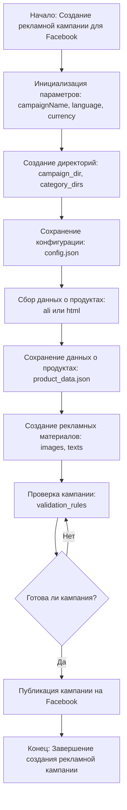

## АНАЛИЗ МОДУЛЯ `campaign`

### <алгоритм>

1. **Начало**: Процесс начинается с инициации создания рекламной кампании для Facebook.
   *   *Пример*: Пользователь запускает скрипт для создания новой кампании.
2. **Инициализация**: Задается название кампании, язык и валюта.
   *   *Пример*:  Название = "Летняя распродажа", Язык = "ru_RU", Валюта = "USD".
3. **Создание директорий**: Создаются необходимые каталоги для кампании, включая подкаталоги для категорий продуктов.
   *   *Пример*: Создаются директории `campaigns/summer_sale`, `campaigns/summer_sale/category1`, `campaigns/summer_sale/category2`.
4. **Сохранение конфигурации**: Параметры кампании (название, язык, валюта) сохраняются в файл конфигурации.
   *   *Пример*: Данные сохраняются в `campaigns/summer_sale/config.json` в виде JSON: `{"name": "Летняя распродажа", "language": "ru_RU", "currency": "USD"}`.
5. **Сбор данных**: Данные о продуктах собираются через `ali` (API AliExpress) или парсинг `html`.
   *   *Пример*: Собирается информация о товарах из категории "купальники" с помощью API AliExpress.
6. **Сохранение данных о продуктах**: Собранные данные о продуктах сохраняются в соответствующие файлы.
   *   *Пример*:  Информация о каждом товаре сохраняется в `campaigns/summer_sale/category1/product1.json`.
7. **Создание рекламных материалов**: На основе собранных данных генерируются рекламные материалы.
   *   *Пример*:  Создаются изображения и тексты для объявлений, соответствующие выбранным продуктам.
8. **Проверка кампании**: Проверяется корректность созданной кампании и рекламных материалов.
    *  *Пример:* Проверяется, что все изображения загружены и тексты соответствуют требованиям Facebook.
9. **Публикация кампании**: Если кампания прошла проверку, она публикуется на Facebook.
    *  *Пример*: Кампания "Летняя распродажа" публикуется на Facebook через API.
10. **Конец**: Завершение процесса создания рекламной кампании.

### <mermaid>

**Описание `mermaid` диаграммы:**

*   `Start`: Начальная точка процесса создания кампании.
*   `InitParams`: Инициализация параметров кампании, таких как имя (`campaignName`), язык (`language`) и валюта (`currency`).
*   `CreateDirs`: Создание структуры директорий для кампании, включая основные каталоги кампании (`campaign_dir`) и каталоги для категорий (`category_dirs`).
*   `SaveConfig`: Сохранение конфигурационных данных кампании в файл `config.json`.
*  `CollectProducts`: Сбор данных о продуктах с использованием API AliExpress (`ali`) или парсинга HTML.
*   `SaveProducts`: Сохранение данных о продуктах в файлах `product_data.json`.
*   `GenerateAds`: Генерация рекламных материалов, включая изображения (`images`) и тексты (`texts`).
*   `CheckCampaign`: Проверка кампании на соответствие правилам валидации (`validation_rules`).
*   `IsCampaignReady`: Условный блок проверки, готова ли кампания к публикации.
*   `PublishCampaign`: Публикация кампании на Facebook.
*   `End`: Конечная точка процесса создания кампании.

### <объяснение>

**Общее описание:**

Модуль `campaign` является центральной частью системы управления рекламными кампаниями на Facebook. Он охватывает все этапы, начиная от инициализации и заканчивая публикацией кампании.

**Импорты:**

В предоставленном коде импорты отсутствуют, но типично для работы этого модуля могли бы быть:

*   `os`: Для работы с файловой системой (создание директорий, сохранение файлов).
*   `json`: Для работы с файлами конфигурации в формате JSON.
*   `requests` или `selenium`: Для сбора данных о продуктах из AliExpress (либо через API, либо через парсинг HTML).
*   `facebook_sdk`: Для взаимодействия с API Facebook при публикации кампании.
*   `src.config`: Для загрузки общих настроек приложения.
*   `src.utils`: Для использования общих утилит (например, создания уникальных идентификаторов).
*   `src.suppliers.aliexpress`: Для работы с данными от поставщиков AliExpress.
*   `src.suppliers.html`: Для работы с данными из HTML-страниц.

**Классы:**

В предоставленном описании классы не указаны, но типовые классы могли бы включать:

*   `Campaign`: Класс для представления кампании, содержащий параметры (название, язык, валюта), методы для создания директорий, сохранения конфигурации, сбора данных, создания рекламы и публикации.
*   `Product`: Класс для представления продукта, содержащий данные о продукте (название, описание, цена, изображения).
*   `AdMaterial`: Класс для представления рекламных материалов, содержащий изображение и текст.

**Функции:**

В предоставленном описании функции не указаны, но типовые функции могут быть:

*   `initialize_campaign(campaign_name, language, currency)`: Инициализирует параметры кампании.
*   `create_campaign_directories(campaign_name)`: Создает необходимые директории для кампании.
*   `save_campaign_config(campaign_name, config)`: Сохраняет конфигурацию кампании в файл.
*   `collect_product_data(campaign_name, source='ali')`: Собирает данные о продуктах из API AliExpress или HTML.
*   `save_product_data(campaign_name, product_data)`: Сохраняет данные о продуктах в файлы.
*   `generate_ad_materials(campaign_name, product_data)`: Генерирует рекламные материалы на основе данных о продуктах.
*   `check_campaign(campaign_name)`: Проверяет кампанию на соответствие правилам.
*   `publish_campaign(campaign_name)`: Публикует кампанию на Facebook.

**Переменные:**

*   `campaign_name`: Название кампании (строка).
*   `language`: Язык кампании (строка, например, "ru_RU").
*   `currency`: Валюта кампании (строка, например, "USD").
*   `campaign_dir`: Директория кампании (строка).
*   `category_dirs`: Список директорий категорий (список строк).
*   `config`: Конфигурация кампании (словарь).
*   `product_data`: Данные о продуктах (список словарей).
*  `source`: Источник данных о продуктах (строка, например, `ali` или `html`).
*   `images`: Изображения для рекламных объявлений (список).
*   `texts`: Тексты для рекламных объявлений (список).

**Потенциальные ошибки и области для улучшения:**

*   **Обработка ошибок**: Недостаточно описана обработка ошибок при сборе данных, сохранении, проверке и публикации.
*   **Гибкость**: Зависимость от конкретного поставщика (`ali`) может быть ограничением.
*   **Масштабируемость**: Необходимо учесть, как система будет работать с большим объемом данных и большим количеством кампаний.
*   **Безопасность**: Важно обеспечить безопасность при доступе к API Facebook.
*   **Логирование**: Необходимо логировать все операции для отслеживания процесса и выявления ошибок.
*   **Конфигурация**: Желательно вынести настройки (например, параметры API, пути к файлам) в отдельный файл конфигурации.

**Взаимосвязь с другими частями проекта:**

*   Модуль `campaign` может использовать модули `src.suppliers.aliexpress` или `src.suppliers.html` для сбора данных о продуктах.
*   Для доступа к Facebook API может использоваться `facebook_sdk`.
*   Модуль может зависеть от `src.config` для загрузки глобальных настроек приложения.
*   Для создания уникальных идентификаторов может использоваться `src.utils`.

**Цепочка взаимосвязей:**

1.  **Запуск**: Пользователь инициирует создание кампании.
2.  **Инициализация**: Параметры кампании (название, язык, валюта) передаются в модуль `campaign`.
3.  **Создание директорий**: Модуль `campaign` создает структуру каталогов.
4.  **Сбор данных**: Модуль `campaign` использует модули `src.suppliers.aliexpress` или `src.suppliers.html` для сбора данных о продуктах.
5.  **Сохранение**: Собранные данные и конфигурация сохраняются на диск.
6.  **Создание рекламы**: Модуль `campaign` генерирует рекламные материалы.
7.  **Проверка**: Кампания проверяется на соответствие правилам.
8.  **Публикация**: Модуль `campaign` взаимодействует с Facebook API через `facebook_sdk` для публикации кампании.
9.  **Завершение**: Кампания успешно опубликована.