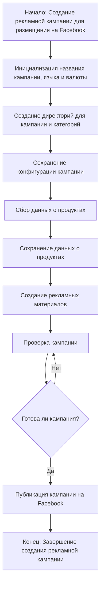
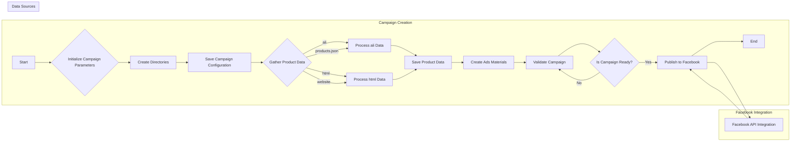

```MD
# Анализ кода модуля `campaign`

## <input code>

```
### `campaign`  
**Описание**:  
Модуль `campaign` предназначен для управления процессом создания и публикации 
рекламных кампаний на Фейсбук. 
Он включает функционал для инициализации параметров кампании (название, язык, валюта), 
создания структуры директорий, сохранения конфигураций для новой кампании, 
сбора и сохранения данных о продуктах через `ali` или `html`, 
генерации рекламных материалов, проверки кампании и публикации ее на Facebook.





## <algorithm>

**Шаг 1:** Начало процесса создания кампании.
**Шаг 2:** Инициализация параметров кампании (название, язык, валюта). Пример: `campaign_name = "Ноябрьская_акция"`, `language = "ru"`, `currency = "USD"`.
**Шаг 3:** Создание директорий для кампании и категорий. Пример: создаются папки `campaign/Ноябрьская_акция/category1`, `campaign/Ноябрьская_акция/category2` и т.д.
**Шаг 4:** Сохранение конфигурации кампании в соответствующий файл.  Пример: Сохранение данных (campaign_name, language, currency) в файл `campaign/Ноябрьская_акция/config.json`.
**Шаг 5:** Сбор данных о продуктах. В зависимости от источника данных (ali или html), данные считываются и обрабатываются. Пример: из файла `products.json` или из веб-страницы.
**Шаг 6:** Сохранение собранных данных о продуктах в соответствующие файлы. Пример: сохранение в `campaign/Ноябрьская_акция/products.json`.
**Шаг 7:** Генерация рекламных материалов (например, изображений и текстов). Пример: генерируются изображения с указанием названий продуктов, цен, и т.д.
**Шаг 8:** Проверка кампании: проверка на корректность данных, наличие всех необходимых элементов. Пример: проверка соответствия формату файлов, наличие необходимых изображений, и т.д.
**Шаг 9:** Проверка готовности кампании. Если кампания готова, перейти к публикации; иначе вернуться к шагу 8.
**Шаг 10:** Публикация кампании на Facebook.
**Шаг 11:** Завершение процесса.


## <mermaid>




## <explanation>

**Импорты:**  Код `campaign` не содержит импортов, поэтому нет зависимости от других пакетов.

**Классы:**  В представленном коде нет классов.

**Функции:** Нет функций, описания в коде - это  комментарии, описывающие процесс.

**Переменные:** В коде нет объявлений переменных.


**Возможные ошибки и улучшения:**

* Отсутствие импортов указывает на то, что код не полноценный и не может быть исполнен.
* Не хватает детального описания алгоритма (какой именно метод сбора данных используется из `ali` или `html`, как генерируются рекламные материалы).
* Не описан процесс взаимодействия с Facebook API, необходимый для публикации.
*  Отсутствие кода, реализующего алгоритм, делает его труднопроверяемым.
* Отсутствие обработки ошибок в коде -  в реальном применении важен анализ ошибок и их корректное  обработка.


**Взаимосвязи с другими частями проекта:**

Модуль `campaign` зависит от модулей, которые отвечают за работу с API Facebook и обработку данных из источников `ali` и `html`.  Связи с другими модулями должны быть указаны через импорты, которые отсутствуют в текущей версии.

**Заключение:**

Представленный фрагмент кода является описанием алгоритма, но не содержит самого кода. Для полноценного анализа необходимо предоставление исходного кода с импортами и реализацией описанных шагов.