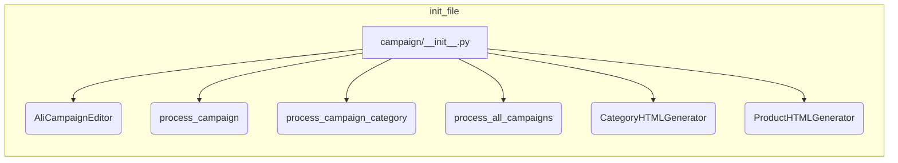

```MD
# <input code>

```python
## \file hypotez/src/suppliers/aliexpress/campaign/__init__.py
# -*- coding: utf-8 -*-\

#! venv/bin/python/python3.12

"""
.. module: src.suppliers.aliexpress.campaign 
	:platform: Windows, Unix
	:synopsis:модули управления рекламной кампанией Aliexpress

"""


from .ali_campaign_editor import AliCampaignEditor
#from .gsheet import AliCampaignGoogleSheet
from .prepare_campaigns import  process_campaign, process_campaign_category, process_all_campaigns
#from .ali_campaign_editor_jupyter_widgets import JupyterCampaignEditorWidgets
from .html_generators import CategoryHTMLGenerator, ProductHTMLGenerator
```

# <algorithm>

Этот код представляет собой модуль `__init__.py` для пакета `campaign` внутри пакета `aliexpress` модуля `suppliers` проекта.  Он импортирует классы и функции, необходимые для управления рекламными кампаниями AliExpress.  Пошаговая блок-схема не применимо к `__init__.py`, так как он просто импортирует элементы, но не выполняет операций.

# <mermaid>



# <explanation>

**1. Импорты:**

Этот файл содержит импорты, определяющие доступные функции и классы для работы с рекламными кампаниями AliExpress. 
* `from .ali_campaign_editor import AliCampaignEditor`: Импортирует класс `AliCampaignEditor`, предположительно, содержащий методы для редактирования кампаний.  `.` означает импортирование из текущей папки.
* `from .prepare_campaigns import  process_campaign, process_campaign_category, process_all_campaigns`: Импортирует функции для обработки кампаний, категорий кампаний и всех кампаний соответственно. Это указывает на наличие логики обработки данных в файлах пакета `prepare_campaigns`.
* `from .html_generators import CategoryHTMLGenerator, ProductHTMLGenerator`: Импортирует классы для генерации HTML-кода для категорий и продуктов, относящихся к кампаниям.

**2. Классы:**

* `AliCampaignEditor`: Предполагается, что это класс, содержащий методы для взаимодействия с API AliExpress или другой системой для управления кампаниями.
* `CategoryHTMLGenerator`: Предположительно отвечает за создание HTML-представления данных категорий кампаний.
* `ProductHTMLGenerator`: Предположительно отвечает за создание HTML-представления данных продуктов кампаний.

**3. Функции:**

* `process_campaign`: Вероятно, обрабатывает отдельную кампанию.
* `process_campaign_category`: Вероятно, обрабатывает категорию кампании.
* `process_all_campaigns`: Вероятно, обрабатывает все кампании.

**4. Переменные:**

* ``: Глобальная переменная, вероятно, задающая режим работы (разработка или производство).

**5. Взаимосвязи с другими частями проекта:**

Этот модуль является частью проекта, ориентированного на работу с рекламными кампаниями AliExpress.  Он опирается на API AliExpress, данные кампаний,  возможно, на таблицы Google Sheets (по удаленным импортам) и имеет взаимосвязь с генерацией отчётов в HTML.   Модуль `prepare_campaigns` содержит логику обработки данных кампаний, что предполагает наличие внешних данных, передаваемых в эти функции.  `html_generators`  позволяют представить полученные данные.  Цепочка взаимосвязей выглядит так:  Внешние данные (AliExpress API, Google Sheets) -> `prepare_campaigns` -> `campaign/__init__.py` -> `html_generators` -> Отчеты в HTML.

**Возможные ошибки или области для улучшений:**

* Отсутствуют описания функций и методов. Важно добавлять docstrings для функций и методов для лучшей документации и понимания их поведения.
* Отсутствуют проверки входных данных. Добавление валидации и обработки исключений сделает код более надежным.
* Необходимо указать, откуда берутся исходные данные для `process_campaign`, `process_campaign_category` и `process_all_campaigns`.


Этот `__init__.py` файл представляет собой точку входа для модуля, организуя доступ к функциональности. Он не содержит основной логики, а лишь определяет доступные компоненты для работы с кампаниями AliExpress.