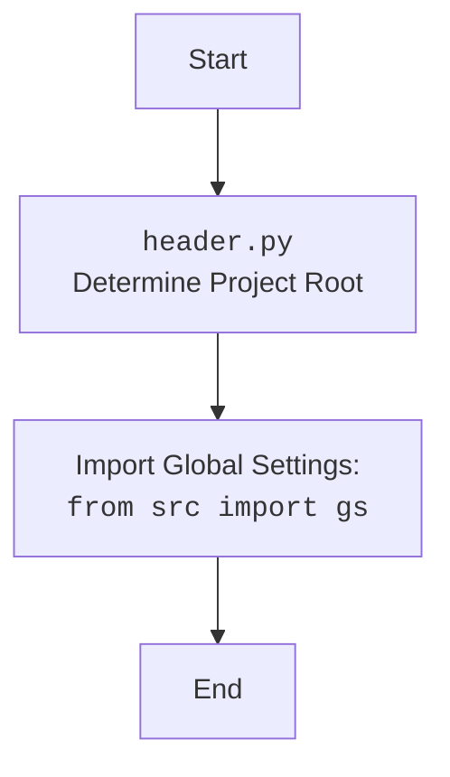

## АНАЛИЗ КОДА: `hypotez/src/suppliers/aliexpress/campaign/_examples/header.py`

### 1. <алгоритм>

1. **Определение корневой директории проекта:**
   - Функция `os.getcwd()` возвращает текущую рабочую директорию.
   - `os.getcwd().rfind('hypotez')` находит индекс последнего вхождения подстроки `hypotez`.
   - `os.getcwd()[:os.getcwd().rfind('hypotez')+7]` вырезает подстроку от начала и до конца `hypotez`, что является предположительно корневой директорией проекта.
   - `Path()` создает объект `Path` из полученной строки (например, `/Users/user/projects/hypotez`).
   - Результат сохраняется в переменной `dir_root`.

   *Пример:* Если текущая директория `/Users/user/projects/hypotez/src/suppliers/aliexpress/campaign/_examples`, то `dir_root` будет `/Users/user/projects/hypotez`.
2. **Добавление корневой директории в `sys.path`:**
   - `str(dir_root)` преобразует объект `Path` обратно в строку (например, `/Users/user/projects/hypotez`).
   - `sys.path.append(...)` добавляет корневую директорию в список путей поиска модулей, позволяя импортировать модули из этой директории.
3. **Определение директории `src`:**
   - `Path(dir_root, 'src')` создает объект `Path`, который является путем к директории `src` внутри корневой директории.
   - Результат сохраняется в переменной `dir_src` (например, `/Users/user/projects/hypotez/src`).
4. **Повторное добавление корневой директории в `sys.path`:**
   - `str(dir_root)` преобразует объект `Path` обратно в строку (например, `/Users/user/projects/hypotez`).
   - `sys.path.append(...)` еще раз добавляет корневую директорию в список путей поиска модулей. (Это дублирование кажется избыточным и, возможно, является ошибкой.)

### 2. <mermaid>

```mermaid
flowchart TD
    Start --> DetermineRoot[Determine Project Root: <br><code>dir_root</code>  = Path(os.getcwd()[:os.getcwd().rfind('hypotez')+7])]
    DetermineRoot --> AddRootToPath[Add Project Root to sys.path: <br><code>sys.path.append(str(dir_root))</code>]
    AddRootToPath --> DetermineSrcDir[Determine Source Directory: <br><code>dir_src</code> = Path(dir_root, 'src')]
    DetermineSrcDir --> AddRootToPathAgain[Add Project Root to sys.path (again): <br><code>sys.path.append(str(dir_root))</code>]
    AddRootToPathAgain --> End
```

**Анализ зависимостей:**

- **`os`**: Модуль `os` используется для работы с операционной системой. Здесь применяется для получения текущей директории `os.getcwd()` и поиска подстроки `hypotez` в пути.
- **`sys`**: Модуль `sys` используется для доступа к системным параметрам и функциям.  В данном случае, `sys.path` изменяется, добавляя корневую директорию проекта.
- **`pathlib.Path`**: Класс `Path` из модуля `pathlib` применяется для создания объектов путей, что делает работу с путями более удобной и кроссплатформенной. Он используется для создания объектов путей к корневой и `src` директориям.



### 3. <объяснение>

**Импорты:**

-   **`import os`**:
    -   Назначение: Предоставляет функции для взаимодействия с операционной системой, такие как получение текущей рабочей директории.
    -   Взаимосвязь: Используется для определения корневой директории проекта.
-   **`import sys`**:
    -   Назначение: Обеспечивает доступ к системным параметрам и функциям.
    -   Взаимосвязь: Используется для изменения `sys.path`, списка путей поиска модулей, чтобы можно было импортировать модули из корневой директории и `src`.
-   **`from pathlib import Path`**:
    -   Назначение: Класс `Path` предоставляет объектно-ориентированный способ работы с путями в файловой системе.
    -   Взаимосвязь: Используется для создания объектов путей для корневой директории `dir_root` и `src` директории `dir_src`.

**Переменные:**

-   **`dir_root: Path`**:
    -   Тип: `pathlib.Path`.
    -   Использование: Представляет собой объект `Path` к корневой директории проекта. Вычисляется динамически на основе текущей директории и предположения, что `hypotez` – это название корневого каталога проекта.
-   **`dir_src: Path`**:
     - Тип: `pathlib.Path`.
     - Использование: Представляет собой объект `Path` к директории `src`, расположенной в корневой директории проекта.
    
**Функции:**

-   **`os.getcwd()`**:
    -   Аргументы: Нет.
    -   Возвращаемое значение: Строка, представляющая текущую рабочую директорию.
    -   Назначение: Получение текущей рабочей директории.
-   **`os.getcwd().rfind('hypotez')`**:
    - Аргументы: Строка `'hypotez'`.
    - Возвращаемое значение: Целое число, индекс последнего вхождения `'hypotez'` в текущей рабочей директории.
    - Назначение: Поиск позиции корневой директории.
-   **`Path(...)`**:
    -   Аргументы: Строка или объект пути, представляющие путь.
    -   Возвращаемое значение: Объект типа `pathlib.Path`.
    -   Назначение: Создание объекта пути.
-   **`sys.path.append(...)`**:
    -   Аргументы: Строка, представляющая путь к директории.
    -   Возвращаемое значение: Нет.
    -   Назначение: Добавление директории в список путей поиска модулей.

**Объяснение и взаимодействие:**

Данный код предназначен для динамического определения корневой директории проекта и добавления ее в список путей поиска модулей Python (`sys.path`). Это позволяет импортировать модули из проекта, не полагаясь на абсолютные пути.
1. **Определение `dir_root`**: Код предполагает, что корневая директория содержит подстроку `hypotez` в своем пути. Это решение может быть хрупким, так как изменение имени корневой директории приведет к поломке.
2. **Добавление в `sys.path`**: Код добавляет и корневую директорию, и директорию `src` в `sys.path`, что является стандартной практикой в Python для организации кода. Повторное добавление корневой директории в `sys.path` выглядит избыточно.
3. **Использование `pathlib`**: Использование `pathlib.Path` делает код более читаемым и кроссплатформенным.

**Потенциальные ошибки и области для улучшения:**

- **Жесткое кодирование `hypotez`**: Полагаться на `hypotez` в качестве имени корневой директории делает код не гибким. Лучше было бы использовать переменную окружения или другое более надежное средство для определения корневой директории.
- **Дублирование добавления в `sys.path`**: Добавление `dir_root` в `sys.path` дважды не имеет смысла и является избыточным.
- **Отсутствие обработки ошибок**: Код не обрабатывает ситуацию, когда `hypotez` не найдено в текущем пути. В этом случае `rfind` вернет `-1`, и дальнейшее использование среза приведет к некорректному результату.
- **Отсутствие `src.gs`**:  В `mermaid` коде есть упоминание `import from src.gs`, но в анализируемом коде такого импорта нет. Это означает, что это либо будущий функционал, либо описка.

**Цепочка взаимосвязей:**

Этот файл является частью модуля `src.suppliers.aliexpress.campaign._examples`. Он устанавливает окружение (добавляет пути поиска) для других модулей в этом проекте. Это означает, что другие модули в этом пакете или в других частях проекта, которые импортируют модули отсюда, будут полагаться на этот код.

**Рекомендации по улучшению:**
1. Использовать более гибкий способ определения корневой директории (например, искать файл конфигурации в корневой директории или использовать переменную окружения).
2. Убрать дублирование добавления в `sys.path`.
3. Добавить обработку ошибок в случае, если `hypotez` не найдено.
4.  Добавить проверку на существование `src.gs` или убрать импорт `gs` из диаграммы, если это не предполагается в текущей архитектуре проекта.