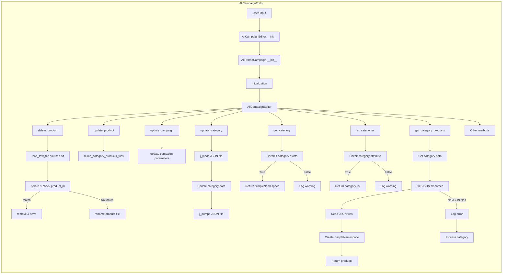

# Анализ кода AliCampaignEditor

**1. <input code>**

```graph LR
    subgraph AliCampaignEditor
        A[User Input: campaign_name, language, currency] --> B{AliCampaignEditor.__init__};
        B --> C[AliPromoCampaign.__init__];
        C --> D[Initialization: AliCampaignEditor constructor];
        D --> E[AliCampaignEditor];
        
        E --> F[delete_product: Check for affiliate link];
        F --> G[read_text_file sources.txt: Read product list];
        G --> H[Iterate & check product_id: Loop through product list];
        H -- Match --> I[remove & save: Remove product if match found];
        H -- No Match --> J[rename product file: Rename product file if no match];
        
        E --> K[update_product: Update product details];
        K --> L[Call dump_category_products_files: Update category with new product];
        
        E --> M[update_campaign: Update campaign properties like description];
        M --> N[update campaign parameters];
        
        E --> O[update_category: Update category in JSON file];
        O --> P[j_loads JSON file: Read category data];
        P --> Q[Update category: Update category data];
        Q --> R[j_dumps JSON file: Write updated category to file];
        
        E --> S[get_category: Retrieve category by name];
        S --> T[Check if category exists];
        T -- Found --> U[Return SimpleNamespace: Return category details];
        T -- Not Found --> V[Log warning: Category not found in campaign];
        
        E --> W[list_categories: List all categories in the campaign];
        W --> X[Check category attribute: Ensure categories exist in campaign];
        X -- Found --> Y[Return category list: List category names];
        X -- Not Found --> Z[Log warning: No categories found in campaign];
        
        E --> AA[get_category_products: Retrieve products for a category];
        AA --> AB[Get category path: Build path for category products];
        AB --> AC[Get JSON filenames: Retrieve all product JSON files];
        AC --> AD[Read JSON files: Load product data];
        AD --> AE[Create SimpleNamespace: Convert product data to objects];
        AE --> AF[Return products: Return list of products];
        AC -- No JSON files --> AG[Log error: No files found];
        AG --> AH[Process category: Trigger category product preparation];
        
        E --> AI[Other methods];
    end
```

**2. <algorithm>**

(Подробная блок-схема представлена выше в формате graph LR)

**3. <mermaid>**



**4. <explanation>**

* **Импорты:**  К сожалению, импорты не представлены в предоставленном коде, поэтому их невозможно проанализировать.  Предполагается, что необходимы импорты для работы с файлами, JSON, обработкой данных и возможно, для работы с `SimpleNamespace`.

* **Классы:**
    * `AliCampaignEditor`: Класс, представляющий редактор кампаний на AliExpress.  Он отвечает за выполнение операций по добавлению, обновлению, удалению продуктов, категорий и всей кампании в целом.  Атрибуты: скорее всего, экземпляры `AliPromoCampaign` для работы с данными кампаний. Методы: `__init__`, `delete_product`, `update_product`, `update_campaign`, `update_category`, `get_category`, `list_categories`, `get_category_products`,  и прочие (`AI`) для управления кампаниями.

    * `AliPromoCampaign`:  Не описан в представленном коде. Предположительно, это класс, предоставляющий методы для работы с данными кампании.  Его использование предполагает работу с данными кампаний (например, чтение и запись из файлов).


* **Функции:**
    * `__init__`: Инициализирует объект класса `AliCampaignEditor`.  Принимает данные о кампании (название, язык, валюта).  Вызывает `AliPromoCampaign` для инициализации.

    * `delete_product`, `update_product`, `update_campaign`, `update_category`, `get_category`, `list_categories`, `get_category_products`: Все эти методы выполняют операции над данными кампании,  работают с файлами (JSON).  Аргументы могут быть различными (id продукта, название категории и т.д.). Возвращаемые значения - результаты операций, или `None`.

    * `read_text_file`: Читает список продуктов из файла `sources.txt`.

    * `dump_category_products_files`:  Вызывается при обновлении продукта.  Предположительно сохраняет информацию о продуктах в файлы.

    * `j_loads`:  Загружает данные из JSON файла.

    * `j_dumps`: Сохраняет данные в JSON файл.

* **Переменные:** Тип переменных зависит от данных, с которыми работает `AliCampaignEditor`. (например, `campaign_name`, `language`, `currency`).

* **Возможные ошибки и улучшения:**

    * **Отсутствие ясности в связи с `AliPromoCampaign`:** Непонятно, как взаимодействует `AliCampaignEditor` с данным классом. Необходимо более детальное описание.

    * **Недостающие импорты:** Не указаны импортируемые модули.  Ошибки могут быть связаны с отсутствием необходимых импортов.

    * **Обработка ошибок:** Необходимо добавить обработку ошибок (например, исключения `FileNotFoundError`, `JSONDecodeError`) для устойчивой работы.

    * **Логирование:**  Используйте логирование для отслеживания действий и ошибок.


* **Взаимосвязи с другими частями проекта:**
    * Взаимодействует с `AliPromoCampaign` для работы с данными кампаний.
    * Необходимо чёткое определение структуры проекта и, главное, структуры данных в файлах (JSON).
    * Используется `SimpleNamespace` для представления данных.


```
**Вывод:**

Диаграмма прекрасно иллюстрирует логику работы `AliCampaignEditor`.  Однако, для более полного понимания необходимы детали реализации,  описание функций и импортируемых модулей. Необходимо дополнить объяснение описанием классов `AliPromoCampaign` и описанием структуры данных в JSON-файлах.