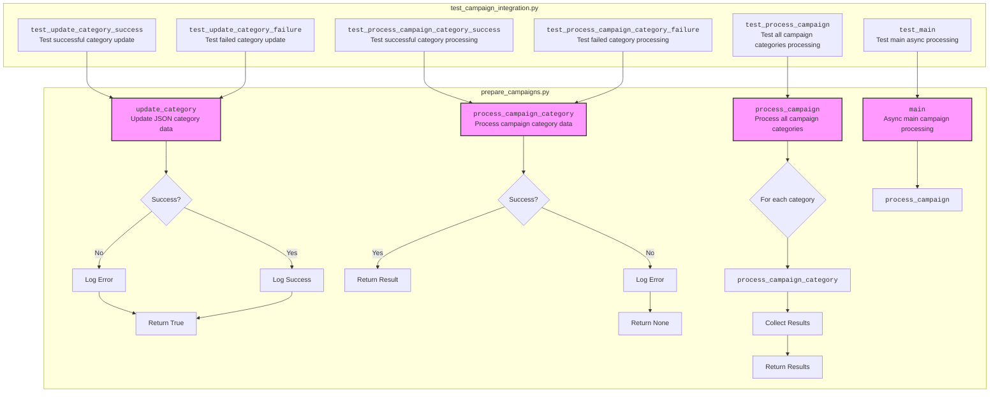

## <алгоритм>

Этот документ представляет собой руководство для тестировщиков модуля, предназначенного для управления рекламными кампаниями на AliExpress. Модуль состоит из трех основных файлов: `edit_campaign.py`, `prepare_campaigns.py` и `test_campaign_integration.py`.

**1. `edit_campaign.py`:**
   - **Описание:** Управляет рекламными кампаниями, наследуя от `AliPromoCampaign`.
   - **Логика:**
     - Инициализация объекта класса `AliCampaignEditor` с необходимыми данными кампании.
     - Выполнение операций по управлению кампанией (не описаны конкретные действия, но подразумеваются).

**2. `prepare_campaigns.py`:**
    - **Описание:** Подготавливает материалы кампании.
    - **Логика:**
      - `update_category(category_data, file_path)`:
        - Принимает `category_data` (JSON) и путь к файлу `file_path`.
        - Пытается обновить данные категории в JSON-файле.
        - Возвращает `True` при успехе, `False` при неудаче.
        - *Пример:* `update_category({"id": 123, "name": "New Category"}, "categories.json")`
      - `process_campaign_category(category_id, campaign_data)`:
         - Принимает `category_id` и `campaign_data`.
         - Выполняет обработку категории в рамках кампании.
         - Возвращает результат обработки или `None` в случае ошибки.
         - *Пример:* `process_campaign_category(123, {"campaign_id": 456, "budget": 100})`
      - `process_campaign(campaign_data)`:
         - Принимает `campaign_data`, содержащую данные по категориям.
         - Перебирает все категории в кампании и вызывает `process_campaign_category` для каждой.
         - Возвращает словарь результатов обработки для каждой категории.
         - *Пример:* `process_campaign({"categories": [1, 2, 3], "campaign_id": 456})`
      - `main()`:
         - Асинхронно запускает обработку всей кампании, вызывая `process_campaign`.
         - *Пример:* `await main()`

**3. `test_campaign_integration.py`:**
    - **Описание:** Содержит тесты для проверки интеграции всех компонентов.
    - **Логика:**
      - `test_update_category_success`:
        - Проверяет, что `update_category` успешно обновляет данные.
      - `test_update_category_failure`:
        - Проверяет обработку ошибок в `update_category`.
      - `test_process_campaign_category_success`:
        - Проверяет успешную обработку категории в `process_campaign_category`.
      - `test_process_campaign_category_failure`:
        - Проверяет обработку ошибок в `process_campaign_category`.
      - `test_process_campaign`:
        - Проверяет обработку всех категорий в `process_campaign`.
      - `test_main`:
        - Проверяет основной сценарий выполнения кампании в `main`.

**Поток данных:**

1. Тестер запускает тесты из `test_campaign_integration.py`.
2. Тесты используют функции из `prepare_campaigns.py` (`update_category`, `process_campaign_category`, `process_campaign`, `main`).
3. `edit_campaign.py` используется для управления кампанией (хотя детали его работы не видны напрямую в тестах).
4. Функции в `prepare_campaigns.py` обновляют JSON-файлы и обрабатывают данные кампании.
5. Тесты проверяют результаты работы функций, логируют ошибки, если они есть, и завершают выполнение.

## <mermaid>



**Объяснение диаграммы:**

-   **`prepare_campaigns.py` subgraph**:
    -   **`update_category`**: Функция обновляет данные категории в JSON файле. При успешном обновлении, возвращает `True` и логирует успех, в случае неудачи - возвращает `False` и логирует ошибку.
    -   **`process_campaign_category`**: Функция обрабатывает отдельную категорию в рамках рекламной кампании. Возвращает результат обработки в случае успеха или `None` в случае ошибки, логируя её.
    -   **`process_campaign`**: Функция обрабатывает все категории в рамках одной рекламной кампании. Перебирает категории и вызывает для каждой функцию `process_campaign_category`, возвращая результаты обработки каждой категории.
    -   **`main`**: Асинхронная функция, запускающая обработку всей кампании. Вызывает функцию `process_campaign`.

-   **`test_campaign_integration.py` subgraph**:
    -   **`test_update_category_success`**: Тест проверяет успешное выполнение функции `update_category`.
    -   **`test_update_category_failure`**: Тест проверяет, что функция `update_category` корректно обрабатывает ошибки.
    -   **`test_process_campaign_category_success`**: Тест проверяет успешное выполнение функции `process_campaign_category`.
    -   **`test_process_campaign_category_failure`**: Тест проверяет, что функция `process_campaign_category` корректно обрабатывает ошибки.
    -   **`test_process_campaign`**: Тест проверяет корректную обработку всех категорий в рамках кампании функцией `process_campaign`.
    -   **`test_main`**: Тест проверяет корректную работу основной асинхронной функции `main`.

**Зависимости:**

-  Функции из `prepare_campaigns.py` вызываются в `test_campaign_integration.py` для тестирования.

## <объяснение>

**Импорты:**

- В представленном коде импортов нет, но из описания понятно, что используются библиотеки для асинхронных операций (например, `asyncio`) и для работы с JSON. Также предполагается наличие класса `AliPromoCampaign`, от которого наследуется класс `AliCampaignEditor`, и модуля `logging` для записи логов.

**Классы:**

-   **`AliCampaignEditor`:**
    -   **Роль:** Класс отвечает за управление рекламными кампаниями на AliExpress.
    -   **Атрибуты:** Не описаны конкретные атрибуты, но подразумевается, что класс хранит информацию о кампании (id, настройки, список категорий).
    -   **Методы:** Не описаны конкретные методы, кроме инициализатора.
    -   **Взаимодействие:** Наследует от `AliPromoCampaign`, что говорит о наличии общих методов и атрибутов для работы с рекламными кампаниями.
        Возможно, использует методы из `prepare_campaigns.py` для подготовки данных.

**Функции:**

-   **`update_category(category_data, file_path)`:**
    -   **Аргументы:** `category_data` (словарь или JSON-объект с данными категории), `file_path` (путь к JSON-файлу).
    -   **Возвращаемое значение:** `True`, если обновление прошло успешно, иначе `False`.
    -   **Назначение:** Обновляет данные категории в JSON-файле, записывая изменения.
    -   **Пример:**
        ```python
        update_category({"id": 123, "name": "New Category"}, "categories.json")
        ```
-   **`process_campaign_category(category_id, campaign_data)`:**
    -   **Аргументы:** `category_id` (идентификатор категории), `campaign_data` (словарь или JSON-объект с данными кампании).
    -   **Возвращаемое значение:** Результат обработки категории или `None` в случае ошибки.
    -   **Назначение:** Выполняет обработку конкретной категории в рамках кампании.
    -   **Пример:**
        ```python
        process_campaign_category(123, {"campaign_id": 456, "budget": 100})
        ```
-   **`process_campaign(campaign_data)`:**
    -   **Аргументы:** `campaign_data` (словарь или JSON-объект с данными кампании, включающий список категорий).
    -   **Возвращаемое значение:** Словарь с результатами обработки для каждой категории.
    -   **Назначение:** Обрабатывает все категории в рамках кампании, вызывая `process_campaign_category` для каждой.
    -   **Пример:**
        ```python
        process_campaign({"categories": [1, 2, 3], "campaign_id": 456})
        ```
-   **`main()`:**
    -   **Аргументы:** Нет.
    -   **Возвращаемое значение:** Нет.
    -   **Назначение:** Асинхронная функция, запускающая обработку всей кампании.
    -   **Пример:**
        ```python
        await main()
        ```

**Переменные:**

- В коде нет явных глобальных переменных. Функции используют параметры, передаваемые в них при вызове. Например, `category_data`, `file_path` в `update_category` или `category_id`, `campaign_data` в `process_campaign_category`.

**Потенциальные ошибки и области для улучшения:**

-   **Обработка ошибок:** В функциях `update_category` и `process_campaign_category` предусмотрена базовая обработка ошибок, но она может быть расширена для предоставления более детальных сообщений.
-   **Отсутствие деталей:** В руководстве недостаточно информации о конкретных операциях, выполняемых функциями `process_campaign_category` и `process_campaign`.
-   **Безопасность:**  При обновлении JSON-файлов может потребоваться проверка данных на корректность и безопасность.
-   **Логирование:** В дополнение к базовому логированию, можно добавить больше контекста к логам.
-   **Конфигурация:**  Необходимо вынести пути к файлам и другие конфигурационные данные в отдельный файл настроек.

**Взаимосвязи с другими частями проекта:**

-   `AliPromoCampaign` (родительский класс `AliCampaignEditor`) вероятно является частью более крупного модуля, отвечающего за общую работу с рекламными кампаниями.
-  Предполагается, что JSON файлы, используемые для обновления категорий, могут быть частью базы данных или настроек системы.

**Цепочка взаимосвязей:**

1.  Тестер запускает тесты в `test_campaign_integration.py`.
2.  Тесты вызывают функции из `prepare_campaigns.py` для обработки кампании.
3.  `prepare_campaigns.py` использует `AliCampaignEditor` для управления кампанией.
4.  `AliCampaignEditor` наследуется от `AliPromoCampaign` для базовой работы с кампанией.
5.  `prepare_campaigns.py` обновляет JSON файлы и логгирует результаты работы.
6.  Тесты в `test_campaign_integration.py` проверяют результаты обработки и логируют ошибки.