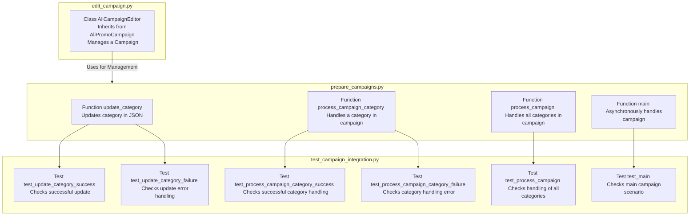

## Анализ кода

### <алгоритм>

**1. Введение:**
   - Документ предназначен для тестировщиков модуля, управляющего рекламными кампаниями AliExpress.
   - Модуль состоит из трех основных файлов: `edit_campaign.py`, `prepare_campaigns.py`, и `test_campaign_integration.py`.

**2. Описание `edit_campaign.py`:**
   - **Класс `AliCampaignEditor`:**
      -  Инициализирует и управляет рекламной кампанией (наследуется от `AliPromoCampaign`).
   - **Пример:** Создание экземпляра `AliCampaignEditor` для управления кампанией.

**3. Описание `prepare_campaigns.py`:**
   - **Функция `update_category`:**
      - Обновляет данные категории в JSON-файле.
      - **Пример:** Вызов `update_category(category_data, json_file)` для обновления данных.
   - **Функция `process_campaign_category`:**
      - Обрабатывает конкретную категорию в кампании.
      - **Пример:** Вызов `process_campaign_category(category_id, campaign_data)` для обработки.
   - **Функция `process_campaign`:**
      - Обрабатывает все категории в кампании.
      - **Пример:** Вызов `process_campaign(campaign_data)` для полной обработки.
   - **Функция `main`:**
      - Асинхронно обрабатывает всю кампанию.
      - **Пример:** Вызов `await main(campaign_data)` для асинхронной обработки.

**4. Описание `test_campaign_integration.py`:**
   - **Тест `test_update_category_success`:**
      - Проверяет успешное обновление категории.
      - **Пример:** Проверяет, что `update_category` возвращает `True`.
   - **Тест `test_update_category_failure`:**
      - Проверяет обработку ошибки при обновлении категории.
      - **Пример:** Проверяет, что `update_category` возвращает `False`.
   - **Тест `test_process_campaign_category_success`:**
      - Проверяет успешную обработку категории.
      - **Пример:** Проверяет, что `process_campaign_category` возвращает результат без ошибок.
   - **Тест `test_process_campaign_category_failure`:**
      - Проверяет обработку ошибки при обработке категории.
      - **Пример:** Проверяет, что `process_campaign_category` возвращает `None`.
   - **Тест `test_process_campaign`:**
      - Проверяет обработку всех категорий в кампании.
      - **Пример:** Проверяет, что `process_campaign` возвращает результаты обработки каждой категории.
   - **Тест `test_main`:**
      - Проверяет основной сценарий выполнения кампании.
      - **Пример:** Проверяет, что `main` выполняет все этапы асинхронно без ошибок.

**5. Инструкции по тестированию:**
   - Установка зависимостей: `pip install -r requirements.txt`
   - Запуск тестов: `pytest test_campaign_integration.py`
   - Проверка результатов: Все тесты должны пройти (`PASSED`).

**6. Проверка функциональности:**
   - Каждый тест проверяет конкретную функцию или сценарий.
   - Убедитесь, что все тесты проходят и функции выполняют свои задачи корректно.

### <mermaid>

**Объяснение зависимостей в `mermaid`:**

-   `edit_campaign.py`:
    -   `AliCampaignEditor` - Класс, который используется для управления рекламными кампаниями. Он наследуется от `AliPromoCampaign`.
-   `prepare_campaigns.py`:
    -   `updateCategory`: Функция обновляет данные о категориях в JSON файле.
    -   `processCampaignCategory`: Функция обрабатывает определенную категорию в рамках рекламной кампании.
    -   `processCampaign`: Функция обрабатывает все категории, относящиеся к рекламной кампании.
    -   `mainFunc`: Асинхронная функция, которая выполняет всю обработку кампании.
-   `test_campaign_integration.py`:
    -   `testUpdateCategorySuccess`: Тест проверяет успешное выполнение функции `updateCategory`.
    -   `testUpdateCategoryFailure`: Тест проверяет корректную обработку ошибок в функции `updateCategory`.
    -   `testProcessCampaignCategorySuccess`: Тест проверяет успешное выполнение функции `processCampaignCategory`.
    -   `testProcessCampaignCategoryFailure`: Тест проверяет обработку ошибок в функции `processCampaignCategory`.
    -   `testProcessCampaign`: Тест проверяет успешное выполнение функции `processCampaign`.
    -   `testMain`: Тест проверяет корректную работу основной асинхронной функции `mainFunc`.
-  **Взаимосвязи:**
   -   `AliCampaignEditor` в `edit_campaign.py` используется для управления процессом подготовки кампании в `prepare_campaigns.py`.
    -   Функции в `prepare_campaigns.py` проверяются соответствующими тестами в `test_campaign_integration.py`.

### <объяснение>

**1. Импорты:**

-   В предоставленном коде нет явных импортов, но подразумевается, что `AliPromoCampaign` и другие зависимости могут быть импортированы в рамках `src`. Поскольку предоставлен только гайд для тестировщиков, конкретные импорты не определены.

**2. Классы:**

-   `AliCampaignEditor`:
    -   **Роль**: Управляет рекламной кампанией.
    -   **Атрибуты**: Предположительно, имеет атрибуты, связанные с настройками кампании и данными.
    -   **Методы**: Управляет запуском и отслеживанием кампании.
    -   **Взаимодействие**: Наследует от `AliPromoCampaign` (определено в `src.suppliers.aliexpress.campaign`).

**3. Функции:**

-   **`update_category(category_data, json_file)`**:
    -   **Аргументы**: `category_data` (словарь с данными категории) и `json_file` (путь к JSON файлу).
    -   **Возвращает**: `True` при успешном обновлении, `False` при ошибке.
    -   **Назначение**: Обновляет данные категории в JSON файле.
    -   **Пример**: `update_category({'id': 123, 'name': 'Electronics'}, 'categories.json')`.
-   **`process_campaign_category(category_id, campaign_data)`**:
    -   **Аргументы**: `category_id` (идентификатор категории) и `campaign_data` (данные кампании).
    -   **Возвращает**: Результат обработки категории или `None` в случае ошибки.
    -   **Назначение**: Обрабатывает конкретную категорию в кампании.
    -   **Пример**: `process_campaign_category(123, {'name': 'Summer Sale'})`.
-   **`process_campaign(campaign_data)`**:
    -   **Аргументы**: `campaign_data` (данные кампании).
    -   **Возвращает**: Словарь с результатами обработки каждой категории.
    -   **Назначение**: Обрабатывает все категории в рамках кампании.
    -   **Пример**: `process_campaign({'name': 'Black Friday', 'categories': [123, 456]})`.
-   **`main(campaign_data)`**:
    -   **Аргументы**: `campaign_data` (данные кампании).
    -   **Возвращает**: Ничего (асинхронная функция).
    -   **Назначение**: Асинхронно выполняет всю логику обработки кампании.
    -   **Пример**: `await main({'name': 'New Year', 'categories': [123, 456]})`.

**4. Переменные:**

-   `category_data` (словарь): Содержит данные категории (например, `{'id': 123, 'name': 'Electronics'}`).
-   `json_file` (строка): Путь к JSON файлу (например, `'categories.json'`).
-   `category_id` (целое число): Идентификатор категории (например, `123`).
-   `campaign_data` (словарь): Содержит данные кампании (например, `{'name': 'Summer Sale', 'categories': [123, 456]}`).

**5. Потенциальные ошибки и области для улучшения:**

-   **Отсутствие обработки исключений**: В `prepare_campaigns.py`, внутри функций `update_category`, `process_campaign_category`, `process_campaign` необходимо добавить блоки `try-except` для обработки возможных исключений, таких как:
   - ошибки открытия или чтения файла
   - ошибки парсинга JSON
   - ошибки обработки данных кампании.
   - Логирование ошибок
-   **Валидация данных**: Валидировать входные данные для функций `update_category`, `process_campaign_category`, `process_campaign`, чтобы предотвратить ошибки из-за неправильного формата данных.
-   **Улучшенное логирование**: Включить подробное логирование для всех основных операций, включая ошибки, чтобы облегчить отладку.
-   **Асинхронность**: Убедиться, что все асинхронные операции в `main` работают корректно.
-   **Расширение тестов**: Добавить больше тестов для разных граничных случаев, для обеспечения надежности.

**6. Взаимосвязь с другими частями проекта:**

-   Предполагается, что модуль `aliexpress.campaign` является частью более крупного проекта `src`.
-   Модуль использует настройки проекта, которые импортируются через `src.gs`.
-   `AliPromoCampaign` (наследуется в `AliCampaignEditor`) – это часть `src.suppliers.aliexpress.campaign`.
-   JSON-файлы, которые обрабатываются, скорее всего, расположены в директории данных проекта.

Этот анализ обеспечивает всестороннее понимание структуры и функциональности кода.