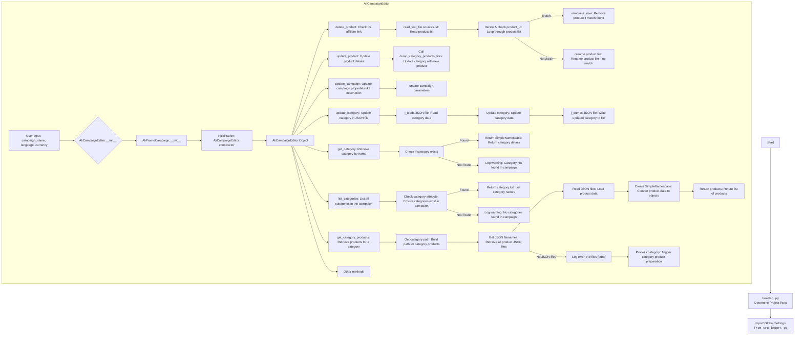

## ИНСТРУКЦИЯ:

Анализируй предоставленный код подробно и объясни его функциональность. Ответ должен включать три раздела:  

1. **<алгоритм>**: Опиши рабочий процесс в виде пошаговой блок-схемы, включая примеры для каждого логического блока, и проиллюстрируй поток данных между функциями, классами или методами.  
2. **<mermaid>**: Напиши код для диаграммы в формате `mermaid`, проанализируй и объясни все зависимости,  
    которые импортируются при создании диаграммы.  
    **ВАЖНО!** Убедитесь, что все имена переменных, используемые в диаграмме `mermaid`,  
    имеют осмысленные и описательные имена. Имена переменных вроде `A`, `B`, `C`, и т.д., не допускаются!  
    
    **Дополнительно**: Если в коде есть импорт `import header`, добавьте блок `mermaid` flowchart, объясняющий `header.py`:
    ```mermaid
    flowchart TD
        Start --> Header[<code>header.py</code><br> Determine Project Root]
    
        Header --> import[Import Global Settings: <br><code>from src import gs</code>] 
    ```

3. **<объяснение>**: Предоставьте подробные объяснения:  
   - **Импорты**: Их назначение и взаимосвязь с другими пакетами `src.`.  
   - **Классы**: Их роль, атрибуты, методы и взаимодействие с другими компонентами проекта.  
   - **Функции**: Их аргументы, возвращаемые значения, назначение и примеры.  
   - **Переменные**: Их типы и использование.  
   - Выделите потенциальные ошибки или области для улучшения.  

Дополнительно, постройте цепочку взаимосвязей с другими частями проекта (если применимо).  

Это обеспечивает всесторонний и структурированный анализ кода.
## Формат ответа: `.md` (markdown)
**КОНЕЦ ИНСТРУКЦИИ**

## <алгоритм>

1.  **Инициализация `AliCampaignEditor`:**
    *   Принимает `campaign_name`, `language`, и `currency`.
    *   Инициализирует родительский класс `AliPromoCampaign` с этими параметрами.
    *   Пример: `editor = AliCampaignEditor(campaign_name="Summer Sale", language="EN", currency="USD")`

2.  **Удаление продукта `delete_product`:**
    *   Принимает `product_id` (строку) и флаг `exc_info` для логирования.
    *   Извлекает ID продукта, используя `extract_prod_ids`.
    *   Ищет `sources.txt` файл в каталоге категории.
    *   Если файл найден, читает список продуктов и удаляет продукт по ID. Обновляет файл.
    *   Если файл не найден, ищет HTML файл продукта и переименовывает его, добавляя "\_" в начало имени.
    *   Пример: `editor.delete_product("12345")`

3.  **Обновление продукта `update_product`:**
    *   Принимает `category_name`, `lang`, и `product` (словарь).
    *   Вызывает `dump_category_products_files` для обновления данных продукта в файле категории.
    *   Пример: `editor.update_product("Electronics", "EN", {"product_id": "12345", "title": "Smartphone"})`

4.  **Обновление кампании `update_campaign`:**
    *   Обновляет свойства кампании (описание, теги и т.д.).
    *   Пример: `editor.update_campaign()`

5.  **Обновление категории `update_category`:**
    *   Принимает `json_path` (путь к файлу) и `category` (SimpleNamespace).
    *   Читает JSON из файла.
    *   Обновляет данные категории.
    *   Записывает JSON обратно в файл.
    *   Возвращает `True` при успехе или `False` при ошибке.
    *   Пример: `editor.update_category(Path("category.json"), SimpleNamespace(name="New Category", description="Updated description"))`

6.  **Получение категории `get_category`:**
    *   Принимает `category_name`.
    *   Возвращает объект `SimpleNamespace` для категории или `None`, если категория не найдена.
    *    Используется `getattr` и `hasattr` для доступа к атрибутам.
    *   Пример: `editor.get_category("Electronics")`

7.  **Получение списка категорий `list_categories`:**
    *   Возвращает список названий категорий.
    *   Использует `vars()` для получения словаря атрибутов объекта `SimpleNamespace`.
    *   Пример: `editor.list_categories`

8.  **Получение товаров категории `get_category_products`:**
    *   Асинхронная функция, принимает `category_name`.
    *   Формирует путь к каталогу товаров категории.
    *   Получает список JSON файлов в каталоге.
    *   Читает данные из JSON файлов и преобразует их в объекты `SimpleNamespace`.
    *   Возвращает список товаров или `None` если нет файлов или ошибка.
    *   Если файлов нет, вызывает `self.process_category_products(category_name)`
    *   Пример: `products = await editor.get_category_products("Electronics")`
## <mermaid>

## <объяснение>

### Импорты:
*   `asyncio`:  Используется для асинхронного программирования, в частности для асинхронного чтения файлов.
*   `re`:  Используется для работы с регулярными выражениями, в данном контексте вероятно для извлечения ID продукта.
*   `shutil`:  Используется для выполнения высокоуровневых операций с файлами, таких как копирование.
*    `datetime`: Используется для работы с датами и временем, возможно, для логирования или отслеживания изменений.
*   `pathlib.Path`:  Обеспечивает объектно-ориентированный способ работы с путями к файлам и каталогам.
*   `types.SimpleNamespace`: Создает простой объект, у которого можно устанавливать атрибуты. Используется для представления данных (категорий, товаров).
*   `typing.List, typing.Optional`:  Используются для аннотации типов, обеспечивают статическую проверку типов и улучшают читаемость кода.

*   `header`: Предположительно, определяет корневой каталог проекта и импортирует общие настройки.
    ```mermaid
    flowchart TD
        Start --> Header[<code>header.py</code><br> Determine Project Root]
    
        Header --> import[Import Global Settings: <br><code>from src import gs</code>] 
    ```
*   `from src import gs`: Импортирует глобальные настройки проекта, например, пути к каталогам.
*   `from src.suppliers.aliexpress.campaign.ali_promo_campaign import AliPromoCampaign`: Импортирует класс `AliPromoCampaign`, от которого наследует `AliCampaignEditor`.
*   `from src.suppliers.aliexpress.campaign.gsheet import AliCampaignGoogleSheet`:  Импортирует класс для работы с Google Sheets. В коде он закомментирован.
*   `from src.suppliers.aliexpress.utils import extract_prod_ids, ensure_https`: Импортирует утилиты для извлечения ID продуктов и проверки ссылок.
*   `from src.utils.jjson import j_loads_ns, j_loads, j_dumps`:  Импортирует функции для работы с JSON, включая загрузку данных в SimpleNamespace (`j_loads_ns`), обычную загрузку (`j_loads`), и запись в файл (`j_dumps`).
*   `from src.utils.convertors.csv import csv2dict`:  Импортирует функцию для преобразования CSV в словарь.
*   `from src.utils.printer import pprint`: Импортирует функцию для вывода данных с форматированием.
*   `from src.utils.file_async import read_text_file, get_filenames_from_directory, get_directory_names`: Импортирует асинхронные функции для работы с файлами.
*   `from src.logger.logger import logger`:  Импортирует объект логгера для логирования событий.

### Классы:
*   `AliCampaignEditor(AliPromoCampaign)`:
    *   **Роль**: Редактор рекламных кампаний AliExpress.
    *   **Атрибуты**: Наследует атрибуты от `AliPromoCampaign`, а также имеет доступ к `gs` (глобальные настройки).
    *   **Методы**:
        *   `__init__`: Инициализирует редактор, принимает имя кампании, язык и валюту.
        *   `delete_product`: Удаляет продукт из кампании по его ID.
        *   `update_product`: Обновляет данные продукта в определенной категории.
        *   `update_campaign`: Обновляет параметры кампании.
        *    `update_category`: Обновляет данные категории в JSON файле.
        *   `get_category`: Получает объект категории `SimpleNamespace`.
        *   `list_categories`: Возвращает список категорий в кампании.
        *   `get_category_products`: Возвращает список объектов-товаров  `SimpleNamespace` в конкретной категории.
    *   **Взаимодействие**: Использует `AliPromoCampaign`, утилиты,  функции для работы с файлами.

### Функции:
*   `__init__(self, campaign_name, language, currency)`:
    *   **Аргументы**:
        *   `campaign_name` (str): Название кампании.
        *   `language` (Optional[str | dict]): Язык кампании.
        *   `currency` (Optional[str]): Валюта кампании.
    *   **Возвращаемое значение**: None.
    *   **Назначение**: Инициализирует редактор кампании, устанавливает параметры и вызывает конструктор родительского класса `AliPromoCampaign`.
*   `delete_product(self, product_id: str, exc_info: bool = False)`:
    *   **Аргументы**:
        *   `product_id` (str): ID продукта для удаления.
        *   `exc_info` (bool): Включать ли информацию об исключениях в лог.
    *   **Возвращаемое значение**: None.
    *   **Назначение**: Удаляет продукт из файла `sources.txt` или переименовывает HTML файл продукта.
*   `update_product(self, category_name: str, lang: str, product: dict)`:
    *   **Аргументы**:
        *   `category_name` (str): Название категории.
        *   `lang` (str): Язык.
        *   `product` (dict): Словарь с данными продукта.
    *   **Возвращаемое значение**: None.
    *   **Назначение**: Обновляет данные продукта, вызывая `dump_category_products_files`.
*   `update_campaign(self)`:
    *   **Аргументы**: None.
    *   **Возвращаемое значение**: None.
    *   **Назначение**: Обновляет свойства кампании. В данном коде не реализован.
*  `update_category(self, json_path: Path, category: SimpleNamespace) -> bool`:
    *   **Аргументы**:
        *   `json_path` (Path): Путь к JSON файлу.
        *   `category` (SimpleNamespace): Объект категории.
    *   **Возвращаемое значение**: `bool` - `True` при успешном обновлении, иначе `False`.
    *   **Назначение**: Обновляет данные категории в JSON файле.
*   `get_category(self, category_name: str) -> Optional[SimpleNamespace]`:
    *   **Аргументы**:
        *   `category_name` (str): Имя категории.
    *   **Возвращаемое значение**: `Optional[SimpleNamespace]`. Возвращает объект категории `SimpleNamespace` или `None`, если не найдена.
    *   **Назначение**: Получает данные категории по её имени.
*   `list_categories(self) -> Optional[List[str]]`:
    *   **Аргументы**: None.
    *   **Возвращаемое значение**: `Optional[List[str]]`. Возвращает список имен категорий или `None`, если категорий нет.
    *   **Назначение**: Получает список категорий в кампании.
*   `get_category_products(self, category_name: str) -> Optional[List[SimpleNamespace]]`:
    *   **Аргументы**:
        *   `category_name` (str): Имя категории.
    *   **Возвращаемое значение**: `Optional[List[SimpleNamespace]]`. Возвращает список объектов товаров `SimpleNamespace` или `None`.
    *   **Назначение**: Получает список товаров из JSON файлов для конкретной категории.

### Переменные:
*   `campaign_name`, `language`, `currency`: Параметры инициализации редактора кампании.
*   `product_id`: ID продукта для удаления или обновления.
*   `category_name`: Название категории для различных операций.
*   `product`: Словарь с данными товара.
*   `json_path`: Путь к JSON файлу для обновления.
*   `products_list`, `record_id`, `product_path`, `prepared_product_path` и др. -  вспомогательные переменные внутри методов, используемые для работы с файлами и данными.

### Потенциальные ошибки и области для улучшения:
*   **Обработка ошибок:**
    *   Не все методы обрабатывают ошибки с помощью try-except.
    *   В методе `delete_product`, если не найден `sources.txt`, происходит переименование файла, но не происходит обработки исключения, если файл не найден.
*   **Асинхронность:**
    *   Метод `get_category_products` использует асинхронное чтение файлов, но другие файловые операции могут быть переведены на асинхронный режим для повышения производительности.
*   **Логирование:**
    *   Логгер `src.logger.logger` используется, но не всегда для всех важных этапов работы.
*   **Модульность:**
    *   Некоторые операции могут быть вынесены в отдельные функции для повышения читаемости и тестируемости кода.
*   **Дополнительно**:
    *   Метод `update_campaign` не реализован, что является неполной функциональностью.
    *   Не используются типы для всех переменных, что может затруднить чтение кода и отладку.

### Цепочка взаимосвязей:
*   `AliCampaignEditor` наследуется от `AliPromoCampaign`, который в свою очередь является частью системы управления рекламными кампаниями AliExpress.
*   Использует утилиты из `src.suppliers.aliexpress.utils` для работы с данными.
*   Обращается к файловой системе через `src.utils.file_async` и JSON файлам через `src.utils.jjson`.
*   Использует `src.logger.logger` для логирования.
*   Зависит от глобальных настроек `src.gs`.

Этот анализ предоставляет полное представление о функциональности и взаимосвязях `ali_campaign_editor.py`.