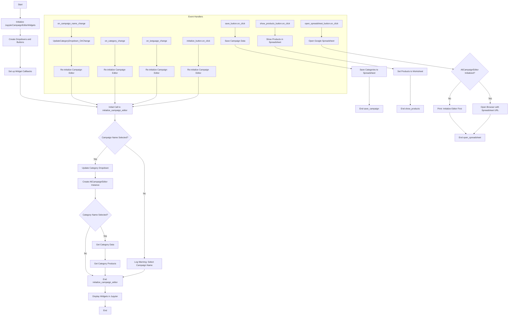
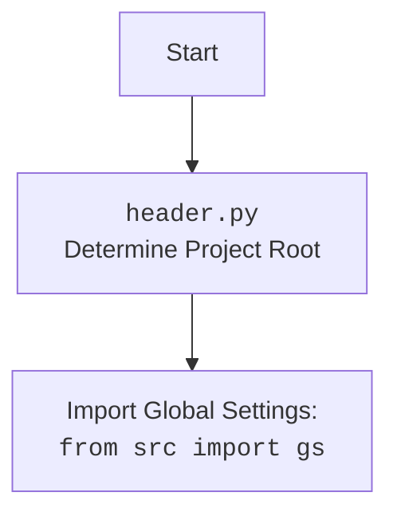

## <алгоритм>

1.  **Инициализация `JupyterCampaignEditorWidgets`**:
    *   Создается экземпляр класса `JupyterCampaignEditorWidgets`.
    *   Определяется путь к директории кампаний (`campaigns_directory`) на Google Drive.
    *   Инициализируются виджеты `Dropdown` для выбора имени кампании, категории и языка/валюты.
    *   Инициализируются кнопки `Button` для инициализации редактора, сохранения кампании, просмотра товаров и открытия Google Sheets.
    *   Устанавливаются коллбэки для обработки изменений в виджетах и нажатий на кнопки.
    *   Вызывается метод `initialize_campaign_editor(None)` для первичной инициализации редактора.
    *   **Пример**: Создается экземпляр `editor_widgets = JupyterCampaignEditorWidgets()`.

2.  **Инициализация редактора `initialize_campaign_editor(_)`**:
    *   Извлекаются значения из виджетов `campaign_name_dropdown`, `category_name_dropdown`, и `language_dropdown`.
    *   Если выбрано имя кампании (`campaign_name`):
        *   Обновляется список категорий для выбранной кампании с помощью  `update_category_dropdown(self.campaign_name)`.
        *   Создается экземпляр `AliCampaignEditor` с выбранным именем кампании, языком и валютой.
        *   Если выбрана категория (`category_name`):
            *   Получается объект категории с помощью `campaign_editor.get_category(self.category_name)`.
            *   Получается список продуктов категории с помощью `campaign_editor.get_category_products(self.category_name)`.
    *   Если имя кампании не выбрано, выводится предупреждение в лог.
    *   **Пример**: При выборе кампании "SummerSale", категории "Electronics", и языка "EN USD", создается `AliCampaignEditor` для этой кампании.

3.  **Обновление категорий `update_category_dropdown(campaign_name)`**:
    *   Формируется путь к директории категорий кампании.
    *   Получается список имен директорий категорий с помощью `get_directory_names`.
    *   Устанавливаются опции выпадающего списка категорий.
    *   **Пример**: Вызов `update_category_dropdown("SummerSale")` обновит `category_name_dropdown` набором категорий для "SummerSale".

4.  **Обработка изменений `on_campaign_name_change(change)`, `on_category_change(change)`, `on_language_change(change)`**:
    *   При изменении значения в виджете выпадающего списка (кампании, категории или языка):
        *   Извлекается новое значение из словаря `change` (аргумент).
        *   Обновляется соответствующий атрибут класса: `self.campaign_name`, `self.category_name` или `self.language`, `self.currency`.
        *   Вызывается `self.initialize_campaign_editor(None)` для переинициализации редактора с новыми значениями.
    *   **Пример**: Изменение `campaign_name_dropdown` на "WinterSale" вызовет `on_campaign_name_change` и переинициализирует редактор.

5.  **Сохранение кампании `save_campaign(_)`**:
    *   Получаются значения имени кампании, категории и языка/валюты.
    *   Если выбраны имя кампании и язык:
        *   Создается экземпляр `AliCampaignEditor` с выбранными параметрами.
        *   Вызывается метод `save_categories_from_worksheet()` для сохранения данных.
    *   При ошибке сохранения, ошибка записывается в лог.
    *   Если имя кампании или язык не выбраны, выводится предупреждение в лог.
    *   **Пример**: Вызов `save_campaign(None)` сохранит данные кампании "SummerSale", если она и язык выбраны.

6.  **Просмотр продуктов `show_products(_)`**:
    *   Получаются значения имени кампании и категории.
    *   Создается экземпляр `AliCampaignEditor`.
    *   Вызывается метод `set_products_worksheet(category_name)` для отображения продуктов в Google Sheets.
    *   При ошибке вывода, она записывается в лог.
    *   **Пример**: Вызов `show_products(None)` обновит Google Sheets с продуктами выбранной категории.

7.  **Открытие Google Sheets `open_spreadsheet(_)`**:
    *   Если редактор инициализирован, открывается URL Google Sheets в браузере.
    *   Если редактор не инициализирован, выводится сообщение об ошибке.
    *    **Пример**: Вызов `open_spreadsheet(None)` откроет таблицу в браузере.

8.  **Установка коллбэков `setup_callbacks()`**:
    *   Метод  `observe()` используется для связывания изменений виджетов выпадающего списка с соответствующими обработчиками.
    *   Метод `on_click()` используется для связывания нажатий кнопок с соответствующими обработчиками.
    *   **Пример**: Коллбэки устанавливают функции `on_campaign_name_change` при изменении `campaign_name_dropdown` , `initialize_campaign_editor` при нажатии кнопки `initialize_button`.

9.  **Отображение виджетов `display_widgets()`**:
    *   Метод `display()` отображает все виджеты.
    *   Вызывается `initialize_campaign_editor(None)` для инициализации.
    *   **Пример**: Вызов `display_widgets()` покажет виджеты на экране.

## <mermaid>

**Импортированные зависимости:**

*   `types`: Модуль используется для создания `SimpleNamespace`, который является простым способом создания объектов с атрибутами.
*   `header`: Пользовательский модуль (зависимость) для определения корневой директории проекта.
*   `pathlib`: Модуль `pathlib` предоставляет классы для работы с файловыми путями в объектно-ориентированном стиле, обеспечивая более удобный и гибкий подход по сравнению с обычными строками путей.
*   `ipywidgets`: Модуль `ipywidgets` используется для создания интерактивных виджетов в Jupyter Notebook, позволяя пользователям взаимодействовать с кодом через GUI элементы.
*   `IPython.display`: Модуль `IPython.display` обеспечивает функции для отображения различных типов данных, таких как виджеты (`display`), в Jupyter Notebook.
*   `webbrowser`: Модуль `webbrowser` используется для открытия веб-страниц в браузере по умолчанию, позволяя пользователям быстро получить доступ к веб-ресурсам прямо из Jupyter Notebook.
*   `src`: Корень проекта.
*   `src.gs`: Глобальные настройки проекта (`gs`).
*   `src.suppliers.aliexpress.campaign.AliCampaignEditor`: Класс для управления кампаниями AliExpress.
*   `src.suppliers.aliexpress.utils.locales`: Модуль, содержащий локали (языки и валюты).
*   `src.utils.printer.pprint`: Функция для удобного вывода данных.
*   `src.utils.printer.get_directory_names`: Функция для получения имен директорий.
*   `src.logger.logger`: Модуль для логирования.

## <объяснение>

### Импорты

*   **`types.SimpleNamespace`**: Используется для создания простых объектов с динамически добавляемыми атрибутами, в данном случае, для хранения данных о категории и товарах.
*   **`header`**: Пользовательский модуль, который, вероятно, определяет корневую директорию проекта. Этот модуль используется для настройки путей к файлам.
*   **`pathlib.Path`**: Модуль для работы с файловыми путями в объектно-ориентированном стиле, используется для управления путями к директориям кампаний.
*   **`ipywidgets`**: Модуль `ipywidgets` используется для создания интерактивных виджетов в Jupyter Notebook, таких как выпадающие списки и кнопки.
*   **`IPython.display.display`**: Используется для отображения виджетов в Jupyter Notebook.
*   **`webbrowser`**: Используется для открытия веб-страниц в браузере, в данном случае, для открытия Google Sheets.
*   **`src.gs`**: Глобальные настройки проекта, вероятно, содержат пути к директориям.
*   **`src.suppliers.aliexpress.campaign.AliCampaignEditor`**: Класс, отвечающий за редактирование кампаний AliExpress.
*   **`src.suppliers.aliexpress.utils.locales`**: Модуль, содержащий данные о локалях (языках и валютах), используется для заполнения выпадающего списка языков.
*   **`src.utils.printer.pprint`**: Функция для форматированного вывода данных (не используется в коде).
*   **`src.utils.printer.get_directory_names`**: Функция для получения списка имен директорий.
*   **`src.logger.logger`**: Модуль для логирования, используется для записи ошибок и предупреждений.

### Классы

*   **`JupyterCampaignEditorWidgets`**:
    *   **Роль**: Предоставляет интерфейс для управления кампаниями AliExpress через Jupyter Notebook, используя виджеты.
    *   **Атрибуты**:
        *   `language: str` - Выбранный язык.
        *   `currency: str` - Выбранная валюта.
        *   `campaign_name: str` - Выбранное имя кампании.
        *   `category_name: str` - Выбранное имя категории.
        *   `category: SimpleNamespace` - Объект с данными категории.
        *   `campaign_editor: AliCampaignEditor` - Экземпляр редактора кампаний.
        *   `products: list[SimpleNamespace]` - Список продуктов категории.
        *   `campaigns_directory: str` - Путь к директории кампаний.
        *   `campaign_name_dropdown`, `category_name_dropdown`, `language_dropdown`: Виджеты `Dropdown` для выбора соответствующих параметров.
        *   `initialize_button`, `save_button`, `show_products_button`, `open_spreadsheet_button`: Виджеты `Button` для выполнения действий.
    *   **Методы**:
        *   `__init__(self)`: Инициализирует виджеты, устанавливает коллбэки и первоначальное состояние.
        *   `initialize_campaign_editor(self, _)`: Инициализирует редактор кампаний на основе выбранных значений.
        *   `update_category_dropdown(self, campaign_name: str)`: Обновляет выпадающий список категорий на основе выбранной кампании.
        *   `on_campaign_name_change(self, change: dict[str, str])`: Обрабатывает изменение выбранной кампании.
        *   `on_category_change(self, change: dict[str, str])`: Обрабатывает изменение выбранной категории.
        *   `on_language_change(self, change: dict[str, str])`: Обрабатывает изменение выбранного языка.
        *   `save_campaign(self, _)`: Сохраняет кампанию с выбранными настройками.
        *   `show_products(self, _)`: Отображает продукты выбранной категории.
        *   `open_spreadsheet(self, _)`: Открывает Google Sheets в браузере.
        *   `setup_callbacks(self)`: Устанавливает обработчики событий для виджетов.
        *   `display_widgets(self)`: Отображает виджеты в Jupyter Notebook.
    *   **Взаимодействие**: Класс взаимодействует с `AliCampaignEditor`, `ipywidgets`, и глобальными настройками `gs`, а также с модулем для логирования `logger`.

### Функции

*   **`__init__` (метод класса `JupyterCampaignEditorWidgets`)**:
    *   **Аргументы**: `self`.
    *   **Возвращаемое значение**: `None`.
    *   **Назначение**: Инициализирует виджеты, пути, устанавливает значения по умолчанию, устанавливает коллбэки и вызывает `initialize_campaign_editor()` для первоначальной загрузки данных.
    *   **Пример**: `editor_widgets = JupyterCampaignEditorWidgets()`.

*   **`initialize_campaign_editor` (метод класса `JupyterCampaignEditorWidgets`)**:
    *   **Аргументы**: `self`, `_` (неиспользуемый аргумент для обратного вызова кнопки).
    *   **Возвращаемое значение**: `None`.
    *   **Назначение**: Инициализирует или переинициализирует экземпляр `AliCampaignEditor` на основе выбранных в виджетах имени кампании, категории и языка/валюты.
    *   **Пример**: `self.initialize_campaign_editor(None)` при нажатии кнопки или изменении выпадающего списка.

*   **`update_category_dropdown` (метод класса `JupyterCampaignEditorWidgets`)**:
    *   **Аргументы**: `self`, `campaign_name: str` (имя кампании).
    *   **Возвращаемое значение**: `None`.
    *   **Назначение**: Обновляет выпадающий список категорий на основе выбранной кампании, читая имена папок в директории.
    *   **Пример**: `self.update_category_dropdown("SummerSale")`.

*    **`on_campaign_name_change`**, **`on_category_change`**, **`on_language_change`** (методы класса `JupyterCampaignEditorWidgets`):
    *   **Аргументы**: `self`, `change: dict[str, str]`.
    *   **Возвращаемое значение**: `None`.
    *   **Назначение**: Обрабатывают изменения в виджетах выпадающего списка, обновляя соответствующие атрибуты и вызывая `initialize_campaign_editor` для переинициализации редактора.
    *    **Пример**: `self.on_campaign_name_change({"new": "NewCampaign"})`.

*   **`save_campaign`** (метод класса `JupyterCampaignEditorWidgets`)**:
    *   **Аргументы**: `self`, `_` (неиспользуемый аргумент для обратного вызова кнопки).
    *   **Возвращаемое значение**: `None`.
    *   **Назначение**: Сохраняет данные кампании через метод `save_categories_from_worksheet` класса `AliCampaignEditor`.
    *   **Пример**: `self.save_campaign(None)` при нажатии кнопки "Save Campaign".

*   **`show_products`** (метод класса `JupyterCampaignEditorWidgets`)**:
    *   **Аргументы**: `self`, `_` (неиспользуемый аргумент для обратного вызова кнопки).
    *   **Возвращаемое значение**: `None`.
    *   **Назначение**: Вызывает метод `set_products_worksheet` класса `AliCampaignEditor` для отображения продуктов категории в Google Sheets.
    *   **Пример**: `self.show_products(None)` при нажатии кнопки "Show Products".

*   **`open_spreadsheet`** (метод класса `JupyterCampaignEditorWidgets`)**:
    *   **Аргументы**: `self`, `_` (неиспользуемый аргумент для обратного вызова кнопки).
    *   **Возвращаемое значение**: `None`.
    *   **Назначение**: Открывает Google Sheets в браузере, используя `webbrowser.open`.
    *    **Пример**: `self.open_spreadsheet(None)` при нажатии кнопки "Open Google Spreadsheet".

*   **`setup_callbacks`** (метод класса `JupyterCampaignEditorWidgets`)**:
    *   **Аргументы**: `self`.
    *   **Возвращаемое значение**: `None`.
    *   **Назначение**: Устанавливает коллбэки для виджетов.
    *   **Пример**: `self.setup_callbacks()` вызывается при инициализации класса.

*   **`display_widgets`** (метод класса `JupyterCampaignEditorWidgets`)**:
    *   **Аргументы**: `self`.
    *   **Возвращаемое значение**: `None`.
    *   **Назначение**: Отображает все виджеты в Jupyter Notebook.
    *   **Пример**: `self.display_widgets()` вызывается для отображения виджетов.

### Переменные

*   **`language: str`, `currency: str`, `campaign_name: str`, `category_name: str`**: Атрибуты класса, хранящие текущие значения, выбранные пользователем.
*   **`category: SimpleNamespace`**: Объект для хранения данных о категории.
*   **`campaign_editor: AliCampaignEditor`**: Экземпляр класса `AliCampaignEditor`.
*    **`products: list[SimpleNamespace]`**: Список объектов для хранения данных о продуктах.
*   **`campaigns_directory: Path`**: Путь к директории кампаний, создается с помощью `pathlib.Path`.
*   **`campaign_name_dropdown`, `category_name_dropdown`, `language_dropdown`**: Виджеты выпадающего списка, экземпляры `ipywidgets.Dropdown`.
*   **`initialize_button`, `save_button`, `show_products_button`, `open_spreadsheet_button`**: Виджеты-кнопки, экземпляры `ipywidgets.Button`.

### Потенциальные ошибки и области для улучшения

*   **Обработка ошибок**: Хотя есть логирование ошибок, более детальная обработка исключений может улучшить стабильность. Например, можно добавить `try/except` блоки вокруг каждого взаимодействия с API или файловой системой.
*   **Валидация ввода**: Можно добавить валидацию пользовательского ввода для предотвращения ошибок, например, проверять, что имя кампании и категории являются корректными директориями.
*   **Зависимости:** Жесткая привязка к Google Drive.
*   **Управление состоянием**: Состояние виджетов (выбранные значения) можно было бы хранить и синхронизировать более эффективно.
*   **Асинхронность**: Операции, связанные с сетью (загрузка данных, сохранение), выполняются синхронно, что может блокировать UI. Можно рассмотреть асинхронное выполнение для лучшего UX.

### Взаимосвязи с другими частями проекта

*   **`src.gs`**: Используется для получения глобальных настроек проекта, таких как путь к Google Drive.
*   **`src.suppliers.aliexpress.campaign.AliCampaignEditor`**: Основная зависимость, класс, который инкапсулирует логику работы с кампаниями AliExpress.
*    **`src.suppliers.aliexpress.utils.locales`**: Используется для получения списка локалей (языков и валют) для выпадающего списка.
*   **`src.logger.logger`**: Используется для записи информации об ошибках и предупреждениях.
*   **`src.utils.printer.get_directory_names`**: Используется для получения списка директорий кампаний и категорий.

Этот файл предназначен для создания интерфейса пользователя в Jupyter Notebook для управления кампаниями AliExpress. Он зависит от других частей проекта, в частности от `AliCampaignEditor`, который выполняет фактические операции по работе с данными кампаний.