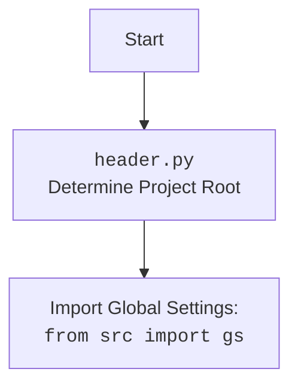

## Анализ кода `prepare_all_camapaigns.py`

### 1. <алгоритм>

1.  **Импорт `header`**: 
    *   Этот модуль, вероятно, отвечает за настройку окружения и глобальных параметров проекта. Например, определение корневой директории проекта для корректной работы импортов.
    *   _Пример_: `header` может содержать логику для определения абсолютного пути к директории `src`, чтобы другие модули могли импортировать вложенные модули без ошибок.
2. **Импорт `process_all_campaigns`**:
    *   Из модуля `src.suppliers.aliexpress.campaign` импортируется функция `process_all_campaigns`.
    *   Эта функция, судя по названию, отвечает за обработку всех рекламных кампаний AliExpress.
    *   _Пример_: Функция может проверять, существуют ли кампании для текущего пользователя, и создавать новые, если это необходимо.
3.  **Вызов `process_all_campaigns()`**:
    *   Вызывается импортированная функция.
    *   Эта функция выполняет основную логику по подготовке рекламных кампаний.
    *   _Пример_: Функция получает список существующих кампаний, сверяет их с необходимыми настройками и создает новые или обновляет существующие.

**Блок-схема:**

```mermaid
graph LR
    A[Start] --> B(Import `header` module);
    B --> C(Import `process_all_campaigns` function);
    C --> D(Call `process_all_campaigns()`);
    D --> E[End];
```

### 2. <mermaid>

```mermaid
flowchart TD
    Start --> ImportHeader[Import <code>header.py</code> Module: <br> Set up project environment]
    ImportHeader --> ImportProcessAllCampaigns[Import Function:<br><code>from src.suppliers.aliexpress.campaign import process_all_campaigns</code>]
    ImportProcessAllCampaigns --> CallProcessAllCampaigns[Call Function: <br><code>process_all_campaigns()</code>]
     CallProcessAllCampaigns --> End
```

**Объяснение зависимостей:**

*   `ImportHeader`: Импортирует модуль `header`, который отвечает за настройку окружения проекта. В частности, он может определять корневую директорию проекта, что важно для правильной работы импортов.
*   `ImportProcessAllCampaigns`: Импортирует функцию `process_all_campaigns` из модуля `src.suppliers.aliexpress.campaign`. Эта функция предположительно содержит основную логику для обработки всех рекламных кампаний AliExpress.
*   `CallProcessAllCampaigns`: Вызывает функцию `process_all_campaigns`, запуская процесс обработки рекламных кампаний.
*    `Header`: `header.py` модуль устанавливает корень проекта.
*   `import`: `header.py` импортирует глобальные настройки из `src` для доступа к ним в других модулях.

### 3. <объяснение>

**Импорты:**

*   **`import header`**:
    *   **Назначение**: Модуль `header` отвечает за настройку окружения проекта. Он может содержать логику для определения корневой директории проекта, добавления путей в `sys.path` для корректной работы импортов, загрузки глобальных настроек и т.д.
    *   **Взаимосвязь с `src`**: Модуль `header` является частью пакета `src`. Он может настраивать пути для импорта модулей из этого пакета и подпакетов.
*   **`from src.suppliers.aliexpress.campaign import process_all_campaigns`**:
    *   **Назначение**: Импортирует функцию `process_all_campaigns` из модуля `src.suppliers.aliexpress.campaign`.
    *   **Взаимосвязь с `src`**:  Модуль `process_all_campaigns` является частью подпакета `campaign` в пакете `src`. Она отвечает за конкретную бизнес-логику в рамках поставщиков AliExpress.

**Классы:**

*   В этом коде классы не используются.

**Функции:**

*   **`process_all_campaigns()`**:
    *   **Аргументы**: Нет аргументов.
    *   **Возвращаемое значение**: Неизвестно (может быть None или что-то другое, в зависимости от реализации).
    *   **Назначение**: Обрабатывает все рекламные кампании AliExpress. Она может проверять наличие кампаний, создавать новые, обновлять существующие и т.д.
    *   **Пример**: Функция может получать список существующих кампаний, сравнивать их с нужными настройками и в случае необходимости создавать новые, логировать действия, и тд.

**Переменные:**

*   В этом коде переменные не используются.

**Потенциальные ошибки и области для улучшения:**

*   **Недостаток логирования**: Отсутствует логирование.  Логирование необходимо для отслеживания работы скрипта, выявления ошибок и облегчения отладки. Следует добавить логирование для ключевых моментов работы скрипта.
*   **Нет обработки ошибок**: Отсутствует обработка ошибок. В случае возникновения ошибки, например, при обращении к API AliExpress или при работе с базой данных, программа может аварийно завершиться. Необходимо добавить обработку исключений для более надежной работы.
*   **Нет документации по `header.py`**: Необходимо добавить больше информации о том, что именно делает `header.py`
*   **Отсутствие параметризации**: Код жестко привязан к конкретным настройкам. Было бы полезно сделать его более гибким, добавив возможность передавать параметры через командную строку или конфигурационный файл.

**Цепочка взаимосвязей с другими частями проекта:**

1.  **`header.py`**: Зависит от глобальных настроек проекта в директории `src`.
2.  **`process_all_campaigns`**: Зависит от API AliExpress и, возможно, от базы данных для хранения информации о рекламных кампаниях.
3.  **`prepare_all_camapaigns.py`**: Зависит от `header.py` для настройки окружения и `process_all_campaigns` для бизнес-логики.

В целом, код выполняет свою задачу - запуск процесса обработки рекламных кампаний AliExpress, но требует доработки в части логирования, обработки ошибок и гибкости.