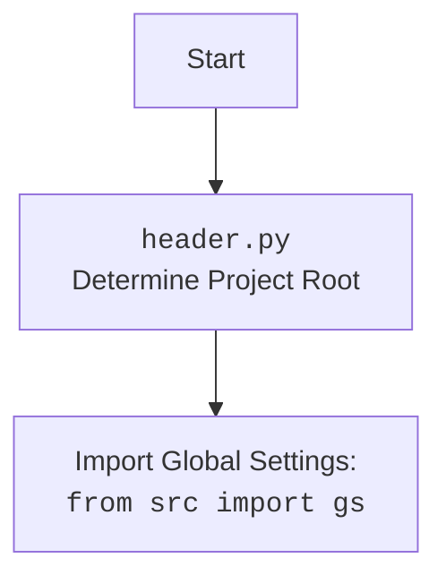

## <алгоритм>

1.  **`get_list_products_in_category(s)`**:
    *   Принимает объект поставщика `s`.
    *   Вызывает `get_prod_urls_from_pagination(s)` для сбора URL товаров.
    *   Возвращает список URL товаров.
    *   **Пример**: Если поставщик `s` настроен на категорию "Электроника", то функция вернет список URL товаров, найденных на страницах этой категории.
2.  **`get_prod_urls_from_pagination(s)`**:
    *   Принимает объект поставщика `s`.
    *   Инициализирует драйвер браузера (`_d`) и локатор ссылок на товары (`_l`) из `s`.
    *   Выполняет локатор `_l` для получения начального списка товаров (`list_products_in_category`).
    *   Если список товаров пуст, возвращает пустой список.
    *   Запускает цикл `while True`, пока находит кнопку пагинации "следующая страница":
        *   Проверяет, есть ли кнопка "следующая страница", используя локатор `s.locators['category']['pagination']['->']`.
        *   Если кнопки нет, выходит из цикла.
        *   Если есть, добавляет новые URL товаров со страницы в `list_products_in_category`.
    *   Возвращает список URL товаров.
    *   **Пример**: Для категории "Одежда" собирает ссылки на товары, переходя по страницам пагинации, пока не достигнет последней страницы.
3.  **`update_categories_in_scenario_file(s, scenario_filename)`**:
    *   Принимает объект поставщика `s` и имя файла сценария `scenario_filename`.
    *   Загружает JSON-файл сценария из `gs.dir_scenarios`.
    *   Извлекает список категорий из файла сценария (`scenarios_in_file`).
    *   Вызывает `get_list_categories_from_site()` для получения списка категорий с сайта (`categoris_on_site`).
    *   Определяет все `all_ids_in_file` из `scenario_json`
    *   Получает `categories_from_aliexpress_shop_json` с сайта.
    *   Формирует списки `all_ids_on_site` и `all_categories_on_site` из JSON категорий сайта.
    *   Определяет `removed_categories` (категории, удаленные с сайта) и `added_categories` (категории, добавленные на сайт) на основе сравнения списков.
    *   Если есть добавленные категории (`added_categories`):
        *   Добавляет информацию о новых категориях в `scenario_json`.
        *   Сохраняет обновленный `scenario_json` в файл.
        *   Отправляет уведомление об этом.
    *   Если есть удаленные категории (`removed_categories`):
        *   Помечает категории как неактивные в `scenario_json`.
        *   Сохраняет обновленный `scenario_json` в файл.
        *   Отправляет уведомление об этом.
    *   Возвращает `True` по завершении.
    *   **Пример**: Для сценария "Электроника.json" проверяет, какие категории изменились на сайте, и обновляет файл, отправляя уведомления.
4. **`get_list_categories_from_site(s,scenario_file,brand='')`**:
    *   Принимает объект поставщика `s`, имя файла сценария `scenario_file` и необязательный параметр `brand`.
    *   Загружает JSON-файл сценария из `gs.dir_scenarios`.
    *   Инициализирует драйвер браузера `_d`.
    *   Переходит на страницу категорий магазина, указанную в файле сценария.
    *   Дальнейшая реализация не представлена (`...`).
    *   **Пример**: Для сценария "Одежда.json" открывает страницу с категориями сайта в браузере.
5.  **`DBAdaptor`**:
    *   Предоставляет методы для работы с базой данных, используя `CategoryManager` и модель `AliexpressCategory`.
    *   `select()`: Выбирает записи из таблицы `AliexpressCategory`.
    *   `insert()`: Вставляет новую запись в таблицу `AliexpressCategory`.
    *   `update()`: Обновляет запись в таблице `AliexpressCategory`.
    *   `delete()`: Удаляет запись из таблицы `AliexpressCategory`.
    *   **Пример**: `DBAdaptor.insert()` добавит новую категорию "New Category" в базу данных.

## <mermaid>

```mermaid
flowchart TD
    Start[Start] --> get_products[<code>get_list_products_in_category(s)</code><br>Get Products]
    get_products --> get_urls[<code>get_prod_urls_from_pagination(s)</code><br>Get Product URLs with Pagination]
    get_urls --> Check_empty_list{Is List Empty?}
    Check_empty_list -- Yes --> Return_empty_list[Return Empty List]
    Check_empty_list -- No --> While_loop{While Pagination Exists}
    While_loop -- Yes --> Execute_locator[<code>_d.execute_locator(_l)</code><br>Execute Locator to collect new URLs]
    Execute_locator --> While_loop
    While_loop -- No --> Return_list[Return List of URLs]
    Return_list --> End_get_products[End]
    Return_empty_list --> End_get_products
    End_get_products --> update_categories[<code>update_categories_in_scenario_file(s, scenario_filename)</code><br>Update Categories in Scenario File]
    update_categories --> load_scenario[Load Scenario JSON]
    load_scenario --> get_categories_site[<code>get_list_categories_from_site()</code><br>Get Categories From Site]
    get_categories_site --> get_categories_json[Get JSON from site]
    get_categories_json -->  extract_ids_from_scenario_file[Extract IDs from scenario file]
    extract_ids_from_scenario_file -->  compare_categories[Compare categories between site and file]
    compare_categories --> check_added{Check Added Categories}
    check_added -- Yes --> update_file_added[Update JSON with added categories and send message]
    update_file_added --> check_removed{Check Removed Categories}
    check_added -- No --> check_removed
    check_removed -- Yes --> update_file_removed[Update JSON with removed categories and send message]
    update_file_removed --> return_true[Return True]
    check_removed -- No --> return_true
    return_true --> End_update_categories[End]
    End_update_categories --> DB_Adaptor_Start[Start DBAdaptor]
    DB_Adaptor_Start --> select_op[<code>select()</code><br>Select Operation]
     DB_Adaptor_Start --> insert_op[<code>insert()</code><br>Insert Operation]
    DB_Adaptor_Start --> update_op[<code>update()</code><br>Update Operation]
    DB_Adaptor_Start --> delete_op[<code>delete()</code><br>Delete Operation]
```

## <объяснение>

### Импорты:

*   `from typing import Union`: Импортирует `Union` для определения типов, допускающих несколько вариантов.
*   `from pathlib import Path`: Импортирует `Path` для работы с путями к файлам в разных ОС.
*   `from src import gs`: Импортирует глобальные настройки проекта из модуля `src.gs`.
*   `from src.utils.jjson import j_dumps, j_loads`: Импортирует функции `j_dumps` и `j_loads` для работы с JSON, разработанные внутри проекта.
*   `from src.logger.logger import logger`: Импортирует объект `logger` для логирования событий.
*   `from src.db.manager_categories.suppliers_categories import CategoryManager, AliexpressCategory`: Импортирует `CategoryManager` и `AliexpressCategory` для управления категориями в БД.
*   `credentials = gs.db_translations_credentials`: Получает учетные данные для подключения к БД из глобальных настроек.

### Классы:

*   `CategoryManager`:
    *   **Роль**: Управляет операциями с категориями в базе данных.
    *   **Атрибуты**: Не показаны в данном коде.
    *   **Методы**: `select_record`, `insert_record`, `update_record`, `delete_record`.
    *   **Взаимодействие**: Используется для выполнения операций с категориями в таблице `AliexpressCategory`.
*   `AliexpressCategory`:
    *   **Роль**: Модель данных для представления категории Aliexpress в базе данных.
    *   **Атрибуты**: Не показаны в данном коде (предполагается наличие полей, таких как `category_name`, `parent_category_id` и т.д.).
    *   **Методы**: Отсутствуют. Это модель данных, используемая для отображения таблицы.
    *   **Взаимодействие**: Используется в методах класса `CategoryManager` для операций с БД.
* `DBAdaptor`:
    * **Роль**: Адаптирует операции с БД, используя `CategoryManager`.
    * **Атрибуты**: Нет.
    * **Методы**: `select()`, `insert()`, `update()`, `delete()` - служат для демонстрации применения `CategoryManager` для операций с БД.
    * **Взаимодействие**: Использует `CategoryManager` и модель `AliexpressCategory` для работы с БД.

### Функции:

*   `get_list_products_in_category(s) -> list[str, str]`:
    *   **Аргументы**:
        *   `s`: Объект поставщика (предположительно содержит драйвер браузера и локаторы).
    *   **Возвращаемое значение**: Список URL товаров (`list`).
    *   **Назначение**: Собирает URL товаров со страницы категории, используя пагинацию, если она есть.
    *   **Пример**: `get_list_products_in_category(supplier_obj)` вернет список URL товаров, найденных в категории, связанной с `supplier_obj`.
*   `get_prod_urls_from_pagination(s) -> list[str]`:
    *   **Аргументы**:
        *   `s`: Объект поставщика.
    *   **Возвращаемое значение**: Список URL товаров (`list`).
    *   **Назначение**: Собирает URL товаров со страниц категории с пагинацией.
    *   **Пример**: `get_prod_urls_from_pagination(supplier_obj)` возвращает список URL товаров, собранных с разных страниц категории.
*   `update_categories_in_scenario_file(s, scenario_filename: str) -> bool`:
    *   **Аргументы**:
        *   `s`: Объект поставщика.
        *   `scenario_filename`: Имя файла сценария.
    *   **Возвращаемое значение**: `True` после завершения.
    *   **Назначение**: Проверяет и обновляет категории в файле сценария на основе данных с сайта, а также отправляет сообщения об изменениях.
    *   **Пример**: `update_categories_in_scenario_file(supplier_obj, "electronics.json")` обновит файл `electronics.json` с учетом изменений на сайте.
*   `get_list_categories_from_site(s, scenario_file, brand='')`:
    *   **Аргументы**:
        *   `s`: Объект поставщика.
        *   `scenario_file`: Имя файла сценария.
        *    `brand`: Бренд
    *   **Возвращаемое значение**: Не определено (пока что `...`).
    *   **Назначение**: Загружает категории с сайта.
    *   **Пример**: `get_list_categories_from_site(supplier_obj, "electronics.json")` загрузит список категорий с сайта.

### Переменные:

*   `credentials`: Содержит учетные данные для подключения к базе данных. Тип: dict.
*   `manager`: Экземпляр `CategoryManager`, используемый для управления категориями. Тип: `CategoryManager`.
*   `_d`: Драйвер браузера, полученный из объекта поставщика `s`. Тип: driver (предположительно selenium).
*   `_l`: Локатор для поиска ссылок на товары. Тип: dict.
*   `list_products_in_category`: Список URL товаров. Тип: `list`.
*   `scenario_json`: Загруженный JSON-файл сценария. Тип: `dict`.
*   `scenarios_in_file`: Список категорий из файла сценария. Тип: `dict`.
*   `categoris_on_site`: Список категорий с сайта (результат `get_list_categories_from_site()`). Тип: `list`.
*   `all_ids_in_file`: Список идентификаторов категорий из файла сценария. Тип: `list`.
*   `categories_from_aliexpress_shop_json`: JSON категорий магазина с сайта. Тип: `dict`.
*   `groups`: Список групп категорий с сайта. Тип: `list`.
*   `all_ids_on_site`: Список идентификаторов категорий с сайта. Тип: `list`.
*   `all_categories_on_site`: Список категорий с сайта в формате словаря. Тип: `list`.
*   `removed_categories`: Список идентификаторов удаленных с сайта категорий. Тип: `list`.
*   `added_categories`: Список идентификаторов добавленных на сайт категорий. Тип: `list`.
*   `post_subject`: Тема уведомления. Тип: `str`.
*   `post_message`: Текст уведомления. Тип: `str`.
*   `category`: временная переменная для хранения информации о категории. Тип: `list`

### Потенциальные ошибки и области для улучшения:

*   **Бесконечный цикл:** В `get_prod_urls_from_pagination` есть комментарий `@todo Опасная ситуация здесь/ Могу уйти в бесконечный цикл`. Необходимо добавить механизм защиты от бесконечного цикла, например, ограничить количество итераций или добавить проверку на отсутствие изменений на странице.
*   **`get_list_categories_from_site`:** Функция не доделана.
*   **Обработка ошибок:** Необходимо добавить более надежную обработку ошибок при работе с сетью, файлами и базой данных.
*   **Логирование:** Можно добавить более подробное логирование для отслеживания работы программы.
*   **Использование `CategoryManager`:** Методы класса `DBAdaptor` показывают пример использования `CategoryManager`. Они могут быть более конкретными и расширенными, в зависимости от реальных потребностей приложения.
*   **Неопределенный тип**:  В функции `get_list_products_in_category` указан тип возвращаемого значения `list[str, str]`, который является некорректным. Вероятнее всего это должен быть `list[str]`.

### Взаимосвязи с другими частями проекта:

*   **`src.gs`:** Используется для получения глобальных настроек, таких как путь к директории сценариев и учетные данные для БД.
*   **`src.utils.jjson`:** Используется для работы с JSON-файлами (загрузка и сохранение).
*   **`src.logger.logger`:** Используется для логирования событий в процессе работы программы.
*   **`src.db.manager_categories.suppliers_categories`:** Используется для управления категориями в базе данных.
*   **Вебдрайвер:** `s.driver` используется для навигации по сайту и сбора данных. Предполагается использование selenium или другого похожего решения.
*   **Файлы сценариев:** JSON-файлы используются для хранения данных о категориях и конфигурации.

Таким образом, данный код отвечает за сбор и обновление информации о категориях товаров на сайте Aliexpress, взаимодействуя с базой данных, файлами сценариев и браузером через вебдрайвер.