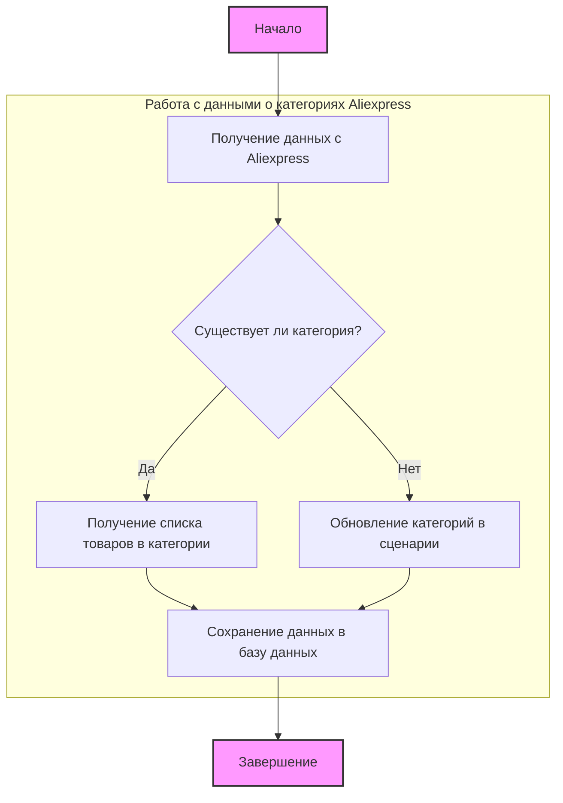

## АНАЛИЗ КОДА

### <алгоритм>

**1. Начало (Start):**
   - Процесс начинается с инициализации работы с категориями Aliexpress.

**2. Получение данных с Aliexpress:**
   - Модуль начинает сбор данных с сайта Aliexpress, используя методы, связанные с экземпляром поставщика (Supplier).
    - **Пример:**
        ```python
        supplier = Supplier(...) # Создается экземпляр поставщика
        ```

**3. Проверка наличия категории (Есть ли категория?):**
   - Проверяется, существует ли категория, с которой в данный момент ведется работа. Это может быть проверка наличия записей в базе данных или проверки в файле сценария.
     - **Пример:**
        ```python
        if db.select(cat_id=some_id):
           # Категория есть
        else:
            # Категории нет
        ```

**4a. Получение списка товаров в категории (Да):**
   - Если категория существует, модуль вызывает функцию `get_list_products_in_category(s)` для сбора URL товаров.
   - **Пример:**
        ```python
        products = get_list_products_in_category(supplier)
        # products = ['url1', 'url2', ...]
        ```
   - Функция использует `get_prod_urls_from_pagination(s)` для перебора страниц.

**4b. Обновление категорий в сценарии (Нет):**
   - Если категория не существует, модуль вызывает функцию `update_categories_in_scenario_file(s, scenario_filename)` для обновления данных о категориях в файле сценария.
   - **Пример:**
        ```python
        updated = update_categories_in_scenario_file(supplier, "scenario_file.json")
        # updated = True
        ```
   - Затем функция `get_list_categories_from_site(s, scenario_file, brand='')` получает список категорий с сайта и обновляет сценарий.

**5. Сохранение данных в базу данных:**
   - После сбора или обновления данных о товарах или категориях, данные сохраняются в базу данных с использованием `DBAdaptor`.
   - **Пример:**
        ```python
        db = DBAdaptor()
        db.insert(data_for_db)
        ```
   - Класс `DBAdaptor` предоставляет методы `select`, `insert`, `update`, `delete` для работы с БД.

**6. Завершение (Завершение):**
    - Процесс обработки категории заканчивается.

### <mermaid>



**Описание `mermaid` диаграммы:**
- `Start`: Начальная точка процесса.
- `GetDataFromAliexpress`: Этап, когда данные собираются с сайта Aliexpress с использованием экземпляра поставщика (Supplier).
- `CategoryExists`: Условный блок, проверяющий наличие категории в базе данных или в файле сценария.
- `GetProductList`: Этап, на котором вызывается функция `get_list_products_in_category(s)` для получения списка URL товаров в категории.
- `UpdateCategoriesInScenario`: Этап, на котором вызывается функция `update_categories_in_scenario_file(s, scenario_filename)` для обновления данных о категориях в файле сценария.
- `SaveDataToDB`: Этап сохранения данных (товаров или категорий) в базу данных, используя методы класса `DBAdaptor`.
- `End`: Конечная точка процесса.
- `subgraph "Работа с данными о категориях Aliexpress"`: Объединяет узлы, связанные с логикой работы с данными о категориях Aliexpress.

**Зависимости импорта:**

- `requests`: используется для выполнения HTTP-запросов к сайту Aliexpress, чтобы получать данные о категориях и товарах.
- `src.utils.jjson`: используется для работы с JSON файлами (чтение и запись). Например, для сохранения и чтения файла сценария.
- `src.db.manager_categories.suppliers_categories`: используется для доступа к методам работы с БД, например, для сохранения категорий, товаров и т.д.
- `src.logger`: используется для логирования событий и ошибок в процессе работы.

### <объяснение>

**Импорты:**
   - `requests`: Библиотека Python для отправки HTTP-запросов. Используется для получения HTML-кода страниц с Aliexpress для парсинга категорий и товаров.
   - `src.utils.jjson`: Модуль проекта, предназначенный для работы с JSON-файлами. Используется для чтения и записи файлов сценария, в которых, вероятно, хранятся данные о категориях и их связях.
   - `src.db.manager_categories.suppliers_categories`: Модуль проекта, обеспечивающий взаимодействие с базой данных для операций с категориями. Включает в себя модели, связанные с категориями, что позволяет выбирать, вставлять, обновлять и удалять данные.
   - `src.logger`: Модуль проекта, предоставляющий функциональность логирования. Помогает отслеживать события, ошибки, и общий ход выполнения программы.

**Классы:**

   - `DBAdaptor`: Класс, являющийся адаптером для работы с базой данных.
     -  **Роль**: Обеспечивает унифицированный интерфейс для выполнения операций с БД (SELECT, INSERT, UPDATE, DELETE). Это позволяет абстрагироваться от конкретной реализации работы с БД, что упрощает поддержку и модификацию кода.
     -  **Атрибуты**: Не указаны в предоставленном коде, но, вероятно, класс содержит атрибуты для подключения к БД и управления сеансом.
     -  **Методы**:
        -   `select(cat_id, parent_id, project_cat_id)`: Позволяет выбирать записи из базы данных по указанным `cat_id`, `parent_id` и `project_cat_id`.
        -   `insert()`: Добавляет новые записи в БД.
        -   `update()`: Обновляет существующие записи в БД.
        -   `delete()`: Удаляет записи из БД.
     -  **Взаимодействие**: Используется в модуле для чтения и записи данных о категориях, товарах и т.д.

**Функции:**
   -  `get_list_products_in_category(s)`
     -  **Аргументы**: `s` (экземпляр класса `Supplier`).
     -  **Возвращает**: `list` (список URL-адресов товаров).
     -  **Назначение**: Считывает URL товаров из страницы категории, перелистывая страницы при наличии пагинации.
     -  **Пример**: `products_list = get_list_products_in_category(supplier)`
   -  `get_prod_urls_from_pagination(s)`
     -  **Аргументы**: `s` (экземпляр класса `Supplier`).
     -  **Возвращает**: `list` (список URL-адресов товаров).
     -  **Назначение**: Собирает ссылки на товары из страницы категории, обрабатывая пагинацию.
     -  **Пример**: `product_urls = get_prod_urls_from_pagination(supplier)`
   - `update_categories_in_scenario_file(s, scenario_filename)`
     -  **Аргументы**: `s` (экземпляр класса `Supplier`), `scenario_filename` (имя файла сценария).
     -  **Возвращает**: `bool` (True в случае успешного обновления).
     -  **Назначение**: Проверяет изменения категорий на сайте и обновляет файл сценария.
     -  **Пример**: `update_result = update_categories_in_scenario_file(supplier, "scenario.json")`
   - `get_list_categories_from_site(s, scenario_file, brand='')`
     - **Аргументы**: `s` (экземпляр класса `Supplier`), `scenario_file` (имя файла сценария), `brand` (опциональное имя бренда).
     - **Возвращает**: `list` (список категорий).
     - **Назначение**: Получает список категорий с сайта на основе данных из файла сценария.
     - **Пример**: `categories_list = get_list_categories_from_site(supplier, "scenario.json", "brand_name")`

**Переменные:**
   - `s`: Экземпляр класса `Supplier`, представляющий поставщика (в данном случае, Aliexpress). Этот объект инкапсулирует данные, необходимые для работы с сайтом Aliexpress.
   - `scenario_filename`: Строка, представляющая имя файла сценария, в котором хранятся данные о категориях.
   - `brand`: Строка, представляющая имя бренда, которое может быть использовано для фильтрации категорий.
   - `db`: Экземпляр класса `DBAdaptor`, который используется для выполнения операций с базой данных.

**Потенциальные ошибки и области для улучшения:**
   - **Обработка ошибок:** Неясно, как обрабатываются ошибки при запросах к Aliexpress, при работе с файлами или БД. Необходимо добавить блоки `try/except` для корректной обработки ошибок и логирования.
   - **Обновление категорий**: Неясно, как именно происходит сравнение категорий на сайте и в файле сценария. Может потребоваться более подробное описание логики обновления.
   - **Валидация данных:** Не помешает добавить валидацию входных данных, например, проверку наличия файлов, корректность URL и т.п.
   - **Производительность**: При большом количестве страниц и категорий, перебор страниц и парсинг HTML может занять значительное время. Можно рассмотреть асинхронные запросы или другие методы оптимизации.

**Взаимосвязи с другими частями проекта:**
    - Модуль взаимодействует с модулями `src.utils.jjson`, `src.db.manager_categories.suppliers_categories` и `src.logger`. Это указывает на архитектуру проекта, где каждый модуль выполняет определенную задачу, а взаимодействие происходит через общий код.

Этот анализ предоставляет подробное представление о функциональности модуля и его взаимодействия с другими компонентами проекта.